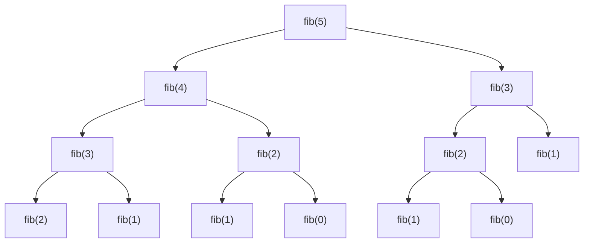
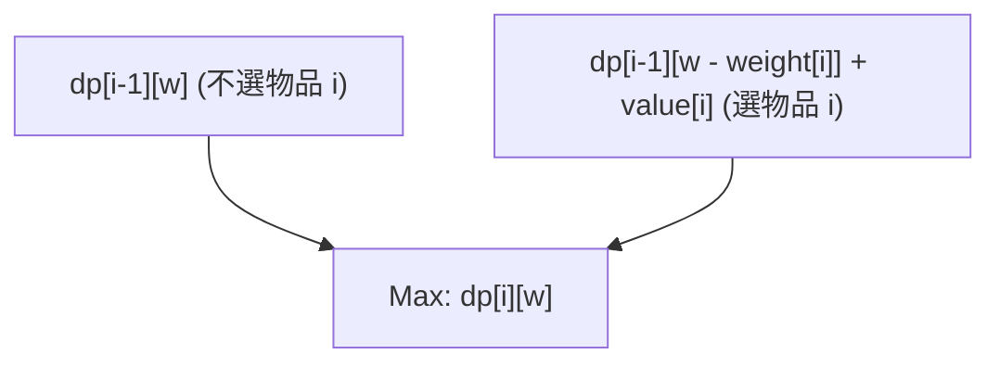
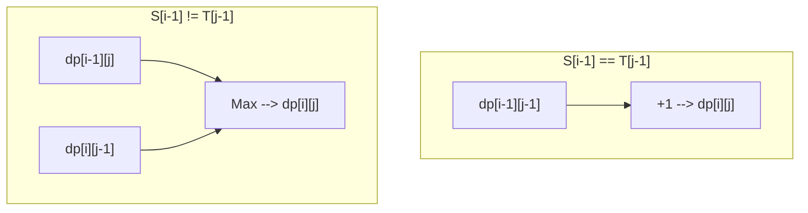

從競技程式設計到實務上的演算法設計，在許多場合都會出現，並且成為許多程式設計師障礙的就是**動態規劃（Dynamic Programming，簡稱 DP）**。「無法推導出遞迴式」、「索引值出錯」、「根本無法判斷這是不是能用 DP 解決的問題」……相信許多人都有這樣的煩惱。

本文將從動態規劃的本質出發，涵蓋具體的方法（由上而下與由下而上），並透過 3 個具代表性的問題（費氏數列、0/1 背包問題、最長共同子序列）進行實務解說，為您提供最全面的指南。我們將提供 C++ 與 Python 雙語的實作範例，並交錯使用數學公式與圖解，提供您「完全掌握」的學習路徑。這將是一篇篇幅很長的文章，但當您讀到最後時，您的演算法能力必定會有飛躍性的提升。

---

## 1. 什麼是動態規劃（DP）？

動態規劃（Dynamic Programming）是一種演算法設計手法，它將複雜的問題分割成更小的「子問題」，並透過記錄與重複使用這些子問題的解，來大幅減少計算量。

這個方法由理查·貝爾曼（Richard Bellman）在 1950 年代提出，在最佳化問題上發揮了壓倒性的威力。「動態（Dynamic）」這個詞其實並沒有什麼特別的意思，據說當時只是為了獲得研究經費而選擇了這個「聽起來很厲害的詞」，但如今它已在計算機科學中確立了作為最重要概念之一的堅實地位。

要能夠使用動態規劃，目標問題必須滿足以下**2個重要性質**。

### 1-1. 重疊子問題 (Overlapping Subproblems)

在解決大問題的過程中，**相同的子問題會一再重複出現**的性質。

例如，在稍後會提到的費氏數列計算中，當我們要求第 5 項與第 4 項時，都會需要進行「求第 3 項」的計算。如果子問題不會重疊（例如：合併排序法等分治法），那麼就沒有記錄解答的優勢，也就不是 DP 適用的對象。正因為會重疊，所以將計算過一次的結果儲存在記憶體中（記憶化或建表），並在之後重複使用，才能實現戲劇性的加速。

### 1-2. 最佳子結構 (Optimal Substructure)

**「整體問題的最佳解，可以由其子問題的最佳解所構成」**的性質。

最短路徑問題就是一個容易理解的例子。如果從城市 A 到城市 C 的最短路徑會經過城市 B，那麼「從城市 A 到城市 B 的路徑」也必須是 A 到 B 的最短路徑。如果 A 到 B 的路徑不是最佳（最短）的，我們只要最佳化它，就能讓 A 到 C 的整體路徑變得更短。像這樣，能夠組合局部的最佳解來導出整體最佳解的性質，正是動態規劃進行狀態轉移的基礎。

---

## 2. 兩種方法：由上而下與由下而上

動態規劃的實作大致可分為「由上而下（記憶化遞迴）」與「由下而上（建表）」兩種方法。深入理解各自的特徵，並能根據情況靈活運用，是完全掌握 DP 的第一步。

### 由上而下法（記憶化遞迴 / Memoization）

從大問題出發，遞迴地呼叫並解決所需子問題的方法。此時，會將已經計算過的子問題解答「記憶（儲存）」在陣列或雜湊表（Hash Map）中，下次需要時便不再重新計算，而是直接從記憶體中回傳結果。

- **優點:** 
  - 能夠以直覺的思考過程（遞迴關係）直接實作。
  - 只有必要的子問題會被計算，因此當整體狀態空間中只有一部分會被存取時較具優勢。
- **缺點:** 
  - 由於遞迴呼叫，會產生函式呼叫的額外負擔（Overhead）。
  - 遞迴深度過大時會有堆疊溢位（Stack Overflow）的風險（在 Python 等語言中特別需要注意）。

### 由下而上法（建表 / Tabulation）

從最小的子問題（基本情況）出發，透過迴圈處理依序將較大問題的解填入表格（陣列）中的方法。最後，我們想求的整體問題解答會存放在表格的特定位置。

- **優點:** 
  - 沒有遞迴造成的額外負擔，執行速度快。
  - 記憶體存取傾向於連續，快取效率（區域性）良好。
  - 容易進行後述的「空間複雜度最佳化（重複使用陣列）」。
- **缺點:** 
  - 因為會計算所有的狀態，結果可能會連不需要的狀態也一併計算了。
  - 必須準確掌握遞迴式的相依關係（拓樸順序），並以正確的順序執行迴圈。

---

## 3. 實戰篇 1：費氏數列

首先，我們以最基本、最容易理解的費氏數列為例。
費氏數列定義如下：

$$
F(0) = 0, \quad F(1) = 1 \\
F(n) = F(n-1) + F(n-2) \quad (n \ge 2)
$$

### 3-1. 單純的遞迴（計算量爆炸）

如果完全按照定義來寫遞迴函式會發生什麼事呢？

```python
def fib_naive(n):
    if n <= 1:
        return n
    return fib_naive(n-1) + fib_naive(n-2)
```

這種實作方式很直覺，但計算量會產生 $O(2^n)$ 的指數級爆炸。這是因為對同一個參數的計算會被重複執行多次。以下是求 $F(5)$ 時的遞迴樹狀圖。



從圖中可以看出，`"fib(3)"` 和 `"fib(2)"` 被多次求值。這就是所謂的「重疊子問題」。

### 3-2. 由上而下法（記憶化遞迴）

使用陣列或字典來儲存已經計算過的結果。這樣可以將計算量降到 $O(n)$。

**Python 實作:**
```python
def fib_memo(n, memo=None):
    if memo is None:
        memo = {}
    if n in memo:
        return memo[n]
    if n <= 1:
        return n
    # 計算並儲存到記憶體中
    memo[n] = fib_memo(n-1, memo) + fib_memo(n-2, memo)
    return memo[n]
```

**C++ 實作:**
```cpp
#include <iostream>
#include <vector>

std::vector<long long> memo;

long long fib_memo(int n) {
    if (n <= 1) return n;
    // 如果已經計算過就從記憶體中回傳
    if (memo[n] != -1) return memo[n];
    
    // 計算並儲存到記憶體中
    return memo[n] = fib_memo(n - 1) + fib_memo(n - 2);
}

int main() {
    int n = 50;
    memo.assign(n + 1, -1);
    std::cout << fib_memo(n) << std::endl;
    return 0;
}
```

### 3-3. 由下而上法（建表）

這是從最小的開始，依序填滿陣列的方法。不用擔心堆疊溢位，且執行速度極快。

**Python 實作:**
```python
def fib_dp(n):
    if n <= 1:
        return n
    dp = [0] * (n + 1)
    dp[1] = 1
    for i in range(2, n + 1):
        dp[i] = dp[i-1] + dp[i-2]
    return dp[n]
```

**C++ 實作:**
```cpp
#include <iostream>
#include <vector>

long long fib_dp(int n) {
    if (n <= 1) return n;
    std::vector<long long> dp(n + 1, 0);
    dp[1] = 1;
    for (int i = 2; i <= n; ++i) {
        dp[i] = dp[i - 1] + dp[i - 2];
    }
    return dp[n];
}
```

### 3-4. 空間複雜度最佳化

仔細觀察由下而上法就會發現，計算 $dp[i]$ 時需要的只有最近的兩個值 $dp[i-1]$ 與 $dp[i-2]$，更之前的值並不需要。因此，我們不必保留整個陣列，只需使用兩個變數就能繼續計算。這樣可以將空間複雜度從 $O(n)$ 減少到 $O(1)$。

**Python 實作:**
```python
def fib_optimized(n):
    if n <= 1:
        return n
    prev2, prev1 = 0, 1
    for i in range(2, n + 1):
        current = prev1 + prev2
        prev2 = prev1
        prev1 = current
    return current
```

---

## 4. 實戰篇 2：0/1 背包問題（0/1 Knapsack Problem）

接下來終於進入正式的最佳化問題了。0/1 背包問題被認為是學習動態規劃的入門關卡。

### 4-1. 問題設定

有一個容量為 $W$ 的背包。另外有 $n$ 個物品，每個物品 $i$ ($1 \le i \le n$) 都有固定的重量 $weight[i]$ 與價值 $value[i]$。
在不超過背包容量的情況下挑選物品，請問能獲得的總價值最大值是多少？
（※「0/1」代表對於每個物品只有「不選(0)」或「選(1)」兩種選擇。物品無法分割。）

### 4-2. 狀態定義與狀態轉移方程式

解決 DP 最重要的一個步驟就是適當地定義「狀態（State）」。
在這個問題中，有兩個參數會改變：「考慮到第幾個物品」以及「背包剩餘的容量」。因此，我們這樣定義狀態：

**狀態定義:**
$dp[i][w]$ := 只考慮從開頭到第 $i$ 個物品，在總重量不超過 $w$ 的情況下挑選時，總價值的最大值。

接下來，思考這個狀態會如何變化（轉移）。當我們考慮第 $i$ 個物品時，有兩個選擇：
1. **不選第 $i$ 個物品時:** 
   最大價值與使用前 $i-1$ 個物品滿足容量 $w$ 的最大價值相同。
   亦即，$dp[i-1][w]$
2. **選擇第 $i$ 個物品時:** 
   這個物品的重量是 $weight[i]$，所以背包中至少需要有 $weight[i]$ 以上的空餘容量（$w \ge weight[i]$）。如果選擇了它，獲得的價值會增加 $value[i]$，但可用容量會減少 $weight[i]$。因此，對於剩餘容量 $w - weight[i]$，其價值會是由前 $i-1$ 個物品所能獲得的最大價值加上 $value[i]$。
   亦即，$dp[i-1][w - weight[i]] + value[i]$

從這兩個選擇中，挑選價值較大的一方（$\max$）即可，因此**狀態轉移方程式**如下：

$$
dp[i][w] = 
\begin{cases} 
dp[i-1][w] & \text{if } w < weight[i] \\
\max(dp[i-1][w], dp[i-1][w - weight[i]] + value[i]) & \text{if } w \ge weight[i]
\end{cases}
$$

**基本情況（初始條件）:**
當物品為 0 個（$i=0$），或者容量為 0（$w=0$）時，價值的最大值為 0。
$$ dp[0][w] = 0, \quad dp[i][0] = 0 $$

以下的 Mermaid 圖將狀態轉移的概念視覺化。



### 4-3. 由下而上實作（二維陣列）

將這個數學公式直接轉換為程式碼。

**C++ 實作:**
```cpp
#include <iostream>
#include <vector>
#include <algorithm>

int knapsack(int W, const std::vector<int>& weight, const std::vector<int>& value) {
    int n = weight.size();
    // 將 dp[n+1][W+1] 的二維陣列初始化為 0
    std::vector<std::vector<int>> dp(n + 1, std::vector<int>(W + 1, 0));

    // 逐一加入物品來考慮
    for (int i = 1; i <= n; ++i) {
        // 針對所有容量的情境進行計算
        for (int w = 0; w <= W; ++w) {
            if (w < weight[i - 1]) {
                // 容量不足無法選擇的情況
                dp[i][w] = dp[i - 1][w];
            } else {
                // 比較不選與選的情況，採用較大的值
                dp[i][w] = std::max(dp[i - 1][w], dp[i - 1][w - weight[i - 1]] + value[i - 1]);
            }
        }
    }
    
    return dp[n][W];
}

int main() {
    int W = 50;
    std::vector<int> weight = {10, 20, 30};
    std::vector<int> value = {60, 100, 120};
    std::cout << "Max Value: " << knapsack(W, weight, value) << std::endl;
    return 0;
}
```
*(※請注意，在 C++ 中陣列索引從 0 開始，因此寫成 `weight[i-1]`。)*

### 4-4. 空間複雜度最佳化（降為一維陣列）

更新二維陣列 $dp[i][w]$ 時，我們會發現它總是只參考前一列 $dp[i-1]$ 的值。這跟費氏數列空間最佳化的原理相同。
因此，可以將陣列壓縮成一維 $dp[w]$。不過，在更新時需要特別注意。容量 $w$ 必須**由大到小（從後往前）**執行迴圈。如果從前面開始更新，參考到的就不會是「第 $i-1$ 個的狀態」，而是剛在同一個步驟被更新的「第 $i$ 個的狀態」，這會導致同一個物品被選取多次（這會變成「無限背包問題」的解法）。

**Python 實作（一維化）:**
```python
def knapsack_1d(W, weight, value):
    n = len(weight)
    dp = [0] * (W + 1)
    
    for i in range(n):
        # 從 W 往回跑迴圈
        for w in range(W, weight[i] - 1, -1):
            dp[w] = max(dp[w], dp[w - weight[i]] + value[i])
            
    return dp[W]

W = 50
weight = [10, 20, 30]
value = [60, 100, 120]
print("Max Value:", knapsack_1d(W, weight, value))
```
這將空間複雜度從 $O(nW)$ 戲劇性地改善至 $O(W)$。在實務或競技程式設計中，這是必備的技巧。

---

## 5. 實戰篇 3：最長共同子序列（LCS: Longest Common Subsequence）

作為處理字串的代表性 DP 問題，我們來探討 LCS。LCS 是一種廣泛應用於現實社會中的演算法，例如檔案差異檢測（diff 工具）與 DNA 序列相似度判定等。

### 5-1. 問題設定

給定兩個字串 $S$ 和 $T$。在雙方的子序列（從原字串中保持順序，刪除 0 個以上的字元所形成的字串）之中，找出共通且長度最長的長度。

例如：當 $S = \text{"ABCBDAB"}$, $T = \text{"BDCABA"}$ 時，LCS 可能是 $\text{"BCBA"}$ 或 $\text{"BDAB"}$ 等等，其長度為 4。

### 5-2. 狀態定義與狀態轉移方程式

假設字串長度分別為 $m, n$。這種情況下同樣將兩個字串的前綴（從開頭算起的部分字串）長度作為狀態。

**狀態定義:**
$dp[i][j]$ := 字串 $S$ 的前 $i$ 個字元與字串 $T$ 的前 $j$ 個字元之間的最長共同子序列（LCS）長度。

著眼於字串的最後一個字元 $S[i-1]$ 與 $T[j-1]$ 來思考轉移。
1. **當 $S[i-1] == T[j-1]$ 時:** 
   因為最後一個字元相符，這個字元必定會包含在 LCS 中。因此，會是各自字串減少 1 個字元狀態的 LCS 再加上 1。
   $dp[i][j] = dp[i-1][j-1] + 1$
2. **當 $S[i-1] \neq T[j-1]$ 時:** 
   因為最後一個字元不同，至少其中一方不會包含在 LCS 中。我們取 $S$ 減少 1 個字元的情況（$dp[i-1][j]$）與 $T$ 減少 1 個字元的情況（$dp[i][j-1]$）兩者之中較長的那一個。
   $dp[i][j] = \max(dp[i-1][j], dp[i][j-1])$

整理成以下狀態轉移方程式：

$$
dp[i][j] = 
\begin{cases} 
0 & \text{if } i = 0 \text{ or } j = 0 \\
dp[i-1][j-1] + 1 & \text{if } i > 0, j > 0 \text{ and } S[i-1] = T[j-1] \\
\max(dp[i-1][j], dp[i][j-1]) & \text{if } i > 0, j > 0 \text{ and } S[i-1] \neq T[j-1]
\end{cases}
$$

將這個轉移用 Mermaid 表達如下：



### 5-3. 由下而上實作

這個同樣能用二維陣列簡單地實作出來。

**Python 實作:**
```python
def longest_common_subsequence(text1: str, text2: str) -> int:
    m, n = len(text1), len(text2)
    # m+1 行 n+1 列的補 0 二維陣列
    dp = [[0] * (n + 1) for _ in range(m + 1)]
    
    for i in range(1, m + 1):
        for j in range(1, n + 1):
            if text1[i-1] == text2[j-1]:
                dp[i][j] = dp[i-1][j-1] + 1
            else:
                dp[i][j] = max(dp[i-1][j], dp[i][j-1])
                
    return dp[m][n]

S = "ABCBDAB"
T = "BDCABA"
print("LCS Length:", longest_common_subsequence(S, T))
```

**C++ 實作:**
```cpp
#include <iostream>
#include <vector>
#include <string>
#include <algorithm>

int longest_common_subsequence(const std::string& text1, const std::string& text2) {
    int m = text1.size();
    int n = text2.size();
    std::vector<std::vector<int>> dp(m + 1, std::vector<int>(n + 1, 0));
    
    for (int i = 1; i <= m; ++i) {
        for (int j = 1; j <= n; ++j) {
            if (text1[i-1] == text2[j-1]) {
                dp[i][j] = dp[i-1][j-1] + 1;
            } else {
                dp[i][j] = std::max(dp[i-1][j], dp[i][j-1]);
            }
        }
    }
    
    return dp[m][n];
}

int main() {
    std::string S = "ABCBDAB";
    std::string T = "BDCABA";
    std::cout << "LCS Length: " << longest_common_subsequence(S, T) << std::endl;
    return 0;
}
```

在 LCS 問題中，更新時同樣只會用到前一列（`dp[i-1]`）與當前列（`dp[i]`），因此只要有 2 列份量（元素數量 $2n$）的陣列就能計算。這被稱為「滾動陣列（Rolling Array）」。作為大幅減少空間複雜度的技巧來說極為實用。

---

## 6. 掌握動態規劃的思考過程

到目前為止我們看過了各種問題，但在面臨未知的 DP 問題時，應該如何思考呢？請隨時留意以下步驟。

1. **這個問題能用 DP 解嗎？（確認條件）**
   用遞迴來思考時，相同的狀態是否會重複出現（重疊子問題）。組合最佳的選擇是否能導出整體的最佳結果（最佳子結構）。
2. **定義狀態（State）**
   找出表示「現在在哪裡」、「還剩下什麼」、「目前的限制條件是什麼」的變數。明確地用言語表達索引值的意義，是預防 bug 的最大防禦手段。
3. **思考狀態轉移方程式（Transition）**
   要怎麼從某個狀態移動到下一個狀態。有什麼選項。要在其中取最大（或最小），還是加總起來。這裡是演算法的核心。
4. **設定初始條件（Base Case）**
   決定陣列的初始值或計算的出發點。正確處理 0 個物品、長度為 0 的字串等存在顯然解答的邊界情況（Edge Case）。
5. **確認計算順序（Topological Order）**
   使用由下而上實作時，在計算轉移目標狀態前，必須先計算完所有的轉移來源狀態。對迴圈的方向要抱持極大的細心。

## 7. 總結

本文從動態規劃的基礎理論出發，詳細解說了具體的實作方法，甚至涵蓋了代表性的最佳化問題。
- 動態規劃是一種利用遞迴關係來重複使用子問題解答的方法。
- **由上而下（記憶化）**實作直覺；而**由下而上（建表）**常數倍率小且容易做記憶體最佳化。
- 只要能正確建立數學式（狀態轉移方程式），實作就會變得非常單純。
- 減少空間複雜度的技巧（陣列一維化與滾動陣列），在實務層面要求效能時不可或缺。

初次接觸動態規劃可能會覺得難以理解。然而，只要在各種問題中反覆訓練尋找「狀態定義」與「轉移」，漸漸就能看見模式。雖然還有樹狀 DP、數位 DP、位元 DP、區間 DP 等更進階的應用，但全都是建立在這次學到的「重疊子問題」與「最佳化」的基礎之上。

不要著急，一邊用紙筆實際畫出 DP 表格（表格），一邊加深理解吧。當您能夠引出演算法真正的力量時，程式設計的世界將會變得更加廣闊。
