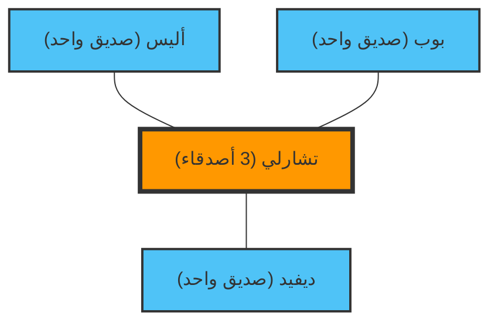

"يبدو أن الأشخاص من حولي لديهم أصدقاء أكثر مني، ويبدو أنهم يستمتعون بوقتهم..."
هل سبق لك أن شعرت بهذا أثناء تصفحك لوسائل التواصل الاجتماعي؟

في الواقع، شعورك هذا ليس بسبب شخصيتك أو قلة شعبيتك. بل هي حقيقة رياضية مثبتة في نظرية الشبكات والإحصاء تُعرف باسم **"مفارقة الصداقة (Friendship Paradox)"**.

هذه المفارقة التي اكتشفها عالم الاجتماع سكوت فيلد في عام 1991، تشرح الظاهرة التي تتناقض مع البديهة والتي تقول: "معظم الناس لديهم أصدقاء أقل من أصدقائهم".

## لماذا "الأصدقاء لديهم أصدقاء أكثر"؟

باختصار، يرجع هذا إلى انحياز بسيط في أخذ العينات: **"الأشخاص الذين لديهم أصدقاء كثر (الأشخاص المشهورون) يظهرون في قوائم أصدقاء الكثير من الناس"**.

دعونا نفكر في شبكة (مخطط) بسيطة.

يوجد في هذا العالم الصغير 4 أشخاص: أليس، بوب، تشارلي، وديفيد.
تشارلي هو "الشخص المشهور" وهو صديق للثلاثة الآخرين جميعهم. بينما الثلاثة الآخرون ليسوا أصدقاء إلا مع تشارلي فقط.

دعونا نلقي نظرة على عدد أصدقاء كل شخص.
- عدد أصدقاء أليس: 1
- عدد أصدقاء بوب: 1
- عدد أصدقاء ديفيد: 1
- عدد أصدقاء تشارلي: 3
**متوسط عدد الأصدقاء للجميع** هو $(1 + 1 + 1 + 3) / 4 = 1.5$ صديق.

بعد ذلك، دعونا نحسب "متوسط عدد أصدقاء صديق كل شخص".
- عدد أصدقاء صديق أليس (تشارلي): 3
- عدد أصدقاء صديق بوب (تشارلي): 3
- عدد أصدقاء صديق ديفيد (تشارلي): 3
- متوسط عدد أصدقاء أصدقاء تشارلي (أليس، بوب، ديفيد): $(1 + 1 + 1) / 3 = 1$ صديق

الآن، سنقارن بين "نفسه" و "متوسط أصدقائه" لكل شخص.
- أليس: نفسها (1) < متوسط الأصدقاء (3)
- بوب: نفسه (1) < متوسط الأصدقاء (3)
- ديفيد: نفسه (1) < متوسط الأصدقاء (3)
- تشارلي: نفسه (3) > متوسط الأصدقاء (1)

3 من أصل 4 أشخاص (75٪ من الناس) يجدون أنفسهم في موقف حيث "أصدقاؤهم لديهم أصدقاء أكثر منهم". وجود تشارلي المشهور يرفع بقوة "متوسط الأصدقاء" لكل من حوله.

## الإثبات الرياضي: التباين هو المفتاح

دعونا نعبر عن هذا رياضياً.
في نظرية الشبكات، لنفترض أن عدد أصدقاء (درجة) الشخص $v$ هو $k(v)$. لنفترض أن متوسط عدد الأصدقاء في الشبكة بأكملها هو $\mu$، وتباين عدد الأصدقاء هو $\sigma^2$.

وفقًا لإثبات فيلد، فإن القيمة المتوقعة لـ "عدد أصدقاء صديق تم اختياره عشوائيًا" هي كما يلي:

$$ \text{متوسط عدد أصدقاء الصديق} = \mu + \frac{\sigma^2}{\mu} $$

التباين $\sigma^2$ هو دائمًا قيمة أكبر من أو تساوي الصفر. بعبارة أخرى، باستثناء الموقف المستحيل حيث يكون لدى كل شخص نفس العدد من الأصدقاء تمامًا ($\sigma^2 = 0$)، فإن المتباينة التالية تتحقق دائمًا.

$$ \mu + \frac{\sigma^2}{\mu} > \mu $$

**"متوسط عدد أصدقاء الصديق" سيكون دائمًا أكبر من "المتوسط الكلي لعدد الأصدقاء".**

في المجتمع الحقيقي وعلى وسائل التواصل الاجتماعي (مثل X و Instagram وغيرها)، يمتلك جزء صغير جدًا من الناس ملايين المتابعين (الأصدقاء)، في حين أن معظم الناس لديهم العشرات إلى المئات فقط. بعبارة أخرى، نظرًا لأن التباين $\sigma^2$ كبير جدًا، فإن تأثير هذه المفارقة يصبح أقوى بكثير.

## التطبيق: الجوائح والتطعيم باللقاحات

مفارقة الصداقة لا تقتصر على علم نفس وسائل التواصل الاجتماعي. بل لها تطبيقات فعالة جدًا في القضايا الاجتماعية الواقعية، وخاصة **التدابير المضادة للأمراض المعدية**.

افترض أن لديك عددًا محدودًا من اللقاحات وتتساءل لمن يجب أن تُعطى. هناك طريقة أكثر فعالية من إعطائها بشكل عشوائي.

1. يتم اختيار أشخاص عشوائيًا.
2. لا يُعطى اللقاح للشخص نفسه، بل **للشخص الذي يسميه "صديقًا"**.

لماذا؟ بسبب مفارقة الصداقة، فإن "أصدقاء" الأشخاص الذين تم اختيارهم عشوائيًا لديهم احتمالية أكبر في أن يكون لديهم اتصالات أكثر في المتوسط (بأن يكونوا مراكز أو محاور). من خلال إعطاء الأولوية في التطعيم للأشخاص الذين لديهم اتصالات كثيرة، يمكن إبطاء انتشار العدوى في الشبكة بأكملها بشكل كبير.

## الخلاصة

عندما تنظر إلى وسائل التواصل الاجتماعي وتشعر بأن "الجميع لديهم أصدقاء أكثر مني ويعيشون حياة أفضل"، فهذا ليس وهمًا من جانبك، بل هو حتمية رياضية تم إنشاؤها بواسطة بنية الشبكة.

نظرًا لأن الأشخاص المشهورين يظهرون في شبكات العديد من الأشخاص، فإننا نُجبر حتمًا على ملاحظة "الأشخاص المشهورين فوق المتوسط" فقط كعينة. في المرة القادمة التي تشعر فيها بالإحباط على وسائل التواصل الاجتماعي، يرجى تذكر هذه المعادلة.

$$ \mu + \frac{\sigma^2}{\mu} > \mu $$
