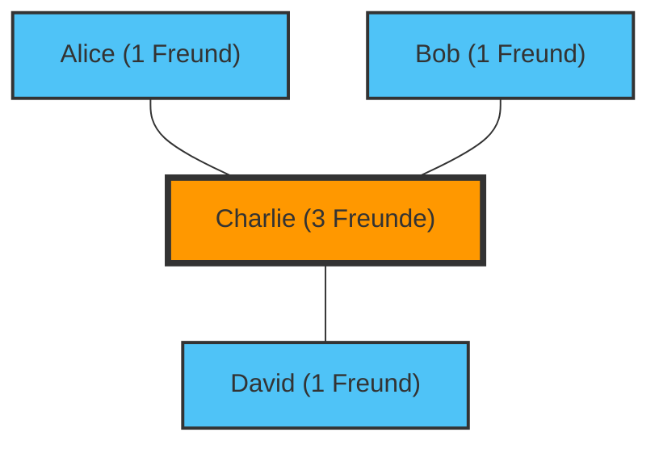

„Die Leute um mich herum scheinen mehr Freunde zu haben und mehr Spaß zu haben als ich...“
Hast du dich jemals so gefühlt, während du durch soziale Medien gescrollt hast?

Tatsächlich liegt dieses Gefühl weder an deiner Persönlichkeit noch an mangelnder Beliebtheit. Es handelt sich um eine mathematische Tatsache, die durch die Netzwerktheorie und die Statistik bewiesen wurde, bekannt als das **„Freundschaftsparadoxon“ (Friendship Paradox)**.

Dieses Paradoxon, das 1991 vom Soziologen Scott Feld entdeckt wurde, erklärt das kontraintuitive Phänomen, dass „die meisten Menschen weniger Freunde haben als ihre eigenen Freunde“.

## Warum haben „Freunde mehr Freunde“?

Kurz gesagt, dies liegt an einer einfachen Verzerrung der Stichprobe (Sampling Bias), bei der **„Menschen mit vielen Freunden (beliebte Personen) auf den Freundeslisten vieler anderer auftauchen“**.

Betrachten wir ein einfaches Netzwerk (einen Graphen).

In dieser kleinen Welt gibt es vier Personen: Alice, Bob, Charlie und David.
Charlie ist die „beliebte Person“ und mit allen anderen drei befreundet. Die anderen drei sind nur mit Charlie befreundet.

Schauen wir uns die Anzahl der Freunde jedes Einzelnen an.
- Anzahl der Freunde von Alice: 1 Person
- Anzahl der Freunde von Bob: 1 Person
- Anzahl der Freunde von David: 1 Person
- Anzahl der Freunde von Charlie: 3 Personen
Die **durchschnittliche Anzahl der Freunde für alle** beträgt $(1 + 1 + 1 + 3) / 4 = 1.5 \text{ Personen}$.

Lass uns nun die „durchschnittliche Anzahl der Freunde der Freunde jedes Einzelnen“ berechnen.
- Anzahl der Freunde von Alices Freund (Charlie): 3 Personen
- Anzahl der Freunde von Bobs Freund (Charlie): 3 Personen
- Anzahl der Freunde von Davids Freund (Charlie): 3 Personen
- Durchschnittliche Anzahl der Freunde von Charlies Freunden (Alice, Bob, David): $(1 + 1 + 1) / 3 = 1 \text{ Person}$

Jetzt vergleichen wir jeweils „sich selbst“ mit dem „Durchschnitt der eigenen Freunde“.
- Alice: Selbst (1) < Durchschnitt der Freunde (3)
- Bob: Selbst (1) < Durchschnitt der Freunde (3)
- David: Selbst (1) < Durchschnitt der Freunde (3)
- Charlie: Selbst (3) > Durchschnitt der Freunde (1)

Drei von vier Personen (75%) befinden sich in einer Situation, in der „ihre Freunde mehr Freunde haben als sie selbst“. Die Präsenz des beliebten Charlie zieht den „Durchschnitt der Freunde“ für alle um ihn herum stark nach oben.

## Mathematischer Beweis: Varianz ist der Schlüssel

Drücken wir dies durch eine mathematische Formel aus.
In der Netzwerktheorie sei die Anzahl der Freunde (der Grad) einer bestimmten Person $v$ gleich $k(v)$. Sei $\mu$ die durchschnittliche Anzahl der Freunde im gesamten Netzwerk und $\sigma^2$ die Varianz der Anzahl der Freunde.

Nach Felds Beweis ist der erwartete Wert der „Anzahl der Freunde eines zufällig ausgewählten Freundes“ wie folgt:

$$ \text{Durchschnittliche Anzahl der Freunde von Freunden} = \mu + \frac{\sigma^2}{\mu} $$

Die Varianz $\sigma^2$ ist immer ein Wert von 0 oder größer. Das heißt, abgesehen von der unmöglichen Situation, in der jeder exakt die gleiche Anzahl von Freunden hat ($\sigma^2 = 0$), gilt immer die folgende Ungleichung:

$$ \mu + \frac{\sigma^2}{\mu} > \mu $$

**Die „durchschnittliche Anzahl der Freunde von Freunden“ ist immer größer als die „durchschnittliche Anzahl der Freunde insgesamt“.**

In der realen Welt und in den sozialen Medien (wie X oder Instagram) hat ein sehr kleiner Teil der Menschen Millionen von Followern (Freunden), während die überwiegende Mehrheit nur ein paar Dutzend bis ein paar Hundert hat. Das bedeutet, dass die Varianz $\sigma^2$ extrem groß ist, was den Effekt dieses Paradoxons noch viel stärker macht.

## Anwendung: Pandemien und Impfungen

Das Freundschaftsparadoxon geht über die bloße Psychologie der sozialen Medien hinaus. Es hat hochwirksame Anwendungen bei realen gesellschaftlichen Herausforderungen gefunden, insbesondere bei **Maßnahmen gegen Infektionskrankheiten**.

Angenommen, es gibt nur eine begrenzte Anzahl von Impfstoffen, und du bist dir unsicher, wem sie verabreicht werden sollen. Es gibt eine Methode, die effektiver ist als eine zufällige Verteilung.

1. Wähle zufällig Personen aus.
2. Impfe nicht diese Personen selbst, sondern **diejenigen, die sie als ihre „Freunde“ benennen**.

Warum das so ist? Wegen des Freundschaftsparadoxons haben die „Freunde“ von zufällig ausgewählten Personen im Durchschnitt eine höhere Wahrscheinlichkeit, mehr Verbindungen (also Knotenpunkte oder Hubs) zu haben. Durch die bevorzugte Impfung von Personen mit vielen Verbindungen kann die Ausbreitung der Infektion im gesamten Netzwerk drastisch verlangsamt werden.

## Fazit

Wenn du in die sozialen Medien schaust und denkst: „Alle haben mehr Freunde als ich und führen ein erfüllteres Leben“, ist das keine Illusion, sondern eine mathematische Unvermeidbarkeit, die durch die Struktur des Netzwerks entsteht.

Da beliebte Personen in den Netzwerken so vieler Menschen auftauchen, sind wir unweigerlich gezwungen, fast nur „überdurchschnittlich beliebte Personen“ als unsere Stichproben zu beobachten. Wenn du das nächste Mal Gefahr läufst, dich wegen der sozialen Medien niedergeschlagen zu fühlen, erinnere dich bitte an diese Formel:

$$ \mu + \frac{\sigma^2}{\mu} > \mu $$
