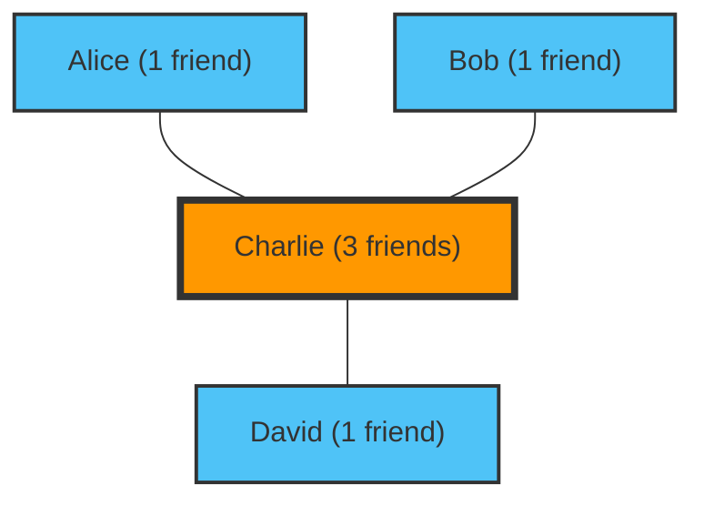

---
title: "Your Friends Have More Friends Than You Do: The Friendship Paradox"
description: "There's no need to worry that you 'don't have enough friends.' It's a mathematically proven property of networks."
date: 2026-09-10T21:00:00+09:00
draft: false
slug: "friendship-paradox"
image: "img/friendship_paradox.jpg"
math: true
mermaid: true
categories: ["Math Paradoxes", "Network Theory"]
tags: ["Paradox", "Graph Theory", "Social Media", "Statistics"]
---

"People around me seem to have more friends and have more fun than I do..."
Have you ever felt this way while scrolling through social media?

Actually, you feeling this way is not because of your personality or lack of popularity. It is a mathematical fact proven by network theory and statistics, known as the **"Friendship Paradox"**.

Discovered in 1991 by sociologist Scott Feld, this paradox explains the counterintuitive phenomenon that "most people have fewer friends than their friends do."

## Why do "Friends Have More Friends"?

To put it simply, this is due to a simple sampling bias: **"People with many friends (popular people) appear on many people's friend lists."**

Let's consider a simple network (graph).

In this small world, there are four people: Alice, Bob, Charlie, and David.
Charlie is the "popular one" and is friends with all three of the others. The other three are only friends with Charlie.

Let's look at the number of friends each person has.
- Alice's number of friends: 1
- Bob's number of friends: 1
- David's number of friends: 1
- Charlie's number of friends: 3
**The average number of friends for everyone** is $(1 + 1 + 1 + 3) / 4 = 1.5$ friends.

Next, let's calculate the average of the "number of friends their friends have" for each person.
- Number of friends of Alice's friend (Charlie): 3
- Number of friends of Bob's friend (Charlie): 3
- Number of friends of David's friend (Charlie): 3
- Average number of friends of Charlie's friends (Alice, Bob, David): $(1 + 1 + 1) / 3 = 1$

Now, let's compare each "person" with the "average of their friends".
- Alice: Herself (1) < Friends' average (3)
- Bob: Himself (1) < Friends' average (3)
- David: Himself (1) < Friends' average (3)
- Charlie: Himself (3) > Friends' average (1)

3 out of 4 people (75% of the people) are in a situation where "their friends have more friends than they do." The presence of the popular Charlie strongly pulls up the "friends' average" for everyone around him.

## Mathematical Proof: Variance is Key

Let's express this with a mathematical formula.
In network theory, let the number of friends (degree) of a person $v$ be $k(v)$. Let the overall average number of friends in the network be $\mu$, and the variance of the number of friends be $\sigma^2$.

According to Feld's proof, the expected value of the "number of friends of a randomly chosen friend" is as follows:

$$ \text{Average number of friends of friends} = \mu + \frac{\sigma^2}{\mu} $$

The variance $\sigma^2$ is always a value of 0 or greater. In other words, except for the impossible situation where everyone has exactly the same number of friends ($\sigma^2 = 0$), the following inequality always holds.

$$ \mu + \frac{\sigma^2}{\mu} > \mu $$

**The "average number of friends of friends" will always be greater than the "overall average number of friends."**

In the real world and on social media (like X or Instagram), a tiny fraction of people have millions of followers (friends), while the vast majority only have dozens to hundreds. Because the variance $\sigma^2$ is extremely large, the effect of this paradox becomes even more intense.

## Application: Pandemics and Vaccination

The Friendship Paradox goes beyond the psychology of social media. It has a highly effective application in real-world social issues, particularly **infectious disease control**.

Suppose we have a limited number of vaccines and are unsure who to vaccinate. There is a more effective method than random vaccination.

1. Choose people at random.
2. Vaccinate not the person themselves, but **the person they named as a "friend"**.

Why is that? Because of the Friendship Paradox, the "friends" of randomly chosen people have a higher probability of having more connections (being a hub) on average. By prioritizing vaccines for people with many connections, we can dramatically slow the spread of infection throughout the entire network.

## Conclusion

When you look at social media and feel "everyone has more friends and a better social life than me," it is not your illusion, but a mathematical inevitability created by the structure of networks.

Because popular people show up in many people's networks, we are inevitably forced to observe a sample consisting mostly of "above-average popular people." The next time you are about to feel down on social media, please remember this formula.

$$ \mu + \frac{\sigma^2}{\mu} > \mu $$
