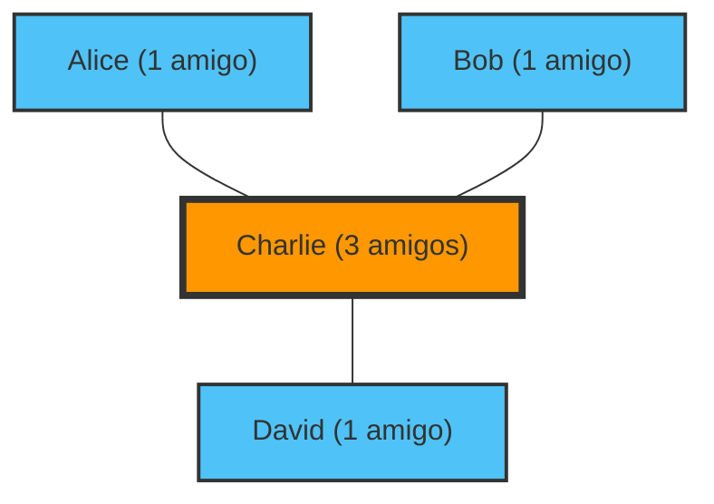

"Parece que los demás tienen más amigos que yo y se divierten..."
¿Alguna vez te has sentido así mientras miras las redes sociales?

En realidad, que te sientas así no es por tu personalidad, ni porque seas impopular. Es un hecho matemático probado por la teoría de redes y la estadística, llamado la **"Paradoja de la amistad (Friendship Paradox)"**.

Descubierta por el sociólogo Scott Feld en 1991, esta paradoja explica el fenómeno contraintuitivo de que "la mayoría de las personas tienen menos amigos que sus propios amigos".

## ¿Por qué "los amigos tienen más amigos"?

En conclusión, esto se debe a un simple sesgo de muestreo donde **"las personas con muchos amigos (personas populares) aparecen en las listas de amigos de muchas personas"**.

Pensemos en una red (grafo) sencilla.

En este pequeño mundo hay cuatro personas: Alice, Bob, Charlie y David.
Charlie es la persona "popular" y es amigo de las otras tres personas. Las otras tres personas solo son amigas de Charlie.

Veamos el número de amigos de cada uno.
- Número de amigos de Alice: 1
- Número de amigos de Bob: 1
- Número de amigos de David: 1
- Número de amigos de Charlie: 3
El **número medio de amigos de todos** es $(1 + 1 + 1 + 3) / 4 = 1.5$.

A continuación, calculemos el "promedio del 'número de amigos de los amigos' de cada persona".
- Número de amigos del amigo de Alice (Charlie): 3
- Número de amigos del amigo de Bob (Charlie): 3
- Número de amigos del amigo de David (Charlie): 3
- Promedio del número de amigos de los amigos de Charlie (Alice, Bob, David): $(1 + 1 + 1) / 3 = 1$

Ahora, comparemos el "propio" número y el "promedio de sus amigos" para cada uno.
- Alice: Propio (1) < Promedio de amigos (3)
- Bob: Propio (1) < Promedio de amigos (3)
- David: Propio (1) < Promedio de amigos (3)
- Charlie: Propio (3) > Promedio de amigos (1)

Tres de las cuatro personas (el 75%) se encuentran en una situación donde "sus amigos tienen más amigos que ellos". La existencia del popular Charlie eleva fuertemente el "promedio de amigos" de todos los que le rodean.

## Prueba matemática: La varianza es la clave

Expresemos esto en una fórmula.
En la teoría de redes, sea $k(v)$ el número de amigos (grado) de una persona $v$. Sea $\mu$ el promedio de amigos de toda la red, y $\sigma^2$ la varianza del número de amigos.

Según la prueba de Feld, el valor esperado del "número de amigos de un amigo elegido al azar" es el siguiente:

$$ \text{Promedio del número de amigos de los amigos} = \mu + \frac{\sigma^2}{\mu} $$

La varianza $\sigma^2$ siempre es un valor mayor o igual a 0. Es decir, excluyendo la situación imposible en la que todos tienen exactamente la misma cantidad de amigos ($\sigma^2 = 0$), siempre se cumple la siguiente desigualdad:

$$ \mu + \frac{\sigma^2}{\mu} > \mu $$

**El "promedio del número de amigos de los amigos" siempre será mayor que el "promedio total de amigos".**

En la sociedad real y en las redes sociales (como X o Instagram), una pequeña fracción de personas tiene millones de seguidores (amigos), mientras que la gran mayoría solo tiene unas pocas docenas a varios cientos. Dado que la varianza $\sigma^2$ es extremadamente grande, el efecto de esta paradoja se vuelve aún más fuerte.

## Aplicación: Pandemias y vacunación

La paradoja de la amistad no se limita solo a la psicología de las redes sociales. Tiene aplicaciones muy eficaces para problemas sociales reales, especialmente en la **prevención de enfermedades infecciosas**.

Supongamos que hay un número limitado de vacunas y no estás seguro de a quién vacunar. Hay un método más efectivo que vacunar al azar.

1. Elige a las personas al azar.
2. Vacuna no a la persona en sí, sino a **la persona que él o ella haya nombrado como "amigo"**.

¿Por qué? Por la paradoja de la amistad, los "amigos" de las personas elegidas al azar tienen una mayor probabilidad de tener, en promedio, más conexiones (ser un nodo central o *hub*). Al vacunar prioritariamente a las personas con más conexiones, se puede ralentizar drásticamente la propagación de la infección a toda la red.

## Conclusión

Cuando miras las redes sociales y sientes que "todos tienen más amigos que yo y llevan vidas perfectas", no es tu imaginación, sino una inevitabilidad matemática creada por la estructura de la red.

Dado que las personas populares aparecen en las redes de muchas personas, inevitablemente nos vemos forzados a observar solo a las "personas más populares que el promedio" como nuestra muestra. La próxima vez que te sientas deprimido en las redes sociales, por favor recuerda esta fórmula.

$$ \mu + \frac{\sigma^2}{\mu} > \mu $$
