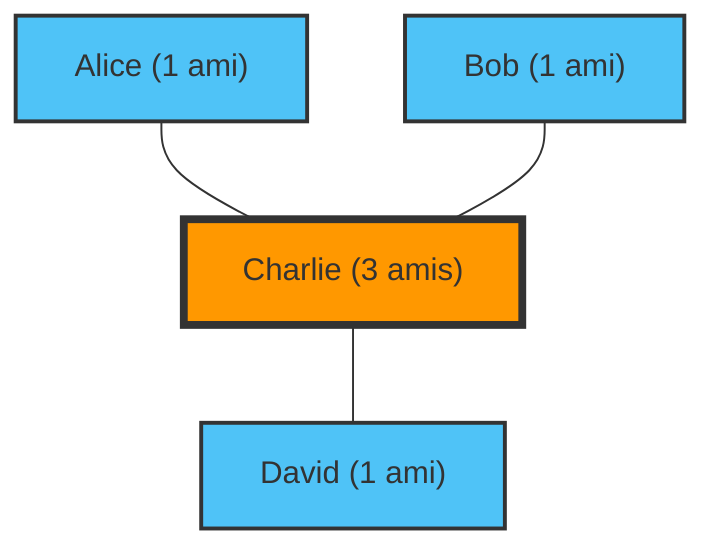

"Les gens autour de moi ont plus d'amis que moi et ont l'air de tellement s'amuser..."
Avez-vous déjà ressenti cela en parcourant les réseaux sociaux ?

En fait, si vous ressentez cela, ce n'est pas à cause de votre personnalité, ni parce que vous n'êtes pas populaire. C'est un fait mathématique prouvé par la théorie des réseaux et les statistiques, appelé le **"Paradoxe de l'amitié" (Friendship Paradox)**.

Découvert en 1991 par le sociologue Scott Feld, ce paradoxe explique un phénomène contre-intuitif : "La plupart des gens ont moins d'amis que leurs propres amis".

## Pourquoi "les amis ont-ils plus d'amis" ?

Pour faire court, cela est dû à un simple biais d'échantillonnage où **"les personnes ayant beaucoup d'amis (les personnes populaires) apparaissent dans les listes d'amis de beaucoup de gens"**.

Prenons un réseau (graphe) simple pour comprendre.

Dans ce petit monde, il y a quatre personnes : Alice, Bob, Charlie et David.
Charlie est le "populaire" et est ami avec les trois autres. Les trois autres ne sont amis qu'avec Charlie.

Regardons le nombre d'amis de chacun :
- Nombre d'amis d'Alice : 1
- Nombre d'amis de Bob : 1
- Nombre d'amis de David : 1
- Nombre d'amis de Charlie : 3
**Le nombre moyen d'amis pour tout le monde** est de $(1 + 1 + 1 + 3) / 4 = 1.5$ personne.

Ensuite, calculons "la moyenne du nombre d'amis des amis" pour chaque personne :
- Nombre d'amis de l'ami d'Alice (Charlie) : 3
- Nombre d'amis de l'ami de Bob (Charlie) : 3
- Nombre d'amis de l'ami de David (Charlie) : 3
- Moyenne du nombre d'amis des amis de Charlie (Alice, Bob, David) : $(1 + 1 + 1) / 3 = 1$

Maintenant, comparons "soi-même" à "la moyenne de ses amis" pour chaque personne :
- Alice : Soi-même (1) < Moyenne de ses amis (3)
- Bob : Soi-même (1) < Moyenne de ses amis (3)
- David : Soi-même (1) < Moyenne de ses amis (3)
- Charlie : Soi-même (3) > Moyenne de ses amis (1)

3 personnes sur 4 (75 % des personnes) se trouvent dans une situation où "leurs amis ont plus d'amis qu'eux-mêmes". La présence de Charlie, la personne populaire, augmente fortement "la moyenne des amis" de tous ceux qui l'entourent.

## Preuve mathématique : la variance est la clé

Exprimons cela avec des formules mathématiques.
Dans la théorie des réseaux, soit $k(v)$ le nombre d'amis (le degré) d'une personne $v$. Soit $\mu$ le nombre moyen d'amis dans l'ensemble du réseau, et $\sigma^2$ la variance du nombre d'amis.

Selon la preuve de Feld, l'espérance du "nombre d'amis d'un ami choisi au hasard" est la suivante :

$$ \text{Moyenne du nombre d'amis des amis} = \mu + \frac{\sigma^2}{\mu} $$

La variance $\sigma^2$ est toujours une valeur supérieure ou égale à 0. En d'autres termes, à l'exception de la situation improbable où tout le monde a exactement le même nombre d'amis ($\sigma^2 = 0$), l'inégalité suivante est toujours vraie :

$$ \mu + \frac{\sigma^2}{\mu} > \mu $$

**"La moyenne du nombre d'amis des amis" est toujours strictement supérieure au "nombre moyen d'amis global".**

Dans le monde réel et sur les réseaux sociaux (comme X ou Instagram), une toute petite fraction de personnes possède des millions de followers (amis), tandis que la grande majorité n'en a que quelques dizaines à quelques centaines. En d'autres termes, comme la variance $\sigma^2$ est extrêmement grande, l'effet de ce paradoxe est encore plus puissant.

## Application : Pandémies et vaccination

Le paradoxe de l'amitié ne se limite pas à la simple psychologie des réseaux sociaux. Il a des applications très efficaces pour des problèmes de société réels, notamment en ce qui concerne **les mesures contre les maladies infectieuses**.

Supposons que vous n'ayez qu'un nombre limité de vaccins et que vous ne sachiez pas à qui les administrer. Il existe une méthode plus efficace que la vaccination aléatoire :

1. Choisissez des personnes au hasard.
2. N'administrez pas le vaccin à ces personnes elles-mêmes, mais **à une personne qu'elles désignent comme "ami"**.

Pourquoi ? Grâce au paradoxe de l'amitié, les "amis" des personnes choisies au hasard ont en moyenne une plus grande probabilité d'avoir plus de connexions (d'être des hubs). En donnant la priorité à la vaccination des personnes ayant beaucoup de connexions, on peut ralentir considérablement la propagation de l'infection à l'ensemble du réseau.

## Conclusion

Lorsque vous regardez les réseaux sociaux et que vous vous dites : "Tout le monde a plus d'amis que moi et a une vie épanouie", ce n'est pas une illusion de votre part, mais une fatalité mathématique créée par la structure du réseau.

Parce que les personnes populaires apparaissent dans les réseaux de nombreuses personnes, nous sommes inévitablement obligés de n'observer que des "personnes populaires au-dessus de la moyenne" comme échantillons. La prochaine fois que vous vous sentirez déprimé(e) sur les réseaux sociaux, n'hésitez pas à vous souvenir de cette formule :

$$ \mu + \frac{\sigma^2}{\mu} > \mu $$
