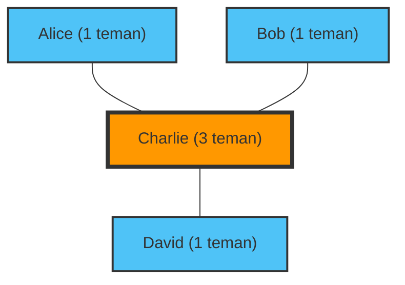

"Orang-orang di sekitarku sepertinya memiliki lebih banyak teman dan terlihat lebih menyenangkan..."
Pernahkah Anda merasa seperti itu saat melihat-lihat media sosial?

Faktanya, alasan Anda merasa seperti itu bukanlah karena kepribadian Anda, atau karena Anda tidak populer. Itu adalah fakta matematis yang dibuktikan oleh teori jaringan dan statistika, yang disebut **"Paradoks Persahabatan (Friendship Paradox)"**.

Ditemukan oleh sosiolog Scott Feld pada tahun 1991, paradoks ini menjelaskan fenomena yang berlawanan dengan intuisi bahwa "kebanyakan orang memiliki lebih sedikit teman daripada teman-teman mereka".

## Mengapa "Teman memiliki lebih banyak teman"?

Singkatnya, ini disebabkan oleh bias pengambilan sampel yang sederhana di mana **"orang dengan banyak teman (orang populer) muncul di daftar teman banyak orang"**.

Mari kita pertimbangkan jaringan (graf) sederhana.

Di dunia kecil ini, ada empat orang: Alice, Bob, Charlie, dan David.
Charlie adalah "orang populer" dan berteman dengan ketiga orang lainnya. Ketiga orang lainnya hanya berteman dengan Charlie.

Mari kita lihat jumlah teman masing-masing.
- Jumlah teman Alice: 1 orang
- Jumlah teman Bob: 1 orang
- Jumlah teman David: 1 orang
- Jumlah teman Charlie: 3 orang
**Rata-rata jumlah teman setiap orang** adalah $(1 + 1 + 1 + 3) / 4 = 1.5 \text{ orang}$.

Selanjutnya, mari kita hitung "rata-rata jumlah teman dari teman-teman masing-masing orang".
- Jumlah teman dari teman Alice (Charlie): 3 orang
- Jumlah teman dari teman Bob (Charlie): 3 orang
- Jumlah teman dari teman David (Charlie): 3 orang
- Rata-rata jumlah teman dari teman-teman Charlie (Alice, Bob, dan David): $(1 + 1 + 1) / 3 = 1 \text{ orang}$

Sekarang, mari kita bandingkan "diri sendiri" dengan "rata-rata dari teman-teman diri sendiri" untuk setiap orang.
- Alice: Sendiri (1) < Rata-rata teman (3)
- Bob: Sendiri (1) < Rata-rata teman (3)
- David: Sendiri (1) < Rata-rata teman (3)
- Charlie: Sendiri (3) > Rata-rata teman (1)

3 dari 4 orang (75% orang) berada dalam situasi di mana "teman-teman mereka memiliki lebih banyak teman daripada mereka sendiri". Keberadaan Charlie yang populer sangat meningkatkan "rata-rata teman" bagi semua orang di sekitarnya.

## Bukti Matematis: Varians adalah Kuncinya

Mari kita nyatakan ini dengan rumus matematika.
Dalam teori jaringan, misalkan jumlah teman (derajat) dari seseorang $v$ adalah $k(v)$. Misalkan rata-rata jumlah teman di seluruh jaringan adalah $\mu$, dan varians dari jumlah teman adalah $\sigma^2$.

Menurut bukti Feld, nilai harapan dari "jumlah teman dari teman yang dipilih secara acak" adalah sebagai berikut:

$$ \text{Rata-rata jumlah teman dari teman} = \mu + \frac{\sigma^2}{\mu} $$

Varians $\sigma^2$ selalu bernilai 0 atau lebih. Dengan kata lain, kecuali situasi yang tidak mungkin di mana setiap orang memiliki jumlah teman yang sama persis ($\sigma^2 = 0$), pertidaksamaan berikut selalu berlaku:

$$ \mu + \frac{\sigma^2}{\mu} > \mu $$

**"Rata-rata jumlah teman dari teman" selalu dan pasti lebih besar dari "rata-rata keseluruhan jumlah teman".**

Dalam masyarakat nyata dan media sosial (seperti X dan Instagram), sebagian kecil orang memiliki jutaan pengikut (teman), sementara sebagian besar orang hanya memiliki puluhan hingga ratusan. Ini berarti bahwa varians $\sigma^2$ sangat besar, sehingga efek dari paradoks ini menjadi lebih kuat.

## Aplikasi: Pandemi dan Vaksinasi

Paradoks persahabatan tidak hanya terbatas pada psikologi media sosial. Ia memiliki aplikasi yang sangat efektif dalam masalah sosial dunia nyata, terutama dalam **tindakan pencegahan penyakit menular**.

Misalkan kita memiliki jumlah vaksin yang terbatas dan bingung kepada siapa harus memberikannya. Ada cara yang lebih efektif daripada memberikannya secara acak.

1. Pilih orang secara acak.
2. Bukan orang itu sendiri, melainkan **orang yang mereka sebut sebagai "teman"** yang diberi vaksin.

Mengapa demikian? Karena paradoks persahabatan, "teman" dari orang yang dipilih secara acak rata-rata memiliki probabilitas lebih tinggi untuk memiliki lebih banyak koneksi (menjadi hub). Dengan memprioritaskan vaksinasi pada orang-orang yang memiliki banyak koneksi, penyebaran infeksi ke seluruh jaringan dapat diperlambat secara drastis.

## Kesimpulan

Ketika Anda melihat media sosial dan merasa "Semua orang memiliki lebih banyak teman daripadaku dan mereka menjalani hidup sepenuhnya", itu bukanlah ilusi Anda, melainkan kepastian matematis yang diciptakan oleh struktur jaringan.

Karena orang-orang populer muncul di banyak jaringan orang, kita pada akhirnya hanya mengamati "orang-orang populer di atas rata-rata" sebagai sampel. Lain kali Anda merasa sedih karena media sosial, silakan ingat rumus ini.

$$ \mu + \frac{\sigma^2}{\mu} > \mu $$
