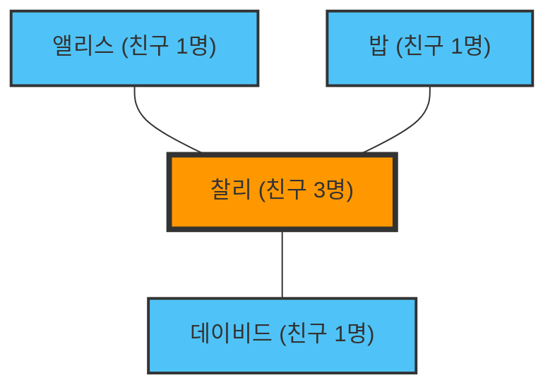

---
title: "당신의 친구는 당신보다 친구가 많다: 우정의 역설"
description: "'나는 친구가 적은 게 아닐까?' 하고 고민할 필요는 없습니다. 그것은 수학적으로 증명된 네트워크의 성질이니까요."
date: 2026-09-10T21:00:00+09:00
draft: false
slug: "friendship-paradox"
image: "img/friendship_paradox.jpg"
math: true
mermaid: true
categories: ["수학 역설", "네트워크 이론"]
tags: ["역설", "그래프 이론", "SNS", "통계학"]
---

"내 주위 사람들은 나보다 친구가 많고 즐거워 보이네..."
SNS를 보다가 그런 느낌을 받은 적이 있나요?

사실, 당신이 그렇게 느끼는 것은 당신의 성격 탓도, 인기가 없는 탓도 아닙니다. 그것은 **'우정의 역설(Friendship Paradox)'**이라고 불리는, 네트워크 이론과 통계학에 의해 증명된 수학적인 사실입니다.

1991년 사회학자 스콧 펠드(Scott Feld)가 발견한 이 역설은, "대부분의 사람들은 자신의 친구보다 친구의 수가 적다"는 직관에 반하는 현상을 설명합니다.

## 왜 '친구가 친구가 더 많다'고 할까요?

결론부터 말하자면, 이것은 **'친구가 많은 사람(인기인)은 여러 사람의 친구 목록에 등장한다'**는 단순한 표본 추출의 편향(Sampling Bias) 때문입니다.

간단한 네트워크(그래프)로 생각해 봅시다.

이 작은 세계에는 앨리스, 밥, 찰리, 데이비드 네 사람이 있습니다.
찰리는 '인기인'으로, 나머지 세 명 모두와 친구입니다. 다른 세 명은 찰리와만 친구입니다.

각자의 친구 수를 살펴봅시다.
- 앨리스의 친구 수: 1명
- 밥의 친구 수: 1명
- 데이비드의 친구 수: 1명
- 찰리의 친구 수: 3명
**모두의 평균 친구 수**는 $(1 + 1 + 1 + 3) / 4 = 1.5명$ 입니다.

다음으로, "각 사람의 '친구의 친구 수'의 평균"을 계산해 보겠습니다.
- 앨리스의 친구(찰리)의 친구 수: 3명
- 밥의 친구(찰리)의 친구 수: 3명
- 데이비드의 친구(찰리)의 친구 수: 3명
- 찰리의 친구(앨리스, 밥, 데이비드)의 친구 수의 평균: $(1 + 1 + 1) / 3 = 1명$

자, 각각의 '나'와 '내 친구의 평균'을 비교해 봅니다.
- 앨리스: 나(1) < 친구의 평균(3)
- 밥: 나(1) < 친구의 평균(3)
- 데이비드: 나(1) < 친구의 평균(3)
- 찰리: 나(3) > 친구의 평균(1)

4명 중 3명(75%의 사람)이 "나의 친구는 나보다 친구가 많다"는 상태에 놓여 있습니다. 인기인 찰리의 존재가 주위 모든 사람의 '친구의 평균'을 강력하게 끌어올리고 있는 것입니다.

## 수학적 증명: 분산이 핵심

이것을 수식으로 표현해 봅시다.
네트워크 이론에서, 어떤 사람 $v$의 친구 수(차수)를 $k(v)$라고 합시다. 네트워크 전체의 평균 친구 수를 $\mu$, 친구 수의 분산을 $\sigma^2$이라고 합니다.

펠드의 증명에 따르면, "무작위로 고른 친구의 친구 수"의 기댓값은 다음과 같습니다:

$$ \text{친구의 친구 수의 평균} = \mu + \frac{\sigma^2}{\mu} $$

분산 $\sigma^2$은 항상 0 이상의 값입니다. 즉, 누구나 완전히 같은 수의 친구를 가지고 있는($\sigma^2 = 0$) 있을 수 없는 상황을 제외하면, 항상 다음 부등식이 성립합니다.

$$ \mu + \frac{\sigma^2}{\mu} > \mu $$

**"친구의 친구 수의 평균"은 항상 "전체의 평균 친구 수"보다 반드시 커지게 됩니다.**

현실 사회나 SNS(X나 인스타그램 등)에서는, 극히 일부의 사람이 수백만 명의 팔로워(친구)를 가지는 반면, 대부분의 사람은 수십 명~수백 명 밖에 없습니다. 즉 분산 $\sigma^2$이 극히 크기 때문에, 이 역설의 효과는 더욱 강렬해집니다.

## 응용: 팬데믹과 백신 접종

우정의 역설은 단순한 SNS의 심리학에 머물지 않습니다. 현실의 사회 문제, 특히 **감염병 대책**에 매우 효과적으로 응용되고 있습니다.

제한된 수의 백신밖에 없어 누구에게 접종해야 할지 망설인다고 합시다. 무작위로 접종하는 것보다 더 효과적인 방법이 있습니다.

1. 무작위로 사람들을 고릅니다.
2. 그 사람 자신이 아니라, **그 사람이 '친구다'라고 지목한 상대**에게 백신을 접종합니다.

왜 그럴까요? 우정의 역설에 의해, 무작위로 선택된 사람의 '친구'는 평균적으로 더 많은 연결을 가지고 있을(허브일) 확률이 높기 때문입니다. 연결이 많은 사람에게 우선적으로 백신을 맞힘으로써, 네트워크 전체로의 감염 확산을 극적으로 늦출 수 있는 것입니다.

## 결론

당신이 SNS를 보고 "다들 나보다 친구가 많고 인싸네"라고 느낄 때, 그것은 당신의 착각이 아니라 네트워크의 구조가 만들어내는 수학적인 필연입니다.

인기인은 많은 사람의 네트워크에 등장하기 때문에, 우리는 필연적으로 "평균 이상의 인기인"만을 표본으로 관찰하게 되는 것입니다. 다음부터 SNS에서 우울해질 것 같을 때는, 꼭 이 수식을 떠올려 보세요.

$$ \mu + \frac{\sigma^2}{\mu} > \mu $$
