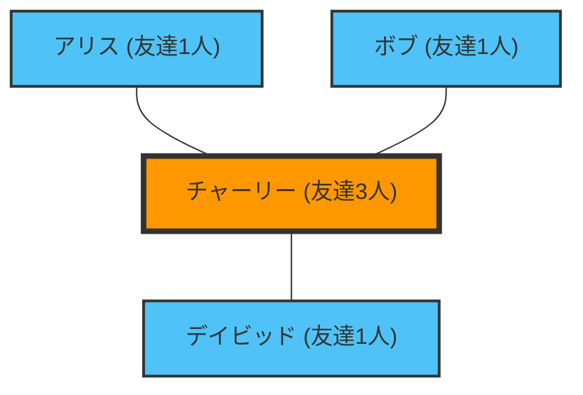

「周りの人は自分よりも友達が多くて、楽しそうだな…」
SNSを眺めていて、そんな風に感じたことはありませんか？

実は、あなたがそう感じるのは、あなたの性格のせいでも、人気がないせいでもありません。それは**「友情のパラドックス（Friendship Paradox）」**と呼ばれる、ネットワーク理論と統計学によって証明された数学的な事実なのです。

1991年に社会学者スコット・フェルドによって発見されたこのパラドックスは、「ほとんどの人は、自分の友達よりも友達の数が少ない」という直感に反する現象を説明しています。

## なぜ「友達の方が友達が多い」のか？

結論から言うと、これは**「友達が多い人（人気者）は、多くの人の友達リストに登場する」**という単純なサンプリングの偏りによるものです。

簡単なネットワーク（グラフ）で考えてみましょう。

この小さな世界には、アリス、ボブ、チャーリー、デイビッドの4人がいます。
チャーリーは「人気者」で、他の3人全員と友達です。他の3人はチャーリーとしか友達ではありません。

それぞれの友達の数を見てみましょう。
- アリスの友達数：1人
- ボブの友達数：1人
- デイビッドの友達数：1人
- チャーリーの友達数：3人
**全員の平均友達数**は、$(1 + 1 + 1 + 3) / 4 = 1.5人$ です。

次に、「それぞれの人の『友達の友達数』の平均」を計算してみましょう。
- アリスの友達（チャーリー）の友達数：3人
- ボブの友達（チャーリー）の友達数：3人
- デイビッドの友達（チャーリー）の友達数：3人
- チャーリーの友達（アリス、ボブ、デイビッド）の友達数の平均：$(1 + 1 + 1) / 3 = 1人$

さて、それぞれの「自分」と「自分の友達の平均」を比較します。
- アリス：自分(1) < 友達の平均(3)
- ボブ：自分(1) < 友達の平均(3)
- デイビッド：自分(1) < 友達の平均(3)
- チャーリー：自分(3) > 友達の平均(1)

4人中3人（75%の人）が、「自分の友達は、自分よりも友達が多い」という状態に置かれています。人気者のチャーリーの存在が、周囲の全員の「友達の平均」を強力に引き上げているのです。

## 数学的な証明：分散がカギ

これを数式で表してみましょう。
ネットワーク理論において、ある人 $v$ の友達の数（次数）を $k(v)$ とします。ネットワーク全体の平均友達数を $\mu$、友達の数の分散を $\sigma^2$ とします。

フェルドの証明によれば、「ランダムに選んだ友達の友達数」の期待値は以下のようになります：

$$ \text{友達の友達数の平均} = \mu + \frac{\sigma^2}{\mu} $$

分散 $\sigma^2$ は常に0以上の値です。つまり、誰もが全く同じ数の友達を持っている（$\sigma^2 = 0$）というあり得ない状況を除けば、常に以下の不等式が成り立ちます。

$$ \mu + \frac{\sigma^2}{\mu} > \mu $$

**「友達の友達数の平均」は、常に「全体の平均友達数」よりも必ず大きくなるのです。**

現実社会やSNS（XやInstagramなど）では、ごく一部の人が数百万人のフォロワー（友達）を持つ一方で、大半の人は数十人〜数百人しかいません。つまり分散 $\sigma^2$ が極めて大きいため、このパラドックスの効果はさらに強烈になります。

## 応用：パンデミックとワクチン接種

友情のパラドックスは、単なるSNSの心理学に留まりません。現実の社会課題、特に**感染症対策**に非常に有効な応用がなされています。

限られた数のワクチンしかなく、誰に接種すべきか迷ったとします。ランダムに接種するよりも効果的な方法があります。

1. ランダムに人々を選びます。
2. その人自身ではなく、**その人が「友達だ」と指名した相手**にワクチンを接種します。

なぜでしょうか？友情のパラドックスにより、ランダムに選ばれた人の「友達」は、平均してより多くのつながりを持っている（ハブである）確率が高いからです。つながりが多い人に優先的にワクチンを打つことで、ネットワーク全体への感染拡大を劇的に遅らせることができるのです。

## 結論

あなたがSNSを見て「みんな私より友達が多くてリア充だ」と感じる時、それはあなたの錯覚ではなく、ネットワークの構造が生み出す数学的な必然です。

人気者は多くの人のネットワークに顔を出すため、私たちは必然的に「平均以上の人気者」ばかりをサンプルとして観察させられているのです。次からSNSで落ち込みそうになった時は、ぜひこの数式を思い出してください。

$$ \mu + \frac{\sigma^2}{\mu} > \mu $$
