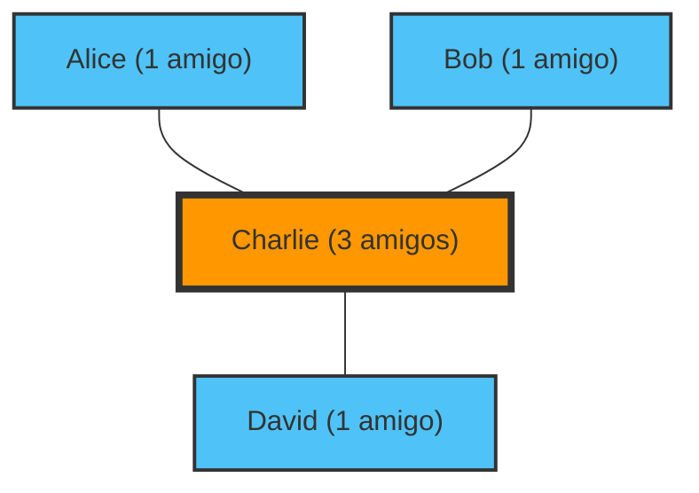

---
title: "Os seus amigos têm mais amigos do que você: O Paradoxo da Amizade"
description: "Não há necessidade de se preocupar se 'você tem poucos amigos'. Esta é uma propriedade das redes comprovada matematicamente."
date: 2026-09-10T21:00:00+09:00
draft: false
slug: "friendship-paradox"
image: "img/friendship_paradox.jpg"
math: true
mermaid: true
categories: ["Paradoxos Matemáticos", "Teoria das Redes"]
tags: ["paradoxo", "teoria dos grafos", "redes sociais", "estatística"]
---

"As pessoas ao meu redor têm mais amigos do que eu e parecem estar a divertir-se muito..."
Já alguma vez sentiu isso ao ver as redes sociais?

Na verdade, a razão pela qual se sente assim não é devido à sua personalidade ou por não ser popular. É um facto matemático provado pela teoria das redes e pela estatística, chamado **"Paradoxo da Amizade (Friendship Paradox)"**.

Descoberto pelo sociólogo Scott Feld em 1991, este paradoxo explica um fenómeno contraintuitivo de que "a maioria das pessoas tem menos amigos do que os seus próprios amigos".

## Por que "os amigos têm mais amigos"?

Resumindo, isto deve-se a um simples viés de amostragem: **"Pessoas com muitos amigos (pessoas populares) aparecem na lista de amigos de muitas pessoas"**.

Vamos pensar numa rede (grafo) simples.

Neste pequeno mundo, existem quatro pessoas: Alice, Bob, Charlie e David.
Charlie é "popular" e é amigo de todos os outros três. Os outros três são amigos apenas do Charlie.

Vejamos o número de amigos de cada um.
- Número de amigos da Alice: 1
- Número de amigos do Bob: 1
- Número de amigos do David: 1
- Número de amigos do Charlie: 3
**O número médio de amigos de todos** é $(1 + 1 + 1 + 3) / 4 = 1.5$ pessoas.

De seguida, vamos calcular "a média do 'número de amigos dos amigos' de cada pessoa".
- Número de amigos do amigo da Alice (Charlie): 3
- Número de amigos do amigo do Bob (Charlie): 3
- Número de amigos do amigo do David (Charlie): 3
- Média do número de amigos dos amigos do Charlie (Alice, Bob, David): $(1 + 1 + 1) / 3 = 1$

Agora, comparamos cada "próprio" com a "média dos seus amigos".
- Alice: Própria(1) < Média dos amigos(3)
- Bob: Próprio(1) < Média dos amigos(3)
- David: Próprio(1) < Média dos amigos(3)
- Charlie: Próprio(3) > Média dos amigos(1)

Das 4 pessoas, 3 (75% das pessoas) estão na situação de que "os seus amigos têm mais amigos do que elas próprias". A presença do popular Charlie aumenta fortemente a "média dos amigos" de todos ao seu redor.

## Prova Matemática: A Variância é a Chave

Vamos expressar isto com fórmulas.
Na teoria das redes, que o número de amigos (grau) de uma determinada pessoa $v$ seja $k(v)$. Que o número médio de amigos em toda a rede seja $\mu$, e a variância do número de amigos seja $\sigma^2$.

Segundo a prova de Feld, o valor esperado do "número de amigos de um amigo escolhido aleatoriamente" é o seguinte:

$$ \text{Média do número de amigos dos amigos} = \mu + \frac{\sigma^2}{\mu} $$

A variância $\sigma^2$ é sempre um valor de 0 ou superior. Ou seja, exceto na situação impossível em que todos têm exatamente o mesmo número de amigos ($\sigma^2 = 0$), a seguinte desigualdade é sempre verdadeira:

$$ \mu + \frac{\sigma^2}{\mu} > \mu $$

**A "média do número de amigos dos amigos" será sempre obrigatoriamente maior do que o "número médio de amigos em geral".**

No mundo real e nas redes sociais (como o X ou o Instagram), uma pequena fração de pessoas tem milhões de seguidores (amigos), enquanto a maioria tem apenas dezenas a centenas. Como a variância $\sigma^2$ é extremamente grande, o efeito deste paradoxo torna-se ainda mais forte.

## Aplicação: Pandemias e Vacinação

O Paradoxo da Amizade não se limita apenas à psicologia das redes sociais. Têm sido feitas aplicações muito eficazes a problemas sociais reais, especialmente no **controlo de doenças infeciosas**.

Imagine que tem um número limitado de vacinas e não sabe a quem vacinar. Existe um método mais eficaz do que a vacinação aleatória.

1. Escolha pessoas aleatoriamente.
2. Vacine não as pessoas em si, mas sim os **contactos que elas indicam como "amigos"**.

Porquê? Devido ao Paradoxo da Amizade, os "amigos" de pessoas escolhidas aleatoriamente têm, em média, uma maior probabilidade de terem mais conexões (sendo centros/hubs). Ao vacinar prioritariamente as pessoas com mais conexões, é possível atrasar drasticamente a propagação da infeção por toda a rede.

## Conclusão

Quando vê as redes sociais e sente que "toda a gente tem mais amigos do que eu e uma vida melhor", isso não é uma ilusão sua, mas sim uma inevitabilidade matemática criada pela estrutura da rede.

Como as pessoas populares aparecem nas redes de muitas pessoas, somos inevitavelmente levados a observar quase apenas "pessoas mais populares do que a média" como amostras. Da próxima vez que estiver prestes a sentir-se deprimido nas redes sociais, por favor, lembre-se desta fórmula.

$$ \mu + \frac{\sigma^2}{\mu} > \mu $$
