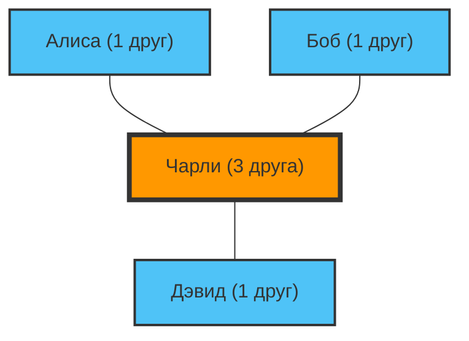

«Кажется, у всех вокруг больше друзей, и они веселятся больше, чем я...»
Бывало ли у вас такое чувство, когда вы листаете ленту в социальных сетях?

На самом деле, если вы так чувствуете, то дело не в вашем характере или отсутствии популярности. Это математический факт, доказанный с помощью теории сетей и статистики, который называется **«Парадокс дружбы (Friendship Paradox)»**.

Этот парадокс, открытый социологом Скоттом Фелдом в 1991 году, объясняет противоречащее интуиции явление: «У большинства людей друзей меньше, чем у их собственных друзей».

## Почему «у друзей больше друзей»?

Вкратце, это происходит из-за простого смещения выборки: **«люди, у которых много друзей (популярные), появляются в списках друзей многих людей»**.

Давайте рассмотрим простую сеть (граф).

В этом маленьком мире четыре человека: Алиса, Боб, Чарли и Дэвид.
Чарли — «популярный», он дружит с тремя остальными. Остальные трое дружат только с Чарли.

Давайте посмотрим на количество друзей у каждого:
- Количество друзей Алисы: 1
- Количество друзей Боба: 1
- Количество друзей Дэвида: 1
- Количество друзей Чарли: 3
**Среднее количество друзей у всех** составляет $(1 + 1 + 1 + 3) / 4 = 1.5$.

Теперь давайте посчитаем «среднее количество друзей друзей» для каждого человека:
- Количество друзей друга Алисы (Чарли): 3
- Количество друзей друга Боба (Чарли): 3
- Количество друзей друга Дэвида (Чарли): 3
- Среднее количество друзей друзей Чарли (Алисы, Боба и Дэвида): $(1 + 1 + 1) / 3 = 1$

Теперь сравним каждого «себя» со «средним числом друзей своих друзей»:
- Алиса: У неё (1) < В среднем у друзей (3)
- Боб: У него (1) < В среднем у друзей (3)
- Дэвид: У него (1) < В среднем у друзей (3)
- Чарли: У него (3) > В среднем у друзей (1)

3 из 4 человек (75% людей) находятся в ситуации, когда «у их друзей больше друзей, чем у них самих». Существование популярного Чарли сильно завышает «среднее число друзей» для всех вокруг него.

## Математическое доказательство: дисперсия — это ключ

Давайте выразим это формулой.
В теории сетей количество друзей (степень узла) человека $v$ обозначается как $k(v)$. Пусть среднее количество друзей во всей сети равно $\mu$, а дисперсия количества друзей равна $\sigma^2$.

Согласно доказательству Фелда, ожидаемое значение «количества друзей случайно выбранного друга» выглядит следующим образом:

$$ \text{Среднее количество друзей друзей} = \mu + \frac{\sigma^2}{\mu} $$

Дисперсия $\sigma^2$ всегда больше или равна 0. Это значит, что, за исключением невозможной ситуации, когда абсолютно у каждого человека одинаковое количество друзей ($\sigma^2 = 0$), всегда выполняется следующее неравенство:

$$ \mu + \frac{\sigma^2}{\mu} > \mu $$

**«Среднее количество друзей друзей» всегда строго больше, чем «общее среднее количество друзей».**

В реальном обществе и социальных сетях (таких как X и Instagram) лишь небольшая часть людей имеет миллионы подписчиков (друзей), тогда как у большинства их от нескольких десятков до сотен. Это означает, что дисперсия $\sigma^2$ чрезвычайно велика, из-за чего эффект этого парадокса становится еще сильнее.

## Применение: Пандемии и вакцинация

Парадокс дружбы не ограничивается только психологией социальных сетей. Он нашел очень эффективное применение в решении реальных социальных проблем, особенно **в борьбе с инфекционными заболеваниями**.

Представьте, что у вас есть ограниченное количество вакцин, и вы сомневаетесь, кого нужно вакцинировать. Есть метод, который эффективнее случайной вакцинации.

1. Выберите людей случайным образом.
2. Вакцинируйте не их самих, а **тех, кого они назвали своими «друзья»**.

Почему так? Из-за парадокса дружбы «друзья» случайно выбранных людей в среднем имеют более высокую вероятность иметь больше связей (быть «хабами»). Вакцинируя людей с большим количеством связей в первую очередь, мы можем значительно замедлить распространение инфекции по всей сети.

## Заключение

Когда вы смотрите в социальные сети и думаете: «У всех больше друзей, чем у меня, и они живут полной жизнью», — это не ваша иллюзия, а математическая неизбежность, порождаемая структурой сетей.

Популярные люди появляются в сетях многих людей, поэтому мы неизбежно вынуждены наблюдать только за «популярными людьми выше среднего» в качестве примеров. В следующий раз, когда вы почувствуете себя подавленным из-за социальных сетей, просто вспомните эту формулу:

$$ \mu + \frac{\sigma^2}{\mu} > \mu $$
