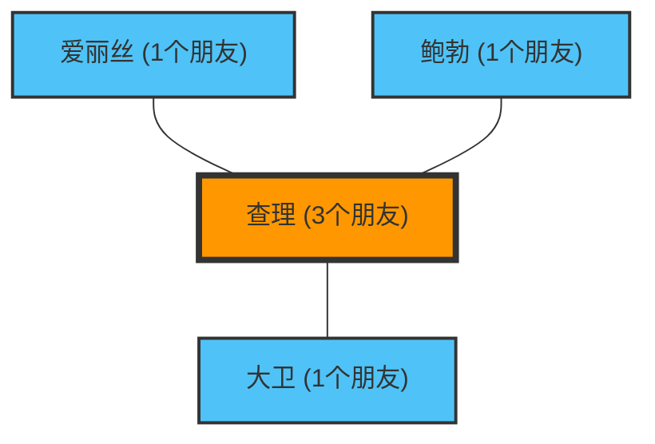

“周围的人朋友都比我多，看起来好开心啊……”
在浏览社交网络（SNS）时，你是否也有过这样的感觉？

其实，你之所以会有这种感觉，并不是因为你的性格问题，也不是因为你不受欢迎。这是被称为**“友谊悖论（Friendship Paradox）”**的现象，一个由网络理论和统计学证明的数学事实。

这一悖论由社会学家斯科特·菲尔德（Scott Feld）在1991年发现，它解释了一个违反直觉的现象：“大多数人的朋友数量都比自己朋友的朋友数量少”。

## 为什么“朋友的朋友比我的朋友多”？

长话短说，这是因为**“朋友多的人（受欢迎的人）会出现在很多人的好友列表中”**，一种简单的采样偏差。

让我们用一个简单的网络（图）来思考一下。

在这个小世界里，有爱丽丝、鲍勃、查理和大卫四个人。
查理是“受欢迎的人”，他与另外三个人都是朋友。而另外三个人只和查理是朋友。

让我们来看看各自的朋友数量：
- 爱丽丝的朋友数：1人
- 鲍勃的朋友数：1人
- 大卫的朋友数：1人
- 查理的朋友数：3人
**所有人的平均朋友数**是：$(1 + 1 + 1 + 3) / 4 = 1.5人$。

接下来，我们计算一下“每个人‘朋友的朋友数’的平均值”：
- 爱丽丝的朋友（查理）的朋友数：3人
- 鲍勃的朋友（查理）的朋友数：3人
- 大卫的朋友（查理）的朋友数：3人
- 查理的朋友（爱丽丝、鲍勃、大卫）的朋友数平均值：$(1 + 1 + 1) / 3 = 1人$

现在，我们将各自的“自己”和“自己朋友的平均值”进行比较：
- 爱丽丝：自己(1) < 朋友的平均(3)
- 鲍勃：自己(1) < 朋友的平均(3)
- 大卫：自己(1) < 朋友的平均(3)
- 查理：自己(3) > 朋友的平均(1)

4个人中有3个人（75%的人）处于“自己的朋友比自己拥有更多朋友”的状态。受欢迎的查理的存在，强力拉高了周围所有人的“朋友平均数”。

## 数学证明：方差是关键

让我们用数学公式来表示这一现象。
在网络理论中，假设某个人 $v$ 的朋友数（度数）为 $k(v)$。网络整体的平均朋友数为 $\mu$，朋友数的方差为 $\sigma^2$。

根据菲尔德的证明，“随机选择的一个朋友的朋友数”的期望值如下：

$$ \text{朋友的朋友数平均值} = \mu + \frac{\sigma^2}{\mu} $$

方差 $\sigma^2$ 始终是一个大于等于0的值。也就是说，除非出现每个人朋友数量完全相同（$\sigma^2 = 0$）这种不可能的情况，否则以下不等式始终成立：

$$ \mu + \frac{\sigma^2}{\mu} > \mu $$

**“朋友的朋友数平均值”必然始终大于“整体的平均朋友数”。**

在现实社会或社交网络（如X或Instagram等）中，极少数人拥有数百万粉丝（朋友），而绝大多数人只有几十到几百人。这意味着方差 $\sigma^2$ 极大，因此这个悖论的效果会变得更加强烈。

## 应用：大流行病与疫苗接种

友谊悖论不仅局限于社交网络的心理学。在现实的社会问题，特别是**传染病防控**中，也有着非常有效的应用。

假设疫苗数量有限，我们在犹豫该给谁接种时。有一种比随机接种更有效的方法：

1. 随机选择一部分人。
2. 不给这些人接种，而是给**这些人“指名为朋友”的对象**接种疫苗。

为什么呢？因为根据友谊悖论，随机选出的人的“朋友”，平均而言拥有更多连接（作为枢纽）的概率更高。通过优先给连接数多的人接种疫苗，可以戏剧性地延缓感染在整个网络中的扩散。

## 结论

当你看社交网络，觉得“大家都比我朋友多、生活更充实”时，这并不是你的错觉，而是网络结构产生的数学必然。

因为受欢迎的人会出现在很多人的网络中，所以我们不可避免地总是观察到“平均水平以上的受欢迎者”作为样本。下次在社交网络上感到沮丧时，请务必回想一下这个数学公式：

$$ \mu + \frac{\sigma^2}{\mu} > \mu $$
