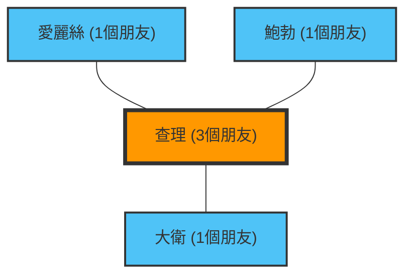

「身邊的人好像都比我朋友多，看起來好開心啊……」
看著社群媒體時，你是否曾有過這樣的感覺？

其實，你會這麼覺得，並不是因為你的性格，也不是因為你不受歡迎。這被稱為**「友誼悖論（Friendship Paradox）」**，是透過網絡理論與統計學所證明的數學事實。

這個悖論由社會學家斯科特·菲爾德（Scott Feld）於1991年發現，它解釋了一個違反直覺的現象：「大多數人的朋友數量，都比自己朋友的朋友數量還要少。」

## 為什麼「朋友的朋友會比較多」？

直接說結論，這是因為**「朋友多的人（受歡迎的人）會出現在很多人的朋友名單中」**，一種單純的抽樣偏差。

讓我們用一個簡單的網絡（圖）來思考一下。

在這個小世界裡，有愛麗絲、鮑勃、查理和大衛4個人。
查理是「受歡迎的人」，與其他3個人都是朋友。而其他3個人都只跟查理是朋友。

我們來看看每個人的朋友數量：
- 愛麗絲的朋友數：1人
- 鮑勃的朋友數：1人
- 大衛的朋友數：1人
- 查理的朋友數：3人
**所有人的平均朋友數**為：$(1 + 1 + 1 + 3) / 4 = 1.5人$。

接下來，我們來計算「每個人『朋友的朋友數』的平均」。
- 愛麗絲的朋友（查理）的朋友數：3人
- 鮑勃的朋友（查理）的朋友數：3人
- 大衛的朋友（查理）的朋友數：3人
- 查理的朋友（愛麗絲、鮑勃、大衛）的朋友數平均：$(1 + 1 + 1) / 3 = 1人$

現在，我們比較每個人的「自己」與「自己朋友的平均」。
- 愛麗絲：自己(1) < 朋友的平均(3)
- 鮑勃：自己(1) < 朋友的平均(3)
- 大衛：自己(1) < 朋友的平均(3)
- 查理：自己(3) > 朋友的平均(1)

4個人中有3個人（75%的人）處於「自己的朋友比自己擁有更多朋友」的狀態。受歡迎的查理的存在，強烈拉高了周圍所有人「朋友的平均」。

## 數學證明：變異數是關鍵

讓我們用數學公式來表示這個現象。
在網絡理論中，假設某個人 $v$ 的朋友數（節點度數）為 $k(v)$。網絡整體的平均朋友數為 $\mu$，朋友數的變異數為 $\sigma^2$。

根據菲爾德的證明，「隨機挑選出的朋友的朋友數」之期望值如下：

$$ \text{朋友的朋友數平均} = \mu + \frac{\sigma^2}{\mu} $$

變異數 $\sigma^2$ 永遠大於或等於0。也就是說，除非在每個人擁有的朋友數完全相同（$\sigma^2 = 0$）這種不可能的情況下，以下的不等式將永遠成立：

$$ \mu + \frac{\sigma^2}{\mu} > \mu $$

**「朋友的朋友數平均」永遠必定大於「整體的平均朋友數」。**

在現實社會或社群媒體（如X或Instagram等）中，極少數人擁有數百萬的粉絲（朋友），而大多數人只有數十到數百人。這意味著變異數 $\sigma^2$ 巨大無比，因此這個悖論的效果會更加強烈。

## 應用：大流行與疫苗接種

友誼悖論不僅僅停留在社群媒體的心理學層面。在現實的社會問題中，特別是在**傳染病對策**上，它有著非常有效的應用。

假設我們只有數量有限的疫苗，且猶豫不知道該給誰接種。有一種比隨機接種更有效的方法。

1. 隨機挑選一群人。
2. 不給這些人接種，而是給**這群人指出「這是我的朋友」的對象**接種疫苗。

為什麼呢？因為根據友誼悖論，隨機挑選出的人的「朋友」，平均而言有更高的機率擁有更多的連結（也就是核心節點）。優先給連結多的人施打疫苗，能夠戲劇性地延緩感染在整個網絡中的擴散。

## 結論

當你看著社群媒體覺得「大家都比我朋友多、生活更充實」時，那並不是你的錯覺，而是網絡結構所產生的數學必然。

因為受歡迎的人會出現在很多人的網絡中，我們無可避免地被迫只觀察到這些「平均以上的受歡迎者」作為樣本。下次在社群媒體上感到沮喪時，請務必回想這個公式：

$$ \mu + \frac{\sigma^2}{\mu} > \mu $$
