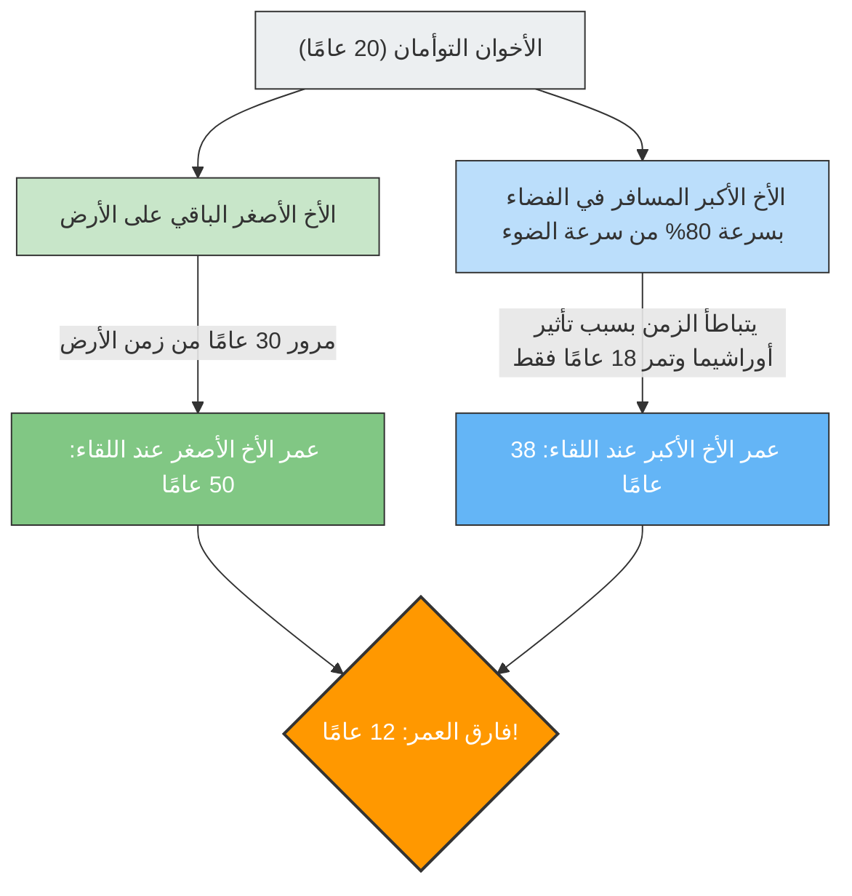

---
title: "هل يعود الأخ الأكبر من الفضاء ليجد أخاه الأصغر أكبر منه؟: مفارقة التوأم"
description: "«تباطؤ الزمن» الذي تتنبأ به نظرية النسبية لأينشتاين. شرح لمفارقة انعكاس العمر بين الأخ الأكبر الذي سافر في صاروخ يقترب من سرعة الضوء والأخ الأصغر الذي بقي على الأرض."
date: 2026-09-10T21:00:00+09:00
draft: false
slug: "twin-paradox"
image: "img/twin_paradox.jpg"
math: true
mermaid: true
categories: ["مفارقات رياضية", "فيزياء"]
tags: ["مفارقة", "النظرية النسبية", "الزمن", "أينشتاين", "الفضاء"]
---

إذا انطلقت في رحلة على متن مركبة فضائية تحلق بسرعة تقترب من سرعة الضوء، فإن ساعتك ستتحرك بـ «بطء» أكبر مقارنة بساعات الأشخاص الموجودين على الأرض.
هذا ليس مجرد سيناريو من أفلام الخيال العلمي، بل هو حقيقة فيزيائية أثبتتها **«النظرية النسبية الخاصة»** لأينشتاين.

إن التجربة الفكرية الشهيرة التي تُعرف باسم **«مفارقة التوأم (Twin Paradox)»** هي التعبير الأكثر دراماتيكية عن مفهوم «تباطؤ الزمن» هذا.

## الأخ الأكبر الذي يسافر إلى الفضاء، والأخ الأصغر الذي يبقى على الأرض

لدينا أخوان توأمان ولدا في نفس اليوم.
في عيد ميلادهما العشرين، استقل الأخ الأكبر رحلة على متن صاروخ فائق السرعة يطير بنسبة 80% من سرعة الضوء ($0.8c$)، وانطلق نحو نجم بعيد. بينما بقي الأخ الأصغر على الأرض في انتظار عودة أخيه.

بعد عدة سنوات، عاد الأخ الأكبر من الفضاء إلى الأرض.
وعندما فُتح باب الصاروخ والتقى الاثنان مجددًا، حدث شيء مذهل.

لقد أصبح الأخ الأصغر الذي انتظر على الأرض رجلًا في منتصف العمر حيث بلغ من العمر **50 عامًا** (مرت 30 عامًا)، بينما كان الأخ الأكبر الذي سافر في الفضاء لا يزال يحتفظ بمظهره الشاب في سن **38 عامًا** (مرت 18 عامًا فقط).

"على الرغم من أنهما توأمان، إلا أن هناك فارقًا في العمر يبلغ 12 عامًا بينهما."
هذه هي الصدمة الأولى التي تجلبها النظرية النسبية.

## جوهر المفارقة: هل يختلف الأمر باختلاف وجهة النظر؟

حقيقة "أن الأخ الأكبر أصبح أصغر سنًا" في حد ذاتها يمكن استنتاجها بتطبيق الأرقام على معادلة النظرية النسبية (معامل لورنتز)، وهي ظاهرة فيزيائية تؤخذ في الاعتبار فعليًا حتى في الأقمار الصناعية لنظام تحديد المواقع العالمي (GPS) الحديثة (وتُعرف أيضًا باسم تأثير أوراشيما).

ومع ذلك، تبدأ "المفارقة" الحقيقية من هنا.
من أهم قواعد النظرية النسبية أنه **"بالنسبة لجميع المراقبين الذين يتحركون بسرعة ثابتة، تنطبق قوانين الفيزياء بنفس الطريقة (لا يوجد سكون مطلق)"**.

إذا طبقنا هذه القاعدة على حالتنا، سيظهر تناقض غريب.

1. **من وجهة نظر الأخ الأصغر على الأرض**:
   "لقد ابتعد صاروخ أخي بسرعة هائلة ثم عاد. وبما أن أخي هو من كان يتحرك، فإن زمنه يجب أن يتباطأ، و**بالتالي يجب أن يكون أخي الأكبر هو الأصغر سنًا**."
2. **من وجهة نظر الأخ الأكبر في الصاروخ**:
   "أنا ساكن داخل الصاروخ. وعندما أنظر من النافذة، أرى الأرض تبتعد بسرعة هائلة ثم تعود. وبما أن أخي الأصغر على الأرض هو من كان يتحرك، فإن زمنه يجب أن يتباطأ، و**بالتالي يجب أن يكون أخي الأصغر هو الأصغر سنًا**."

كلا الادعاءين يلتزمان تمامًا بمبدأ النظرية النسبية القائل: "إذا كان الطرف الآخر يبدو متحركًا، فإن زمنه يتباطأ".
ومع ذلك، عندما يلتقي الاثنان ويقفان جنبًا إلى جنب، **من المستحيل أن يكون "كل منهما أصغر سنًا من الآخر"**. يجب أن يكون أحدهما حتمًا هو الأكبر والآخر هو الأصغر.

فهل يعني هذا أن نظرية أينشتاين خاطئة؟

## الحل: كسر "التناظر"

مفتاح حل هذه المفارقة يكمن في حقيقة أن **"موقف كلا الأخوين ليس متكافئًا (متناظرًا) تمامًا"**.

لقد ظل الأخ الأصغر دائمًا على الأرض (نظام إحداثي قصوري: حالة الحركة بسرعة ثابتة أو السكون).
ومع ذلك، تضمنت رحلة الأخ الأكبر **"تسارعًا" و"تباطؤًا"**.

مركبة الأخ الأكبر الفضائية يجب أن تمر بالخطوات التالية حتى تتمكن من العودة إلى الأرض:
1. الانطلاق من الأرض و**التسارع**.
2. استخدام المكابح عند النجم الوجهة (**التباطؤ**)، ثم تغيير الاتجاه نحو الأرض، و**التسارع** مرة أخرى (الاستدارة للخلف).
3. الوصول إلى الأرض واستخدام المكابح (**التباطؤ**).

في النظرية النسبية، يُعامل المراقب الذي يشعر بالتسارع (يشعر بقوة الجاذبية G) بشكل مختلف عن المراقب الذي يتحرك بسرعة ثابتة (وهذا يدخل في مجال النظرية النسبية العامة).

على وجه الخصوص، في اللحظة التي يقوم فيها الأخ الأكبر بـ **"الاستدارة للخلف (تغيير الاتجاه بتسارع شديد)"** عند النجم الوجهة، ينهار التناظر بين موقفيهما تمامًا.
في اللحظة التي يستدير فيها الأخ الأكبر ويتسارع مرة أخرى نحو الأرض، يُلاحظ أن "ساعة الأرض (عمر الأخ الأصغر)" بالنسبة إليه تتقدم فجأة لعقود من الزمن دفعة واحدة.

ونتيجة لذلك، عند اللقاء، تتبقى فقط الحقيقة المتوافقة مع الحسابات: **"عمر الأخ الأكبر 38 عامًا، والأخ الأصغر 50 عامًا"**، ويُحل التناقض تمامًا.

تُعد مفارقة التوأم واحدة من أجمل التجارب الفكرية في تاريخ الفيزياء، حيث تعلمنا أن إحساسنا البديهي بأن "الزمن يمر بالتساوي على الجميع" لا ينطبق على الإطلاق أمام الفضاء الشاسع وسرعة الضوء.
