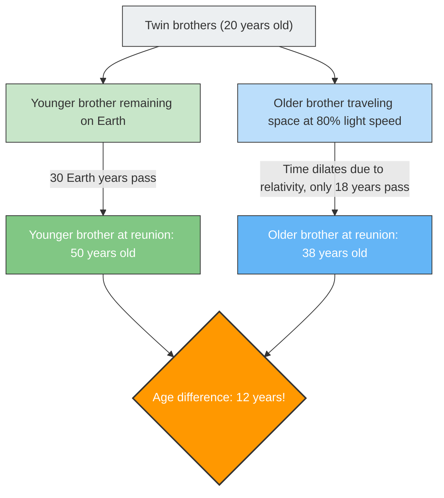

If you were to travel in a spaceship flying at a speed close to the speed of light, your clock would run "slower" than the clocks of the people on Earth.
This is not a sci-fi movie setting, but a fact of physics proven by Einstein's **"Special Theory of Relativity"**.

The most dramatic expression of this concept of "time dilation" is the famous thought experiment known as the **"Twin Paradox"**.

## The Brother Who Goes to Space, and the Brother Who Stays on Earth

There are twin brothers born on the same day.
On their 20th birthday, the older brother boards an ultra-high-speed rocket flying at 80% the speed of light ($0.8c$) and departs for a distant star. The younger brother stays on Earth and waits for his brother's return.

Years later, the older brother returns to Earth.
When the rocket doors open and the two reunite, something astonishing has happened.

The younger brother who waited on Earth has become a full-grown middle-aged man at **50 years old** (30 years passed), whereas the older brother who traveled through space is still youthful at **38 years old** (18 years passed).

"Even though they are twins, an age difference of 12 years has been created."
This is the first shock brought about by the theory of relativity.

## The Core of the Paradox: Does It Change Depending on Who Is Looking?

The fact that "the older brother becomes younger" itself is a fact that can be derived by applying numbers to the equations of the theory of relativity (Lorentz factor), and is a physical phenomenon that is actually taken into account in modern GPS satellites (sometimes referred to as the Urashima effect).

However, the true "paradox" begins here.
One of the most important rules of the theory of relativity is that **"the laws of physics are exactly the same for every observer moving at a constant speed (absolute rest does not exist)"**.

Applying this to our case creates a bizarre contradiction.

1. **From the perspective of the younger brother on Earth**:
   "The rocket carrying my older brother zoomed away at breakneck speed and then came back. Since my brother was the one moving, his time should slow down, and **he should be younger**."
2. **From the perspective of the older brother in the rocket**:
   "I am stationary inside the rocket. Looking out the window, Earth zoomed away at breakneck speed and then came back. Since the younger brother on Earth was the one moving, his time should slow down, and **he should be younger**."

Both claims are faithful to the relativity principle that "if the other person appears to be moving, their time slows down."
However, when the two reunite and stand side by side, **a state where "both are younger than the other" is impossible**. One must definitely be older and the other younger.

Does this mean Einstein's theory is wrong?

## Resolution: The Breakdown of "Symmetry"

The key to solving this paradox lies in the fact that **"the positions of the two are not completely equal (symmetric)"**.

The younger brother remained on Earth (an inertial frame: a state of moving at a constant speed or being at rest) the whole time.
However, the older brother's journey involves **"acceleration" and "deceleration"**.

The older brother's spaceship cannot return to Earth without taking the following steps:
1. Depart Earth and **accelerate**.
2. Hit the brakes at the destination star (**decelerate**), change direction towards Earth, and **accelerate** again (make a U-turn).
3. Arrive at Earth and hit the brakes (**decelerate**).

In the theory of relativity, an observer who experiences acceleration (feels G-force) is treated differently (in the realm of General Relativity) than an observer moving at a constant speed.

In particular, the moment the older brother makes a **"U-turn (a change of direction through intense acceleration)"** at the destination star, the symmetry between the brothers' positions completely breaks down.
At the moment the older brother makes a U-turn and re-accelerates toward Earth, the "Earth's clock (the younger brother's age)" as seen by the older brother is observed to rapidly leap forward by decades all at once.

As a result, when they reunite, exactly as calculated, only the reality remains that **"the older brother is 38 and the younger brother is 50,"** cleanly resolving the contradiction.

The Twin Paradox is one of the most beautiful thought experiments in the history of physics, teaching us that our commonsense perception that "time flows equally for everyone" is completely inapplicable in the face of the vast universe and the speed of light.
