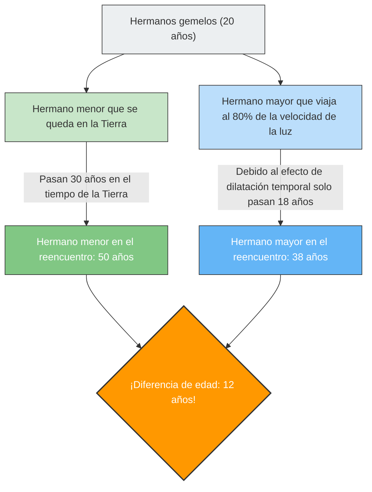

---
title: "¿Volver del espacio y tu hermano menor es mayor que tú?: La paradoja de los gemelos"
description: "La 'dilatación del tiempo' predicha por la teoría de la relatividad de Einstein. Explicamos la paradoja en la que se invierten las edades del gemelo que viaja en un cohete cercano a la velocidad de la luz y del hermano que se queda en la Tierra."
date: 2026-09-10T21:00:00+09:00
draft: false
slug: "twin-paradox"
image: "img/twin_paradox.jpg"
math: true
mermaid: true
categories: ["Paradojas matemáticas", "Física"]
tags: ["Paradoja", "Teoría de la relatividad", "Tiempo", "Einstein", "Espacio"]
---

Si viajaras en una nave espacial que se desplaza a una velocidad cercana a la de la luz, tu reloj avanzaría "más lentamente" que los relojes de las personas que permanecen en la Tierra.
Esto no es el argumento de una película de ciencia ficción, sino un hecho físico demostrado por la **"Teoría de la Relatividad Especial"** de Einstein.

El experimento mental más famoso que expresa de forma más dramática este concepto de "dilatación del tiempo" es el conocido como **"La paradoja de los gemelos (Twin Paradox)"**.

## El hermano que viaja al espacio y el hermano que se queda en la Tierra

Hay unos hermanos gemelos nacidos el mismo día.
En su vigésimo cumpleaños, el hermano mayor se embarca en un cohete ultrarrápido que viaja al 80% de la velocidad de la luz ($0.8c$) y parte hacia una estrella lejana. El hermano menor se queda en la Tierra esperando el regreso de su hermano.

Unos años después, el hermano mayor regresa a la Tierra.
Cuando se abre la puerta del cohete y los dos se reencuentran, ocurre algo asombroso.

El hermano menor, que había estado esperando en la Tierra, se había convertido en un hombre maduro de **50 años** (habían pasado 30 años), mientras que el hermano mayor, que había viajado por el espacio, seguía siendo un joven de solo **38 años** (solo habían pasado 18 años).

"A pesar de ser gemelos, se genera una diferencia de edad de 12 años."
Este es el primer impacto que produce la teoría de la relatividad.

## El núcleo de la paradoja: ¿Cambia según desde qué punto de vista se observe?

El hecho de que "el hermano mayor se vuelva más joven" en sí mismo es un fenómeno físico que se puede deducir sustituyendo valores en las ecuaciones de la relatividad (factor de Lorentz), y que en la actualidad se tiene en cuenta en los satélites GPS y otros sistemas (también conocido como efecto Urashima).

Sin embargo, la verdadera "paradoja" comienza aquí.
Una de las reglas más importantes de la teoría de la relatividad es que **"para todos los observadores que se mueven a velocidad constante, las leyes de la física se aplican de la misma manera (no existe el reposo absoluto)"**.

Si aplicamos esto al caso que nos ocupa, surge una extraña contradicción.

1. **Desde el punto de vista del hermano menor en la Tierra**:
   "El cohete en el que iba mi hermano se alejó a gran velocidad y luego regresó. El que se estaba moviendo era mi hermano, así que su tiempo se ralentizó y **mi hermano debería ser más joven**."
2. **Desde el punto de vista del hermano mayor en el cohete**:
   "Dentro del cohete yo estoy en reposo. Mirando por la ventana, la Tierra se alejó a gran velocidad y luego regresó. El que se estaba moviendo era mi hermano en la Tierra, así que su tiempo se ralentizó y **mi hermano menor debería ser más joven**."

Las afirmaciones de ambos son fieles al principio de la relatividad de que "si parece que el otro se está moviendo, el tiempo del otro se ralentiza".
Sin embargo, cuando los dos se reencuentran y se ponen uno al lado del otro, **no es posible que "ambos sean más jóvenes que el otro"**. Necesariamente uno es mayor y el otro es menor.

¿Significa esto que la teoría de Einstein es errónea?

## La resolución: La ruptura de la "simetría"

La clave para resolver esta paradoja reside en el hecho de que **"las posiciones de los dos no son completamente equivalentes (simétricas)"**.

El hermano menor permaneció todo el tiempo en la Tierra (sistema inercial: un estado que se mueve a velocidad constante o que está en reposo).
Sin embargo, el viaje del hermano mayor incluye **"aceleración" y "desaceleración"**.

La nave espacial del hermano mayor debe seguir los siguientes pasos para poder regresar a la Tierra:
1. Partir de la Tierra y **acelerar**.
2. Frenar (**desacelerar**) en la estrella de destino, cambiar de dirección hacia la Tierra y **acelerar** de nuevo (giro en U).
3. Llegar a la Tierra y frenar (**desacelerar**).

En la teoría de la relatividad, un observador que experimenta aceleración (que siente fuerzas G) recibe un tratamiento diferente al de un observador que se mueve a velocidad constante (entra en el dominio de la Teoría de la Relatividad General).

En particular, en el momento en que el hermano mayor realiza el **"giro en U (cambio de dirección por aceleración intensa)"** en la estrella de destino, la simetría entre las posiciones del hermano mayor y del hermano menor se rompe por completo.
En el instante en que el hermano mayor da la vuelta y vuelve a acelerar hacia la Tierra, el "reloj de la Tierra (la edad del hermano menor)" observado desde el hermano mayor avanza de golpe varias décadas.

Como resultado, cuando se reencuentran, solo queda la realidad calculada de que **"el hermano mayor tiene 38 años y el hermano menor tiene 50 años"**, y la contradicción se resuelve completamente.

La paradoja de los gemelos es uno de los experimentos mentales más bellos de la historia de la física, que nos enseña que nuestra sensación de sentido común de que "el tiempo fluye de manera igual para todos" no funciona en absoluto frente al vasto universo y la velocidad de la luz.
