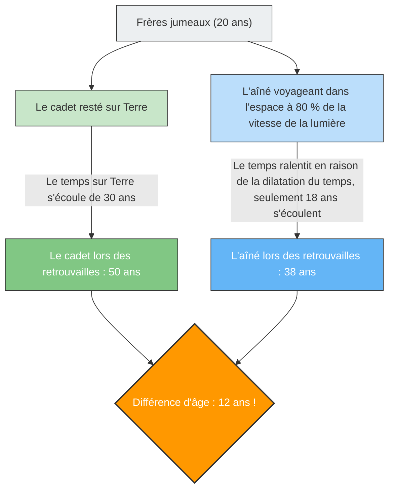

Si vous partez en voyage à bord d'un vaisseau spatial volant à une vitesse proche de celle de la lumière, votre horloge s'écoulera plus « lentement » que celle des personnes restées sur Terre.
Ce n'est pas le scénario d'un film de science-fiction, mais un fait physique prouvé par la **« théorie de la relativité restreinte »** d'Einstein.

La représentation la plus dramatique de ce concept de « dilatation du temps » est la célèbre expérience de pensée connue sous le nom de **« paradoxe des jumeaux (Twin Paradox) »**.

## Le frère aîné qui part dans l'espace, et le cadet qui reste sur Terre

Imaginons deux frères jumeaux nés le même jour.
Le jour de leurs 20 ans, le frère aîné embarque dans une fusée ultra-rapide volant à 80 % de la vitesse de la lumière ($0.8c$) et part vers une étoile lointaine. Le cadet reste sur Terre pour attendre le retour de son frère.

Quelques années plus tard, le frère aîné revient sur Terre.
Lorsque la porte de la fusée s'ouvre et que les deux se retrouvent, une chose étonnante s'est produite.

Alors que le frère cadet qui attendait sur Terre est devenu un homme mûr de **50 ans** (30 ans se sont écoulés), le frère aîné qui a voyagé dans l'espace a gardé son apparence jeune et n'a encore que **38 ans** (18 ans se sont écoulés).

« Bien qu'ils soient jumeaux, une différence d'âge de 12 ans s'est créée. »
C'est le premier choc provoqué par la théorie de la relativité.

## Le cœur du paradoxe : cela change-t-il selon le point de vue ?

Le fait que « l'aîné devienne plus jeune » est en soi un fait qui peut être déduit en appliquant des valeurs à l'équation de la théorie de la relativité (facteur de Lorentz), et c'est un phénomène physique qui est effectivement pris en compte dans les satellites GPS modernes (également appelé effet d'Urashima au Japon).

Cependant, le véritable « paradoxe » commence ici.
L'une des règles les plus importantes de la théorie de la relativité est que **« les lois de la physique s'appliquent de la même manière pour tous les observateurs se déplaçant à vitesse constante (le repos absolu n'existe pas) »**.

Si nous appliquons cela à notre cas, une étrange contradiction apparaît.

1. **Du point de vue du cadet sur Terre** :
   « La fusée de mon frère s'est éloignée à une vitesse fulgurante, puis est revenue. Comme c'est mon frère qui était en mouvement, son temps s'est écoulé plus lentement, et **il devrait donc être plus jeune**. »
2. **Du point de vue de l'aîné dans la fusée** :
   « À l'intérieur de la fusée, je suis au repos. En regardant par la fenêtre, c'est la Terre qui s'est éloignée à une vitesse fulgurante, puis est revenue. Comme c'est mon frère sur Terre qui était en mouvement, son temps s'est écoulé plus lentement, et **il devrait donc être plus jeune**. »

Les deux affirmations sont fidèles au principe de la théorie de la relativité selon lequel « si l'autre semble être en mouvement, son temps s'écoule plus lentement ».
Cependant, lorsque les deux se retrouvent et se tiennent côte à côte, **il est impossible que « chacun soit plus jeune que l'autre »**. L'un doit nécessairement être plus âgé et l'autre plus jeune.

Cela signifie-t-il que la théorie d'Einstein est fausse ?

## La solution : la rupture de la « symétrie »

La clé de la résolution de ce paradoxe réside dans le fait que **« les positions des deux frères ne sont pas complètement équivalentes (symétriques) »**.

Le cadet est toujours resté sur Terre (un référentiel inertiel : un état de mouvement à vitesse constante ou de repos).
Cependant, le voyage de l'aîné implique **« accélération » et « décélération »**.

Le vaisseau spatial de l'aîné doit passer par les étapes suivantes pour revenir sur Terre :
1. Quitter la Terre et **accélérer**.
2. Freiner à l'étoile de destination (**décélération**), faire demi-tour vers la Terre et **accélérer** à nouveau (demi-tour).
3. Arriver sur Terre et freiner (**décélération**).

Dans la théorie de la relativité, un observateur ressentant une accélération (ressentant la force G) est traité différemment d'un observateur se déplaçant à une vitesse constante (domaine de la théorie de la relativité générale).

En particulier, au moment où l'aîné effectue un **« demi-tour (changement de direction par une forte accélération) »** à l'étoile de destination, la symétrie entre les positions de l'aîné et du cadet s'effondre complètement.
Au moment où l'aîné fait demi-tour et réaccélère vers la Terre, « l'horloge terrestre (l'âge du cadet) » vue par l'aîné est observée comme avançant d'un seul coup de plusieurs décennies.

En conséquence, lors des retrouvailles, seule la réalité mathématiquement calculée que **« l'aîné a 38 ans et le cadet 50 ans »** demeure, et la contradiction est parfaitement résolue.

Le paradoxe des jumeaux est l'une des expériences de pensée les plus belles de l'histoire de la physique, nous enseignant que notre bon sens selon lequel « le temps s'écoule de manière égale pour tous » n'est absolument pas valable face à l'immensité de l'univers et à la vitesse de la lumière.
