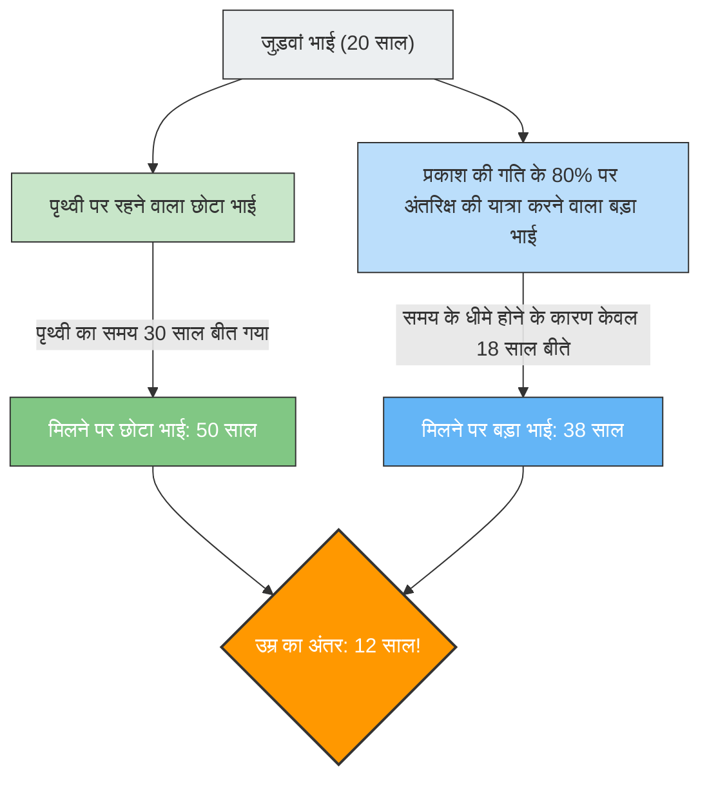

---
title: "अंतरिक्ष से लौटने पर छोटा भाई आपसे बड़ा हो जाए?: जुड़वां का विरोधाभास"
description: "आइंस्टीन के सापेक्षता के सिद्धांत द्वारा भविष्यवाणी की गई 'समय की गति धीमी होना'। एक ऐसा विरोधाभास जहां प्रकाश की गति के करीब रॉकेट में यात्रा करने वाले बड़े भाई और पृथ्वी पर रहने वाले छोटे भाई की उम्र उलट जाती है।"
date: 2026-09-10T21:00:00+09:00
draft: false
slug: "twin-paradox"
image: "img/twin_paradox.jpg"
math: true
mermaid: true
categories: ["गणितीय विरोधाभास", "भौतिक विज्ञान"]
tags: ["विरोधाभास", "सापेक्षता का सिद्धांत", "समय", "आइंस्टीन", "अंतरिक्ष"]
---

अगर आप प्रकाश की गति के करीब गति से उड़ने वाले अंतरिक्ष यान में यात्रा करते हैं, तो आपकी घड़ी पृथ्वी पर मौजूद लोगों की घड़ियों की तुलना में "धीमी" चलने लगेगी।
यह किसी साइंस-फिक्शन फिल्म की कहानी नहीं है, बल्कि भौतिकी का एक तथ्य है जिसे आइंस्टीन के **"विशेष सापेक्षता के सिद्धांत"** द्वारा साबित किया गया है।

इस "समय की गति धीमी होने" की अवधारणा को सबसे नाटकीय रूप से व्यक्त करने वाले एक प्रसिद्ध विचार प्रयोग को **"जुड़वां का विरोधाभास (Twin Paradox)"** कहा जाता है।

## अंतरिक्ष में जाने वाला बड़ा भाई, और पृथ्वी पर रहने वाला छोटा भाई

एक ही दिन पैदा हुए जुड़वां भाई हैं।
अपने 20वें जन्मदिन पर, बड़ा भाई प्रकाश की गति के 80% ($0.8c$) की गति से उड़ने वाले एक अति-तीव्र रॉकेट में सवार होकर एक दूर के तारे की यात्रा पर निकल जाता है। छोटा भाई पृथ्वी पर रुककर बड़े भाई के लौटने का इंतजार करता है।

कुछ सालों बाद, बड़ा भाई पृथ्वी पर लौट आता है।
जब रॉकेट का दरवाज़ा खुलता है और दोनों फिर से मिलते हैं, तो एक आश्चर्यजनक घटना घट चुकी होती है।

पृथ्वी पर इंतज़ार करने वाला छोटा भाई **50 साल** (30 साल बीत चुके हैं) का होकर पूरी तरह से एक अधेड़ उम्र का व्यक्ति बन गया था, जबकि अंतरिक्ष की यात्रा करने वाला बड़ा भाई अभी भी **38 साल** (केवल 18 साल बीते हैं) का युवा ही था।

"जुड़वां होने के बावजूद, उनकी उम्र में 12 साल का अंतर आ गया।"
यह सापेक्षता के सिद्धांत द्वारा लाया गया पहला झटका है।

## विरोधाभास का मूल: क्या यह देखने के नज़रिए पर निर्भर करता है?

"बड़े भाई का युवा होना" अपने आप में एक ऐसा तथ्य है जिसे सापेक्षता के सिद्धांत के समीकरण (लोरेन्ट्ज़ कारक) में संख्याएं डालकर प्राप्त किया जा सकता है, और यह एक भौतिक घटना है जिसे वास्तव में आधुनिक GPS उपग्रहों आदि में भी ध्यान में रखा जाता है।

हालाँकि, असली "विरोधाभास" यहाँ से शुरू होता है।
सापेक्षता के सिद्धांत के सबसे महत्वपूर्ण नियमों में से एक यह है कि, **"समान गति से चलने वाले सभी प्रेक्षकों के लिए, भौतिकी के नियम समान रूप से लागू होते हैं (पूर्ण स्थिरता जैसी कोई चीज़ नहीं होती है)।"**

जब इसे इस मामले पर लागू किया जाता है, तो एक अजीब विरोधाभास पैदा होता है।

1. **पृथ्वी के छोटे भाई के नज़रिए से**:
   "बड़े भाई का रॉकेट बहुत तेज़ी से दूर गया और फिर वापस आ गया। चूँकि बड़ा भाई गति कर रहा था, इसलिए बड़े भाई का समय धीमा हो गया होगा, और **बड़े भाई को युवा होना चाहिए**।"
2. **रॉकेट के बड़े भाई के नज़रिए से**:
   "रॉकेट के अंदर मैं स्थिर हूँ। खिड़की से बाहर देखने पर, पृथ्वी बहुत तेज़ी से दूर गई और फिर वापस आ गई। चूँकि पृथ्वी का छोटा भाई गति कर रहा था, इसलिए छोटे भाई का समय धीमा हो गया होगा, और **छोटे भाई को युवा होना चाहिए**।"

दोनों के दावे सापेक्षता के सिद्धांत के इस नियम के प्रति वफ़ादार हैं कि "यदि दूसरा व्यक्ति गति करता हुआ प्रतीत होता है, तो उसका समय धीमा हो जाता है।"
हालाँकि, जब दोनों फिर से मिलते हैं और साथ खड़े होते हैं, तो **"दोनों एक-दूसरे से युवा हों" ऐसी स्थिति संभव नहीं है**। निश्चित रूप से कोई एक बड़ा होगा, और कोई एक छोटा होगा।

क्या इसका मतलब यह है कि आइंस्टीन का सिद्धांत गलत है?

## समाधान: "समरूपता" का टूटना

इस विरोधाभास के समाधान की कुंजी इस तथ्य में निहित है कि **"दोनों की स्थिति पूरी तरह से समान (सममित) नहीं है।"**

छोटा भाई हमेशा पृथ्वी (जड़त्वीय फ्रेम: निरंतर गति से चलने या स्थिर रहने की स्थिति) पर ही रहा।
हालाँकि, बड़े भाई की यात्रा में **"त्वरण" और "मंदी"** शामिल हैं।

बड़े भाई का अंतरिक्ष यान निम्नलिखित चरणों को पूरा किए बिना पृथ्वी पर वापस नहीं आ सकता:
1. पृथ्वी से प्रस्थान करना और **त्वरण (accelerate)** करना।
2. गंतव्य तारे पर ब्रेक लगाना (**मंदी**), पृथ्वी की ओर मुड़ना, और फिर से **त्वरण** (U-टर्न) करना।
3. पृथ्वी पर पहुँचना और ब्रेक लगाना (**मंदी**)।

सापेक्षता के सिद्धांत में, जो प्रेक्षक त्वरण महसूस कर रहा है (G-force महसूस कर रहा है), उसके साथ निरंतर गति से चलने वाले प्रेक्षक की तुलना में अलग व्यवहार किया जाता है (सामान्य सापेक्षता के सिद्धांत का क्षेत्र)।

विशेष रूप से, जिस क्षण बड़ा भाई गंतव्य तारे पर **"U-टर्न (तीव्र त्वरण के कारण दिशा परिवर्तन)"** लेता है, बड़े भाई और छोटे भाई की स्थिति की समरूपता पूरी तरह से टूट जाती है।
उस क्षण जब बड़ा भाई U-टर्न लेता है और पृथ्वी की ओर वापस गति करता है, तो बड़े भाई के नज़रिए से "पृथ्वी की घड़ी (छोटे भाई की उम्र)" अचानक दशकों आगे बढ़ती हुई दिखाई देती है।

नतीजतन, जब वे फिर से मिलते हैं, तो गणना के अनुसार केवल **"बड़ा भाई 38 साल का है, और छोटा भाई 50 साल का है"** यही वास्तविकता बचती है, और विरोधाभास स्पष्ट रूप से हल हो जाता है।

जुड़वां का विरोधाभास, भौतिकी के इतिहास में सबसे सुंदर विचार प्रयोगों में से एक है, जो हमें सिखाता है कि हमारी सामान्य समझ कि "समय सभी के लिए समान रूप से बहता है", विशाल ब्रह्मांड और प्रकाश की गति के सामने बिल्कुल काम नहीं करती है।
