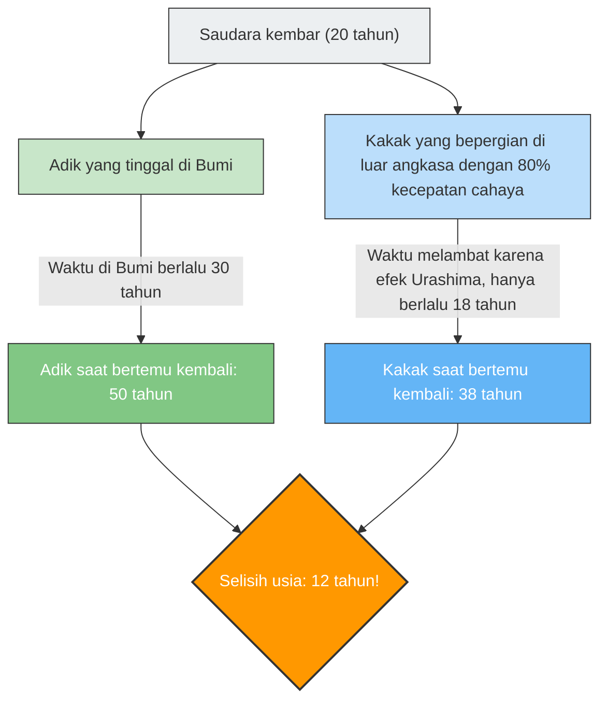

Jika Anda melakukan perjalanan dengan pesawat luar angkasa yang terbang dengan kecepatan mendekati kecepatan cahaya, jam Anda akan berdetak lebih "lambat" dibandingkan jam orang-orang di Bumi.
Ini bukan latar film fiksi ilmiah, melainkan fakta fisika yang dibuktikan oleh **"Teori Relativitas Khusus"** Einstein.

Konsep "dilasi waktu" (pelebaran waktu) ini diekspresikan secara paling dramatis melalui eksperimen pikiran terkenal yang disebut **"Paradoks Kembar (Twin Paradox)"**.

## Kakak yang Pergi ke Luar Angkasa dan Adik yang Tinggal di Bumi

Ada dua saudara kembar yang lahir pada hari yang sama.
Pada ulang tahun mereka yang ke-20, sang kakak menaiki roket super cepat yang terbang dengan 80% kecepatan cahaya ($0.8c$) dan memulai perjalanan ke bintang yang jauh. Sang adik tetap di Bumi dan menunggu kakaknya kembali.

Beberapa tahun kemudian, sang kakak kembali ke Bumi.
Ketika pintu roket terbuka dan keduanya bertemu kembali, hal yang mengejutkan telah terjadi.

Sang adik yang menunggu di Bumi telah menjadi pria paruh baya berusia **50 tahun** (30 tahun berlalu), sedangkan sang kakak yang melakukan perjalanan di luar angkasa masih berpenampilan muda dengan usia **38 tahun** (18 tahun berlalu).

"Meskipun mereka kembar, ada perbedaan usia sebesar 12 tahun."
Ini adalah kejutan pertama yang dibawa oleh teori relativitas.

## Inti dari Paradoks: Berubah Tergantung Siapa yang Melihat?

Fakta bahwa "kakak menjadi lebih muda" dapat disimpulkan dengan memasukkan nilai ke dalam persamaan teori relativitas (faktor Lorentz), dan ini merupakan fenomena fisika yang benar-benar dipertimbangkan pada satelit GPS modern (juga dikenal sebagai efek Urashima).

Namun, "paradoks" yang sebenarnya baru dimulai dari sini.
Salah satu aturan paling penting dari teori relativitas adalah, **"Bagi semua pengamat yang bergerak dengan kecepatan konstan, hukum-hukum fisika berlaku sama (tidak ada keadaan diam mutlak)."**

Jika kita menerapkan ini pada kasus kita, muncul kontradiksi yang aneh.

1. **Dari sudut pandang adik di Bumi**:
   "Roket yang dinaiki kakak menjauh dengan kecepatan tinggi, lalu kembali. Karena kakaklah yang bergerak, waktu kakak yang melambat, sehingga **kakaklah yang seharusnya lebih muda**."
2. **Dari sudut pandang kakak di roket**:
   "Di dalam roket, diriku ini diam. Saat melihat ke luar jendela, Bumilah yang menjauh dengan kecepatan tinggi, lalu kembali. Karena adik di Bumi yang bergerak, waktu adik yang melambat, sehingga **adiklah yang seharusnya lebih muda**."

Argumen keduanya sama-sama setia pada prinsip teori relativitas bahwa "jika pihak lain terlihat bergerak, maka waktu pihak lain tersebut yang melambat".
Namun, ketika mereka bertemu kembali dan berdiri berdampingan, **kondisi "keduanya lebih muda dari yang lain" adalah suatu kemustahilan**. Pasti salah satunya lebih tua, dan yang lainnya lebih muda.

Apakah ini berarti teori Einstein salah?

## Solusi: Runtuhnya "Simetri"

Kunci pemecahan paradoks ini terletak pada fakta bahwa **"posisi keduanya tidak sepenuhnya setara (simetris)."**

Sang adik selalu berada di Bumi (kerangka acuan inersia: keadaan bergerak dengan kecepatan konstan, atau diam).
Akan tetapi, perjalanan sang kakak melibatkan **"percepatan" dan "perlambatan."**

Pesawat luar angkasa kakak harus melalui langkah-langkah berikut untuk bisa kembali ke Bumi:
1. Berangkat dari Bumi dan **mempercepat** kecepatannya.
2. Mengerem di bintang tujuan (**memperlambat**), berbalik arah menuju Bumi, dan **mempercepat** lagi (berputar balik / U-turn).
3. Tiba di Bumi dan mengerem (**memperlambat**).

Dalam teori relativitas, pengamat yang merasakan percepatan (merasakan gaya G) diperlakukan berbeda dengan pengamat yang bergerak dengan kecepatan konstan (ini masuk ke ranah Teori Relativitas Umum).

Khususnya, pada saat sang kakak melakukan **"putaran balik (perubahan arah melalui percepatan yang kuat)"** di bintang tujuan, simetri posisi kakak dan adik hancur berantakan.
Tepat pada momen saat sang kakak berputar balik dan mempercepat kembali menuju Bumi, "jam di Bumi (usia sang adik)" dari sudut pandang kakak akan teramati melompat maju hingga puluhan tahun secara mendadak.

Sebagai hasilnya, saat mereka bertemu kembali, yang tersisa hanyalah kenyataan sesuai perhitungan: **"kakak 38 tahun, adik 50 tahun,"** dan kontradiksinya terselesaikan dengan rapi.

Paradoks Kembar adalah salah satu eksperimen pikiran terindah dalam sejarah fisika, yang mengajarkan kita bahwa pemahaman umum kita tentang "waktu mengalir sama bagi semua orang" sama sekali tidak berlaku di hadapan luasnya alam semesta dan kecepatan cahaya.
