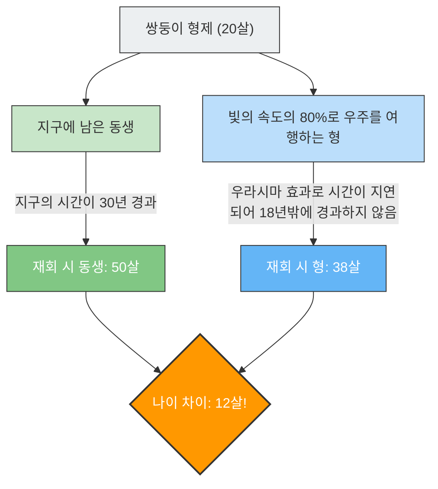

만약 당신이 빛의 속도에 가까운 속도로 날아가는 우주선을 타고 여행을 떠난다면, 당신의 시계는 지구에 있는 사람들의 시계보다 '천천히' 흐르게 됩니다.
이것은 SF 영화의 설정이 아니라 아인슈타인의 **'특수 상대성 이론'**이 증명하는 물리학적 사실입니다.

이 '시간 지연'의 개념을 가장 극적으로 표현한 것이 **'쌍둥이 역설(Twin Paradox)'**이라 불리는 유명한 사고 실험입니다.

## 우주로 가는 형과, 지구에 남는 동생

같은 날에 태어난 쌍둥이 형제가 있습니다.
20살 생일, 형은 빛의 속도의 80%($0.8c$)로 날아가는 초고속 로켓을 타고 멀리 떨어진 별로 여행을 떠났습니다. 동생은 지구에 남아 형의 귀환을 기다립니다.

몇 년 후, 형이 지구로 귀환했습니다.
로켓의 문이 열리고 두 사람이 재회했을 때, 놀라운 일이 벌어졌습니다.

지구에서 기다리던 동생은 **50살**(30년 경과)의 완전한 아저씨가 되어 있던 반면, 우주를 여행하던 형은 여전히 **38살**(18년 경과)의 젊은 모습 그대로였던 것입니다.

"쌍둥이인데, 나이에 무려 12살이라는 차이가 생겨버렸다"
이것이 상대성 이론이 가져다주는 첫 번째 충격입니다.

## 역설의 핵심: 어느 쪽에서 보느냐에 따라 달라진다?

'형 쪽이 더 젊어진다'는 것 자체는 상대성 이론의 방정식(로런츠 인자)에 수치를 대입하면 도출해낼 수 있는 사실이며, 현대의 GPS 위성 등에서도 실제로 고려되고 있는 물리 현상입니다(우라시마 효과라고도 불립니다).

그러나 진정한 '역설'은 여기서부터 시작됩니다.
상대성 이론의 가장 중요한 규칙 중 하나로, **'모든 등속으로 움직이는 관찰자에게 물리 법칙은 동일하게 성립한다(절대적인 정지는 존재하지 않는다)'**는 것이 있습니다.

이것을 이번 사례에 대입하면 기묘한 모순이 생깁니다.

1. **지구의 동생의 관점에서 보면**:
   "형이 탄 로켓이 맹렬한 속도로 멀어졌다가, 그리고 돌아왔다. 움직인 것은 형이기 때문에, 형의 시간이 지연되어 **형 쪽이 더 젊어질** 것이다."
2. **로켓의 형의 관점에서 보면**:
   "로켓 안에서 자신은 정지해 있다. 창밖을 보면 지구가 맹렬한 속도로 멀어졌다가, 그리고 돌아왔다. 움직인 것은 지구의 동생이기 때문에, 동생의 시간이 지연되어 **동생 쪽이 더 젊어질** 것이다."

양측의 주장은 둘 다 상대성 이론의 "상대방이 움직이는 것처럼 보인다면, 상대방의 시간이 지연된다"는 원칙에 충실합니다.
그러나 두 사람이 재회하여 나란히 섰을 때, **'양쪽 다 상대방보다 젊다' 같은 상태는 있을 수 없습니다**. 반드시 어느 한쪽이 연상이고, 어느 한쪽이 연하가 됩니다.

이것은 아인슈타인의 이론이 틀렸다는 뜻일까요?

## 해결편: '대칭성'의 붕괴

이 역설의 해결의 열쇠는 **'두 사람의 입장은 완전히 동등(대칭)하지 않다'**는 사실에 있습니다.

동생은 줄곧 지구(관성계: 일정한 속도로 움직이거나, 또는 정지해 있는 상태)에 머물러 있었습니다.
그러나 형의 여행에는 **'가속'과 '감속'**이 포함되어 있습니다.

형의 우주선은 다음 단계를 거치지 않으면 지구로 돌아올 수 없습니다.
1. 지구를 출발하여 **가속**한다.
2. 목적지 별에서 브레이크를 밟고(**감속**), 지구를 향해 방향을 바꾸어, 다시 **가속**(U턴)한다.
3. 지구에 도착하여 브레이크를 밟는다(**감속**).

상대성 이론에서 가속도를 느끼고 있는(G를 느끼고 있는) 관찰자는 일정한 속도로 움직이고 있는 관찰자와는 다른 취급(일반 상대성 이론의 영역)이 됩니다.

특히, 형이 목적지 별에서 **'U턴(강렬한 가속에 의한 방향 전환)'**을 한 순간, 형과 동생의 입장의 대칭성은 완전히 붕괴됩니다.
형이 U턴하여 지구를 향해 재가속하는 그 순간, 형의 관점에서 본 '지구의 시계(동생의 나이)'는 단숨에 수십 년 치나 훌쩍 진행된 것으로 관측되는 것입니다.

결과적으로 재회했을 때에는 계산대로 **'형이 38살, 동생이 50살'**이라는 현실만이 남아, 모순은 깔끔하게 해소됩니다.

쌍둥이 역설은 "시간은 누구에게나 평등하게 흐른다"는 우리의 상식적인 감각이 광대한 우주와 빛의 속도 앞에서는 전혀 통용되지 않는다는 것을 가르쳐주는, 물리학 역사상 가장 아름다운 사고 실험 중 하나입니다.
