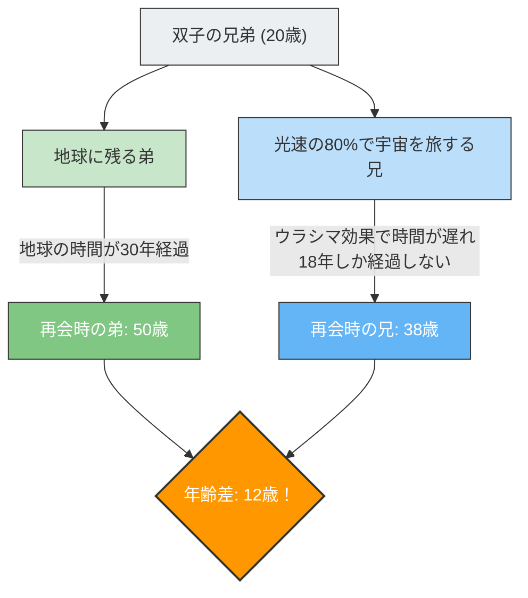

もしあなたが光の速さに近いスピードで飛ぶ宇宙船に乗って旅に出たら、あなたの時計は地球にいる人々の時計よりも「ゆっくり」と進むようになります。
これはSF映画の設定ではなく、アインシュタインの**「特殊相対性理論」**が証明している物理学の事実です。

この「時間の遅れ」の概念を最も劇的に表現したのが、**「双子のパラドックス（Twin Paradox）」**と呼ばれる有名な思考実験です。

## 宇宙へ行く兄と、地球に残る弟

同じ日に生まれた双子の兄弟がいます。
20歳の誕生日、兄は光速の80%（$0.8c$）で飛ぶ超高速ロケットに乗り、遠く離れた星へ旅立ちました。弟は地球に残って兄の帰りを待ちます。

数年後、兄が地球に帰還しました。
ロケットのドアが開いて二人が再会したとき、驚くべきことが起きていました。

地球で待っていた弟は**50歳**（30年経過）のすっかりおじさんになっていたのに対し、宇宙を旅していた兄はまだ**38歳**（18年経過）の若々しい姿のままだったのです。

「双子なのに、年齢に12歳もの差が生まれてしまう」
これが相対性理論がもたらす第一の衝撃です。

## パラドックスの核心：どちらから見るかで変わる？

「兄の方が若くなる」こと自体は、相対性理論の方程式（ローレンツ因子）に数値を当てはめれば導き出せる事実であり、現代のGPS衛星などでも実際に考慮されている物理現象です（ウラシマ効果とも呼ばれます）。

しかし、真の「パラドックス」はここから始まります。
相対性理論の最も重要なルールのひとつに、**「すべての等速で動いている観測者にとって、物理法則は同じように成り立つ（絶対的な静止は存在しない）」**というものがあります。

これを今回のケースに当てはめると、奇妙な矛盾が生じます。

1. **地球の弟から見れば**：
   「兄の乗ったロケットが猛スピードで遠ざかり、そして戻ってきた。動いていたのは兄だから、兄の時間が遅れて、**兄の方が若くなる**はずだ」
2. **ロケットの兄から見れば**：
   「ロケットの中では自分は静止している。窓の外を見ると、地球が猛スピードで遠ざかり、そして戻ってきた。動いていたのは地球の弟だから、弟の時間が遅れて、**弟の方が若くなる**はずだ」

両者の主張は、どちらも相対性理論の「相手が動いているように見えるなら、相手の時間が遅れる」という原則に忠実です。
しかし、二人が再会して並んで立ったとき、**「どちらも相手より若い」などという状態はあり得ません**。必ずどちらかが年上で、どちらかが年下になります。

これはアインシュタインの理論が間違っているということなのでしょうか？

## 解決編：「対称性」の崩れ

このパラドックスの解決の鍵は、**「二人の立場は完全には対等（対称）ではない」**という事実にあります。

弟はずっと地球（慣性系：一定の速度で動く、または静止している状態）に留まっていました。
しかし、兄の旅には**「加速」と「減速」**が含まれています。

兄の宇宙船は、以下のステップを踏まなければ地球に帰って来られません。
1. 地球を出発して**加速**する。
2. 目的地の星でブレーキをかけ（**減速**）、地球に向かって向きを変え、再び**加速**（Uターン）する。
3. 地球に到着してブレーキをかける（**減速**）。

相対性理論において、加速度を感じている（Gを感じている）観測者は、一定の速度で動いている観測者とは異なる扱い（一般相対性理論の領域）になります。

特に、兄が目的地の星で**「Uターン（強烈な加速による方向転換）」**をした瞬間、兄と弟の立場の対称性は完全に崩れます。
兄がUターンして地球に向かって再加速するその瞬間、兄から見た「地球の時計（弟の年齢）」は、一気に何十年分もグンと進むように観測されるのです。

結果として、再会したときには、計算通り**「兄が38歳、弟が50歳」**という現実だけが残り、矛盾はきれいに解消されます。

双子のパラドックスは、「時間は誰にとっても平等に流れる」という私たちの常識的な感覚が、広大な宇宙と光の速度の前では全く通用しないことを教えてくれる、物理学史上最も美しい思考実験のひとつです。
