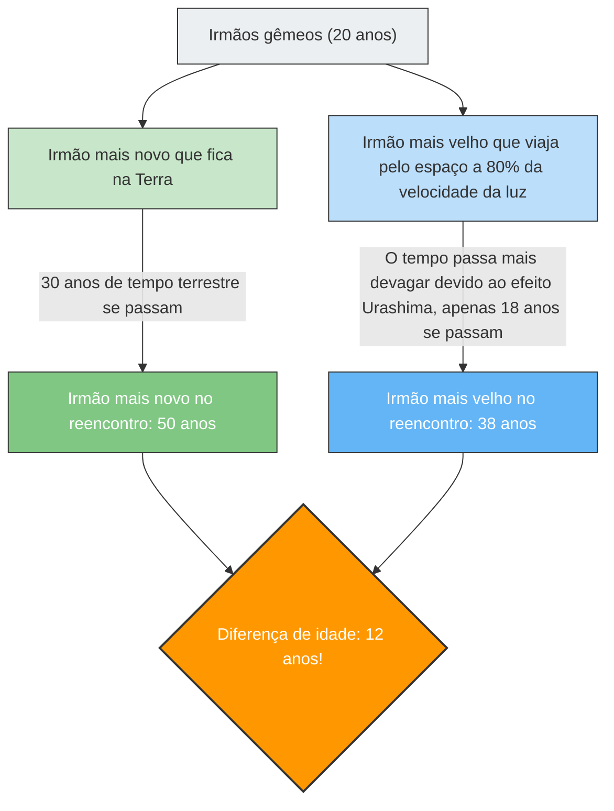

---
title: "Ao voltar do espaço, o irmão mais novo está mais velho do que você?: O Paradoxo dos Gêmeos"
description: "A «dilatação do tempo» prevista pela teoria da relatividade de Einstein. Uma explicação do paradoxo em que a idade de um irmão gêmeo que viaja num foguete quase à velocidade da luz e a do outro que fica na Terra se invertem."
date: 2026-09-10T21:00:00+09:00
draft: false
slug: "twin-paradox"
image: "img/twin_paradox.jpg"
math: true
mermaid: true
categories: ["Paradoxos Matemáticos", "Física"]
tags: ["Paradoxo", "Teoria da Relatividade", "Tempo", "Einstein", "Espaço"]
---

Se você viajar numa espaçonave que voa a uma velocidade próxima à da luz, o seu relógio passará mais "lentamente" do que os relógios das pessoas na Terra.
Isso não é um cenário de um filme de ficção científica, mas um fato físico comprovado pela **"Teoria da Relatividade Restrita"** de Einstein.

A expressão mais dramática desse conceito de "dilatação do tempo" é o famoso experimento mental chamado **"Paradoxo dos Gêmeos (Twin Paradox)"**.

## O irmão mais velho que vai para o espaço e o irmão mais novo que fica na Terra

Existem dois irmãos gêmeos nascidos no mesmo dia.
No seu 20º aniversário, o irmão mais velho embarca num foguete ultrarrápido viajando a 80% da velocidade da luz ($0.8c$) e parte para uma estrela distante. O irmão mais novo fica na Terra para esperar o retorno do seu irmão.

Anos mais tarde, o irmão mais velho retorna à Terra.
Quando a porta do foguete se abriu e eles se reencontraram, algo surpreendente havia acontecido.

Enquanto o irmão mais novo, que esperava na Terra, havia se tornado um homem de meia-idade com **50 anos** (30 anos passados), o irmão que viajou pelo espaço ainda tinha uma aparência jovem aos **38 anos** (18 anos passados).

"Apesar de serem gêmeos, há uma diferença de idade de 12 anos entre eles."
Este é o primeiro choque provocado pela Teoria da Relatividade.

## O cerne do paradoxo: muda dependendo do ponto de vista?

O fato de que "o irmão mais velho fica mais jovem" pode ser derivado da aplicação de valores na equação da Teoria da Relatividade (o fator de Lorentz) e é um fenômeno físico que é realmente levado em consideração em satélites GPS modernos (também conhecido como efeito Urashima).

No entanto, o verdadeiro "paradoxo" começa aqui.
Uma das regras mais importantes da Teoria da Relatividade é que **"as leis da física são as mesmas para todos os observadores movendo-se a uma velocidade constante (não existe repouso absoluto)"**.

Quando aplicamos isso a este caso, surge uma estranha contradição.

1. **Do ponto de vista do irmão mais novo na Terra**:
   "O foguete com o meu irmão mais velho afastou-se em grande velocidade e depois voltou. Foi ele quem se moveu, por isso o tempo dele atrasou-se, e **ele deve ser mais jovem**."
2. **Do ponto de vista do irmão mais velho no foguete**:
   "Dentro do foguete, estou parado. Quando olho pela janela, vejo a Terra a afastar-se em grande velocidade e depois a voltar. Foi o meu irmão na Terra quem se moveu, por isso o tempo dele atrasou-se, e **ele deve ser mais jovem**."

Ambas as afirmações são fiéis ao princípio da Teoria da Relatividade de que "se a outra pessoa parece estar em movimento, o tempo dessa pessoa fica mais lento".
Porém, quando os dois se reencontram e ficam lado a lado, **não é possível que "ambos sejam mais jovens que o outro"**. Um deles tem de ser necessariamente o mais velho, e o outro o mais novo.

Significa isto que a teoria de Einstein está errada?

## A Solução: A quebra da "simetria"

A chave para resolver este paradoxo reside no facto de que **"as posições dos dois não são completamente iguais (simétricas)"**.

O irmão mais novo permaneceu na Terra o tempo todo (um sistema de referência inercial: movendo-se a uma velocidade constante ou num estado de repouso).
No entanto, a jornada do irmão mais velho envolveu **"aceleração" e "desaceleração"**.

A espaçonave do irmão mais velho deve realizar as seguintes etapas para retornar à Terra:
1. Partir da Terra e **acelerar**.
2. Travar na estrela de destino (**desacelerar**), virar em direção à Terra e **acelerar** novamente (inversão de marcha).
3. Chegar à Terra e travar (**desacelerar**).

Na Teoria da Relatividade, um observador que experimenta aceleração (que sente forças G) é tratado de forma diferente de um observador que se move a uma velocidade constante (o que entra no domínio da Teoria da Relatividade Geral).

Especificamente, no momento em que o irmão mais velho faz uma **"inversão de marcha (mudança de direção através de uma forte aceleração)"** na estrela de destino, a simetria entre as posições dos dois irmãos é completamente quebrada.
Nesse exato momento em que o irmão mais velho inverte a marcha e acelera novamente em direção à Terra, do seu ponto de vista, o "relógio da Terra (a idade do irmão mais novo)" é observado a avançar de forma abrupta dezenas de anos de uma só vez.

Como resultado, quando se reencontram, apenas resta a realidade de que **"o irmão mais velho tem 38 anos e o irmão mais novo tem 50 anos"**, exatamente como calculado, resolvendo assim a contradição perfeitamente.

O Paradoxo dos Gêmeos é um dos experimentos mentais mais belos da história da física, que nos ensina que a nossa intuição baseada no senso comum de que "o tempo passa igualmente para todos" não se aplica de todo perante o vasto universo e a velocidade da luz.
