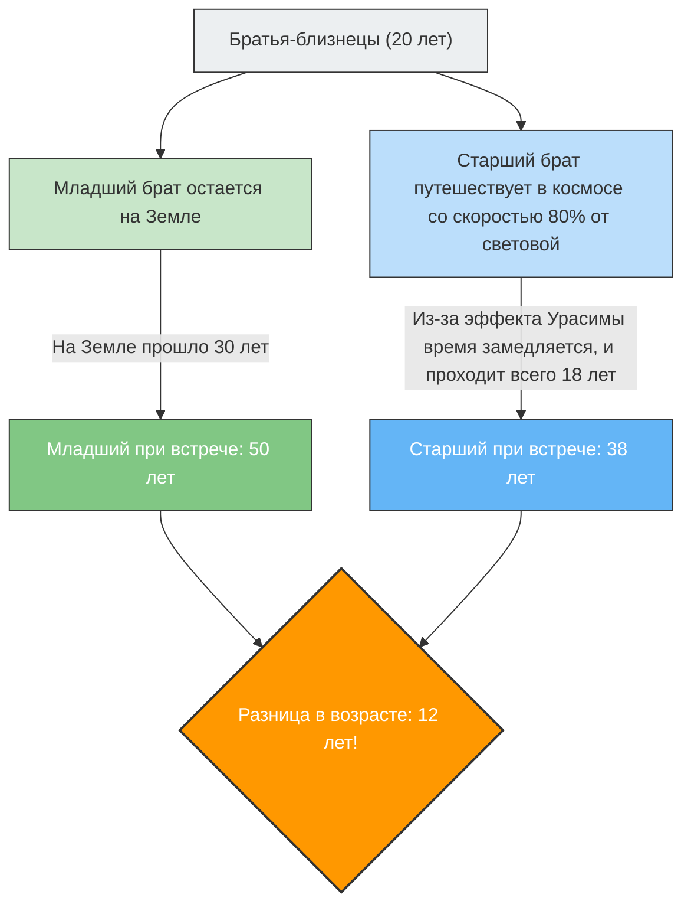

Если бы вы отправились в путешествие на космическом корабле, летящем со скоростью, близкой к скорости света, ваши часы стали бы идти «медленнее», чем у людей на Земле.
Это не сценарий научно-фантастического фильма, а физический факт, доказанный **«специальной теорией относительности»** Эйнштейна.

Наиболее ярко концепцию этого «замедления времени» демонстрирует знаменитый мысленный эксперимент, известный как **«парадокс близнецов» (Twin Paradox)**.

## Старший брат отправляется в космос, а младший остается на Земле

Представьте двух братьев-близнецов, родившихся в один день.
В их 20-й день рождения старший брат садится в сверхскоростную ракету, летящую со скоростью 80% от скорости света ($0.8c$), и отправляется к далекой звезде. Младший брат остается на Земле ждать возвращения брата.

Спустя несколько лет старший брат возвращается на Землю.
Когда открывается дверь ракеты и они встречаются вновь, выясняется нечто поразительное.

Младший брат, ожидавший на Земле, превратился в зрелого мужчину **50 лет** (прошло 30 лет), тогда как старший брат, путешествовавший в космосе, всё еще оставался молодым в возрасте **38 лет** (прошло 18 лет).

«Хотя они близнецы, между ними возникла разница в возрасте в 12 лет».
Это первый шокирующий вывод, к которому приводит теория относительности.

## Суть парадокса: меняется ли всё в зависимости от точки зрения?

Сам факт того, что «старший брат становится моложе», является истиной, которую можно вывести, подставив значения в уравнения теории относительности (фактор Лоренца), и это физическое явление, которое реально учитывается, например, в современных спутниках GPS (также известно как эффект Урасимы).

Однако настоящий «парадокс» начинается именно здесь.
Одно из важнейших правил теории относительности гласит: **«Физические законы действуют одинаково для всех наблюдателей, движущихся с постоянной скоростью (абсолютного покоя не существует)»**.

Если применить это к нашему случаю, возникает странное противоречие.

1. **С точки зрения младшего брата на Земле**:
   «Ракета, на которой летел брат, удалилась на огромной скорости, а затем вернулась. Двигался именно старший брат, поэтому его время замедлилось, и **он должен быть моложе**».
2. **С точки зрения старшего брата в ракете**:
   «Внутри ракеты я нахожусь в состоянии покоя. Если посмотреть в окно, Земля удалилась на огромной скорости, а затем вернулась. Двигался именно младший брат на Земле, поэтому его время замедлилось, и **младший брат должен быть моложе**».

Оба утверждения верны принципу теории относительности: «если кажется, что другой движется, его время замедляется».
Однако, когда они снова встречаются и стоят рядом, **состояние, при котором «каждый моложе другого», невозможно**. Один обязательно будет старше, а другой младше.

Значит ли это, что теория Эйнштейна ошибочна?

## Разрешение: нарушение «симметрии»

Ключ к разгадке этого парадокса заключается в том факте, что **«положения двоих не являются полностью равными (симметричными)»**.

Младший брат все время оставался на Земле (в инерциальной системе отсчета: состояние движения с постоянной скоростью или покоя).
В то же время, путешествие старшего брата включает **«ускорение» и «замедление»**.

Космический корабль старшего брата не может вернуться на Землю, не пройдя следующие шаги:
1. Стартовать с Земли и **ускориться**.
2. Затормозить у звезды-цели (**замедление**), развернуться в сторону Земли и снова **ускориться** (сделать разворот).
3. Прибыть на Землю и затормозить (**замедление**).

В теории относительности наблюдатель, испытывающий ускорение (испытывающий перегрузки), рассматривается иначе, чем наблюдатель, движущийся с постоянной скоростью (это область общей теории относительности).

В частности, в тот момент, когда старший брат совершает **«разворот (смена направления из-за сильного ускорения)»** у звезды-цели, симметрия в положениях старшего и младшего братьев полностью разрушается.
В момент, когда старший брат совершает разворот и снова ускоряется в сторону Земли, с его точки зрения «часы Земли (возраст младшего брата)» покажутся скачком продвинувшимися на многие десятилетия вперед.

В результате, когда они встречаются вновь, остается лишь та реальность, где по расчетам **«старшему брату 38 лет, а младшему — 50»**, и противоречие полностью исчезает.

Парадокс близнецов — это один из самых красивых мысленных экспериментов в истории физики, который учит нас тому, что наше привычное ощущение, будто «время течет для всех одинаково», совершенно неприменимо в масштабах необъятного космоса и скорости света.
