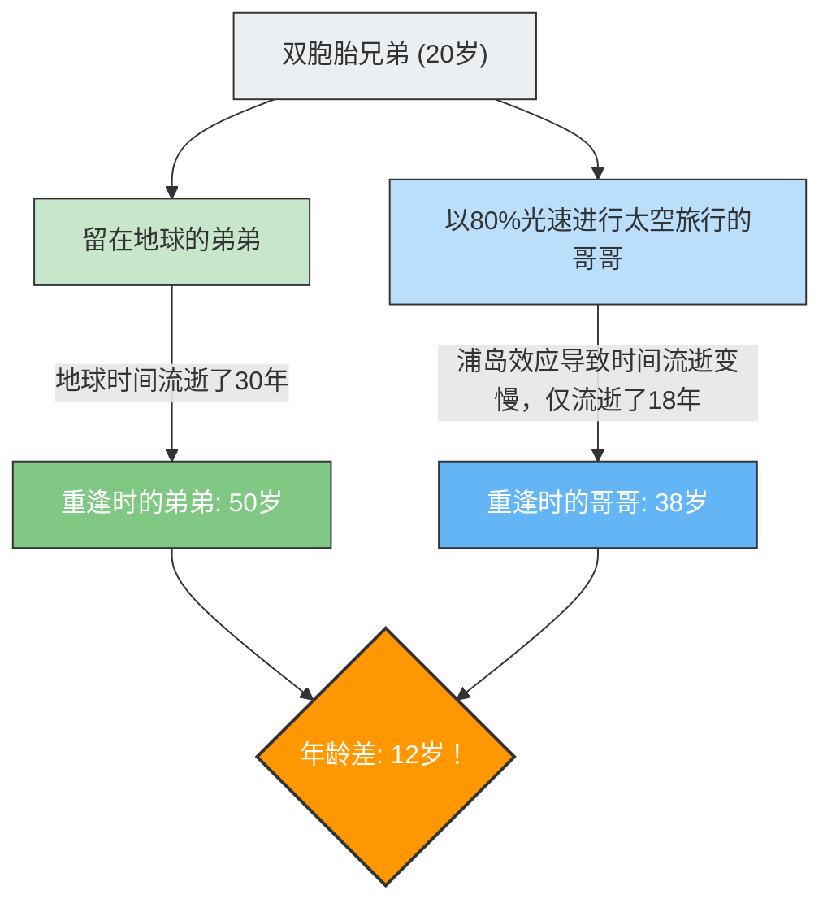

---
title: "从太空回来后弟弟比自己还老？：双生子佯谬"
description: "爱因斯坦相对论预言的“时间膨胀”。解密以接近光速的火箭旅行的双胞胎哥哥与留在地球的弟弟年龄反转的佯谬。"
date: 2026-09-10T21:00:00+09:00
draft: false
slug: "twin-paradox"
image: "img/twin_paradox.jpg"
math: true
mermaid: true
categories: ["数学佯谬", "物理学"]
tags: ["佯谬", "相对论", "时间", "爱因斯坦", "宇宙"]
---

如果你乘坐一艘以接近光速飞行的宇宙飞船去旅行，你的时间流逝将会比地球上的人们“更慢”。
这并不是科幻电影中的设定，而是爱因斯坦的**“狭义相对论”**所证明的物理学事实。

将这种“时间膨胀”概念展现得淋漓尽致的，就是著名的思想实验——**“双生子佯谬（Twin Paradox）”**。

## 前往太空的哥哥，与留在地球的弟弟

有一对同年同月同日生的双胞胎兄弟。
在20岁生日那天，哥哥乘坐以80%光速（$0.8c$）飞行的超高速火箭，踏上了前往遥远星球的旅程。弟弟则留在地球上等待哥哥归来。

几年后，哥哥返回了地球。
当火箭舱门打开，两人重逢时，发生了令人震惊的事情。

在地球上等待的弟弟已经度过了30年，变成了**50岁**的彻底的中年大叔；而太空旅行归来的哥哥却仅仅度过了18年，依然保持着**38岁**的年轻模样。

“明明是双胞胎，年龄却相差了12岁之多。”
这就是相对论带来的第一个震撼。

## 佯谬的核心：观察者的视角不同会导致结果改变？

“哥哥变得更年轻”本身，是将数值代入相对论方程（洛伦兹因子）就能推导出的事实，这也是现代GPS卫星等实际应用中必须考虑的物理现象（也被称为浦岛效应）。

然而，真正的“佯谬”才刚刚开始。
相对论最重要的规则之一是：**“对于所有匀速运动的观察者来说，物理定律都是相同的（不存在绝对静止）”**。

将这一点应用到本次的情况中，就会产生一个奇妙的矛盾。

1. **从地球上的弟弟看来**：
   “哥哥乘坐的火箭以极快的速度远去，然后又返回了。因为运动的是哥哥，所以哥哥的时间变慢了，**哥哥应该更年轻**。”
2. **从火箭里的哥哥看来**：
   “在火箭里，我自己是静止的。看窗外的话，是地球以极快的速度远去，然后又返回了。因为运动的是地球上的弟弟，所以弟弟的时间变慢了，**弟弟应该更年轻**。”

这两者的主张，都忠实于相对论中“如果看到对方在运动，那么对方的时间就会变慢”的原则。
但是，当两人重逢并排站立时，**不可能存在“双方都比对方年轻”的状态**。必然是一方年长，另一方年轻。

难道这意味着爱因斯坦的理论是错误的吗？

## 解决篇：“对称性”的破缺

解开这个佯谬的关键在于，**“两人的立场并不完全对等（不对称）”**这一事实。

弟弟一直留在地球上（惯性系：匀速运动或静止的状态）。
但是，哥哥的旅程中包含了**“加速”和“减速”**。

哥哥的宇宙飞船必须经过以下步骤才能返回地球。
1. 从地球出发并**加速**。
2. 在目的地星球刹车（**减速**），转向地球，然后再次**加速**（掉头）。
3. 到达地球并刹车（**减速**）。

在相对论中，感受到加速度（受到G力影响）的观察者，与匀速运动的观察者的处理方式是不同的（属于广义相对论的范畴）。

特别是，在哥哥在目的地星球进行**“掉头（由强烈加速引起的方向转换）”**的瞬间，哥哥和弟弟立场的对称性就被完全打破了。
就在哥哥掉头并朝着地球再次加速的瞬间，从哥哥的视角来看，“地球上的时钟（弟弟的年龄）”会被观测到一下子猛进了几十年。

结果，在重逢时，只留下了符合计算的**“哥哥38岁，弟弟50岁”**的现实，矛盾被完美地消除了。

双生子佯谬告诉我们，“时间对所有人来说都是平等流逝的”这一常识性感觉，在浩瀚的宇宙和光速面前是完全行不通的，它是物理学史上最优美的思想实验之一。
