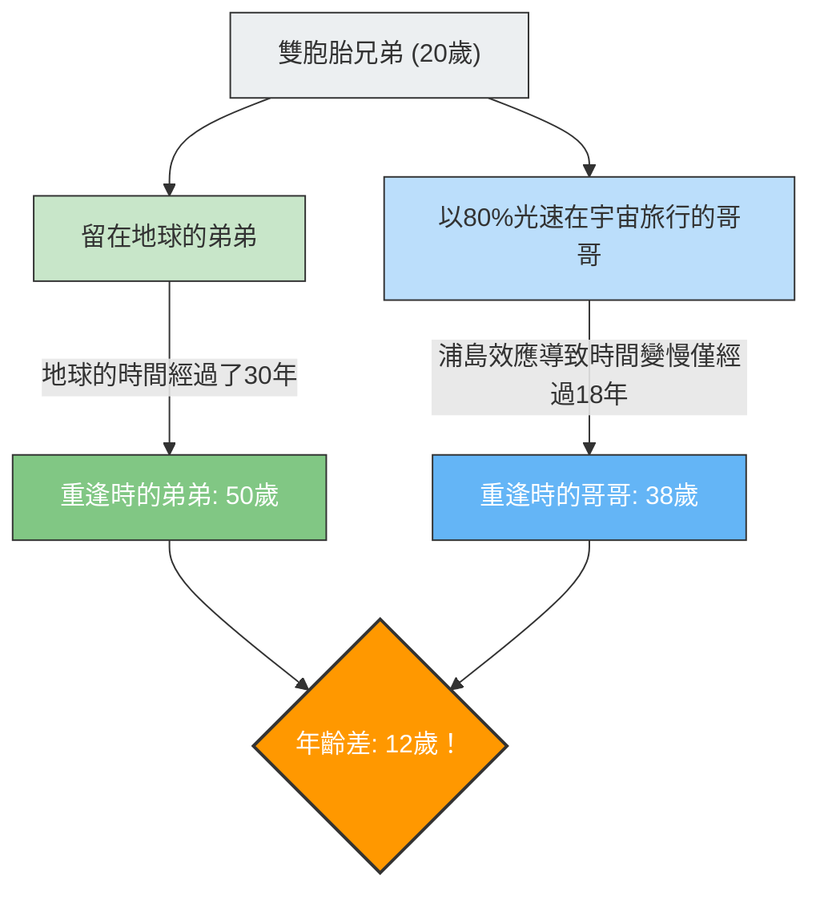

如果你搭乘一艘以接近光速飛行的太空船去旅行，你的時鐘會比地球上人們的時鐘走得更「慢」。
這不是科幻電影的設定，而是愛因斯坦的**「狹義相對論」**所證明的物理學事實。

將這種「時間膨脹」概念表現得最具戲劇性的，就是著名的思想實驗——**「雙子悖論（Twin Paradox）」**。

## 前往宇宙的哥哥與留在地球的弟弟

有一對同日出生的雙胞胎兄弟。
在他們20歲生日那天，哥哥搭乘一艘以80%光速（$0.8c$）飛行的超高速火箭，出發前往遙遠的星球。弟弟則留在地球等待哥哥歸來。

幾年後，哥哥回到了地球。
當火箭艙門打開，兩人重逢時，發生了令人驚訝的事情。

在地球上等待的弟弟已經變成**50歲**（經過了30年）的十足大叔，而曾在宇宙旅行的哥哥卻依然保持著**38歲**（僅經過18年）的年輕容貌。

「明明是雙胞胎，年齡卻產生了12歲的差距」
這就是相對論帶來的第一個衝擊。

## 悖論的核心：取決於從誰的視角來看？

「哥哥變得比較年輕」這件事本身，是只要將數值代入相對論方程式（勞侖茲因子）就能推導出的事實，這也是現代GPS衛星等在實際應用中必須考慮的物理現象（又稱為浦島效應）。

然而，真正的「悖論」從這裡才剛開始。
相對論最重要的法則之一是：**「對於所有等速運動的觀察者而言，物理定律同樣成立（不存在絕對的靜止）」**。

如果將其套用在這次的案例中，就會產生奇妙的矛盾。

1. **從地球上的弟弟來看**：
   「哥哥搭乘的火箭以極快的速度遠去，然後又回來了。因為在運動的是哥哥，所以哥哥的時間會變慢，**哥哥應該比較年輕**才對。」
2. **從火箭上的哥哥來看**：
   「在火箭裡面我是靜止的。看著窗外，地球以極快的速度遠去，然後又回來了。因為在運動的是地球上的弟弟，所以弟弟的時間會變慢，**弟弟應該比較年輕**才對。」

雙方的主張都忠實於相對論中「如果對方看起來在運動，對方的時間就會變慢」的原則。
但是，當兩人重逢並肩站立時，**不可能出現「兩人都比對方年輕」的狀態**。必然是一方年紀較大，另一方年紀較小。

這難道意味著愛因斯坦的理論是錯的嗎？

## 解答篇：「對稱性」的破缺

解決這個悖論的關鍵在於一個事實：**「兩人的立場並不完全是對等（對稱）的」**。

弟弟一直留在地球上（慣性參考系：以一定速度運動或保持靜止的狀態）。
然而，哥哥的旅行中包含了**「加速」與「減速」**。

哥哥的太空船必須經過以下步驟，才能回到地球：
1. 離開地球並**加速**。
2. 在目的地星球踩下剎車（**減速**），轉向地球，然後再次**加速**（U型迴轉）。
3. 抵達地球並踩下剎車（**減速**）。

在相對論中，感受到加速度（感受到G力）的觀察者，與等速運動的觀察者會有不同的對待方式（這屬於廣義相對論的領域）。

特別是當哥哥在目的地星球進行**「U型迴轉（藉由強烈加速改變方向）」**的瞬間，哥哥與弟弟立場的對稱性就完全被打破了。
就在哥哥U型迴轉並朝向地球再次加速的瞬間，從哥哥的視角來看，「地球的時鐘（弟弟的年齡）」會被觀測到一口氣突飛猛進了幾十年。

結果，在重逢時，就只會留下如計算般**「哥哥38歲，弟弟50歲」**的現實，矛盾也就迎刃而解。

雙子悖論告訴我們，「時間對每個人都是平等流逝的」這種我們常識上的感覺，在浩瀚宇宙與光速面前是完全行不通的，它是物理學史上最優美的思想實驗之一。
