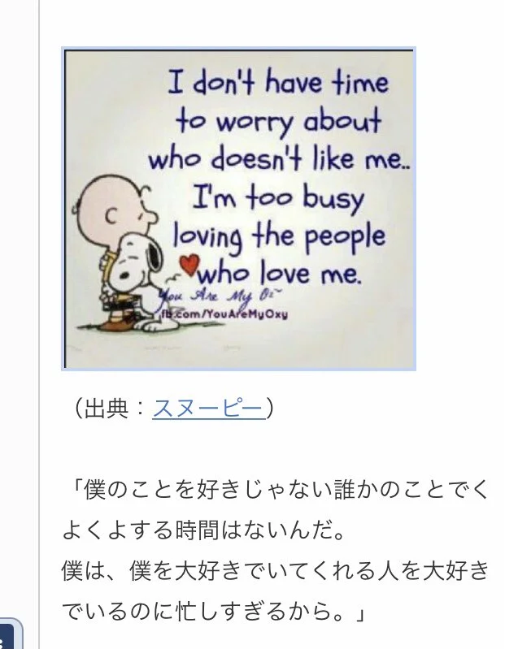

> Les sots apprennent de l'expérience, les sages apprennent de l'histoire (Otto von Bismarck)

> Ne donne pas de poisson, mais apprends à pêcher (Lao Tseu)

> Soyez affamés, soyez fous (Steve Jobs)

> Fait vaut mieux que parfait (Mark Zuckerberg)

> Gardez les choses simples (James Gosling)

> Je n'ai pas le temps de m'inquiéter de ceux qui ne m'aiment pas. Je suis trop occupé à aimer les gens qui m'aiment. (Snoopy)

> Le plus grand bonheur pour l'homme est de « rencontrer un travail dans lequel il peut s'accomplir » (Karl Marx)

> Si une connaissance à moitié est dangereuse, où est l'homme qui possède suffisamment de connaissances pour être hors de danger ? (Thomas Huxley, 1877)

> Tweedledee ajouta : « Au contraire, si c'était ainsi, cela pourrait l'être ; et si c'était ainsi, cela le serait ; mais comme ce n'est pas le cas, ça ne l'est pas. C'est ça, la logique. » (Lewis Carroll, *De l'autre côté du miroir*, 1872)

> Il n'est pas exagéré de dire que Claude Shannon est le père de l'ère de l'information et que ses réalisations académiques comptent parmi les plus grandes du 20e siècle. (Revue de l'American Mathematical Society)

> Ceux qui connaissent l'état actuel de la théorie de l'algèbre symbolique sont conscients que la validité du processus d'analyse ne dépend pas de l'interprétation des symboles qui y sont employés, mais uniquement des lois de leur combinaison. (George Boole, au début de son livre *L'Analyse mathématique de la logique*, 1847)

## Philosophie et Pensée

> Le cœur a ses raisons que la raison ne connaît point (Blaise Pascal)

> Dieu est mort (Friedrich Nietzsche)

> Celui qui a un pourquoi pour vivre peut supporter n'importe quel comment (Friedrich Nietzsche)

> Sur ce dont on ne peut parler, il faut garder le silence (Ludwig Wittgenstein)

> L'homme est né libre, et partout il est dans les fers (Jean-Jacques Rousseau)

> L'homme est la mesure de toutes choses (Protagoras)

> Connais-toi toi-même (Oracle de Delphes / Socrate)

> Que nul n'entre ici s'il n'est géomètre (Platon)

> Tout s'écoule (Héraclite)

> Je pense, donc je suis (René Descartes)

> Je sais que je ne sais rien (Socrate)

> Une vie sans examen ne vaut pas la peine d'être vécue (Socrate)

> L'homme est un animal politique (Aristote)

> L'homme est un roseau pensant (Blaise Pascal)

> Savoir, c'est pouvoir (Francis Bacon)

> Ce que tu ne souhaites pas pour toi-même, ne l'inflige pas aux autres (Confucius)

> Peu importe à quelle lenteur tu vas, tant que tu ne t'arrêtes pas (Confucius)

> Apprendre sans réfléchir est vain, réfléchir sans apprendre est dangereux (Confucius)

> Déteste le péché, mais ne déteste pas le pécheur (Kongcongzi)

## Science, Mathématiques et Technologie

> Les mathématiques sont la reine des sciences (Carl Friedrich Gauss)

> Nous devons savoir, nous saurons (David Hilbert)

> Il n'y a aucune branche des mathématiques, aussi abstraite soit-elle, qui ne puisse un jour s'appliquer aux phénomènes du monde réel (Nikolaï Lobatchevski)

> La science, c'est de la connaissance organisée. La sagesse, c'est une vie organisée (Emmanuel Kant)

> Rien dans la vie n'est à craindre, tout est à comprendre (Marie Curie)

> Si j'ai mille idées et qu'une seule s'avère bonne, je suis satisfait (Alfred Nobel)

> Ce qui est bien avec la science, c'est qu'elle est vraie, que vous y croyiez ou non (Neil deGrasse Tyson)

> En mathématiques, l'art de poser une question a plus de valeur que celui de la résoudre (Georg Cantor)

> Si nous savions ce que nous faisions, cela ne s'appellerait pas de la recherche, n'est-ce pas ? (Albert Einstein)

> Le génie est fait de 1 % d'inspiration et de 99 % de transpiration (Thomas Edison)

> Je n'ai pas échoué. J'ai simplement trouvé 10 000 solutions qui ne fonctionnent pas (Thomas Edison)

> L'imagination est plus importante que la connaissance (Albert Einstein)

> Dieu ne joue pas aux dés avec l'univers (Albert Einstein)

> Au milieu de la difficulté se trouve l'opportunité (Albert Einstein)

> Une personne qui n'a jamais commis d'erreur n'a jamais rien essayé de nouveau (Albert Einstein)

> Si j'ai vu plus loin, c'est en me tenant sur les épaules de géants (Isaac Newton)

> Et pourtant elle tourne (Galilée)

> Il n'y a pas de voie royale en géométrie (Euclide)

> Donnez-moi un point d'appui et je soulèverai le monde (Archimède)

## Informatique et Science Informatique

> Le logiciel dévore le monde (Marc Andreessen)

> Mesurer la progression de la programmation par des lignes de code est comme mesurer la progression de la construction d'un avion par son poids (Bill Gates)

> Neuf femmes enceintes réunies ne peuvent pas faire un bébé en un mois (Frederick Brooks, *Le Mythe du mois-homme*)

> La propriété la plus importante d'un programme est de savoir s'il accomplit l'intention de son utilisateur (C.A.R. Hoare)

> L'optimisation prématurée est la racine de tous les maux (Donald Knuth)

> UNIX est fondamentalement un système d'exploitation simple, mais il faut être un génie pour comprendre sa simplicité (Dennis Ritchie)

> L'itération est humaine, la récursivité est divine (L. Peter Deutsch)

> Le code est lu beaucoup plus souvent qu'il n'est écrit (Guido van Rossum)

> Le grand secret pour devenir un bon programmeur est de lire, lire et encore lire le code écrit par d'autres (Linus Torvalds)

> La meilleure façon de prédire l'avenir est de l'inventer (Alan Kay)

> Les mots ne coûtent rien. Montrez-moi le code (Linus Torvalds)

> La simplicité est la condition préalable à la fiabilité (Edsger Dijkstra)

> L'informatique n'est pas plus la science des ordinateurs que l'astronomie n'est celle des télescopes (Edsger Dijkstra)

> Il n'y a que deux choses difficiles en informatique : l'invalidation du cache et nommer les choses (Phil Karlton)

> N'importe quel idiot peut écrire du code qu'un ordinateur peut comprendre. Les bons programmeurs écrivent du code que les humains peuvent comprendre (Martin Fowler)

> Un bon code est sa propre meilleure documentation (Steve McConnell)

> Les programmes doivent être écrits pour que les gens puissent les lire, et seulement accessoirement pour que les machines les exécutent (Harold Abelson)

> Résolvez d'abord le problème. Ensuite, écrivez le code (John Johnson)

> Votre temps est limité, alors ne le gaspillez pas à vivre la vie de quelqu'un d'autre (Steve Jobs)

> Le design ne se limite pas à l'apparence et au ressenti. Le design, c'est comment ça fonctionne (Steve Jobs)

> L'innovation fait la distinction entre un leader et un suiveur (Steve Jobs)

## Histoire, Politique et Dirigeants

> Je n'ai rien à offrir que du sang, du labeur, des larmes et de la sueur (Winston Churchill)

> Une maison divisée contre elle-même ne peut subsister (Abraham Lincoln)

> Le bulletin de vote est plus fort que la balle de fusil (Abraham Lincoln)

> L'injustice où qu'elle soit est une menace pour la justice partout (Martin Luther King Jr.)

> L'obscurité ne peut pas chasser l'obscurité ; seule la lumière le peut. La haine ne peut pas chasser la haine ; seul l'amour le peut (Martin Luther King Jr.)

> Remporter cent victoires dans cent batailles n'est pas le summum du savoir-faire. Soumettre l'ennemi sans combattre est le summum du savoir-faire (Sun Tzu, *L'Art de la guerre*)

> En temps de paix, les fils enterrent leurs pères. En temps de guerre, les pères enterrent leurs fils (Hérodote)

> L'enthousiasme sans la connaissance n'est que du feu sans lumière (Thomas Fuller)

> L'histoire du monde est le tribunal du monde (Georg Wilhelm Friedrich Hegel)

> Je suis venu, j'ai vu, j'ai vaincu (Jules César)

> Le sort en est jeté (Jules César)

> Le gouvernement du peuple, par le peuple et pour le peuple, ne disparaîtra pas de la surface de la terre (Abraham Lincoln)

> Quoi que vous soyez, soyez-le bien (Abraham Lincoln)

> Le temps, c'est de l'argent (Benjamin Franklin)

> Une bonne action vaut mieux qu'une bonne parole (Benjamin Franklin)

> Le succès n'est pas final, l'échec n'est pas fatal : c'est le courage de continuer qui compte (Winston Churchill)

> N'abandonnez jamais, jamais, jamais (Winston Churchill)

> S'améliorer, c'est changer ; être parfait, c'est changer souvent (Winston Churchill)

> L'éducation est l'arme la plus puissante que vous puissiez utiliser pour changer le monde (Nelson Mandela)

> Cela semble toujours impossible jusqu'à ce que ce soit fait (Nelson Mandela)

> J'ai un rêve (Martin Luther King Jr.)

> La seule chose que nous devons craindre, c'est la crainte elle-même (Franklin D. Roosevelt)

> Ne demandez pas ce que votre pays peut faire pour vous, demandez ce que vous pouvez faire pour votre pays (John F. Kennedy)

> Œil pour œil, et le monde finira aveugle (Mahatma Gandhi)

> Soyez le changement que vous voulez voir dans le monde (Mahatma Gandhi)

> Vis comme si tu devais mourir demain. Apprends comme si tu devais vivre toujours (Mahatma Gandhi)

> Répandez l'amour partout où vous allez. Que personne ne vienne à vous sans repartir plus heureux (Mère Teresa)

> Le mot impossible n'est pas dans mon dictionnaire (Napoléon Bonaparte)

## Littérature, Art et Société

> Le monde entier est un théâtre, et tous les hommes et les femmes ne sont que des acteurs (William Shakespeare)

> L'enfer, c'est les autres (Jean-Paul Sartre)

> Tous ceux qui errent ne sont pas perdus (J. R. R. Tolkien)

> Soyez vous-même, tous les autres sont déjà pris (Oscar Wilde)

> Le génie est une patience éternelle (Michel-Ange)

> Je peins les objets comme je les pense, non comme je les vois (Pablo Picasso)

> L'art est un mensonge qui nous fait réaliser la vérité (Pablo Picasso)

> Même si je savais que le monde allait se désintégrer demain, je planterais quand même mon pommier aujourd'hui (Martin Luther)

> La vie est une tragédie quand on la regarde de près, mais une comédie quand on la regarde de loin (Charlie Chaplin)

> Les ordinateurs sont inutiles. Ils ne peuvent que vous donner des réponses (Pablo Picasso)

> Être, ou ne pas être, telle est la question (William Shakespeare)

> C'est un petit pas pour un homme, un bond de géant pour l'humanité (Neil Armstrong)

> Tous nos rêves peuvent devenir réalité, si nous avons le courage de les poursuivre (Walt Disney)

> La façon de commencer est d'arrêter de parler et de commencer à faire (Walt Disney)

> Dieu est dans les détails (Mies van der Rohe, etc.)

> L'art est long, la vie est courte (Hippocrate)

> Sois comme l'eau, mon ami (Bruce Lee)

## Grands Hommes du Japon

> Vivre un jour de plus, je voudrais que ce soit faire un pas de plus en avant (Hideki Yukawa)

> Montre-leur, dis-leur, fais-les essayer, loue-les, sinon les gens ne bougeront pas (Isoroku Yamamoto)

> Je ne regrette rien de ce que j'ai fait (Musashi Miyamoto, *Dokkōdō*)

> Mille jours de pratique forgent, dix mille jours de pratique polissent (Musashi Miyamoto, *Le Livre des cinq anneaux*)

> Établir sa volonté est la source de toutes choses (Shōin Yoshida)

> Ceux qui n'ont pas de rêves n'ont pas d'idéaux, ceux qui n'ont pas d'idéaux n'ont pas de plans, ceux qui n'ont pas de plans n'ont pas d'exécution, ceux qui n'ont pas d'exécution n'ont pas de succès. Par conséquent, ceux qui n'ont pas de rêves n'ont pas de succès (Shōin Yoshida)

> Celui qui n'avance pas recule inévitablement, et celui qui ne recule pas avance inévitablement (Yukichi Fukuzawa)

> Échouer et abandonner, voilà l'échec. Si vous continuez jusqu'à réussir, cela devient un succès (Kōnosuke Matsushita)

> L'effort est toujours récompensé. S'il y a un effort qui n'est pas récompensé, c'est qu'il ne peut pas encore être appelé effort (Sadaharu Oh)

> Vaincre soi-même vaut mieux que vaincre les autres (Jigorō Kanō)

> Garçons, soyez ambitieux (William Smith Clark)

> Rendre intéressant un monde qui ne l'est pas (Shinsaku Takasugi)

> Laissez le monde dire de moi ce qu'il veut. Je suis le seul à savoir ce que je fais (Ryōma Sakamoto)

> Le Ciel ne crée pas d'hommes au-dessus des hommes, ni d'hommes en dessous des hommes (Yukichi Fukuzawa, *L'Appel à l'étude*)

> Celui qui n'a pas la volonté de s'améliorer spirituellement est un idiot (Sōseki Natsume, *Le Pauvre Cœur des hommes*)

> J'ai vécu une vie pleine de honte (Osamu Dazai, *La Déchéance d'un homme*)

> Si vous le faites, vous pouvez le faire. Si vous ne le faites pas, vous ne le ferez pas. Tout ce qui n'est pas accompli est dû au fait que les gens ne le font pas (Yōzan Uesugi)

