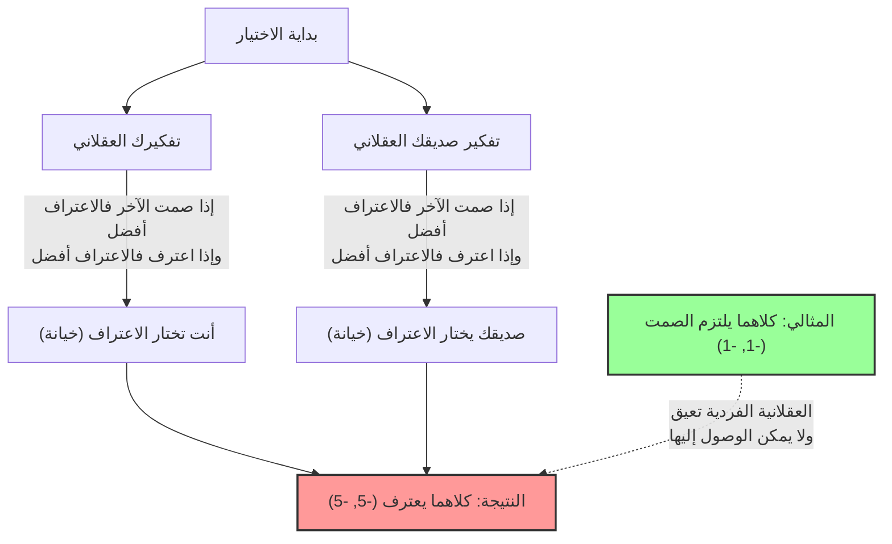
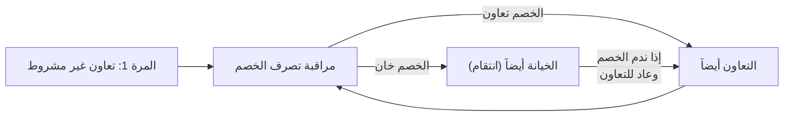

## 1. الخيار النهائي: التزام الصمت أم الخيانة؟

لقد تم القبض عليك وعلى صديقك كشريكين في جريمة.
تم وضعكما في غرفتي استجواب منفصلتين، ولا يمكنكما التواصل مع بعضكما البعض على الإطلاق.

نظراً لأن الشرطة ليس لديها أدلة كافية، قدم المدعي العام لكل منكما "صفقة إقرار بالذنب" كالتالي:

1. **إذا "التزم كلاكما الصمت" (تعاون):** لعدم كفاية الأدلة، سيُحكم على كل منكما **بالسجن لمدة عام واحد**.
2. **إذا "اعترفت أنت" (خيانة) و"التزم صديقك الصمت":** نظراً لتعاونك مع التحقيق، سيتم **تبرئتك (إطلاق سراح فوري)**، بينما سيتحمل صديقك كل اللوم ويُحكم عليه **بالسجن لمدة 10 سنوات**. (والعكس صحيح)
3. **إذا "اعترف كلاكما" (خيانة):** نظراً لاعترافكما بالذنب، سيتم تخفيف العقوبة قليلاً ويُحكم على كل منكما **بالسجن لمدة 5 سنوات**.

الآن، ماذا ستفعل؟ هل "تلتزم الصمت (تتعاون مع الآخر)"؟ أم "تعترف (تخون الآخر)"؟

---

## 2. التحليل باستخدام جدول العوائد (مصفوفة المردود)

هذا الموقف، دعونا نرتبه في "جدول العوائد" المستخدم في نظرية الألعاب.
تمثل الأرقام داخل المربعات (سنوات سجنك، سنوات سجن صديقك). تشير القيمة السالبة إلى الخسارة (سنوات السجن).

| أنت \ صديقك | التزام الصمت (تعاون) | الاعتراف (خيانة) |
| :--- | :---: | :---: |
| **التزام الصمت (تعاون)** | (-1, -1) | (-10, 0) |
| **الاعتراف (خيانة)** | (0, -10) | (-5, -5) |

من وجهة نظر موضوعية، فإن أفضل مسار عمل يمكن لكلا الشخصين اتخاذه واضح.
**إذا "التزم كلاكما الصمت"، فسيكون إجمالي مدة العقوبة عامين فقط (-1 و -1).** هذه هي حالة "أمثلية باريتو" التي تزيد من الفائدة الإجمالية إلى الحد الأقصى.

ومع ذلك، إذا كنت "إنساناً عقلانياً يسعى لتعظيم مصلحته الشخصية فقط"، فسيتم التوصل إلى استنتاج مختلف تماماً.

---

## 3. لماذا تعتبر "الخيانة" الخيار العقلاني؟

دعونا نتتبع عملية التفكير الخاصة بك حيث تتوقع تصرفات "صديقك" في الغرفة الأخرى وتقرر مسار عملك.

**الحالة 1: إذا توقعت أن صديقك "سيلتزم الصمت"**
- إذا "التزمت الصمت" أيضاً، فستسجن لمدة عام.
- إذا "اعترفت"، سيتم تبرئتك (إطلاق سراح فوري).
$\rightarrow$ البراءة أفضل، لذا فإن **"الاعتراف (الخيانة)"** هو الأمثل.

**الحالة 2: إذا توقعت أن صديقك "سيعترف"**
- إذا "التزمت الصمت"، فستسجن لمدة 10 سنوات.
- إذا "اعترفت"، فستسجن لمدة 5 سنوات.
$\rightarrow$ السجن لمدة 5 سنوات أفضل، لذا مرة أخرى فإن **"الاعتراف (الخيانة)"** هو الأمثل.

هل لاحظت ذلك؟ بغض النظر عن الإجراء الذي يتخذه الطرف الآخر، **فإن "الاعتراف (الخيانة)" هو دائماً الخيار الأكثر فائدة لك**.
يُطلق على هذا في نظرية الألعاب اسم **"الاستراتيجية المهيمنة"**.

بما أن صديقك يوضع في نفس الموقف تماماً وسيفكر بعقلانية بنفس الطريقة، فإن "الاعتراف" هو أيضاً الاستراتيجية المهيمنة لصديقك.

ونتيجة لذلك، فإن كلا الشخصين اللذين يفكران بعقلانية سيختاران دائماً "الاعتراف (الخيانة)".
النتيجة التي يتم التوصل إليها هي **السجن لمدة 5 سنوات لكليهما (-5، -5)**، وهي النتيجة الأسوأ تقريباً للصورة العامة. لو أنهما تعاونا (التزما الصمت) لكان حُكم عليهما بالسجن لمدة عام واحد، ولكن نتيجة للسعي وراء العقلانية الفردية، انتهى بهما الأمر بخسارة كليهما.

هذه الحالة، حيث "نتيجة لتوقع كل طرف لتصرفات الآخر، لا يوجد لدى أي منهما دافع لتغيير استراتيجيته (لا يمكن فعل شيء أكثر من ذلك)"، تُعرف باسم **"توازن ناش"**، نسبة إلى عالم نظرية الألعاب جون ناش.

النقطة الأكثر رعباً في معضلة السجين هي أن **"أمثلية باريتو (النتيجة الأفضل للجميع)" لا تتطابق مع "توازن ناش (الوجهة النهائية للعقلانية الفردية)"**.

---

## 4. "معضلة السجين" الكامنة في مجتمعنا اليومي

معضلة السجين ليست مجرد لغز. يمكن تفسير العديد من المشاكل التي تحدث في مجتمعنا باستخدام هذا النموذج الرياضي.

### 1. حرب الأسعار (المنافسة السعرية)
تبيع شركتان متنافستان منتجاً مشابهاً مقابل 1000 ين.
إذا حافظت كلتا الشركتين على سعر 1000 ين (تعاون)، فستحقق كلتاهما أرباحاً عالية.
ومع ذلك، استسلاماً لإغراء "سأجعله أرخص قليلاً من المنافس (خيانة) لاحتكار العملاء"، تبدأ الشركتان في حرب أسعار. ونتيجة لذلك، يصبح سعر المنتج 500 ين، وتعاني كلتا الشركتين من عدم تحقيق أرباح (خيانة متبادلة).

### 2. القضايا البيئية وغازات الاحتباس الحراري
تتعهد دول العالم بـ "تقليل انبعاثات ثاني أكسيد الكربون (تعاون)". هذا هو الحل الأمثل للأرض ككل.
ومع ذلك، من خلال قيام دولة واحدة بـ "تجاهل قيود الانبعاثات وتشغيل المصانع (خيانة)"، يمكنها وحدها تحقيق نمو اقتصادي سريع. وعلى العكس من ذلك، إذا خانت دول أخرى بينما التزمت دولة واحدة فقط بالقواعد، فإن تلك الدولة فقط هي التي ستتكبد خسائر اقتصادية فادحة.
ونتيجة لذلك، خوفاً من تعرضها للخداع، تختار كل دولة الخيانة، مما يؤدي إلى تدمير بيئة الأرض.

### 3. مشكلة المنشطات في الرياضة
المثالي هو ألا يتعاطى أي من الرياضيين المنشطات (تعاون).
ومع ذلك، بسبب الشك في أن "الخصم قد يكون متعاطياً للمنشطات" أو إغراء "إذا تعاطيت أنا وحدي فسأفوز"، فإنهم يختارون تعاطي المنشطات (خيانة). ونتيجة لذلك، يقع الجميع في أسوأ وضع وهو المنافسة تحت تأثير المنشطات مع الإضرار بصحتهم.

---

## 5. هل هناك حل؟ "استراتيجية العين بالعين"

في معاملة لمرة واحدة، تكون "الخيانة" دائماً الخيار العقلاني.
ومع ذلك، عندما يصبح هذا "لعبة متكررة مع نفس الخصم (معضلة السجين المتكررة)"، يتغير الوضع بشكل كبير.

في الثمانينيات، أجرى عالم السياسة روبرت أكسلرود بطولة تنافست فيها برامج كمبيوتر مبرمجة باستراتيجيات مختلفة ضد بعضها البعض.
من بين الاستراتيجيات المعقدة التي تم جمعها من العلماء حول العالم، مثل "الخيانة دائماً" أو "الخيانة العشوائية" أو "مسامحة الخصم"، كانت الاستراتيجية الفائزة وبأغلبية ساحقة هي أبسط استراتيجية: **"استراتيجية العين بالعين" (Tit for Tat)**.

قواعد استراتيجية العين بالعين بسيطة للغاية:

1. **"التعاون" دائماً في المرة الأولى.**
2. **من المرة التالية فصاعداً، قلّد بالضبط "الإجراء الذي اتخذه الخصم" في المرة السابقة.**
   - إذا تعاون الخصم في المرة السابقة، فتعاون هذه المرة.
   - إذا خان الخصم في المرة السابقة، فخن وانتقم هذه المرة.

السبب في قوة هذه الاستراتيجية هو أنها تمتلك أربع خصائص: "عدم المبادرة بالخيانة أبداً (اللطف)"، و"المعاقبة الفورية في حال الخيانة (الصرامة)"، و"المسامحة فوراً إذا غيّر الخصم موقفه (التسامح)"، و"البنية البسيطة التي يسهل على الخصم فهمها (الوضوح)".

حتى في العلاقات الإنسانية أو المجتمع الدولي، طالما أن العلاقات طويلة الأمد هي الأساس، فمن خلال مشاركة قاعدة مثل "استراتيجية العين بالعين": **"التعاون هو الأساس، ولكن هناك عقوبة للخيانة"**، يمكننا التغلب على معضلة السجين وبناء علاقات تعاونية.

## 6. الخلاصة: قيمة "الثقة" التي تعلمنا إياها الرياضيات

لقد أثبتت معضلة السجين رياضياً أن "العقلانية الأنانية للإنسان" يمكنها في بعض الأحيان أن تلقي بالمجتمع بأسره في قاع البؤس.
العقلانية الفردية المتمثلة في "الرغبة في الاستفادة وحدي" أو "عدم الرغبة في التعرض للخداع" تؤدي في النهاية إلى نتيجة تخنق صاحبها (توازن ناش).

ولكن في الوقت نفسه، تعلمنا نظرية الألعاب أنه طالما توفر شرط "استمرار العلاقة على المدى الطويل"، فإن **"الثقة المتبادلة والتعاون" هي الاستراتيجية الأكثر عقلانية التي تزيد أيضاً من المصلحة الذاتية في نهاية المطاف**.

في المرة القادمة التي تتردد فيها قائلاً "هل يجب أن أغش قليلاً من أجل مصلحتي فقط"، يرجى تذكر جدول العوائد لمعضلة السجين هذه. فـ "الخيانة العقلانية" التي تسعى وراء مكاسب قصيرة الأجل قد تكون في الواقع الخيار الأكثر لاعقلانية على المدى الطويل.
