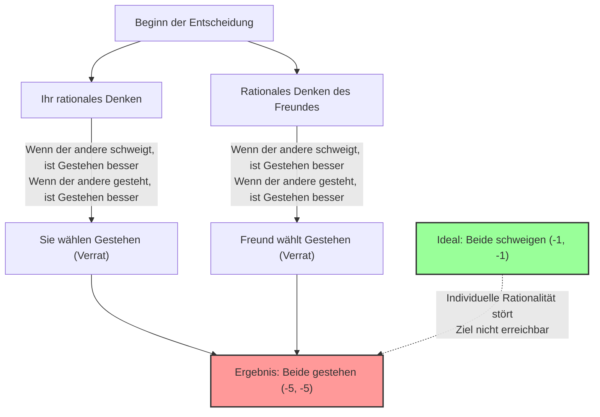
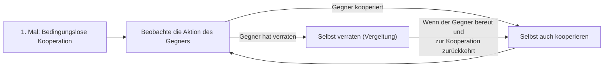

## 1. Die ultimative Wahl: Schweigen oder verraten?

Sie und ein befreundeter Komplize wurden von der Polizei wegen des Verdachts auf eine Straftat festgenommen.
Sie werden in getrennte Verhörräume gebracht und können absolut keinen Kontakt zueinander aufnehmen.

Da die Polizei nicht genügend Beweise gesammelt hat, bietet der Staatsanwalt Ihnen und Ihrem Freund jeweils den folgenden "Deal" an:

1. **Wenn beide "schweigen (kooperieren)":** Aus Mangel an Beweisen erhalten beide nur **1 Jahr Gefängnis**.
2. **Wenn Sie "gestehen (verraten)" und Ihr Freund "schweigt":** Weil Sie bei den Ermittlungen geholfen haben, werden Sie **freigesprochen (sofortige Freilassung)**, aber Ihr Freund nimmt die gesamte Schuld auf sich und bekommt **10 Jahre Gefängnis**. (Umgekehrt genauso)
3. **Wenn beide "gestehen (verraten)":** Da beide die Tat zugegeben haben, wird die Strafe leicht gemildert und beide erhalten **5 Jahre Gefängnis**.

Also, was würden Sie tun? Werden Sie "schweigen (mit dem anderen kooperieren)"? Oder werden Sie "gestehen (den anderen verraten)"?

---

## 2. Analyse durch die Auszahlungsmatrix (Payoff Matrix)

Lassen Sie uns diese Situation in einer "Auszahlungsmatrix", die in der Spieltheorie verwendet wird, ordnen.
Die Zahlen in den Feldern repräsentieren (Ihre Gefängnisstrafe, Gefängnisstrafe des Freundes). Ein Minus bedeutet einen Verlust (Jahre im Gefängnis).

| Sie \ Freund | Schweigen (Kooperation) | Gestehen (Verrat) |
| :--- | :---: | :---: |
| **Schweigen (Kooperation)** | (-1, -1) | (-10, 0) |
| **Gestehen (Verrat)** | (0, -10) | (-5, -5) |

Objektiv betrachtet ist die optimale Vorgehensweise für beide offensichtlich.
**Wenn beide "schweigen", beträgt die gesamte Gefängnisstrafe nur 2 Jahre (-1 und -1).** Dies ist der "pareto-optimale" Zustand, der den Gesamtnutzen maximiert.

Wenn Sie jedoch ein "rationaler Mensch sind, der nur seinen eigenen Nutzen maximieren will", kommen Sie zu einer völlig anderen Schlussfolgerung.

---

## 3. Warum "Verrat" eine rationale Entscheidung wird

Lassen Sie uns den Denkprozess verfolgen, bei dem Sie die Handlung Ihres "Freundes" im anderen Raum vorhersagen und über Ihre eigene Handlung entscheiden.

**Fall 1: Sie sagen voraus, dass Ihr Freund "schweigt"**
- Wenn Sie auch "schweigen", bekommen Sie 1 Jahr Gefängnis.
- Wenn Sie "gestehen", werden Sie freigesprochen (sofortige Freilassung).
$\rightarrow$ Da Freispruch besser ist, ist **"Gestehen (Verrat)"** optimal.

**Fall 2: Sie sagen voraus, dass Ihr Freund "gesteht"**
- Wenn Sie "schweigen", bekommen Sie 10 Jahre Gefängnis.
- Wenn Sie "gestehen", bekommen Sie 5 Jahre Gefängnis.
$\rightarrow$ Da 5 Jahre Gefängnis besser sind, ist ebenfalls **"Gestehen (Verrat)"** optimal.

Merken Sie etwas? Egal, welche Aktion der andere wählt, **es ist für Sie immer vorteilhafter, zu "gestehen (zu verraten)"**.
In der Spieltheorie wird dies als **"dominante Strategie"** bezeichnet.

Da Ihr Freund sich in genau derselben Situation befindet und genauso rational denkt, wird auch für ihn das "Gestehen" zur dominanten Strategie.

Infolgedessen werden beide rational denkenden Personen unweigerlich "Gestehen (Verrat)" wählen.
Das Ergebnis ist **für beide 5 Jahre Gefängnis (-5, -5)**, was insgesamt betrachtet fast das schlechteste Ende ist. Obwohl sie mit nur 1 Jahr Gefängnis davongekommen wären, wenn sie zusammengearbeitet (geschwiegen) hätten, verlieren sie beide dadurch, dass sie ihre individuelle Rationalität verfolgt haben.

Diesen Zustand, in dem "keiner der Spieler ein Motiv hat, seine Strategie zu ändern, nachdem er das Verhalten des anderen vorhergesagt hat (es kann nicht mehr geändert werden)", nennt man **"Nash-Gleichgewicht"**, benannt nach dem großen Spieltheoretiker John Nash.

Der beängstigendste Punkt beim Gefangenendilemma ist, dass **"Pareto-Optimum (das beste Ergebnis für die Gesamtheit)" und "Nash-Gleichgewicht (das Ende der individuellen Rationalität)" nicht übereinstimmen**.

---

## 4. Das "Gefangenendilemma" im Alltag

Das Gefangenendilemma ist nicht nur ein Quiz. Viele Probleme in unserer Gesellschaft können durch dieses mathematische Modell erklärt werden.

### 1. Preiskampf (Preissenkungskrieg)
Zwei rivalisierende Unternehmen verkaufen ähnliche Produkte für 1000 Yen.
Wenn beide Unternehmen bei 1000 Yen bleiben (Kooperation), erzielen beide hohe Gewinne.
Sie erliegen jedoch der Versuchung, "etwas billiger als der Konkurrent zu sein (Verrat), um alle Kunden an sich zu reißen", und beide Unternehmen beginnen einen Preiskampf. Infolgedessen kostet das Produkt 500 Yen und beide Unternehmen leiden, da sie keinen Gewinn mehr machen (beidseitiger Verrat).

### 2. Umweltprobleme und Treibhausgase
Länder auf der ganzen Welt versprechen, "die CO2-Emissionen zu reduzieren (Kooperation)". Das ist die optimale Lösung für die gesamte Erde.
Ein Land kann jedoch "seine Fabriken weiterlaufen lassen und die Emissionsgrenzen ignorieren (Verrat)", wodurch nur seine eigene Wirtschaft schnell wächst. Umgekehrt wird das Land, das sich als einziges an die Regeln hält, während andere betrügen, enorme wirtschaftliche Verluste erleiden.
Aus Angst, hintergangen zu werden, wählt letztendlich jedes Land den Verrat und die globale Umwelt wird zerstört.

### 3. Dopingproblem im Sport
Das Ideal wäre, dass kein Athlet dopt (Kooperation).
Jedoch führen der Verdacht, "dass der Gegner dopen könnte", und die Versuchung, "dass man gewinnen kann, wenn man als Einziger dopt", dazu, dass sie Doping (Verrat) wählen. Das Ergebnis ist eine schreckliche Situation, in der alle unter Drogeneinfluss kämpfen und dabei ihre Gesundheit ruinieren.

---

## 5. Gibt es eine Lösung? Die "Tit-for-Tat-Strategie" (Wie du mir, so ich dir)

Bei einem einmaligen Geschäft ist "Verrat" immer eine rationale Entscheidung.
Aber wenn dies ein "Spiel ist, das immer wieder mit demselben Gegner wiederholt wird (wiederholtes Gefangenendilemma)", ändert sich die Situation drastisch.

In den 1980er Jahren veranstaltete der Politikwissenschaftler Robert Axelrod ein Turnier, bei dem Computerprogramme mit verschiedenen Strategien gegeneinander antraten.
Unter den komplexen Strategien von Wissenschaftlern aus aller Welt, wie "immer verraten", "zufällig verraten" oder "dem Gegner vergeben", gewann mit überwältigendem Erfolg die einfachste: die **"Tit-for-Tat-Strategie"**.

Die Regeln für Tit-for-Tat sind ganz einfach:

1. **Beim ersten Mal immer "kooperieren".**
2. **Ab dem nächsten Mal genau das nachahmen, was "der Gegner beim letzten Mal getan hat".**
   - Wenn der Gegner beim letzten Mal kooperiert hat, kooperieren Sie dieses Mal auch.
   - Wenn der Gegner beim letzten Mal verraten hat, verraten Sie dieses Mal auch zur Vergeltung.

Der Grund, warum diese Strategie so stark ist, liegt an vier Eigenschaften: "Ich werde niemals als Erster verraten (Güte)", "Wenn ich verraten werde, werde ich sofort bestrafen (Strenge)", "Wenn der Gegner sein Verhalten ändert, werde ich sofort vergeben (Vergebung)" und "Die Struktur ist einfach und für den Gegner leicht zu verstehen (Klarheit)".

Selbst in menschlichen Beziehungen und in der internationalen Gemeinschaft, vorausgesetzt, es besteht eine langfristige Beziehung, kann das Gefangenendilemma überwunden und eine kooperative Beziehung aufgebaut werden, indem man eine Regel wie bei der "Tit-for-Tat-Strategie" teilt: **"Grundsätzlich kooperieren, aber Verrat wird bestraft."**

## 6. Zusammenfassung: Der Wert von "Vertrauen", den uns die Mathematik lehrt

Das Gefangenendilemma hat mathematisch bewiesen, dass die "egoistische Rationalität des Menschen" manchmal die gesamte Gesellschaft in die Tiefen des Unglücks stürzt.
Die individuelle Rationalität, "nur selbst profitieren zu wollen" oder "nicht überlistet werden zu wollen", führt letztendlich zu einem Ergebnis (Nash-Gleichgewicht), bei dem man sich selbst schadet.

Gleichzeitig lehrt uns die Spieltheorie jedoch, dass solange die Bedingung "die Beziehung dauert langfristig an" erfüllt ist, **"gegenseitiges Vertrauen und Kooperation" die rationalste Strategie ist, die letztendlich auch den eigenen Nutzen maximiert**.

Wenn Sie das nächste Mal zögern und denken "soll ich ein bisschen schummeln?", erinnern Sie sich an die Auszahlungsmatrix dieses Gefangenendilemmas. Ein "rationaler Verrat", der nur auf kurzfristigen Gewinn abzielt, könnte auf lange Sicht die irrationalste Wahl sein.
