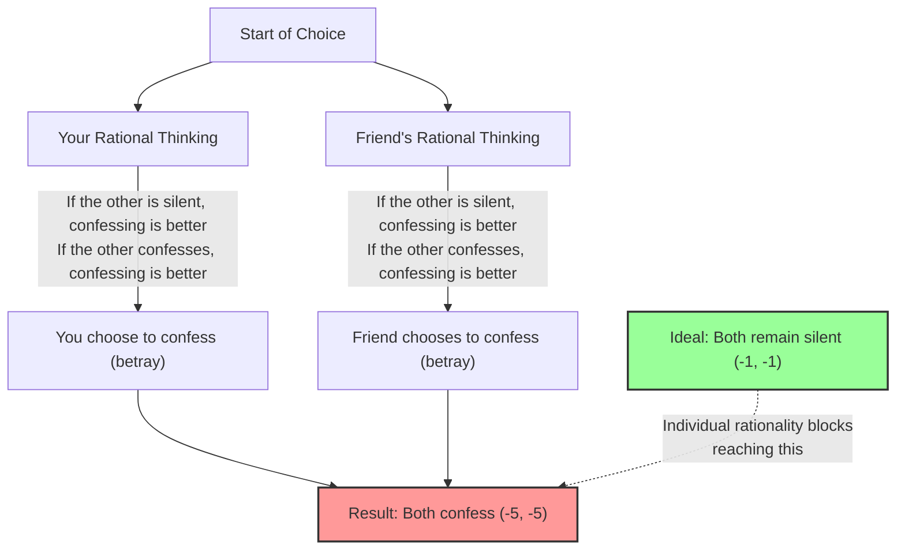
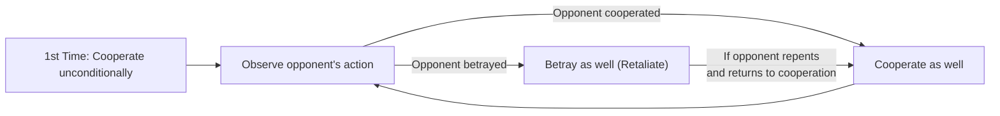

## 1. The Ultimate Choice: Remain Silent or Betray?

You and your accomplice friend have been caught by the police on suspicion of a certain crime.
The two of you are placed in separate interrogation rooms and cannot communicate with each other at all.

Because the police have not fully solidified the evidence, the prosecutor offers each of you and your friend the following "plea bargain".

1. **If both "remain silent (cooperate)":** Due to insufficient evidence, both of you will only get **1 year in prison**.
2. **If you "confess (betray)" and your friend "remains silent":** You, who cooperated with the investigation, will be **found not guilty (immediate release)**, but your friend will take all the blame and get **10 years in prison**. (And vice versa)
3. **If both "confess (betray)":** Since both admitted to the crime, the sentence is slightly reduced and both get **5 years in prison**.

Now, what would you do? Will you "remain silent (cooperate)"? Or will you "confess (betray)"?

---

## 2. Analysis Using a Payoff Matrix

Let's organize this situation into a "payoff matrix" used in game theory.
The numbers in the squares represent (your prison years, your friend's prison years). A minus indicates a loss (prison years).

| You \ Friend | Remain Silent (Cooperate) | Confess (Betray) |
| :--- | :---: | :---: |
| **Remain Silent (Cooperate)** | (-1, -1) | (-10, 0) |
| **Confess (Betray)** | (0, -10) | (-5, -5) |

Viewed objectively, the optimal action the two should take is clear.
**If both "remain silent", the total sentence is only 2 years (-1 and -1).** This is the "Pareto optimal" state that maximizes the overall benefit.

However, if you are a "rational human being trying to maximize only your own benefit", a completely different conclusion is drawn.

---

## 3. Why Is "Betrayal" a Rational Choice?

Let's follow the thought process of deciding your own action by predicting the action of your "friend" in the other room.

**Case 1: If you predict your friend will "remain silent"**
- If you also "remain silent", 1 year in prison.
- If you "confess", not guilty (immediate release).
$\rightarrow$ Being not guilty is better, so **"confess (betray)"** is optimal.

**Case 2: If you predict your friend will "confess"**
- If you also "remain silent", 10 years in prison.
- If you "confess", 5 years in prison.
$\rightarrow$ 5 years in prison is better, so again, **"confess (betray)"** is optimal.

Have you noticed? No matter what action the other person takes, **"confessing (betraying)" is always more advantageous for you**.
In game theory, this is called a **"dominant strategy"**.

Your friend is placed in exactly the same situation and thinks rationally in exactly the same way, so "confessing" also becomes the dominant strategy for your friend.

As a result, the two rational thinkers will always both choose to "confess (betray)".
The resulting outcome is **5 years in prison for both (-5, -5)**, which is nearly the worst outcome overall. Even though cooperating (remaining silent) would have resulted in only 1 year in prison, pursuing individual rationality leads to mutual loss.

This state, "where neither has an incentive to change strategy as a result of predicting the other's action (nothing more can be done)", is called a **"Nash Equilibrium"**, named after the master of game theory, John Nash.

The most terrifying point of the Prisoner's Dilemma lies in the fact that **"Pareto optimal (the best result for the whole)" and "Nash equilibrium (the end point of individual rationality)" do not coincide**.

---

## 4. The "Prisoner's Dilemma" Hidden in Everyday Society

The Prisoner's Dilemma is not just a quiz. Many problems occurring in our society can be explained by this mathematical model.

### 1. Price Competition (Price War)
Two rival companies are selling a similar product for 1000 yen.
If both companies keep the 1000 yen price (cooperate), both can gain high profits.
However, succumbing to the temptation to "make it slightly cheaper than the competitor (betray) and monopolize customers", both companies start a price war. As a result, the product becomes 500 yen, and both companies suffer without making a profit (mutual betrayal).

### 2. Environmental Issues and Greenhouse Gases
Countries around the world promise to "reduce CO2 emissions (cooperate)". This is the optimal solution for the entire Earth.
However, if only one's own country "ignores emission limits and operates factories (betrayal)", only its own economy can grow rapidly. Conversely, if other countries betray but one's own country strictly follows the rules, only one's own country will suffer a huge economic loss.
As a result, every country fears being outsmarted and chooses to betray, and the global environment is destroyed.

### 3. Doping Problems in Sports
Ideally, all athletes should refrain from doping (cooperate).
However, due to paranoia that "the opponent might be doping" or the temptation that "I can win if I am the only one doping", they choose doping (betrayal). As a result, they fall into the worst situation where everyone competes full of drugs while ruining their health.

---

## 5. Is There a Solution? The "Tit for Tat" Strategy

In a single transaction, "betrayal" always becomes the rational choice.
However, when this becomes a "game repeated over and over with the same opponent (Iterated Prisoner's Dilemma)", the situation changes dramatically.

In the 1980s, political scientist Robert Axelrod held a tournament matching up computers programmed with various strategies.
Among complex strategies gathered from scholars around the world, such as "Always Betray", "Betray Randomly", and "Forgive the Opponent", the one that won with an overwhelming score was the simplest **"Tit for Tat"** strategy.

The rules of the Tit for Tat strategy are just these:

1. **Always "cooperate" on the first move.**
2. **From the next move onwards, just copy "the action the opponent took" in the previous move.**
   - If the opponent cooperated last time, cooperate this time.
   - If the opponent betrayed last time, retaliate by betraying this time.

This strategy is strong because it has four characteristics: "Never betray first (Nice)", "Immediately punish when betrayed (Retaliatory)", "Immediately forgive if the opponent changes their attitude (Forgiving)", and "Simple structure that is easy for the opponent to understand (Clear)".

In human relationships and international society as well, if a long-term relationship is assumed, by sharing a rule like the "Tit for Tat" strategy—**"basically cooperate, but penalize betrayal"**—we can overcome the prisoner's dilemma and build cooperative relationships.

## 6. Conclusion: The Value of "Trust" Taught by Mathematics

The Prisoner's Dilemma mathematically proved that "human selfish rationality" can sometimes plunge the entire society into the depths of misery.
The individual rationality of "wanting to be the only one who profits" or "not wanting to be outsmarted" ultimately invites a result (Nash equilibrium) that strangles one's own neck.

At the same time, however, game theory also teaches us that as long as the condition of "the relationship continuing long-term" is met, **"trusting and cooperating with each other" is the most rational strategy that ultimately maximizes one's own profit as well**.

The next time you wonder, "Should I cheat just a little bit for myself?", try to remember this payoff matrix of the Prisoner's Dilemma. Pursuing immediate profit through "rational betrayal" might be the most irrational choice in the long run.
