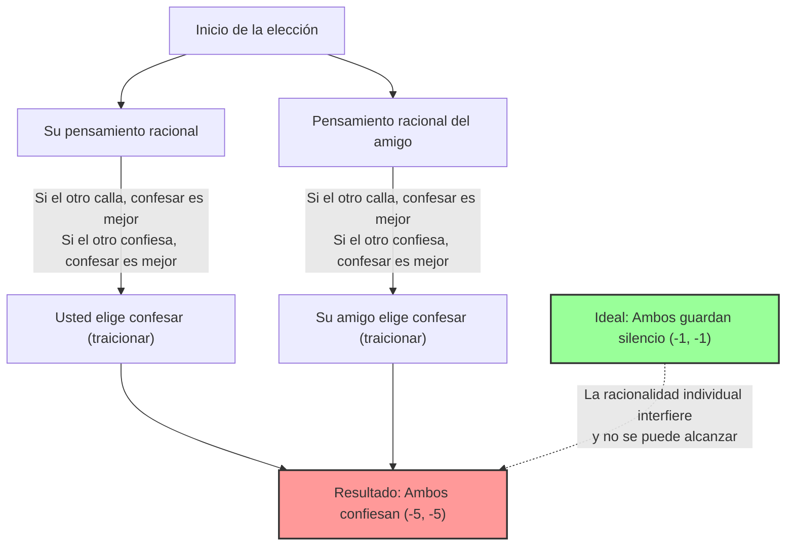
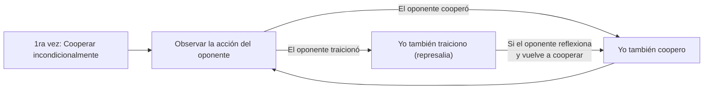

## 1. La elección definitiva: ¿Guardar silencio o traicionar?

Usted ha sido arrestado por la policía junto con un amigo cómplice como sospechoso de un delito.
Los dos son puestos en salas de interrogatorio separadas y no pueden comunicarse entre sí de ninguna manera.

Dado que la policía no tiene pruebas completamente concluyentes, el fiscal les ofrece a usted y a su amigo el siguiente "acuerdo de culpabilidad":

1. **Si ambos "guardan silencio" (cooperan):** Por falta de pruebas, ambos solo cumplirán **1 año de prisión**.
2. **Si usted "confiesa" (traiciona) y su amigo "guarda silencio":** Usted, que cooperó con la investigación, será **absuelto (liberación inmediata)**, pero su amigo asumirá toda la culpa y recibirá **10 años de prisión**. (Y viceversa).
3. **Si ambos "confiesan" (se traicionan):** Dado que ambos admitieron la culpa, sus sentencias se reducen ligeramente y ambos cumplen **5 años de prisión**.

Entonces, ¿qué haría usted? ¿"Guardaría silencio" (cooperar con el otro)? ¿O "confesaría" (traicionar al otro)?

---

## 2. Análisis con la matriz de pagos

Organicemos esta situación en una "matriz de pagos" utilizada en la teoría de juegos.
Los números en las celdas representan (sus años de prisión, años de prisión del amigo). Los números negativos significan pérdidas (años de prisión).

| Usted \ Amigo | Guardar silencio (Cooperar) | Confesar (Traicionar) |
| :--- | :---: | :---: |
| **Guardar silencio (Cooperar)** | (-1, -1) | (-10, 0) |
| **Confesar (Traicionar)** | (0, -10) | (-5, -5) |

Objetivamente, la mejor acción para ambos es clara.
**Si ambos "guardan silencio", el tiempo total de prisión es de solo 2 años (-1 y -1).** Este es el estado "Óptimo de Pareto", donde se maximiza el beneficio total.

Sin embargo, si usted es una "persona racional que intenta maximizar solo su propio beneficio", se llega a una conclusión completamente diferente.

---

## 3. ¿Por qué la "traición" se convierte en la opción racional?

Sigamos el proceso de pensamiento de predecir las acciones de su "amigo" en la otra habitación y decidir su propia acción.

**Caso 1: Si predice que su amigo "guardará silencio"**
- Si usted también "guarda silencio", cumple 1 año de prisión.
- Si usted "confiesa", es absuelto (liberación inmediata).
$\rightarrow$ Como la absolución es mejor, **"confesar (traicionar)"** es óptimo.

**Caso 2: Si predice que su amigo "confesará"**
- Si usted "guarda silencio", cumple 10 años de prisión.
- Si usted "confiesa", cumple 5 años de prisión.
$\rightarrow$ Como 5 años de prisión es menos malo, nuevamente **"confesar (traicionar)"** es óptimo.

¿Se ha dado cuenta? Sin importar qué acción tome la otra persona, **para usted siempre es más ventajoso "confesar (traicionar)"**.
En la teoría de juegos, esto se llama una **"estrategia dominante"**.

Su amigo está en la misma situación y piensa exactamente de la misma manera racional, por lo que para su amigo, "confesar" también es la estrategia dominante.

Como resultado, ambos, pensando racionalmente, siempre elegirán "confesar (traicionar)".
El resultado final es que **ambos reciben 5 años de prisión (-5, -5)**, que es casi el peor resultado en general. A pesar de que cooperando (guardando silencio) solo cumplirían 1 año, la búsqueda de la racionalidad individual termina perjudicándolos a ambos.

Este estado, en el que "después de predecir la acción del otro, ninguno tiene motivos para cambiar de estrategia (ya no hay nada más que hacer)", se denomina **"Equilibrio de Nash"**, en honor a John Nash, un maestro de la teoría de juegos.

El punto más aterrador del dilema del prisionero es que **el "Óptimo de Pareto" (el mejor resultado para el conjunto) y el "Equilibrio de Nash" (el destino final de la racionalidad individual) no coinciden**.

---

## 4. El "Dilema del prisionero" oculto en la sociedad cotidiana

El dilema del prisionero no es solo un acertijo. Muchos de los problemas de nuestra sociedad pueden explicarse con este modelo matemático.

### 1. Competencia de precios (Guerra de precios)
Dos empresas rivales venden un producto similar por 1000 yenes.
Si ambas mantienen el precio en 1000 yenes (cooperación), ambas obtienen grandes beneficios.
Sin embargo, ceden a la tentación de "vender un poco más barato que el otro (traición) para monopolizar a los clientes", y ambas comienzan una guerra de precios. Como resultado, el producto baja a 500 yenes y ambas empresas sufren sin obtener beneficios (ambas traicionan).

### 2. Problemas ambientales y gases de efecto invernadero
Los países de todo el mundo prometen "reducir las emisiones de CO2 (cooperación)". Esta es la solución óptima para todo el planeta.
Sin embargo, al ignorar las restricciones de emisiones y operar sus fábricas (traición), un país puede hacer crecer rápidamente su propia economía. Por el contrario, si otros países traicionan pero su país sigue las reglas, su país sufrirá grandes pérdidas económicas.
Como resultado, por temor a que otros se adelanten, todos los países eligen la traición y el medio ambiente global se destruye.

### 3. El problema del dopaje en el deporte
Lo ideal es que ningún atleta se dope (cooperación).
Sin embargo, debido a la paranoia de que "el otro podría estar dopándose" o a la tentación de que "solo yo ganaré si me dopo", eligen doparse (traición). Como resultado, todos caen en la peor situación, arruinando su salud y compitiendo llenos de drogas.

---

## 5. ¿Hay alguna solución? La estrategia "Toma y daca" (Tit for Tat)

En una transacción única, la "traición" es siempre la opción racional.
Sin embargo, si se convierte en un "juego repetido con la misma persona (Dilema del prisionero iterado)", la situación cambia drásticamente.

En la década de 1980, el politólogo Robert Axelrod organizó un torneo en el que programas de computadora con varias estrategias se enfrentaban entre sí.
Entre estrategias complejas de académicos de todo el mundo, como "traicionar siempre", "traicionar al azar" y "perdonar al oponente", la que ganó por abrumadora ventaja fue la estrategia más simple: el **"Toma y daca (Tit for Tat)"**.

Las reglas de la estrategia "Toma y daca" son solo estas:

1. **Al principio, siempre "coopera".**
2. **A partir de ahí, imita exactamente "la acción que tomó el oponente" la última vez.**
   - Si el oponente cooperó la última vez, usted coopera esta vez.
   - Si el oponente lo traicionó la última vez, usted lo traiciona y toma represalias esta vez.

La razón por la que esta estrategia es fuerte es que tiene cuatro características: "nunca traiciona primero (bondad)", "castiga inmediatamente la traición (severidad)", "perdona tan pronto como el oponente cambia de actitud (indulgencia)" y "su estructura es simple y fácil de entender para el oponente (claridad)".

En las relaciones humanas o en la sociedad internacional, si existe la premisa de una relación a largo plazo, compartir la regla de **"básicamente cooperar, pero penalizar la traición"**, como la estrategia "Toma y daca", nos permite superar el dilema del prisionero y construir relaciones de cooperación.

## 6. Conclusión: El valor de la "confianza" enseñado por las matemáticas

El dilema del prisionero demostró matemáticamente que la "racionalidad egoísta humana" a veces puede hundir a toda la sociedad en la desgracia.
La racionalidad individual de "querer beneficiarse solo uno mismo" o "no querer ser engañado" finalmente conduce a un resultado (Equilibrio de Nash) que termina estrangulándolo a uno mismo.

Pero al mismo tiempo, la teoría de juegos también nos enseña que mientras exista la condición de que "la relación continúe a largo plazo", **"confiar y cooperar mutuamente" es en última instancia la estrategia más racional que también maximiza nuestro propio beneficio**.

La próxima vez que dude si "hacer un poco de trampa solo usted", intente recordar la matriz de pagos de este dilema del prisionero. Después de todo, una "traición racional" en busca de ganancias a corto plazo puede ser la opción más irracional a largo plazo.
