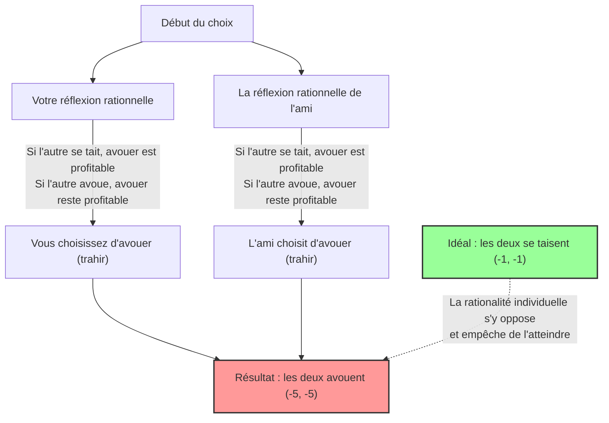
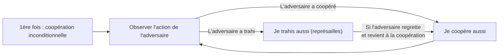

## 1. Le choix ultime : garder le silence ou trahir ?

Vous avez été arrêté par la police avec un ami, complice d'un crime présumé.
Vous êtes placés dans des salles d'interrogatoire séparées, et il vous est absolument impossible de communiquer l'un avec l'autre.

Comme la police n'a pas de preuves solides, le procureur propose à vous et à votre ami l'accord de plaidoyer suivant :

1. **Si tous les deux "gardent le silence (coopération)" :** Faute de preuves, vous vous en sortirez tous les deux avec **1 an de prison**.
2. **Si vous "avouez (trahison)" et que votre ami "garde le silence" :** Vous qui avez coopéré à l'enquête serez **acquitté (libération immédiate)**, mais votre ami portera le chapeau pour tout et aura **10 ans de prison**. (Et vice versa)
3. **Si tous les deux "avouent (trahison)" :** Puisque vous avez tous les deux reconnu les faits, vos peines seront légèrement réduites et vous écoperez tous les deux de **5 ans de prison**.

Alors, que feriez-vous ? Allez-vous "garder le silence (coopérer avec votre complice)" ? Ou allez-vous "avouer (trahir votre complice)" ?

---

## 2. Analyse par la matrice des gains (payoff matrix)

Organisons cette situation dans une "matrice des gains" utilisée dans la théorie des jeux.
Les nombres dans les cases représentent (vos années de prison, les années de prison de votre ami). Le signe moins signifie une perte (années de prison).

| Vous \ Ami | Garder le silence (Coopération) | Avouer (Trahison) |
| :--- | :---: | :---: |
| **Garder le silence (Coopération)** | (-1, -1) | (-10, 0) |
| **Avouer (Trahison)** | (0, -10) | (-5, -5) |

D'un point de vue objectif, la meilleure action à entreprendre pour vous deux est évidente.
**Si tous les deux "gardent le silence", la peine totale ne sera que de 2 ans (-1 et -1).** C'est l'état "Optimum de Pareto" qui maximise le bénéfice global.

Cependant, si vous êtes un "humain rationnel essayant de maximiser son propre profit", une conclusion complètement différente en est tirée.

---

## 3. Pourquoi la "trahison" devient-elle un choix rationnel ?

Suivons le processus de réflexion où vous prédisez le comportement de votre "ami" dans l'autre pièce pour décider de votre propre action.

**Cas 1 : Si vous prédisez que votre ami "gardera le silence"**
- Si je "garde le silence", 1 an de prison.
- Si j'"avoue", acquittement (libération immédiate).
$\rightarrow$ L'acquittement étant préférable, **"avouer (trahir)"** est optimal.

**Cas 2 : Si vous prédisez que votre ami "avouera"**
- Si je "garde le silence", 10 ans de prison.
- Si j'"avoue", 5 ans de prison.
$\rightarrow$ 5 ans de prison étant moins pires, **"avouer (trahir)"** est toujours optimal.

L'avez-vous remarqué ? Peu importe l'action entreprise par l'autre, **il est toujours plus avantageux pour vous d'"avouer (trahir)"**.
Dans la théorie des jeux, on appelle cela une **"stratégie dominante"**.

Votre ami étant placé exactement dans la même situation et pensant de la même manière rationnelle, "avouer" devient également sa stratégie dominante.

En conséquence, les deux individus rationnels choisiront toujours "d'avouer (se trahir)" mutuellement.
Le résultat final est que **tous les deux purgeront 5 ans de prison (-5, -5)**, ce qui est presque le pire résultat dans l'ensemble. Si vous aviez coopéré (gardé le silence), vous vous en seriez tirés avec un an de prison, mais en poursuivant la rationalité individuelle, vous finissez tous les deux par y perdre.

Cet état où "après avoir prédit le comportement de l'autre, personne n'est incité à changer de stratégie (on ne peut rien faire de plus)" est appelé **"Équilibre de Nash"**, d'après le grand maître de la théorie des jeux, John Nash.

Le point le plus effrayant du dilemme du prisonnier réside dans le fait que **"l'optimum de Pareto (le meilleur résultat pour l'ensemble)" et "l'équilibre de Nash (la destination ultime de la rationalité individuelle)" ne coïncident pas**.

---

## 4. Le "dilemme du prisonnier" caché dans la société quotidienne

Le dilemme du prisonnier n'est pas qu'un simple quiz. De nombreux problèmes survenant dans notre société peuvent être expliqués par ce modèle mathématique.

### 1. La guerre des prix (concurrence sur les prix)
Deux entreprises rivales vendent des produits similaires pour 1000 yens.
Si les deux maintiennent le prix de 1000 yens (coopération), elles obtiennent toutes deux des bénéfices élevés.
Cependant, cédant à la tentation de "vendre un peu moins cher que le concurrent (trahison) pour monopoliser les clients", les deux entreprises commencent une guerre des prix. En conséquence, le produit finit à 500 yens, et les deux entreprises souffrent sans faire de bénéfices (trahison mutuelle).

### 2. Les problèmes environnementaux et les gaz à effet de serre
Les pays du monde entier promettent de "réduire les émissions de CO2 (coopération)". C'est la solution optimale pour la planète entière.
Cependant, si un seul pays "ignore les limites d'émission et fait tourner ses usines (trahison)", il peut faire croître rapidement sa propre économie. À l'inverse, si d'autres pays trahissent mais que votre pays est le seul à respecter les règles, votre pays subira d'énormes pertes économiques.
En conséquence, craignant d'être devancé, chaque pays choisit la trahison, et l'environnement mondial est détruit.

### 3. Le problème du dopage dans le sport
L'idéal est qu'aucun athlète ne se dope (coopération).
Cependant, la paranoïa que "les adversaires pourraient se doper" ou la tentation de penser que "si je suis le seul à me doper, je peux gagner", conduit à choisir le dopage (trahison). En conséquence, on tombe dans la pire situation où tout le monde concourt dopé tout en ruinant sa santé.

---

## 5. Y a-t-il une solution ? La stratégie "donnant-donnant" (Tit for Tat)

Dans une transaction unique, la "trahison" sera toujours le choix rationnel.
Mais lorsque cela devient "un jeu répété plusieurs fois avec le même adversaire (dilemme du prisonnier itéré)", la situation change radicalement.

Dans les années 1980, le politologue Robert Axelrod a organisé un tournoi où des ordinateurs programmés avec diverses stratégies s'affrontaient.
Parmi les stratégies complexes recueillies auprès de chercheurs du monde entier, telles que "toujours trahir", "trahir de façon aléatoire", ou "pardonner à l'adversaire", c'est la stratégie la plus simple, **"donnant-donnant (Tit for Tat)"**, qui l'a emporté avec des résultats écrasants.

Les règles de la stratégie donnant-donnant se résument à ceci :

1. **Toujours "coopérer" au début.**
2. **Ensuite, imiter simplement "l'action prise par l'adversaire" au tour précédent.**
   - Si l'adversaire a coopéré la dernière fois, on coopère cette fois.
   - Si l'adversaire a trahi la dernière fois, on trahit et on riposte cette fois.

Cette stratégie est forte car elle combine quatre caractéristiques : "ne jamais être le premier à trahir (bonté)", "punir immédiatement si on est trahi (sévérité)", "pardonner immédiatement si l'adversaire change d'attitude (indulgence)", et "une structure simple facile à comprendre pour l'adversaire (clarté)".

Dans les relations humaines ou la société internationale, tant qu'une relation à long terme est supposée, partager la règle de **"coopérer à la base, mais pénaliser la trahison"**, comme dans la stratégie donnant-donnant, permet de surmonter le dilemme du prisonnier et de construire des relations de coopération.

## 6. Conclusion : la valeur de la "confiance" enseignée par les mathématiques

Le dilemme du prisonnier a prouvé mathématiquement que la "rationalité égoïste humaine" peut parfois plonger la société tout entière dans l'abîme du malheur.
La rationalité individuelle de vouloir "être le seul à en tirer profit" ou "ne pas se faire devancer" conduit finalement à un résultat où l'on se tire une balle dans le pied (équilibre de Nash).

Mais dans le même temps, la théorie des jeux nous enseigne aussi que, à condition que "la relation se poursuive sur le long terme", **"se faire mutuellement confiance et coopérer" est en fait la stratégie la plus rationnelle qui maximise aussi son propre profit**.

La prochaine fois que vous hésiterez à "tricher un peu pour vous seul", rappelez-vous de la matrice des gains de ce dilemme du prisonnier. Poursuivre le profit immédiat par une "trahison rationnelle" pourrait bien être le choix le plus irrationnel à long terme.
