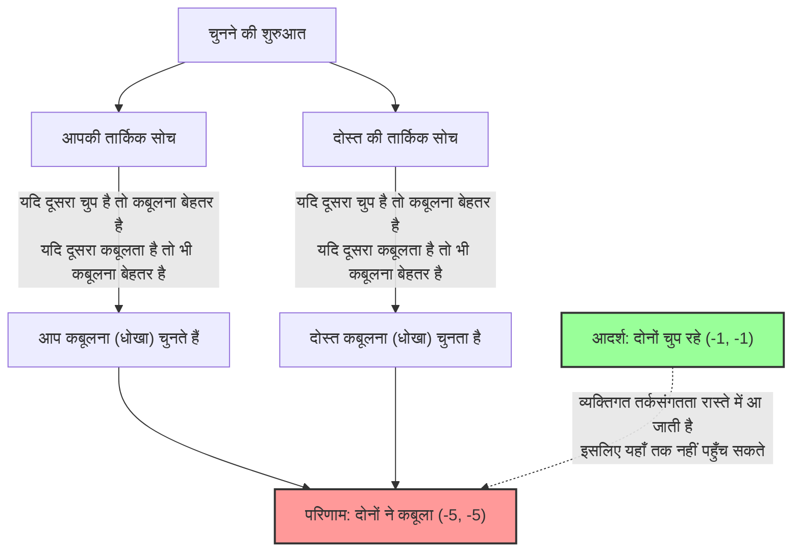
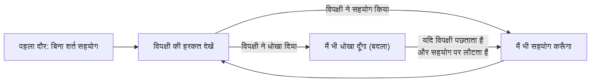

## 1. अंतिम विकल्प: चुप रहना या धोखा देना?

आपको और आपके एक दोस्त (सह-अपराधी) को पुलिस ने किसी अपराध के संदेह में गिरफ्तार कर लिया है।
आप दोनों को अलग-अलग पूछताछ कमरों में रखा गया है और आप एक-दूसरे से बिल्कुल भी संपर्क नहीं कर सकते।

चूंकि पुलिस के पास पुख्ता सबूत नहीं हैं, इसलिए अभियोजक ने आपको और आपके दोस्त को निम्नलिखित "सौदा (Plea Bargain)" की पेशकश की है:

1. **यदि दोनों "चुप रहते हैं (सहयोग करते हैं)":** अपर्याप्त सबूतों के कारण, दोनों को केवल **1 वर्ष की जेल** होगी।
2. **यदि आप "कबूूल करते हैं (धोखा देते हैं)" और आपका दोस्त "चुप रहता है":** जांच में सहयोग करने के लिए आपको **निर्दोष (तुरंत रिहा)** कर दिया जाएगा, लेकिन आपका दोस्त सारा दोष अपने ऊपर ले लेगा और उसे **10 साल की जेल** होगी। (और इसके विपरीत भी)
3. **यदि दोनों "कबूल करते हैं (धोखा देते हैं)":** चूंकि दोनों ने अपना अपराध मान लिया है, इसलिए उनकी सजा थोड़ी कम कर दी जाएगी और दोनों को **5 साल की जेल** होगी।

अब, आप क्या करेंगे? क्या आप "चुप रहेंगे (अपने साथी का सहयोग करेंगे)"? या क्या आप "कबूल करेंगे (अपने साथी को धोखा देंगे)"?

---

## 2. पेऑफ मैट्रिक्स (Payoff Matrix) द्वारा विश्लेषण

आइए इस स्थिति को गेम थ्योरी में इस्तेमाल होने वाले "पेऑफ मैट्रिक्स (Payoff Matrix)" में व्यवस्थित करें।
बॉक्स के अंदर की संख्या (आपकी जेल की सजा के वर्ष, आपके दोस्त की जेल की सजा के वर्ष) को दर्शाती है। ऋण चिह्न (-) नुकसान (जेल में बिताए गए वर्षों) को दर्शाता है।

| आप \ दोस्त | चुप रहना (सहयोग) | कबूल करना (धोखा) |
| :--- | :---: | :---: |
| **चुप रहना (सहयोग)** | (-1, -1) | (-10, 0) |
| **कबूल करना (धोखा)** | (0, -10) | (-5, -5) |

निष्पक्ष रूप से देखा जाए, तो दोनों द्वारा की जाने वाली सबसे अच्छी कार्रवाई स्पष्ट है।
**यदि दोनों "चुप रहते हैं", तो कुल सजा केवल 2 वर्ष (-1 और -1) होगी।** यह "पारेतो इष्टतम (Pareto Optimal)" स्थिति है जो समग्र लाभ को अधिकतम करती है।

हालाँकि, यदि आप "एक तर्कसंगत इंसान हैं जो केवल अपने लाभ को अधिकतम करने की कोशिश कर रहा है," तो एक बिल्कुल अलग निष्कर्ष निकलता है।

---

## 3. "धोखा देना" एक तर्कसंगत विकल्प क्यों बन जाता है?

आइए उस विचार प्रक्रिया का पालन करें जहाँ आप दूसरे कमरे में बैठे अपने "दोस्त" के कार्यों की भविष्यवाणी करते हैं और अपना अगला कदम तय करते हैं।

**स्थिति 1: यदि आप अनुमान लगाते हैं कि आपका दोस्त "चुप रहेगा"**
- यदि आप भी "चुप रहते हैं", तो 1 वर्ष की जेल।
- यदि आप "कबूल करते हैं", तो निर्दोष (तुरंत रिहाई)।
$\rightarrow$ निर्दोष छूटना बेहतर है, इसलिए **"कबूल करना (धोखा देना)"** सबसे अच्छा है।

**स्थिति 2: यदि आप अनुमान लगाते हैं कि आपका दोस्त "कबूल करेगा"**
- यदि आप "चुप रहते हैं", तो 10 वर्ष की जेल।
- यदि आप "कबूल करते हैं", तो 5 वर्ष की जेल।
$\rightarrow$ 5 साल की जेल बेहतर है, इसलिए यहाँ भी **"कबूल करना (धोखा देना)"** सबसे अच्छा है।

क्या आपने गौर किया? चाहे आपका साथी कोई भी कदम उठाए, **आपके लिए "कबूल करना (धोखा देना)" हमेशा अधिक फायदेमंद होता है**।
गेम थ्योरी में इसे **"प्रभावी रणनीति (Dominant Strategy)"** कहा जाता है।

चूँकि आपका दोस्त भी बिल्कुल वैसी ही स्थिति में है और बिल्कुल उसी तरह तार्किक रूप से सोचेगा, इसलिए "कबूल करना" भी उसके लिए एक प्रभावी रणनीति बन जाती है।

नतीजतन, तार्किक रूप से सोचने वाले दोनों व्यक्ति हमेशा "कबूूल करना (धोखा देना)" चुनेंगे।
परिणामस्वरूप, वे जिस नतीजे पर पहुँचते हैं वह है **दोनों के लिए 5 साल की जेल (-5, -5)**, जो समग्र रूप से देखा जाए तो सबसे खराब परिणाम के करीब है। यद्यपि अगर उन्होंने एक-दूसरे का सहयोग किया होता (चुप रहते) तो उन्हें केवल 1 साल की सजा मिलती, लेकिन व्यक्तिगत तर्कसंगतता (Rationality) का पीछा करने के परिणामस्वरूप दोनों को नुकसान उठाना पड़ता है।

इस स्थिति को जिसमें "एक-दूसरे के कार्यों की भविष्यवाणी करने के परिणामस्वरूप दोनों के पास अपनी रणनीति बदलने का कोई मकसद नहीं होता (और कुछ नहीं किया जा सकता)", गेम थ्योरी के उस्ताद जॉन नैश के नाम पर **"नैश इक्विलिब्रियम (Nash Equilibrium)"** कहा जाता है।

कैदी की दुविधा के बारे में सबसे डरावनी बात यह है कि **"पारेतो इष्टतम (समग्र रूप से सबसे अच्छा परिणाम)" और "नैश इक्विलिब्रियम (व्यक्तिगत तर्कसंगतता का अंतिम परिणाम)" एक-दूसरे से मेल नहीं खाते हैं**।

---

## 4. रोजमर्रा के समाज में छिपी "कैदी की दुविधा"

कैदी की दुविधा सिर्फ एक पहेली नहीं है। हमारे समाज में होने वाली कई समस्याओं को इस गणितीय मॉडल से समझाया जा सकता है।

### 1. मूल्य प्रतिस्पर्धा (कीमत कम करने की होड़)
दो प्रतिद्वंद्वी कंपनियाँ एक ही तरह का उत्पाद 1000 येन में बेच रही हैं।
यदि दोनों कंपनियाँ 1000 येन (सहयोग) बनाए रखती हैं, तो दोनों को अधिक मुनाफा हो सकता है।
हालाँकि, वे इस प्रलोभन के आगे झुक जाते हैं कि "मैं इसे दूसरे से थोड़ा सस्ता (धोखा) दूँगा और ग्राहकों पर एकाधिकार कर लूँगा," और दोनों कंपनियाँ कीमत कम करने की होड़ शुरू कर देती हैं। नतीजतन, उत्पाद 500 येन का हो जाता है और दोनों कंपनियों को मुनाफा न होने (दोनों ने धोखा दिया) का नुकसान उठाना पड़ता है।

### 2. पर्यावरणीय समस्याएँ और ग्रीनहाउस गैसें
दुनिया भर के देश "CO2 उत्सर्जन को कम करने (सहयोग करने)" का वादा करते हैं। यह पूरी पृथ्वी के लिए सबसे अच्छा समाधान है।
हालाँकि, यदि केवल एक देश "उत्सर्जन सीमाओं को नजरअंदाज करता है और अपने कारखानों (धोखा) को चलाता है," तो वह अकेले अपनी अर्थव्यवस्था को तेजी से विकसित कर सकता है। इसके विपरीत, यदि कोई देश नियमों का पालन करता है जबकि अन्य धोखा देते हैं, तो नियम का पालन करने वाले देश को भारी आर्थिक नुकसान उठाना पड़ेगा।
नतीजतन, हर देश पीछे छूटने के डर से धोखा देना चुनता है और पृथ्वी का पर्यावरण नष्ट होता चला जाता है।

### 3. खेलों में डोपिंग की समस्या
आदर्श स्थिति यह है कि कोई भी एथलीट डोपिंग (सहयोग) न करे।
हालाँकि, "हो सकता है कि मेरा प्रतिद्वंद्वी डोपिंग कर रहा हो" के संदेह और "अगर मैं डोपिंग करूँगा तो जीत जाऊँगा" के प्रलोभन के कारण, वे डोपिंग (धोखा) चुन लेते हैं। नतीजतन, स्थिति सबसे खराब हो जाती है जहाँ हर कोई अपने स्वास्थ्य को बर्बाद करते हुए दवाओं के प्रभाव में प्रतिस्पर्धा करता है।

---

## 5. क्या कोई समाधान है? "जैसे को तैसा (Tit for Tat)" रणनीति

एक एकल लेन-देन में, "धोखा देना" हमेशा एक तर्कसंगत विकल्प होता है।
हालाँकि, जब यह एक "ऐसा खेल बन जाता है जो उसी प्रतिद्वंद्वी के साथ बार-बार खेला जाता है (दोहराई गई कैदी की दुविधा / Iterated Prisoner's Dilemma)", तो स्थिति नाटकीय रूप से बदल जाती है।

1980 के दशक में, राजनीतिक वैज्ञानिक रॉबर्ट एक्सलरोड ने एक टूर्नामेंट आयोजित किया जहाँ उन्होंने विभिन्न रणनीतियों के साथ प्रोग्राम किए गए कंप्यूटरों को एक-दूसरे के खिलाफ खड़ा किया।
दुनिया भर के विद्वानों द्वारा प्रस्तुत "हमेशा धोखा देना", "बेतरतीब ढंग से धोखा देना" और "विपक्षी को माफ करना" जैसी जटिल रणनीतियों में से, भारी सफलता के साथ टूर्नामेंट जीतने वाली रणनीति सबसे सरल थी: **"जैसे को तैसा (Tit for Tat)"** रणनीति।

जैसे को तैसा रणनीति के नियम सरल हैं:

1. **शुरुआत में हमेशा "सहयोग" करें।**
2. **अगली बार से, ठीक वही करें जो पिछली बार "आपके प्रतिद्वंद्वी ने किया" था।**
   - यदि आपके प्रतिद्वंद्वी ने पिछली बार सहयोग किया था, तो इस बार आप भी सहयोग करें।
   - यदि आपके प्रतिद्वंद्वी ने पिछली बार धोखा दिया था, तो इस बार आप भी धोखा देकर बदला लें।

यह रणनीति इतनी मजबूत इसलिए है क्योंकि इसमें चार विशेषताएं हैं: "मैं कभी भी पहले धोखा नहीं दूंगा (अच्छाई)", "अगर मुझे धोखा दिया गया तो मैं तुरंत सजा दूंगा (सख्ती)", "अगर मेरा प्रतिद्वंद्वी अपना रवैया बदलता है तो मैं तुरंत माफ कर दूंगा (क्षमाशीलता)" और "संरचना सरल और प्रतिद्वंद्वी को समझने में आसान है (स्पष्टता)"।

मानवीय रिश्तों और अंतरराष्ट्रीय समाज में भी, यदि एक दीर्घकालिक संबंध माना जाता है, तो "कैदी की दुविधा" को दूर किया जा सकता है और एक "जैसे को तैसा" रणनीति की तरह **"मूल रूप से सहयोग करें, लेकिन धोखे के लिए दंड दें"** नियम को साझा करके एक सहकारी संबंध बनाया जा सकता है।

## 6. निष्कर्ष: गणित हमें "भरोसे" का मूल्य सिखाता है

कैदी की दुविधा गणितीय रूप से साबित करती है कि "मनुष्य की स्वार्थी तर्कसंगतता" कभी-कभी पूरे समाज को दुर्भाग्य की गहराई में धकेल सकती है।
यह व्यक्तिगत तर्कसंगतता कि "मैं ही केवल लाभ कमाना चाहता हूँ" या "मैं पीछे नहीं छूटना चाहता" अंततः एक ऐसे परिणाम (नैश इक्विलिब्रियम) की ओर ले जाती है जो खुद का ही गला घोंट देता है।

हालाँकि, साथ ही, गेम थ्योरी यह भी सिखाती है कि जब तक "रिश्ता लंबे समय तक चलने वाला है", **"एक-दूसरे पर भरोसा करना और सहयोग करना" अंततः सबसे तर्कसंगत रणनीति है जो आपके अपने मुनाफे को भी अधिकतम करती है**।

अगली बार जब आप "क्या मुझे अपने लिए थोड़ी बेईमानी करनी चाहिए" के बारे में झिझक रहे हों, तो कृपया इस कैदी की दुविधा के पेऑफ मैट्रिक्स को याद करें। अल्पकालिक मुनाफे का पीछा करने वाला "तर्कसंगत धोखा" लंबे समय में सबसे अतार्किक विकल्प हो सकता है।
