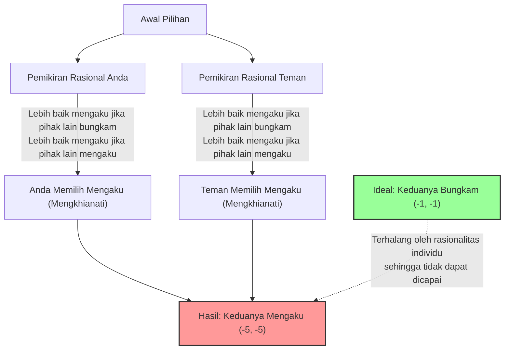
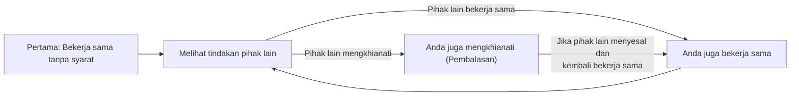

## 1. Pilihan Terakhir: Bungkam atau Mengkhianati?

Anda dan seorang teman yang menjadi kaki tangan ditangkap oleh polisi karena dicurigai melakukan kejahatan.
Keduanya dimasukkan ke dalam ruang interogasi yang terpisah dan tidak dapat berkomunikasi satu sama lain sama sekali.

Karena polisi belum memiliki bukti yang sepenuhnya kuat, jaksa menawarkan "tawar-menawar pembelaan" kepada Anda dan teman Anda sebagai berikut:

1. **Jika keduanya "bungkam (bekerja sama)":** Karena bukti tidak cukup, keduanya hanya akan dipenjara selama **1 tahun**.
2. **Jika Anda "mengaku (mengkhianati)" dan teman Anda "bungkam":** Anda yang bekerja sama dengan penyelidikan akan dibebaskan **tanpa tuntutan (pembebasan segera)**, tetapi teman Anda akan menanggung semua tuduhan dan dipenjara selama **10 tahun**. (Berlaku sebaliknya)
3. **Jika keduanya "mengaku (mengkhianati)":** Karena keduanya mengakui kejahatan, hukuman akan sedikit dikurangi dan keduanya dipenjara selama **5 tahun**.

Nah, apa yang akan Anda lakukan? Apakah Anda akan "bungkam (bekerja sama dengan pihak lain)"? Atau apakah Anda akan "mengaku (mengkhianati pihak lain)"?

---

## 2. Analisis Menggunakan Tabel Ganjaran (Payoff Matrix)

Mari kita susun situasi ini ke dalam "tabel ganjaran" yang digunakan dalam teori permainan.
Angka di dalam sel menunjukkan (tahun penjara Anda, tahun penjara teman Anda). Tanda minus berarti kerugian (tahun penjara).

| Anda \ Teman | Bungkam (Bekerja Sama) | Mengaku (Mengkhianati) |
| :--- | :---: | :---: |
| **Bungkam (Bekerja Sama)** | (-1, -1) | (-10, 0) |
| **Mengaku (Mengkhianati)** | (0, -10) | (-5, -5) |

Dilihat secara objektif, tindakan terbaik yang harus diambil oleh keduanya jelas.
**Jika keduanya "bungkam", total masa hukuman hanya 2 tahun (-1 dan -1).** Ini adalah kondisi "Optimal Pareto" yang memaksimalkan keuntungan keseluruhan.

Namun, jika Anda adalah "manusia rasional yang mencoba memaksimalkan keuntungannya sendiri", kesimpulan yang sama sekali berbeda akan ditarik.

---

## 3. Mengapa "Pengkhianatan" Menjadi Pilihan yang Rasional?

Mari kita ikuti proses berpikir dalam memprediksi tindakan "teman" Anda yang berada di ruangan lain untuk menentukan tindakan Anda sendiri.

**Kasus 1: Jika diprediksi bahwa teman akan "bungkam"**
- Jika Anda juga "bungkam", hukuman penjara 1 tahun.
- Jika Anda "mengaku", bebas dari tuntutan (pembebasan segera).
$\rightarrow$ Karena dibebaskan lebih baik, **"mengaku (mengkhianati)"** adalah pilihan terbaik.

**Kasus 2: Jika diprediksi bahwa teman akan "mengaku"**
- Jika Anda juga "bungkam", hukuman penjara 10 tahun.
- Jika Anda "mengaku", hukuman penjara 5 tahun.
$\rightarrow$ Karena 5 tahun penjara lebih ringan, lagi-lagi **"mengaku (mengkhianati)"** adalah pilihan terbaik.

Pernahkah Anda menyadarinya? Apapun tindakan yang diambil pihak lain, **"mengaku (mengkhianati)" selalu lebih menguntungkan bagi Anda**.
Dalam teori permainan, ini disebut **"Strategi Dominan"**.

Teman Anda juga ditempatkan dalam situasi yang sama persis dan berpikir rasional dengan cara yang persis sama, sehingga "mengaku" juga menjadi strategi dominan bagi teman Anda.

Hasilnya, kedua orang yang berpikir rasional pasti akan memilih "mengaku (mengkhianati)" satu sama lain.
Akibatnya, mereka berdua berakhir dengan **hukuman penjara 5 tahun (-5, -5)**, sebuah hasil yang mendekati skenario terburuk jika dilihat secara keseluruhan. Padahal jika mereka berdua bekerja sama (bungkam), mereka hanya akan dipenjara selama 1 tahun, tetapi sebagai akibat dari mengejar rasionalitas individu, mereka saling merugikan.

Keadaan di mana "tidak ada motivasi untuk saling mengubah strategi sebagai hasil dari memprediksi tindakan pihak lain (tidak ada lagi yang bisa dilakukan)" dinamakan **"Keseimbangan Nash"**, diambil dari nama master teori permainan, John Nash.

Poin paling mengerikan dari Dilema Tahanan terletak pada fakta bahwa **"Optimal Pareto (hasil terbaik untuk keseluruhan)" dan "Keseimbangan Nash (tujuan akhir dari rasionalitas individu)" tidak sejalan**.

---

## 4. "Dilema Tahanan" yang Bersembunyi di Masyarakat Sehari-hari

Dilema Tahanan bukan sekadar kuis biasa. Banyak masalah yang terjadi di masyarakat kita dapat dijelaskan dengan model matematika ini.

### 1. Persaingan Harga (Perang Diskon)
Dua perusahaan pesaing menjual produk yang sama seharga 1000 yen.
Jika kedua perusahaan mempertahankan 1000 yen (bekerja sama), keduanya akan mendapat untung besar.
Namun, mereka tergoda oleh godaan untuk "menurunkan harga sedikit di bawah pihak lain (mengkhianati) untuk memonopoli pelanggan", dan kedua perusahaan memulai perang diskon. Akibatnya, produk tersebut menjadi 500 yen, dan kedua perusahaan menderita kerugian (keduanya mengkhianati).

### 2. Masalah Lingkungan dan Gas Rumah Kaca
Negara-negara di seluruh dunia berjanji untuk "mengurangi emisi CO2 (bekerja sama)". Ini adalah solusi optimal bagi seluruh bumi.
Namun, jika suatu negara "mengabaikan batasan emisi dan mengoperasikan pabrik (mengkhianati)" sendirian, negara tersebut dapat mengembangkan ekonominya sendiri dengan cepat. Sebaliknya, jika negara lain berkhianat sementara negara Anda sendiri tetap mematuhi aturan, hanya negara Anda yang akan menderita kerugian ekonomi besar.
Akibatnya, setiap negara memilih pengkhianatan karena takut disalip, dan lingkungan global hancur.

### 3. Masalah Doping dalam Olahraga
Kondisi yang ideal adalah semua atlet tidak menggunakan doping (bekerja sama).
Namun, karena kecurigaan bahwa "lawan mungkin melakukan doping" atau godaan bahwa "saya bisa menang jika saya menggunakan doping sendirian", mereka memilih doping (mengkhianati). Akibatnya, semua orang jatuh ke dalam situasi terburuk di mana mereka bersaing dalam pengaruh obat-obatan sambil membahayakan kesehatan mereka.

---

## 5. Apakah Ada Solusinya? "Strategi Tit for Tat"

Dalam satu kali transaksi, "pengkhianatan" selalu menjadi pilihan yang rasional.
Namun, jika ini menjadi "permainan yang diulang berkali-kali dengan pihak yang sama (Dilema Tahanan Berulang)", situasinya berubah secara dramatis.

Pada tahun 1980-an, ilmuwan politik Robert Axelrod mengadakan turnamen di mana komputer yang diprogram dengan berbagai strategi bertanding satu sama lain.
Di antara strategi kompleks yang dikumpulkan dari para ilmuwan di seluruh dunia, seperti "selalu mengkhianati", "mengkhianati secara acak", dan "memaafkan pihak lain", strategi yang menang dengan hasil luar biasa adalah **"Strategi Tit for Tat (Membalas Tindakan Serupa)"** yang paling sederhana.

Aturan strategi Tit for Tat hanya ini:

1. **Pada awalnya, selalu "bekerja sama".**
2. **Mulai dari tahap berikutnya, cukup tiru "tindakan yang diambil pihak lain" sebelumnya.**
   - Jika pihak lain bekerja sama sebelumnya, kali ini Anda bekerja sama.
   - Jika pihak lain mengkhianati sebelumnya, kali ini Anda mengkhianati untuk membalas dendam.

Strategi ini kuat karena memiliki empat karakteristik: "jangan pernah berkhianat terlebih dahulu (kebaikan)", "segera berikan hukuman jika dikhianati (ketegasan)", "segera maafkan jika pihak lain mengubah sikapnya (toleransi)", dan "strukturnya sederhana dan mudah dipahami oleh pihak lain (kejelasan)".

Dalam hubungan manusia atau komunitas internasional sekalipun, jika hubungan jangka panjang merupakan premis dasar, dengan membagikan aturan seperti "Strategi Tit for Tat" yaitu **"pada dasarnya bekerja sama, tetapi memberikan penalti terhadap pengkhianatan"**, kita dapat mengatasi Dilema Tahanan dan membangun hubungan kerja sama.

## 6. Kesimpulan: Nilai "Kepercayaan" yang Diajarkan oleh Matematika

Dilema Tahanan membuktikan secara matematis bahwa "rasionalitas egois manusia" terkadang menjerumuskan seluruh masyarakat ke dasar jurang kesengsaraan.
Rasionalitas individu seperti "hanya saya yang ingin mendapat untung" atau "tidak ingin dikelabui" pada akhirnya akan membawa hasil yang mencekik leher sendiri (Keseimbangan Nash).

Namun pada saat yang sama, teori permainan juga mengajarkan bahwa selama ada kondisi bahwa "hubungan berlanjut untuk jangka panjang", **"saling percaya dan bekerja sama satu sama lain" adalah strategi paling rasional yang pada akhirnya memaksimalkan keuntungan diri sendiri**.

Saat Anda selanjutnya ragu apakah Anda harus "sedikit curang", cobalah mengingat tabel ganjaran dari Dilema Tahanan ini. Karena "pengkhianatan rasional" yang mengejar keuntungan di depan mata mungkin merupakan pilihan paling irasional dalam jangka panjang.
