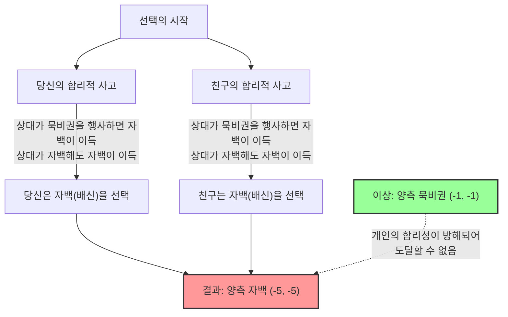
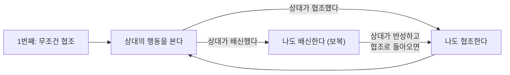

## 1. 궁극의 선택: 묵비권을 행사할 것인가, 배신할 것인가?

당신은 어떤 범죄의 용의자로 공범인 친구와 함께 경찰에 붙잡히고 말았습니다.
두 사람은 서로 다른 취조실에 들어가게 되었고, 서로 연락을 취하는 것은 일절 불가능합니다.

경찰은 증거를 완전히 확보하지 못했기 때문에, 검사는 당신과 친구에게 각각 다음과 같은 "사법 거래"를 제안했습니다.

1. **둘 다 "묵비권 행사(협력)"를 한 경우:** 증거 불충분으로, 두 사람 모두 **징역 1년**으로 끝난다.
2. **당신이 "자백(배신)"하고, 친구가 "묵비권 행사"를 한 경우:** 수사에 협조한 당신은 **무죄(즉시 석방)**가 되지만, 친구는 모든 죄를 뒤집어쓰고 **징역 10년**이 된다. (반대의 경우도 마찬가지)
3. **둘 다 "자백(배신)"을 한 경우:** 두 사람 모두 죄를 인정했기 때문에, 형이 조금 감경되어 두 사람 모두 **징역 5년**이 된다.

자, 당신이라면 어떻게 하시겠습니까? "묵비권(상대방과 협력)"을 행사하시겠습니까? 아니면 "자백(상대방을 배신)"하시겠습니까?

---

## 2. 이득표(페이오프 매트릭스)를 통한 분석

이 상황을 게임 이론에서 사용되는 "이득표"로 정리해 봅시다.
칸 안의 숫자는 (당신의 징역 연수, 친구의 징역 연수)를 나타냅니다. 마이너스는 손실(징역 연수)을 의미합니다.

| 당신 \ 친구 | 묵비권 행사(협조) | 자백하기(배신) |
| :--- | :---: | :---: |
| **묵비권 행사(협조)** | (-1, -1) | (-10, 0) |
| **자백하기(배신)** | (0, -10) | (-5, -5) |

객관적으로 보면, 두 사람이 취해야 할 최적의 행동은 명확합니다.
**둘 다 "묵비권"을 행사하면, 전체 형기는 단 2년(-1과 -1)으로 끝납니다.** 이것이 전체의 이익을 극대화하는 "파레토 최적" 상태입니다.

하지만 당신이 "자신의 이익만을 극대화하려는 합리적인 인간"이라면, 전혀 다른 결론이 도출됩니다.

---

## 3. 왜 "배신"이 합리적인 선택이 되는가?

당신이 다른 방에 있는 "친구"의 행동을 예측하여 자신의 행동을 결정하는 사고 과정을 따라가 봅시다.

**케이스 1: 친구가 "묵비권"을 행사할 것이라고 예측한 경우**
- 나도 "묵비권"을 행사하면, 징역 1년.
- 내가 "자백"하면, 무죄(즉시 석방).
$\rightarrow$ 무죄가 더 좋으므로, **"자백(배신)"**이 최적.

**케이스 2: 친구가 "자백"할 것이라고 예측한 경우**
- 나도 "묵비권"을 행사하면, 징역 10년.
- 내가 "자백"하면, 징역 5년.
$\rightarrow$ 징역 5년이 더 나으므로, 역시 **"자백(배신)"**이 최적.

눈치채셨나요? 상대방이 어떤 행동을 취하든 간에, **당신에게는 "자백(배신)"하는 것이 항상 더 유리**합니다.
이것을 게임 이론에서는 **"우월 전략(Dominant Strategy)"**이라고 부릅니다.

친구도 완전히 같은 상황에 놓여 있고 완전히 똑같이 합리적으로 생각하기 때문에, 친구에게도 "자백"이 우월 전략이 됩니다.

결과적으로, 합리적으로 생각한 두 사람은 반드시 서로 "자백(배신)"을 선택합니다.
그 결과 도달하게 되는 것은 **둘 다 징역 5년(-5, -5)**이라는, 전체적으로 보면 최악에 가까운 결말입니다. 둘이서 협력(묵비권)했다면 징역 1년으로 끝났을 텐데, 개인의 합리성을 추구한 결과 서로 손해를 보고 마는 것입니다.

이처럼 "서로 상대의 행동을 예측한 결과, 서로 전략을 바꿀 동기가 없는(더 이상 어쩔 수 없는) 상태"를 게임 이론의 대가 존 내시의 이름을 따서 **"내시 균형(Nash Equilibrium)"**이라고 부릅니다.

죄수의 딜레마에서 가장 무서운 점은, **"파레토 최적(전체에게 가장 좋은 결과)"과 "내시 균형(개인의 합리성이 도달하는 곳)"이 일치하지 않는다**는 점에 있습니다.

---

## 4. 일상 사회에 숨어 있는 "죄수의 딜레마"

죄수의 딜레마는 단순한 퀴즈가 아닙니다. 우리 사회에서 일어나고 있는 많은 문제들이 이 수학 모델로 설명됩니다.

### 1. 가격 경쟁(할인 경쟁)
두 경쟁 기업이 비슷한 상품을 1000원에 팔고 있습니다.
양사가 1000원을 유지(협조)하면 양사 모두 높은 이익을 얻을 수 있습니다.
하지만, "상대보다 조금만 싸게 해서(배신), 손님을 독점하자"라는 유혹에 넘어가 양사가 할인 경쟁을 시작합니다. 결과적으로 상품은 500원이 되고 양사 모두 이익을 내지 못하고 고통받는(양측 배신) 상황이 됩니다.

### 2. 환경 문제와 온실가스
전 세계 국가들이 "CO2 배출을 줄이자(협조)"라고 약속합니다. 이것이 지구 전체를 위한 최적의 해답입니다.
하지만 자국만 "배출 제한을 무시하고 공장을 가동(배신)"함으로써 자국의 경제만 급성장시킬 수 있습니다. 반대로, 타국이 배신했는데 자국만 규칙을 지키면 자국만 경제적으로 큰 손해를 봅니다.
결과적으로 어느 나라도 남들이 먼저 빠져나갈까 두려워 배신을 선택하고, 지구 환경은 파괴되어 갑니다.

### 3. 스포츠의 도핑 문제
선수 전원이 도핑을 하지 않는(협조) 것이 이상적입니다.
하지만 "상대가 도핑을 하고 있을지도 모른다"는 의심이나 "나만 도핑하면 이길 수 있다"는 유혹 때문에 도핑(배신)을 선택하고 맙니다. 결과적으로 전원이 건강을 해쳐가며 약물에 찌든 채 싸우는 최악의 상황에 빠집니다.

---

## 5. 해결책은 있는가? "팃포탯(Tit for Tat) 전략"

일회성 거래에서는 "배신"이 항상 합리적인 선택이 되어버립니다.
하지만 이것이 "같은 상대와 여러 번 반복되는 게임(반복되는 죄수의 딜레마)"이 되면 상황은 극적으로 바뀝니다.

1980년대, 정치학자 로버트 액설로드는 다양한 전략이 프로그래밍된 컴퓨터끼리 대전하는 토너먼트를 열었습니다.
"항상 배신한다", "무작위로 배신한다", "상대를 용서한다" 등 전 세계 학자들로부터 모인 복잡한 전략들 중에서 압도적인 성적으로 우승한 것은 가장 단순한 **"팃포탯 전략(Tit for Tat, 눈에는 눈 이에는 이)"**이었습니다.

팃포탯 전략의 규칙은 단지 이것뿐입니다.

1. **처음에는 반드시 "협조"한다.**
2. **다음부터는, 이전 턴에 "상대가 취한 행동"을 그대로 따라 한다.**
   - 상대가 이전에 협조해 주었다면, 이번에는 협조한다.
   - 상대가 이전에 배신했다면, 이번에는 배신으로 보복한다.

이 전략이 강력한 이유는 "먼저 절대 배신하지 않는다(선량함)", "배신당하면 즉각 벌을 준다(엄격함)", "상대가 태도를 고치면 바로 용서한다(관대함)", "구조가 단순하여 상대에게 전달되기 쉽다(명료함)"라는 4가지 특징을 갖추고 있기 때문입니다.

인간관계나 국제사회에서도 장기적인 관계가 전제되어 있다면, "팃포탯 전략"처럼 **"기본적으로는 협력하되, 배신에는 페널티를 준다"**는 규칙을 공유함으로써 죄수의 딜레마를 극복하고 협력 관계를 구축할 수 있습니다.

## 6. 결론: 수학이 가르쳐 주는 "신뢰"의 가치

죄수의 딜레마는 "인간의 이기적인 합리성"이 때로는 사회 전체를 불행의 구렁텅이로 빠뜨린다는 것을 수학적으로 증명했습니다.
"나 혼자만 이득을 보고 싶다" 혹은 "남에게 당하고 싶지 않다"는 개인의 합리성은 결국 자기 자신의 목을 조르는 결과(내시 균형)를 초래합니다.

하지만 동시에 "관계가 장기적으로 이어진다"는 조건만 있다면, **"서로 신뢰하고 협력하는 것"이 결과적으로 자기 자신의 이익도 극대화하는 가장 합리적인 전략이라는 것** 또한 게임 이론은 가르쳐 주고 있습니다.

당신이 다음에 "나 혼자만 살짝 꼼수를 부려볼까" 하고 망설일 때, 이 죄수의 딜레마의 이득표를 떠올려 보십시오. 눈앞의 이익을 좇는 "합리적인 배신"은 장기적으로는 가장 비합리적인 선택일지도 모르니까요.
