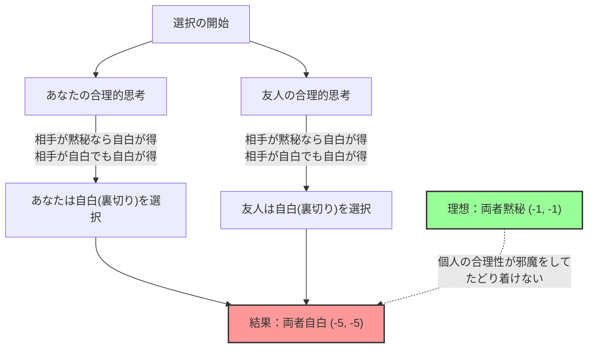

## 1. 究極の選択：黙秘するか、裏切るか？

あなたは、ある犯罪の容疑で共犯者の友人とともに警察に捕まってしまいました。
二人は別々の取調室に入れられ、お互いに連絡を取ることは一切できません。

警察は証拠を完全には固め切れていないため、検察官はあなたと友人にそれぞれ次のような「司法取引」を持ちかけました。

1. **両方が「黙秘（協力）」した場合：** 証拠不十分で、二人とも **懲役1年** で済む。
2. **あなたが「自白（裏切り）」して、友人が「黙秘」した場合：** 捜査に協力したあなたは **無罪（即時釈放）** となるが、友人はすべての罪を被り **懲役10年** になる。（逆も同様）
3. **両方が「自白（裏切り）」した場合：** 二人とも罪を認めたため、少しだけ減刑されて二人とも **懲役5年** になる。

さあ、あなたならどうしますか？「黙秘（相手と協力）」しますか？それとも「自白（相手を裏切る）」しますか？

---

## 2. 利得表（ペイオフ・マトリックス）による分析

この状況を、ゲーム理論で使われる「利得表」に整理してみましょう。
マスの中の数字は、（あなたの懲役年数, 友人の懲役年数）を表しています。マイナスは損失（懲役年数）を意味します。

| あなた \ 友人 | 黙秘する（協調） | 自白する（裏切り） |
| :--- | :---: | :---: |
| **黙秘する（協調）** | (-1, -1) | (-10, 0) |
| **自白する（裏切り）** | (0, -10) | (-5, -5) |

客観的に見れば、二人が取るべき最適な行動は明らかです。
**二人とも「黙秘」すれば、合計の刑期はたったの2年（-1と-1）で済みます。** これが全体の利益を最大化する「パレート最適」な状態です。

しかし、あなたが「自分の利益だけを最大化しようとする合理的な人間」である場合、全く別の結論が導き出されます。

---

## 3. なぜ「裏切り」が合理的な選択になるのか？

あなたが別室にいる「友人」の行動を予測して、自分の行動を決める思考プロセスを追ってみましょう。

**ケース1：友人が「黙秘」すると予測した場合**
- 自分も「黙秘」すれば、懲役1年。
- 自分が「自白」すれば、無罪（即時釈放）。
$\rightarrow$ 無罪の方が良いので、**「自白（裏切り）」**が最適。

**ケース2：友人が「自白」すると予測した場合**
- 自分も「黙秘」すれば、懲役10年。
- 自分が「自白」すれば、懲役5年。
$\rightarrow$ 懲役5年の方がマシなので、やはり**「自白（裏切り）」**が最適。

お気付きでしょうか。相手がどんな行動を取ろうとも、**あなたにとっては「自白（裏切る）」ことの方が常に有利**なのです。
これをゲーム理論では**「支配戦略」**と呼びます。

友人も全く同じ状況に置かれ、全く同じように合理的に考えるため、友人にとっても「自白」が支配戦略になります。

結果として、合理的に考えた二人は、必ずお互いに「自白（裏切り）」を選択します。
その結果、たどり着くのは **二人とも懲役5年（-5, -5）** という、全体で見れば最悪に近い結末です。二人で協力（黙秘）していれば懲役1年で済んだのに、個人の合理性を追求した結果、互いに損をしてしまうのです。

この「お互いに相手の行動を予測した結果、お互いに戦略を変える動機がない（これ以上どうしようもない）状態」を、ゲーム理論の大家ジョン・ナッシュの名をとって**「ナッシュ均衡」**と呼びます。

囚人のジレンマの最も恐ろしいポイントは、**「パレート最適（全体にとって一番良い結果）」と「ナッシュ均衡（個人の合理性の行き着く先）」が一致しない**という点にあります。

---

## 4. 日常社会に潜む「囚人のジレンマ」

囚人のジレンマは、単なるクイズではありません。私たちの社会で起きている多くの問題が、この数学モデルで説明できます。

### 1. 価格競争（値下げ合戦）
2つのライバル企業が、同じような商品を1000円で売っています。
両社が1000円をキープ（協調）すれば、両社とも高い利益を得られます。
しかし、「相手より少しだけ安くして（裏切り）、客を独占しよう」という誘惑に負け、両社が値下げ合戦を始めます。結果として、商品は500円になり、両社とも利益が出ず苦しむ（両者裏切り）ことになります。

### 2. 環境問題と温室効果ガス
世界中の国が「CO2排出を削減しよう（協調）」と約束します。これが地球全体にとっての最適解です。
しかし、自国だけが「排出制限を無視して工場を稼働させる（裏切り）」ことで、自国の経済だけを急成長させることができます。逆に、他国が裏切ったのに自国だけがルールを守ると、自国だけが経済的に大損をします。
結果として、どの国も抜け駆けを恐れて裏切りを選択し、地球環境が破壊されていきます。

### 3. スポーツのドーピング問題
選手全員がドーピングをしない（協調）のが理想です。
しかし、「相手がドーピングしているかもしれない」という疑心暗鬼や、「自分だけドーピングすれば勝てる」という誘惑から、ドーピング（裏切り）を選択してしまいます。結果として、全員が健康を害しながら薬物漬けで戦うという最悪の状況に陥ります。

---

## 5. 解決策はあるのか？「しっぺ返し戦略」

一回の取引では「裏切り」が常に合理的な選択になってしまいます。
しかし、これが「同じ相手と何度も繰り返されるゲーム（繰り返し囚人のジレンマ）」になると、状況は劇的に変わります。

1980年代、政治学者のロバート・アクセルロッドは、様々な戦略をプログラムしたコンピューター同士を対戦させるトーナメントを行いました。
「常に裏切る」「ランダムに裏切る」「相手を許す」など、世界中の学者から集められた複雑な戦略の中で、圧倒的な成績で優勝したのは、最もシンプルな**「しっぺ返し戦略（Tit for Tat）」**でした。

しっぺ返し戦略のルールはたったこれだけです。

1. **最初は必ず「協調」する。**
2. **次からは、前回「相手が取った行動」をそのまま真似する。**
   - 相手が前回協調してくれたら、今回は協調する。
   - 相手が前回裏切ってきたら、今回は裏切って報復する。

この戦略が強い理由は、「自分からは絶対に裏切らない（善良さ）」「裏切られたら即座に罰を与える（厳しさ）」「相手が態度を改めたらすぐに許す（寛容さ）」「構造がシンプルで相手に伝わりやすい（明瞭さ）」という4つの特徴を備えているからです。

人間関係や国際社会においても、長期的な関係が前提となっていれば、「しっぺ返し戦略」のように**「基本は協力するが、裏切りにはペナルティを与える」**というルールを共有することで、囚人のジレンマを乗り越え、協力関係を築くことができるのです。

## 6. まとめ：数学が教える「信頼」の価値

囚人のジレンマは、「人間の利己的な合理性」が、時として社会全体を不幸のどん底に叩き落とすことを数学的に証明しました。
「自分だけが得をしたい」あるいは「出し抜かれたくない」という個人の合理性は、最終的に自分自身の首を絞める結果（ナッシュ均衡）を招きます。

しかし同時に、「関係性が長期的に続く」という条件さえあれば、**「お互いに信頼して協力すること」が、結果的に自分自身の利益をも最大化する最も合理的な戦略である**ことも、ゲーム理論は教えてくれています。

あなたが次に「自分だけ少しズルをしようか」と迷ったとき、この囚人のジレンマの利得表を思い出してみてください。目先の利益を追う「合理的な裏切り」は、長期的には最も非合理な選択かもしれないのですから。
