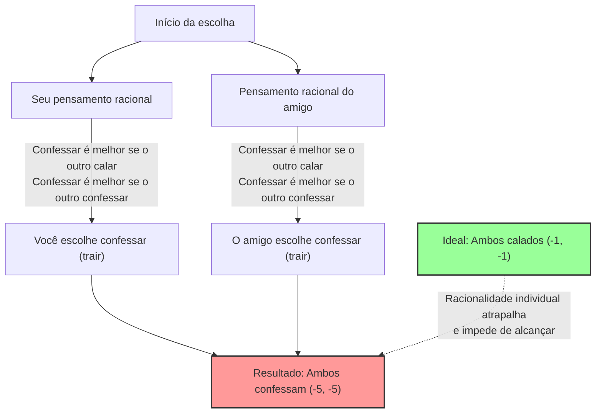
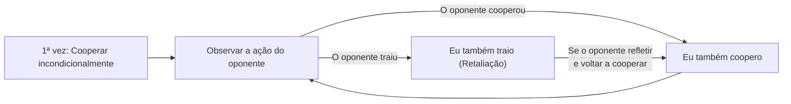

## 1. A Escolha Suprema: Ficar calado ou trair?

Você e seu amigo, suspeitos de cumplicidade em um crime, foram presos pela polícia.
Os dois são colocados em salas de interrogatório separadas, sem qualquer possibilidade de comunicação entre si.

Como a polícia não possui evidências contundentes, o promotor oferece a você e ao seu amigo o seguinte "acordo judicial":

1. **Se ambos "ficarem calados (cooperarem)":** Por falta de provas, ambos cumprem apenas **1 ano de prisão**.
2. **Se você "confessar (trair)" e o seu amigo "ficar calado":** Você, que colaborou com as investigações, será **inocentado (libertação imediata)**, mas seu amigo levará toda a culpa e cumprirá **10 anos de prisão**. (O inverso também é verdadeiro)
3. **Se ambos "confessarem (traírem)":** Como ambos admitiram a culpa, a pena será um pouco reduzida e os dois cumprirão **5 anos de prisão**.

E então, o que você faria? "Ficaria calado (cooperaria com o parceiro)" ou "Confessaria (trairia o parceiro)"?

---

## 2. Análise pela Matriz de Recompensas (Payoff Matrix)

Vamos organizar essa situação na "matriz de recompensas", muito utilizada na Teoria dos Jogos.
Os números dentro das células representam (Seus anos de prisão, Anos de prisão do seu amigo). O sinal de menos significa perda (anos de prisão).

| Você \ Amigo | Ficar calado (Cooperar) | Confessar (Trair) |
| :--- | :---: | :---: |
| **Ficar calado (Cooperar)** | (-1, -1) | (-10, 0) |
| **Confessar (Trair)** | (0, -10) | (-5, -5) |

Do ponto de vista objetivo, a melhor ação que ambos deveriam tomar é óbvia.
**Se os dois "ficarem calados", a pena total será de apenas 2 anos (-1 e -1).** Esse é o estado de "Ótimo de Pareto", que maximiza o benefício geral.

No entanto, se você for "um ser humano racional que tenta maximizar apenas o próprio benefício", uma conclusão completamente diferente será alcançada.

---

## 3. Por que a "traição" se torna uma escolha racional?

Vamos acompanhar o processo de pensamento para decidir a sua ação, prevendo o que o seu "amigo" na outra sala faria.

**Caso 1: Se você prever que o seu amigo vai "ficar calado"**
- Se você também "ficar calado", pena de 1 ano.
- Se você "confessar", inocentado (libertação imediata).
$\rightarrow$ Como a inocência é melhor, **"Confessar (Trair)"** é o ideal.

**Caso 2: Se você prever que o seu amigo vai "confessar"**
- Se você "ficar calado", pena de 10 anos.
- Se você "confessar", pena de 5 anos.
$\rightarrow$ Como 5 anos é menos ruim, novamente **"Confessar (Trair)"** é o ideal.

Você percebeu? Não importa qual ação a outra pessoa tome, **para você, "Confessar (Trair)" será sempre mais vantajoso**.
Na Teoria dos Jogos, isso é chamado de **"Estratégia Dominante"**.

Seu amigo está exatamente na mesma situação e pensará de forma igualmente racional; logo, para ele também, a "confissão" é a estratégia dominante.

Como resultado, duas pessoas pensando racionalmente escolherão invariavelmente "Confessar (Trair)" um ao outro.
O que se alcança é o desfecho quase pior possível para o todo: **ambos cumprem 5 anos de prisão (-5, -5)**. Embora pudessem cumprir apenas 1 ano se cooperassem (ficassem calados), ao buscar a racionalidade individual, ambos saem perdendo.

A esse estado em que "ninguém tem incentivo para mudar de estratégia após prever a ação do outro (não há mais o que fazer)", dá-se o nome de **"Equilíbrio de Nash"**, em homenagem ao grande mestre da Teoria dos Jogos, John Nash.

O ponto mais assustador do Dilema do Prisioneiro é que **o "Ótimo de Pareto (o melhor resultado para todos)" e o "Equilíbrio de Nash (o fim da linha da racionalidade individual)" não coincidem**.

---

## 4. O "Dilema do Prisioneiro" oculto na sociedade

O Dilema do Prisioneiro não é apenas um simples quebra-cabeça. Muitos dos problemas que ocorrem em nossa sociedade podem ser explicados por esse modelo matemático.

### 1. Guerra de Preços (Competição por Redução de Preço)
Duas empresas rivais vendem um produto similar por R$1000.
Se ambas mantiverem (cooperarem) os R$1000, ambas obterão altos lucros.
No entanto, cedendo à tentação de "ser um pouco mais barato que o concorrente (trair) para monopolizar os clientes", as duas começam uma guerra de preços. Como resultado, o produto passa a custar R$500 e ambas acabam sofrendo sem obter lucros (ambas traem).

### 2. Problemas Ambientais e Gases de Efeito Estufa
Países ao redor do mundo concordam em "reduzir as emissões de CO2 (cooperar)". Essa é a melhor solução para todo o planeta.
No entanto, se apenas o seu próprio país "ignorar o limite de emissões e operar as fábricas (trair)", poderá fazer com que apenas a sua economia cresça rapidamente. Por outro lado, se outros países traírem e apenas o seu seguir as regras, apenas o seu país sofrerá grandes perdas econômicas.
Como resultado, todos os países, com medo de serem passados para trás, escolhem a traição, e o meio ambiente da Terra é destruído.

### 3. O Problema do Doping nos Esportes
O ideal é que nenhum atleta use doping (cooperar).
No entanto, devido à suspeita de que "o oponente pode estar usando doping" e à tentação de que "se só eu usar doping, poderei vencer", acaba-se escolhendo o doping (trair). Como resultado, cai-se na pior situação possível, onde todos competem dependentes de substâncias químicas enquanto prejudicam a saúde.

---

## 5. Existe uma solução? A "Estratégia Olho por Olho (Tit for Tat)"

Em uma única transação, a "traição" sempre será a escolha racional.
No entanto, quando isso se torna "um jogo repetido várias vezes com a mesma pessoa (Dilema do Prisioneiro Iterado)", a situação muda drasticamente.

Na década de 1980, o cientista político Robert Axelrod realizou um torneio colocando computadores com várias estratégias programadas para competir entre si.
Em meio a estratégias complexas enviadas por acadêmicos de todo o mundo, como "sempre trair", "trair aleatoriamente", "perdoar o oponente", quem venceu com resultados esmagadores foi a mais simples: a **"Estratégia Olho por Olho (Tit for Tat)"**.

As regras da estratégia Olho por Olho são apenas estas:

1. **Na primeira vez, sempre "cooperar".**
2. **A partir da segunda vez, imitar exatamente "a ação que o oponente tomou" na rodada anterior.**
   - Se o oponente cooperou na vez anterior, coopera-se desta vez.
   - Se o oponente traiu na vez anterior, trai-se desta vez em retaliação.

A razão pela qual essa estratégia é forte se deve a quatro características: "nunca trair primeiro (bondade)", "punir imediatamente se for traído (rigor)", "perdoar rapidamente se o oponente mudar de atitude (tolerância)" e "ter uma estrutura simples e fácil de ser compreendida pelo oponente (clareza)".

Mesmo nas relações humanas e na comunidade internacional, se uma relação de longo prazo for a premissa, é possível superar o Dilema do Prisioneiro e construir relações de cooperação ao compartilhar regras como as da estratégia "Olho por Olho", de **"basicamente cooperar, mas penalizar a traição"**.

## 6. Conclusão: O valor da "confiança" ensinado pela matemática

O Dilema do Prisioneiro provou matematicamente que a "racionalidade egoísta humana" às vezes pode jogar toda a sociedade no abismo da infelicidade.
A racionalidade individual de "querer ser o único a levar vantagem" ou "não querer ser passado para trás" acaba resultando em um tiro no próprio pé (Equilíbrio de Nash).

Mas, ao mesmo tempo, a Teoria dos Jogos nos ensina que, desde que exista a condição de que "a relação perdure a longo prazo", **"confiar e cooperar um com o outro" é, no fim das contas, a estratégia mais racional para maximizar os próprios benefícios**.

Na próxima vez que você hesitar pensando "será que eu dou um jeitinho só para me dar bem?", lembre-se da matriz de recompensas do Dilema do Prisioneiro. Buscar o lucro imediato através de uma "traição racional" pode ser a escolha mais irracional a longo prazo.
