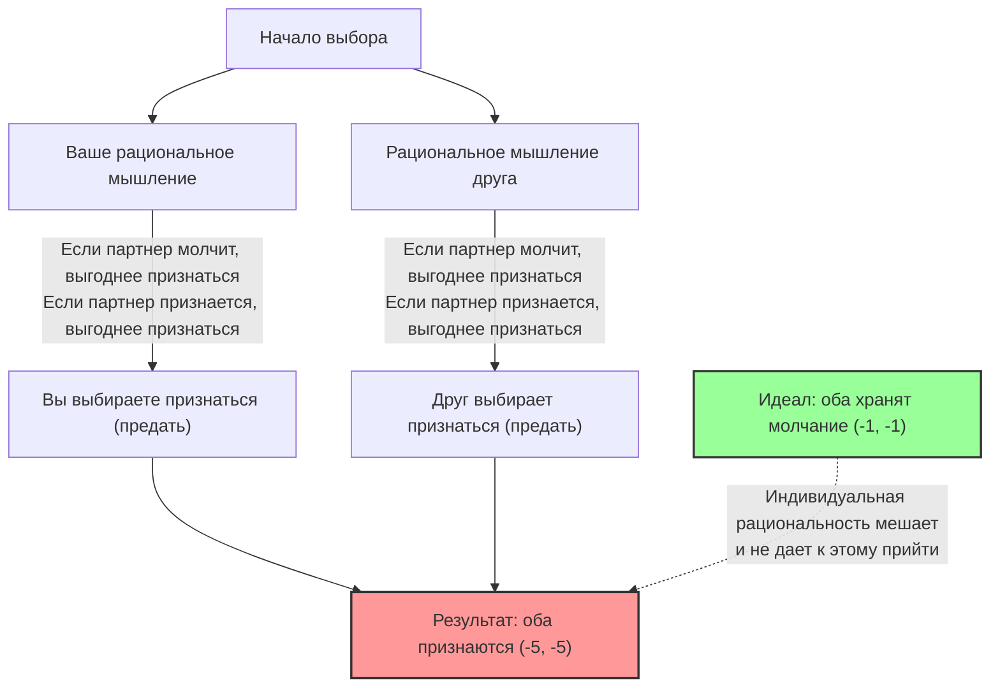
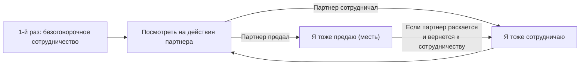

## 1. Главный выбор: хранить молчание или предать?

Вы и ваш друг-сообщник арестованы полицией по подозрению в совершении преступления.
Вас поместили в разные комнаты для допроса, и вы никак не можете связаться друг с другом.

Поскольку у полиции недостаточно улик для вынесения приговора, прокурор предлагает каждому из вас следующую "сделку со следствием":

1. **Если оба "хранят молчание" (сотрудничают друг с другом):** Из-за недостатка улик оба получают всего по **1 году тюрьмы**.
2. **Если вы "признаетесь" (предаете), а друг "хранит молчание":** Вы, как согласившийся сотрудничать со следствием, **освобождаетесь от наказания (выходите на свободу)**, а ваш друг берет всю вину на себя и получает **10 лет тюрьмы**. (И наоборот)
3. **Если оба "признаются" (предают):** Поскольку оба признали вину, срок немного сокращается, и оба получают по **5 лет тюрьмы**.

Итак, что вы сделаете? "Сохраните молчание" (будете сотрудничать с напарником)? Или "признаетесь" (предадите напарника)?

---

## 2. Анализ с помощью платежной матрицы (матрицы выигрышей)

Давайте представим эту ситуацию с помощью "платежной матрицы", которая используется в теории игр.
Числа в клетках представляют (ваши годы тюрьмы, годы тюрьмы друга). Минус означает потери (годы тюремного заключения).

| Вы \ Друг | Хранить молчание (сотрудничество) | Признаться (предательство) |
| :--- | :---: | :---: |
| **Хранить молчание (сотрудничество)** | (-1, -1) | (-10, 0) |
| **Признаться (предательство)** | (0, -10) | (-5, -5) |

Объективно говоря, оптимальные действия для обоих очевидны.
**Если оба будут "хранить молчание", общий тюремный срок составит всего 2 года (-1 и -1).** Это "Парето-оптимальное" состояние, которое максимизирует общую выгоду.

Однако если вы являетесь "рациональным человеком, стремящимся максимизировать только собственную выгоду", напрашивается совершенно иной вывод.

---

## 3. Почему "предательство" становится рациональным выбором?

Давайте проследим процесс мышления, в котором вы предсказываете поведение "друга", находящегося в другой комнате, и решаете, как действовать самому.

**Сценарий 1: Вы предполагаете, что друг "хранит молчание"**
- Если вы тоже "храните молчание", то получаете 1 год тюрьмы.
- Если вы "признаетесь", вас оправдают (немедленно освободят).
$\rightarrow$ Оправдание лучше, поэтому оптимальный выбор — **"признаться (предательство)"**.

**Сценарий 2: Вы предполагаете, что друг "признается"**
- Если вы "храните молчание", то получаете 10 лет тюрьмы.
- Если вы тоже "признаетесь", то получаете 5 лет тюрьмы.
$\rightarrow$ 5 лет тюрьмы лучше, поэтому оптимальный выбор по-прежнему — **"признаться (предательство)"**.

Заметили? Независимо от того, как поступит другой человек, **вам всегда выгоднее "признаться (предать)"**.
В теории игр это называется **"доминирующей стратегией"**.

Друг находится в точно такой же ситуации и думает так же рационально, поэтому "признание" является доминирующей стратегией и для него.

В результате оба рационально мыслящих человека обязательно выберут "признаться (предательство)".
В итоге они придут к **5 годам тюрьмы для обоих (-5, -5)**, что является почти худшим исходом для них вместе. Если бы они сотрудничали (хранили молчание), то получили бы по 1 году, но, преследуя индивидуальную рациональность, оба остаются в проигрыше.

Это "состояние, в котором в результате предсказания действий друг друга ни у кого нет мотива менять свою стратегию (потому что лучше сделать невозможно)", называется **"равновесием Нэша"** в честь мастера теории игр Джона Нэша.

Самый пугающий момент в дилемме заключенного заключается в том, что **"Парето-оптимальность (лучший результат для всех)" и "равновесие Нэша (конечный пункт индивидуальной рациональности)" не совпадают**.

---

## 4. "Дилемма заключенного", скрытая в повседневном обществе

Дилемма заключенного — это не просто головоломка. Многие проблемы, возникающие в нашем обществе, можно объяснить с помощью этой математической модели.

### 1. Ценовая конкуренция (ценовые войны)
Две конкурирующие компании продают похожие товары за 1000 иен.
Если обе компании будут удерживать цену 1000 иен (сотрудничество), обе получат высокую прибыль.
Однако, поддавшись искушению "сделать цену чуть ниже конкурента (предательство) и монополизировать клиентов", обе компании начинают ценовую войну. В результате товар стоит 500 иен, и обе компании страдают от отсутствия прибыли (обе предают).

### 2. Экологические проблемы и парниковые газы
Страны мира договариваются "сократить выбросы CO2 (сотрудничество)". Это оптимальное решение для всей планеты.
Однако, если только одна страна "проигнорирует ограничения на выбросы и запустит фабрики (предательство)", она сможет обеспечить стремительный рост только своей экономики. И наоборот, если другие страны предадут, а ваша страна будет соблюдать правила, она понесет огромные экономические убытки.
В результате каждая страна, боясь быть обманутой, выбирает предательство, и глобальная окружающая среда разрушается.

### 3. Проблема допинга в спорте
В идеале все спортсмены не используют допинг (сотрудничество).
Однако из-за паранойи "возможно, другие используют допинг" или соблазна "если только я приму допинг, я выиграю", спортсмены выбирают допинг (предательство). В результате все попадают в наихудшую ситуацию, соревнуясь накачанными препаратами в ущерб своему здоровью.

---

## 5. Есть ли решение? Стратегия "око за око"

В одноразовой сделке "предательство" всегда является рациональным выбором.
Но если это становится "игрой, которая повторяется много раз с одним и тем же партнером (повторяющаяся дилемма заключенного)", ситуация кардинально меняется.

В 1980-х годах политолог Роберт Аксельрод провел турнир, в котором компьютеры, запрограммированные на разные стратегии, играли друг против друга.
Среди сложных стратегий, собранных от ученых со всего мира, таких как "всегда предавать", "предавать случайным образом", "прощать партнера", с подавляющим преимуществом победила самая простая **стратегия "око за око" (Tit for Tat)**.

Правила стратегии "око за око" очень просты:

1. **В первый раз всегда выбирай "сотрудничество".**
2. **В следующий раз просто копируй то, что партнер "сделал в предыдущий раз".**
   - Если в прошлый раз партнер сотрудничал, то в этот раз сотрудничайте.
   - Если в прошлый раз партнер предал, то в этот раз предайте в качестве мести.

Причина, по которой эта стратегия сильна, заключается в том, что она имеет четыре характеристики: "я никогда не предам первым (доброта)", "если меня предадут, я немедленно накажу (строгость)", "если партнер изменит свое отношение, я быстро прощу (снисходительность)" и "структура проста и легко понимается партнером (ясность)".

В человеческих отношениях и в международном сообществе, если предполагаются долгосрочные отношения, совместное использование правила, подобного стратегии "око за око": **"в основном мы сотрудничаем, но за предательство будет штраф"**, — позволяет преодолеть дилемму заключенного и построить отношения сотрудничества.

## 6. Заключение: Ценность "доверия", которой учит математика

Дилемма заключенного математически доказала, что "эгоистичная рациональность человека" иногда ввергает все общество в пучину несчастья.
Индивидуальная рациональность "я хочу получить выгоду только для себя" или "я не хочу, чтобы меня обманули" в конечном итоге приводит к результату, который душит вас самих (равновесие Нэша).

В то же время теория игр учит нас, что до тех пор, пока выполняется условие "отношения будут продолжаться в долгосрочной перспективе", **"доверять друг другу и сотрудничать" — это самая рациональная стратегия, которая в конечном итоге максимизирует вашу собственную выгоду**.

В следующий раз, когда вы будете колебаться, думая "а не схитрить ли мне немного ради себя", вспомните платежную матрицу этой дилеммы заключенного. Потому что "рациональное предательство" в погоне за краткосрочной выгодой может оказаться самым иррациональным выбором в долгосрочной перспективе.
