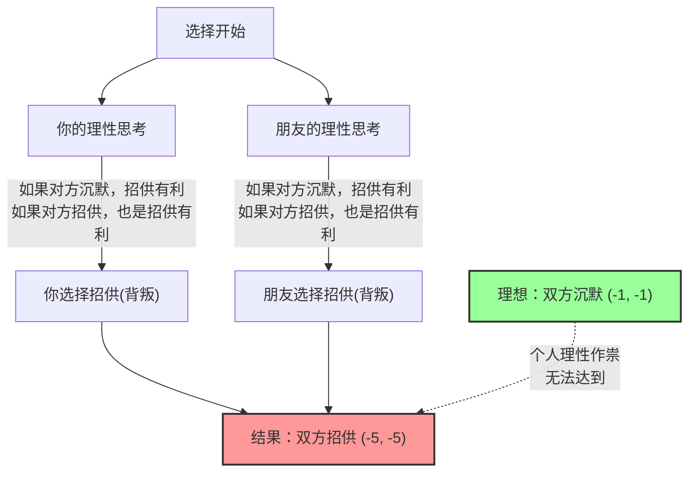
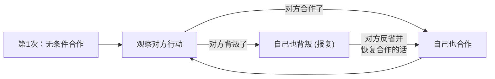

## 1. 终极选择：保持沉默，还是背叛？

你和共犯朋友因为涉嫌某项犯罪被警察抓获。
两人被分别关在不同的审讯室里，彼此之间完全无法联系。

由于警方没有掌握充分的证据，检察官分别向你和朋友提出了如下的“认罪协商”：

1. **如果双方都“保持沉默（合作）”：** 因证据不足，两人都只需判 **1年监禁**。
2. **如果你“招供（背叛）”，而朋友“保持沉默”：** 配合调查的你将 **无罪（立即释放）**，而朋友将承担所有罪名被判 **10年监禁**。（反之亦然）
3. **如果双方都“招供（背叛）”：** 因为两人都认罪了，稍微减轻刑罚，两人都被判 **5年监禁**。

那么，你会怎么做？是选择“保持沉默（与对方合作）”？还是选择“招供（背叛对方）”？

---

## 2. 收益矩阵分析

让我们把这种情况整理成博弈论中使用的“收益矩阵”。
表格中的数字代表了（你的监禁年数, 朋友的监禁年数）。负数表示损失（监禁年数）。

| 你 \ 朋友 | 保持沉默（合作） | 招供（背叛） |
| :--- | :---: | :---: |
| **保持沉默（合作）** | (-1, -1) | (-10, 0) |
| **招供（背叛）** | (0, -10) | (-5, -5) |

客观来看，两人应该采取的最佳行动显而易见。
**如果两人都“保持沉默”，总刑期只有2年（-1和-1）。** 这是使整体利益最大化的“帕累托最优”状态。

然而，如果你是一个“试图使自身利益最大化的理性人”，得出的结论将截然不同。

---

## 3. 为什么“背叛”会成为理性的选择？

让我们试着预测身处另一房间的“朋友”的行动，来追踪你决定自己行动的思考过程。

**情况1：预测朋友会“保持沉默”时**
- 如果自己也“保持沉默”，判刑1年。
- 如果自己“招供”，无罪（立即释放）。
$\rightarrow$ 因为无罪更好，所以**“招供（背叛）”**是最佳选择。

**情况2：预测朋友会“招供”时**
- 如果自己“保持沉默”，判刑10年。
- 如果自己“招供”，判刑5年。
$\rightarrow$ 因为判5年更好受些，所以依然是**“招供（背叛）”**为最佳选择。

你发现了吗？无论对方采取什么行动，**对你来说“招供（背叛）”总是更有利的**。
这在博弈论中被称为**“占优策略”**。

你的朋友也处于完全相同的境地，也会进行同样理性的思考，因此对朋友来说“招供”也是占优策略。

结果就是，经过理性思考的两人，必然都会选择互相“招供（背叛）”。
导致的结果是，最终两人 **都被判5年监禁（-5, -5）**，从整体来看这是一个接近最糟糕的结局。如果两人合作（保持沉默）本来只需判刑1年，但追求个人理性的结果却是两败俱伤。

这种“在互相预测了对方的行动后，双方都没有动机改变自己策略（无可奈何）的状态”，以博弈论大师约翰·纳什的名字命名，被称为**“纳什均衡”**。

囚徒困境最可怕的一点在于，**“帕累托最优（对整体最好的结果）”和“纳什均衡（个人理性的最终归宿）”并不一致**。

---

## 4. 潜藏在日常社会中的“囚徒困境”

囚徒困境不仅仅是一个智力测验。我们社会中发生的许多问题都可以用这个数学模型来解释。

### 1. 价格战（降价竞争）
两家竞争对手企业以1000元的价格销售类似的产品。
如果双方都保持1000元（合作），两家都能获得高额利润。
然而，抵挡不住“比对方稍微便宜一点（背叛）来垄断客户”的诱惑，两家公司开始了价格战。结果产品变成了500元，两家公司都无利可图，陷入困境（双方背叛）。

### 2. 环境问题与温室气体
世界各国承诺“减少二氧化碳排放（合作）”。这是对整个地球的最优解。
但是，如果只有本国“无视排放限制继续运营工厂（背叛）”，就能让本国经济快速增长。反之，如果其他国家背叛了而只有本国遵守规则，本国在经济上就会遭受巨大损失。
结果，每个国家都因为害怕吃亏而选择背叛，地球环境不断遭到破坏。

### 3. 体育界的兴奋剂问题
理想情况是所有运动员都不使用兴奋剂（合作）。
但是，出于“对手可能在使用兴奋剂”的疑神疑鬼，以及“只要自己用了就能赢”的诱惑，最终选择了使用兴奋剂（背叛）。结果陷入了所有人都在损害健康、依靠药物比赛的最糟糕局面。

---

## 5. 有解决办法吗？“一报还一报策略”

在单次交易中，“背叛”总是理性的选择。
然而，如果变成了“与同一对手多次重复的博弈（重复囚徒困境）”，情况就会发生戏剧性的变化。

20世纪80年代，政治学家罗伯特·阿克塞尔罗德举办了一场计算机锦标赛，让编有各种策略的程序进行对战。
在世界各地学者提交的“总是背叛”、“随机背叛”、“宽恕对方”等复杂策略中，以压倒性成绩获得冠军的，是最简单的**“一报还一报策略（Tit for Tat）”**。

一报还一报策略的规则仅此而已：

1. **第一次必须“合作”。**
2. **从第二次起，直接模仿上一次“对方采取的行动”。**
   - 如果对方上一次合作了，这次我也合作。
   - 如果对方上一次背叛了，这次我也背叛并进行报复。

这个策略之所以强大，是因为它具备了4个特点：“绝对不主动背叛（善良）”、“遭到背叛立即惩罚（严厉）”、“对方改过自新立刻原谅（宽容）”、“结构简单容易让对方理解（明了）”。

在人际关系和国际社会中也是如此，只要以长期关系为前提，通过共享像“一报还一报策略”那样**“基本以合作为主，但对背叛给予惩罚”**的规则，就能克服囚徒困境，建立起合作关系。

## 6. 总结：数学告诉我们“信任”的价值

囚徒困境用数学证明了，“人类利己的理性”有时会将整个社会推入不幸的深渊。
“只想自己占便宜”或者“不想被别人算计”的个人理性，最终会导致作茧自缚的结果（纳什均衡）。

但同时，博弈论也告诉我们，只要具备“关系长期持续”这一条件，**“互相信任与合作”才是最终能使自身利益最大化的最合理的策略**。

当你下次犹豫“要不要就自己稍微耍点小聪明”时，不妨回想一下这个囚徒困境的收益矩阵。因为追求眼前利益的“理性背叛”，从长远来看也许是最不理性的选择。
