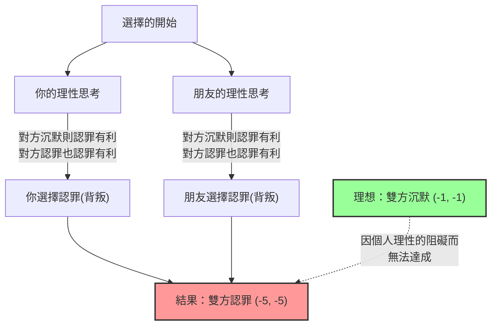
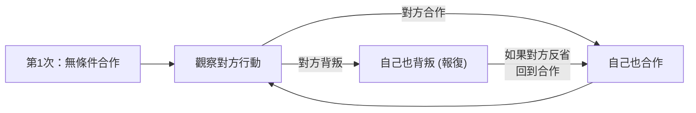

## 1. 終極抉擇：保持沉默，還是背叛？

你和共犯朋友因為涉嫌某起犯罪，一起被警察逮捕了。
你們兩人被關在不同的審訊室，彼此完全無法取得聯繫。

因為警方還沒有掌握充分的證據，所以檢察官分別向你和朋友提出了以下的「認罪協商」：

1. **如果兩人都「保持沉默（合作）」：** 因證據不足，兩人都只需服刑 **1年**。
2. **如果你「認罪（背叛）」，而朋友「保持沉默」：** 配合調查的你將獲得 **無罪（立即釋放）**，但朋友必須承擔所有罪行，服刑 **10年**。（反之亦然）
3. **如果兩人都「認罪（背叛）」：** 因為兩人都承認了罪行，稍微減刑後兩人都服刑 **5年**。

那麼，你會怎麼做？「保持沉默（與對方合作）」嗎？還是「認罪（背叛對方）」？

---

## 2. 透過收益表（Payoff Matrix）進行分析

讓我們把這個情況，整理成賽局理論中使用的「收益表」。
格子裡的數字代表（你的服刑年數, 朋友的服刑年數）。負數代表損失（服刑年數）。

| 你 \ 朋友 | 保持沉默（合作） | 認罪（背叛） |
| :--- | :---: | :---: |
| **保持沉默（合作）** | (-1, -1) | (-10, 0) |
| **認罪（背叛）** | (0, -10) | (-5, -5) |

客觀來看，兩人應該採取的最佳行動顯而易見。
**如果兩人都「保持沉默」，總服刑期就只要短短的2年（-1與-1）。** 這就是讓整體利益最大化的「柏拉圖最適（Pareto optimal）」狀態。

然而，如果假設你是一個「只圖追求自身利益最大化的理性人類」，就會得出截然不同的結論。

---

## 3. 為什麼「背叛」會成為理性的選擇？

讓我們追溯一下，當你預測在另一間房間的「朋友」的行動時，決定自己行動的思考過程。

**情況1：預測朋友會「保持沉默」時**
- 如果自己也「保持沉默」，服刑1年。
- 如果自己「認罪」，無罪（立即釋放）。
$\rightarrow$ 無罪比較好，所以**「認罪（背叛）」**是最佳選擇。

**情況2：預測朋友會「認罪」時**
- 如果自己「保持沉默」，服刑10年。
- 如果自己「認罪」，服刑5年。
$\rightarrow$ 服刑5年比較不糟，所以還是**「認罪（背叛）」**是最佳選擇。

你發現了嗎？不管對方採取什麼行動，**對你來說「認罪（背叛）」永遠都是更有利的**。
這在賽局理論中被稱為**「優勢策略（Dominant strategy）」**。

朋友也處於完全相同的狀況，並同樣理性地思考，因此對朋友來說「認罪」也是優勢策略。

結果就是，理性思考的兩人，必然都會選擇互相「認罪（背叛）」。
結果，他們達到的結局是 **兩人都服刑5年（-5, -5）**，從整體來看，這是接近最壞的結局。明明兩人合作（保持沉默）就只要服刑1年，但追求個人理性的結果，卻導致了雙輸的局面。

這種「互相預測對方行動後，雙方都沒有動機改變策略（無法再做任何改變）的狀態」，以賽局理論大師約翰·納許（John Nash）的名字命名，稱為**「納許均衡（Nash equilibrium）」**。

囚徒困境最可怕的一點在於，**「柏拉圖最適（對全體最好的結果）」與「納許均衡（個人理性的最終歸宿）」並不一致**。

---

## 4. 潛伏在日常社會中的「囚徒困境」

囚徒困境不僅僅是一個謎題。我們社會中發生的許多問題，都可以用這個數學模型來解釋。

### 1. 價格競爭（削價戰）
兩家競爭企業以1000元的價格銷售類似商品。
如果雙方都維持1000元（合作），雙方都能獲得高利潤。
然而，敵不過「只要比對方賣得稍微便宜一點（背叛），就能獨佔客源」的誘惑，雙方開始了削價戰。結果商品價格跌至500元，雙方都無利可圖而陷入困境（雙方背叛）。

### 2. 環境問題與溫室氣體
世界各國承諾「要減少二氧化碳排放（合作）」。這是對地球整體的最佳解答。
但是，只要自己的國家「無視排放限制讓工廠運作（背叛）」，就能讓自己的經濟單獨快速成長。反之，如果其他國家背叛，而只有自己國家遵守規則，就會在經濟上蒙受巨大損失。
結果，每個國家都因為害怕被別人搶佔先機而選擇背叛，地球環境因此遭到破壞。

### 3. 體育界的禁藥問題
理想情況是所有選手都不使用禁藥（合作）。
但是，出於「對手可能在使用禁藥」的疑神疑鬼，或是「只要自己用藥就能贏」的誘惑，選手就會選擇使用禁藥（背叛）。結果，所有人都陷入了犧牲健康、依賴藥物競賽的最壞狀況。

---

## 5. 有解決方案嗎？「以牙還牙策略」

在單次交易中，「背叛」永遠是理性的選擇。
但是，如果這變成「和同一個對手反覆進行的遊戲（重複的囚徒困境）」，情況就會有戲劇性的改變。

1980年代，政治學家羅伯特·阿克塞爾羅德（Robert Axelrod）舉辦了一場讓程式化各種策略的電腦互相對戰的錦標賽。
在來自世界各地學者的複雜策略中，例如「永遠背叛」、「隨機背叛」、「原諒對方」等，以壓倒性成績獲勝的，是最簡單的**「以牙還牙策略（Tit for Tat）」**。

以牙還牙策略的規則只有這些：

1. **第一回合必定「合作」。**
2. **從第二回合開始，完全模仿「對方上一回合的行動」。**
   - 如果對方上一回合合作，這次就合作。
   - 如果對方上一回合背叛，這次就背叛來報復。

這個策略之所以強大，是因為它具備了四個特徵：「絕對不主動背叛（善良）」、「一旦被背叛就立刻懲罰（嚴厲）」、「如果對方改變態度就立刻原諒（寬容）」、「結構簡單容易傳達給對方（明瞭）」。

在人際關係或國際社會中也是如此，只要以長期的關係為前提，透過共享如「以牙還牙策略」般**「基本合作，但對背叛給予懲罰」**的規則，就能克服囚徒困境，建立合作關係。

## 6. 總結：數學教導我們的「信任」價值

囚徒困境在數學上證明了，「人類自私的理性」有時候會將整個社會推入不幸的深淵。
「只希望自己獲利」或是「不想被別人佔便宜」的個人理性，最終會招致掐住自己脖子的結果（納許均衡）。

但同時，賽局理論也教導我們，只要具備「關係會長期持續」這個條件，**「互相信任並合作」才是最終能將自身利益最大化的最理性策略**。

下次當你在猶豫「要不要為了自己稍微作點弊」的時候，請回想一下這個囚徒困境的收益表。因為追求眼前利益的「理性背叛」，從長期來看或許正是最不理性的選擇。
