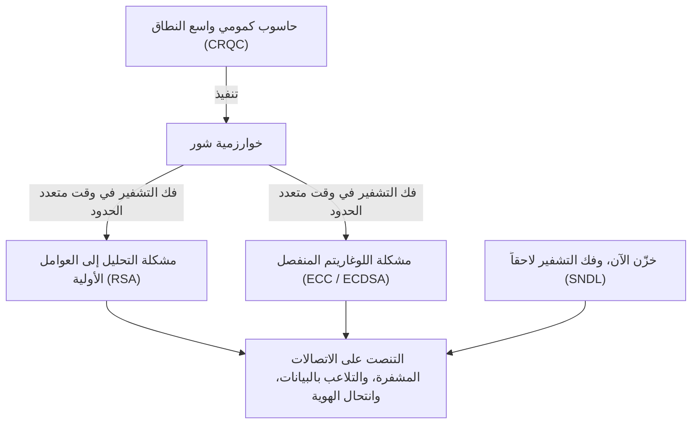
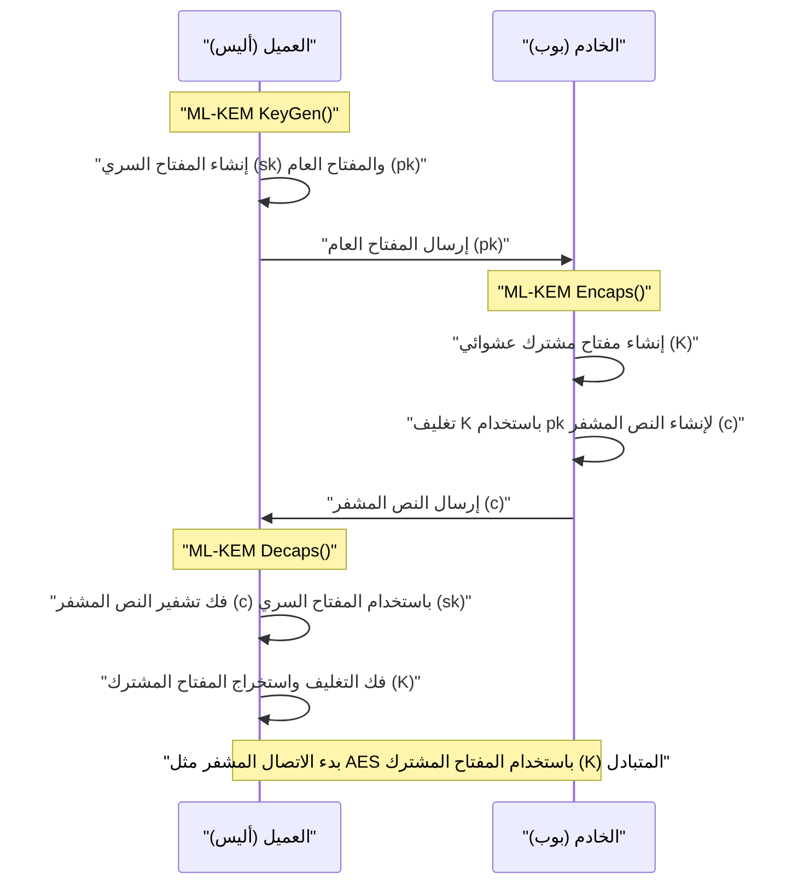
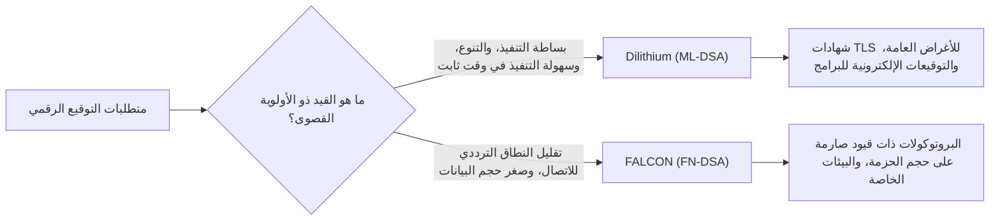

## 1. مقدمة: "أزمة التشفير" التي تجلبها الحواسيب الكمومية

في مجتمع الإنترنت الحديث، تعتبر تقنية تشفير المفتاح العام بنية تحتية لا غنى عنها لحماية سرية الاتصالات وسلامة البيانات. تعتمد خوارزميات التشفير المستخدمة على نطاق واسع حالياً، مثل تشفير RSA وتشفير المنحنى الإهليلجي (ECC)، على عوائق رياضية لضمان الأمان، وهي "صعوبة تحليل الأعداد المركبة الضخمة إلى عواملها الأولية" و"صعوبة مشكلة اللوغاريتم المنفصل على المنحنى الإهليلجي" على التوالي. بالنسبة للحواسيب الكلاسيكية (الحواسيب التي نستخدمها حالياً بما في ذلك الحواسيب الفائقة)، فقد ثبت أن حل هذه المشكلات الرياضية يتطلب وقتاً أطول من عمر الكون، وهذا هو أساس أمانها.

ومع ذلك، فإن هذا الافتراض القوي يوشك أن ينقلب رأساً على عقب بسبب التقدم في نظرية والتطبيق العملي لـ **الحواسيب الكمومية**. فـ "**خوارزمية شور (Shor's Algorithm)**"، التي نشرها عالم التشفير بيتر شور (Peter Shor) في عام 1994، أثبتت نظرياً أنه عند تنفيذها على حاسوب كمومي عام يتحمل الأخطاء ذي أداء كافٍ (CRQC: حاسوب كمومي ذو صلة بالتشفير)، يمكن فك تشفير مشاكل التحليل إلى عوامل ومشاكل اللوغاريتم المنفصل في "وقت متعدد الحدود". هذا يعني أن جميع أنظمة تشفير المفتاح العام المستخدمة حالياً ستصبح بلا جدوى.



من الخطير جداً الاعتقاد بأنه "لا توجد مشكلة لأن الانتهاء الفعلي من تطوير الحواسيب الكمومية لا يزال أمامه عقود". لأن أسلوب الهجوم المسمى **خزّن الآن، وفك التشفير لاحقاً (SNDL: Store Now, Decrypt Later)** قد أصبح بالفعل تهديداً واقعياً. هذا هجوم تقوم فيه دول معادية أو منظمات قراصنة بتخزين كميات هائلة من بيانات الاتصالات المشفرة الحالية (مثل حركة مرور TLS) في وسائط التخزين، وفك تشفيرها بالكامل بمجرد توفر حواسيب كمومية قوية في المستقبل. إن أسرار الدولة، ومعلومات البنية التحتية، والبيانات الطبية التي يجب حمايتها لفترات طويلة معرّضة بالفعل لهذا التهديد.

بالإضافة إلى ذلك، بالنسبة لتشفير المفتاح المتماثل (مثل AES) ودوال التجزئة (مثل SHA-256)، توجد **خوارزمية غروفر (Grover's Algorithm)** المكتشفة في عام 1996. تؤدي هذه الخوارزمية إلى تقليل عبء الحساب لهجوم القوة الغاشمة (Brute-force attack) إلى الجذر التربيعي. بمعنى آخر، ينخفض مستوى الأمان لـ AES-128 فعلياً إلى النصف ليصبح 2 أس 64، لذلك يوصى باستخدام مفاتيح وأطوال تجزئة أطول في العصر الكمومي، مثل AES-256 و SHA-384.

ولمواجهة أزمة التشفير غير المسبوقة هذه، ظهر ما يسمى بـ **تشفير ما بعد الكم (Post-Quantum Cryptography: PQC)**، والذي يعتمد على مشكلات رياضية جديدة يصعب فك تشفيرها حتى باستخدام الحواسيب الكمومية. ستشرح هذه المقالة بتفصيل شديد الخوارزميات الرئيسية لـ PQC، بدءاً من خلفيتها الرياضية وآلياتها وصولاً إلى مقارنة هياكلها المعمارية، وذلك بناءً على نتائج عملية توحيد معايير PQC التي قادها المعهد الوطني للمعايير والتقنية (NIST) في الولايات المتحدة.

---

## 2. الصورة الكاملة وتاريخ مشروع توحيد معايير PQC من قبل NIST

يستغرق الانتقال في تكنولوجيا التشفير من بضع سنوات إلى عدة عقود، بما في ذلك إعادة تصميم البروتوكولات، وتحديث الأنظمة، واستبدال الأجهزة وغيرها. لذلك، بدأ علماء التشفير حول العالم في البحث في PQC منذ وقت مبكر. وقد لعب المعهد الوطني للمعايير والتقنية (NIST) في الولايات المتحدة الدور المركزي في ذلك. أعلن NIST في عام 2016 عن فتح باب تقديم المقترحات لعملية توحيد معايير PQC، وتلقى مقترحات لخوارزميات تشفير جديدة تماماً من مجتمع التشفير العالمي.

استهدفت عملية التوحيد الفئتين الرئيسيتين التاليتين:
1. **تشفير المفتاح العام / آلية تغليف المفتاح (KEM: Key Encapsulation Mechanism)**: آلية لمشاركة (توزيع) مفتاح مشترك بأمان لتشفير مسار الاتصال، كما هو الحال في اتصالات TLS.
2. **التوقيعات الرقمية (Digital Signatures)**: آلية لإثبات عدم تلاعب البيانات، وعدم انتحال هوية المرسل (الموثوقية)، وذلك في تحديثات البرامج والشهادات الرقمية.

بعد حوالي 6 سنوات من التقييم والتحليل المكثف ومنافسات فك التشفير (الجولة 1 إلى الجولة 3)، أجريت تقييمات إضافية في الجولة 4 لبعض الخوارزميات. ونتيجة لذلك، في عام 2024، تم إصدار الخوارزميات التالية رسمياً كمعايير معالجة المعلومات الفيدرالية (FIPS)، وتم تأكيدها كمعايير عالمية مستقبلية.

- **FIPS 203 (ML-KEM)**: آلية تغليف مفتاح (KEM) تعتمد على CRYSTALS-Kyber
- **FIPS 204 (ML-DSA)**: توقيع رقمي يعتمد على CRYSTALS-Dilithium
- **FIPS 205 (SLH-DSA)**: توقيع مبني على التجزئة عديم الحالة يعتمد على SPHINCS+
- **(مقرر صياغته مستقبلاً) FN-DSA**: توقيع رقمي يعتمد على FALCON

تعتمد هذه الخوارزميات المختارة على "مشكلات الصعوبة" الرياضية المختلفة، مما يضمن التنوع (مرونة التشفير أو Crypto Agility) بحيث إذا تم اكتشاف ثغرة قاتلة في إحدى الخوارزميات في المستقبل، فلن ينهار النظام بأكمله. في عملية التوحيد القياسي، لعب التشفير الشبكي (Lattice-based cryptography) الدور الرئيسي من حيث الأداء، ولكن تم اعتماد التشفير المبني على التجزئة والتشفير المبني على الأكواد كبدائل قوية احتياطية.

---

## 3. تصنيف المناهج الرياضية الرئيسية لـ PQC

تُقسم خوارزميات PQC بشكل رئيسي إلى الفئات الخمس التالية بناءً على المشكلة الرياضية التي تشكل أساس أمانها. في هذه المقالة، سنتعمق بشكل خاص في الفئات الثلاث الأولى.

1. **التشفير الشبكي (Lattice-based Cryptography)**:
   يعتمد على مشكلة المتجه الأقصر (SVP) ومشكلة المتجه الأقرب (CVP) في الفضاءات الشبكية متعددة الأبعاد، ومشكلة LWE المشتقة منها. وهو محور عملية التوحيد القياسي من NIST، ويشمل Kyber و Dilithium و FALCON. يتميز بأفضل توازن بين سرعة المعالجة وحجم المفتاح العام وحجم النص المشفر، وهو مناسب للاستخدام العام.
2. **التشفير المبني على التجزئة (Hash-based Cryptography)**:
   يضع أساس أمانه حصرياً على "مقاومة الاصطدام" و"أحادية الاتجاه" لدوال التجزئة التشفيرية (مثل SHA-2 و SHAKE). قابل للتطبيق فقط على التوقيعات الرقمية (مثل SPHINCS+)، ولكن إثبات أمانه هو الأقوى، ويتميز بمقاومة عالية جداً للهجمات الرياضية غير المعروفة.
3. **التشفير المبني على الأكواد (Code-based Cryptography)**:
   يعتمد على نظرية رموز تصحيح الأخطاء، ويرتكز على صعوبة مشكلة فك تشفير المتلازمة (Syndrome Decoding Problem). يعتبر Classic McEliece، المقترح في السبعينيات، المثال الأبرز عليه، ويتمتع بتاريخ طويل جداً وسجل حافل من الأمان، ولكن في المقابل، يكون حجم المفتاح العام كبيراً جداً ويقاس بالميغابايت.
4. **تشفير متعدد الحدود متعدد المتغيرات (Multivariate Polynomial Cryptography)**:
   يعتمد على صعوبة حل أنظمة المعادلات التربيعية متعددة المتغيرات فوق الحقول المحدودة (مشكلة MQ). تم اقتراحه بشكل أساسي كتوقيعات رقمية (مثل Rainbow)، ولكن خلال الجولة النهائية لـ NIST، تم اكتشاف تقنية هجوم قوية تمكنت من فك تشفيره في غضون أيام قليلة باستخدام جهاز كمبيوتر شخصي واحد، مما أدى إلى خروج العديد من الخوارزميات من سباق التوحيد القياسي.
5. **التشفير المبني على التماثلات (Isogeny-based Cryptography)**:
   يعتمد على مشكلة البحث عن مسار على رسوم بيانية للتماثلات (Isogeny) للمنحنيات الإهليلجية. حجم المفتاح صغير جداً، وكان يُتوقع أن يكون الخليط الشرعي لـ ECC، ولكن تم فك تشفير المرشح النهائي "SIKE" تماماً في بضع ساعات فقط على كمبيوتر شخصي عادي في عام 2022 باستخدام رياضيات كلاسيكية (مثل هجوم Castryck-Decru)، مما شكل نهاية درامية ترمز إلى صعوبة وخطورة تصميم PQC.

---

## 4. أعماق التشفير الشبكي: الأساس الرياضي لمشكلة LWE ومشكلة Module-LWE

**التشفير الشبكي** هو الأكثر ترجيحاً حالياً وأصبح محور عملية التوحيد القياسي. يكمن في أساس أمانه **مشكلة LWE (Learning with Errors: مشكلة التعلم مع الأخطاء)**. اقترحها Oded Regev في عام 2005، وحصل على جائزة غودل (Gödel Prize) تقديراً لهذا الإنجاز الرائد. لا يمكن الحديث عن PQC الحديثة دون فهم مشكلة LWE.

### 4.1. ما هي مشكلة LWE (التعلم مع الأخطاء)

أولاً، دعونا ننظر في نظام بسيط من المعادلات الخطية المتزامنة. بافتراض أنه في ظل مقياس $q$ (modulo $q$)، لدينا مصفوفة عشوائية معروفة $A$، ومتجه سري مجهول $\vec{s}$، وأُعطينا حاصل ضربهما $\vec{b}$.

$$ \vec{b} = A\vec{s} \pmod q $$

في هذه الحالة، من السهل إيجاد $\vec{s}$ المجهول من المعلومات العامة $A$ و $\vec{b}$. باستخدام الخوارزمية الكلاسيكية "الحذف الغاوسي (Gaussian elimination)"، يمكن حساب $\vec{s}$ بسهولة في وقت متعدد الحدود.

ولكن، بإضافة "خطأ مقصود صغير (ضوضاء)" إلى هذه المعادلة، يرتفع مستوى صعوبة المشكلة بشكل كبير. هذه هي **مشكلة LWE**.

نقوم بتجهيز متجه سري مجهول $\vec{s} \in \mathbb{Z}_q^n$، ومصفوفة مختارة عشوائياً $A \in \mathbb{Z}_q^{m \times n}$. علاوة على ذلك، نقوم بإعداد متجه خطأ $\vec{e} \in \mathbb{Z}_q^m$ يتم اختياره وفقاً لتوزيع طبيعي أو توزيع ذي حدين حيث تكون "قيم العناصر صغيرة بما فيه الكفاية"، ونحسب $\vec{b}$ على النحو التالي.

$$ \vec{b} = A\vec{s} + \vec{e} \pmod q $$

**مشكلة البحث في LWE (Search LWE)** هي المشكلة المتمثلة في "إيجاد المعلومات السرية $\vec{s}$ من المعلومات العامة $(A, \vec{b})$". بوجود هذا الخطأ $\vec{e}$، إذا حاولنا استخدام طرق حل جبرية مثل الحذف الغاوسي، فإن الخطأ $\vec{e}$ سيتضخم ككرة الثلج أثناء عملية جمع وطرح المعادلات، ليصبح في النهاية لا يمكن تمييزه عن القيم العشوائية وتفشل العملية.

عظمة مشكلة LWE تكمن في وجود إثبات نظري قوي (اختزال أو Reduction) ينص على أنه ما لم تكن هناك خوارزمية كمومية قادرة على حل مشكلات الصعوبة في أسوأ الحالات (Worst-case hardness) على الشبكات، مثل GapSVP (مشكلة أقصر متجه القرار) و SIVP (مشكلة أقصر متجهات مستقلة)، فلا يمكن حل مشكلة LWE أيضاً في الحالات المتوسطة (Average-case). بعبارة أخرى، حتى بالنسبة لمفاتيح التشفير التي تم إنشاؤها عشوائياً، يُضمن أن يكون لها أمان قوي مدعوم بحدود نظرية عُليا.

### 4.2. الكفاءة الدراماتيكية باستخدام Ring-LWE و Module-LWE

تعتبر مشكلة LWE العادية (Standard LWE) واضحة جداً في أساس أمانها، ولكنها ليست عملية لأن حجم المصفوفة $A$ يصبح كبيراً جداً، مما يجعل حجم المفتاح في نطاق الميغابايت. لذا، تم اقتراح نهج يستخدم حلقات متعددات الحدود (Polynomial Rings) لإعطائها بنية جبرية.

في **مشكلة Ring-LWE**، نستخدم عناصر (متعددات حدود) من حلقة متعددة حدود معينة $R_q$ بدلاً من مجرد متجهات أو مصفوفات. المعيار الشائع المستخدم في معايير NIST هو حلقة متعددة الحدود السيكلوتومية التالية:

$$ R_q = \mathbb{Z}_q[X]/(X^n + 1) $$

هنا، $n$ هي قوة للعدد 2 (مثال: 256)، و $q$ هو عدد أولي مناسب. على هذه الحلقة، باستخدام العناصر $a, s, e \in R_q$، نحسب $b = a \cdot s + e \pmod q$. نظراً لأن متعددة حدود واحدة $a$ تحتوي على $n$ من المعاملات، يمكن ضغط البيانات بشكل كبير. وعلاوة على ذلك، باستخدام إصدار الحقل المحدود من تحويل فورييه السريع (FFT) المسمى **NTT (Number Theoretic Transform: تحويل نظرية الأعداد)**، يمكن ضرب متعددات الحدود بسرعة فائقة بتعقيد حسابي قدره $O(n \log n)$.

ومع ذلك، كانت هناك مخاوف بشأن Ring-LWE من أنه "قد توجد ثغرات أمنية غير معروفة ناجمة عن البنية الجبرية الخاصة للحلقة". بالإضافة إلى ذلك، عند تغيير مستوى الأمان (مثل ما يعادل AES-128 أو 192 أو 256)، كان يجب تغيير درجة متعددة الحدود $n$ نفسها، وكان هناك تحد هندسي يتمثل في ضرورة إعادة كتابة التنفيذ بأكمله، بما في ذلك خوارزمية NTT.

لذا، اعتمدت خوارزميات التوحيد القياسي Kyber و Dilithium **مشكلة Module-LWE (M-LWE)**. تُعد مشكلة Module-LWE حلاً وسطاً يقع تماماً بين مشكلة LWE القياسية غير المنظمة ومشكلة Ring-LWE ذات البنية المفرطة، وتستخدم مصفوفة $k \times k$ (وحدة) مكونة من عناصر حلقة متعددات الحدود $R_q$.

$$ \vec{b} = A\vec{s} + \vec{e} \pmod{R_q} \quad (A \in R_q^{k \times k}, \vec{s}, \vec{e} \in R_q^k) $$

أكبر ميزة لـ Module-LWE هي أنه يسمح بسهولة بتوسيع نطاق مستويات الأمان ببساطة عن طريق تغيير بُعد المصفوفة $k$، مع الحفاظ على درجة متعددة الحدود $n$ ثابتة (في معيار NIST تكون $n=256$).
على سبيل المثال، في حالة Kyber، يتم ضبط البعد $k$ كما يلي:
- **Kyber512 (المستوى 1)**: $k = 2$ (يعادل AES-128)
- **Kyber768 (المستوى 3)**: $k = 3$ (يعادل AES-192)
- **Kyber1024 (المستوى 5)**: $k = 4$ (يعادل AES-256)

وقد مكّن هذا من إعادة استخدام الكود الأساسي لـ NTT ودوائر الأجهزة الخاصة بعمليات متعددات الحدود بنسبة 100% في جميع مستويات الأمان، مما أدى إلى تحسين دراماتيكي في أمان وكفاءة التنفيذ.

---

## 5. CRYSTALS-Kyber (ML-KEM): آلية تغليف المفتاح من الجيل التالي

خوارزمية CRYSTALS-Kyber، التي تم توحيدها رسمياً كـ **FIPS 203 (ML-KEM)**، هي آلية تغليف مفتاح (KEM) تعتمد على مشكلة Module-LWE المذكورة أعلاه. وستصبح في المستقبل المعيار العالمي الفعلي لمشاركة مفاتيح الجلسة بأمان في بروتوكولات مثل TLS 1.3 و SSH.

### 5.1. بنية KEM (آلية تغليف المفتاح)

في عصر PQC، بدلاً من النهج المباشر كما في RSA حيث "يقوم العميل بإنشاء مفتاح مشترك وتشفيره بالمفتاح العام للخادم وإرساله"، سيصبح إطار عمل التغليف المعروف باسم KEM هو المعيار.



### 5.2. آلية الخوارزمية الداخلية لـ Kyber وتحويل فوجيساكي-أوكاموتو

تصميم Kyber راقٍ جداً. أولاً، يقوم ببناء نظام تشفير مفتاح عام (Kyber.CPAPKE) آمن فقط ضد هجمات CPA (هجوم النص الواضح المختار)، ثم يطبق تقنية تشفير قوية جداً تُعرف باسم **تحويل فوجيساكي-أوكاموتو (Fujisaki-Okamoto Transform)**، وبذلك يعتمد تصميماً يرقّيه إلى KEM كامل آمن حتى ضد هجمات CCA (هجوم النص المشفر المختار المتكيف).

فيما يلي آليات التشفير وفك التشفير الأساسية لـ CPAPKE:

1. **إنشاء المفتاح (Key Generation)**:
   - من قيمة بذرة عشوائية (seed)، يتم إنشاء مصفوفة $A \in R_q^{k \times k}$ في نطاق NTT. يُستخدم المقياس $q$ بقيمة $3329$.
   - يتم أخذ عينات من توزيع ذي حدين مركزي (CBD) لإنتاج متجه سري $\vec{s}$ ومتجه خطأ $\vec{e}$ بمعاملات صغيرة.
   - يتم حساب $\vec{t} = A\vec{s} + \vec{e}$. المفتاح العام هو $(A, \vec{t})$ والمفتاح السري هو $\vec{s}$. (عملياً، يتم نشر $A$ كقيمة بذرة لتوفير النطاق الترددي).

2. **التشفير (Encryption)**:
   - يتم تشفير الرسالة المكونة من 32 بايت (مواد المفتاح المشترك) $m$ المراد مشاركتها إلى متعددة حدود.
   - يتم إنشاء متجه عشوائي جديد $\vec{r}$، وأخطاء صغيرة $\vec{e_1}, e_2$.
   - يتم حساب $\vec{u} = A^T\vec{r} + \vec{e_1}$
   - يتم حساب $v = \vec{t}^T\vec{r} + e_2 + \lfloor q/2 \rceil \cdot m$
   - يكون النص المشفر هو $(\vec{u}, v)$.

3. **فك التشفير (Decryption)**:
   - يقوم المستلم بحساب $v - \vec{s}^T\vec{u}$.
   - بتوسيع هذه المعادلة جبرياً نحصل على ما يلي:
     $v - \vec{s}^T\vec{u} = (\vec{t}^T\vec{r} + e_2 + \lfloor q/2 \rceil \cdot m) - \vec{s}^T(A^T\vec{r} + \vec{e_1})$
   - بالتعويض بـ $\vec{t} = A\vec{s} + \vec{e}$، يتم إلغاء الحد الرئيسي $\vec{s}^TA^T\vec{r}$.
   - يتبقى لدينا $\lfloor q/2 \rceil \cdot m + (\vec{e}^T\vec{r} + e_2 - \vec{s}^T\vec{e_1})$.
   - نظراً لأن الحدود داخل الأقواس هي "حاصل ضرب ومجموع أخطاء صغيرة"، فإن قيمتها الإجمالية تظل قيمة صغيرة بما فيه الكفاية (ضوضاء). ولذلك، من خلال إجراء حكم عتبة بناءً على ما إذا كان كل معامل قريباً من $0$ أو قريباً من $q/2$، يمكن استعادة بتات الرسالة الأصلية $m$ (0 أو 1) بالكامل دون أي أخطاء.

أكبر نقطة قوة لـ Kyber هي **سرعة المعالجة** الفائقة و**حجم المفتاح المعتدل**. في حالة Kyber768، يبلغ حجم المفتاح العام 1,184 بايت، وحجم النص المشفر 1,088 بايت. وعلى الرغم من أنها أكبر مقارنةً بـ RSA-3072 (حجم المفتاح حوالي 384 بايت)، إلا أنه يمكن تضمينها ضمن وحدة الإرسال القصوى (MTU) لاتصالات الإنترنت الحديثة دون تجزئة الحزم، مما لا يؤثر تقريباً على زمن انتقال الشبكة.

---

## 6. CRYSTALS-Dilithium (ML-DSA): التوقيع الرقمي العام المبني على الشبكات

في عملية توحيد التوقيعات الرقمية، تنافست خوارزميات ذات فلسفات تصميمية مختلفة حتى ضمن نفس نهج التشفير الشبكي. ومن بينها، تم اختيار **CRYSTALS-Dilithium** كـ **FIPS 204 (ML-DSA)** ليكون التوقيع الرقمي للاستخدام العام.

### 6.1. نموذج فيات-شامير مع الإلغاء (Fiat-Shamir with Aborts)

Dilithium هو نظام توقيع رقمي يعتمد على Module-LWE (ومشكلة Module-SIS) مثل Kyber تماماً. ويُستخدم في أساس تصميمه نموذج مهم للغاية يُعرف باسم "**نموذج فيات-شامير مع الإلغاء (Fiat-Shamir with Aborts)**".

تحويل فيات-شامير بحد ذاته هو تقنية قياسية لتحويل بروتوكول إثبات المعرفة الصفرية التفاعلي إلى توقيع رقمي غير تفاعلي. حيث يقوم المُثبِت (المُوقّع) بإنشاء التزام (Commitment) $y$، ويحسب $w = Ay$ ويمرره عبر دالة تجزئة للحصول على تحدٍ عشوائي $c$، ثم يحسب الاستجابة $z = y + cs$.

ولكن، عند تطبيق ذلك ببساطة في التشفير الشبكي، يتشوه توزيع الاستجابة $z$ اعتماداً على قيمة المفتاح السري $s$، وكانت هناك مشكلة قاتلة (تسريب رياضي يشبه القناة الجانبية) حيث تتسرب معلومات المفتاح السري $s$ تدريجياً إلى المهاجم الذي يراقب عدداً كبيراً من التوقيعات.

لحل ذلك، أدخل فريق تصميم Dilithium (ليوباشيفسكي وآخرون) تقنية "**أخذ العينات بالرفض (Rejection Sampling)**"، حيث يتم إجهاض (Abort) عملية التوقيع بأكملها إذا لم تقع معاملات نتيجة حساب التوقيع $z$ ضمن نطاق عتبة آمنة محددة مسبقاً، ويتم إعادة الحساب من البداية باستخدام رقم عشوائي جديد $y$.

ونتيجة لذلك، أصبح التوقيع النهائي المخرَج $z$ يمتلك توزيعاً موحداً تماماً لا يعتمد على الإطلاق على المفتاح السري، مما نجح في منع تسريب المعلومات رياضياً بالكامل.

### 6.2. مزايا Dilithium وسهولة تنفيذه

الميزة الكبيرة في تصميم Dilithium هي أنه **لا يستخدم على الإطلاق** عمليات معقدة مثل "أخذ العينات من توزيع غاوسي" أو "عمليات الفاصلة العائمة" في عملية إنشاء التوقيع. ونظراً لأنه يمكن تنفيذه فقط باستخدام أخذ العينات من توزيع موحد، وحسابات معاملات الأعداد الصحيحة البسيطة، و NTT، ودالة التجزئة (SHAKE)، فمن السهل تنفيذه بأمان وفي وقت ثابت (Constant-time) في مجموعة واسعة من البيئات، بدءاً من وحدات التحكم الدقيقة المدمجة وصولاً إلى الخوادم السحابية. وهذا يمنحه مقاومة قوية ضد هجمات القناة الجانبية المادية مثل هجمات التوقيت.

---

## 7. FALCON (FN-DSA): التوقيع الشبكي المدمج للغاية

اختار NIST خوارزمية **FALCON (Fast-Fourier Lattice-based Compact Signatures over NTRU)** كمرشح آخر للتوحيد القياسي للتوقيع المبني على الشبكات، بخصائص مختلفة عن Dilithium (وهي حالياً قيد الصياغة كـ FN-DSA).

### 7.1. شبكات NTRU وأخذ العينات الغاوسية

الميزة الأبرز لـ FALCON هي أنه لا يستخدم مشكلة LWE، بل يستخدم **شبكة NTRU (N-th degree Truncated polynomial Ring Units)** العريقة التي ظهرت عام 1996. وعلاوة على ذلك، فإنه يعتمد نموذج "**التجزئة والتوقيع (Hash-and-Sign)**" بناءً على إطار عمل GPV (Gentry-Peikert-Vaikuntanathan).

في نموذج التجزئة والتوقيع (Hash-and-Sign)، يتم جعل قيمة تجزئة الرسالة نقطة هدف في الفضاء، ويتم إنشاء التوقيع عن طريق إيجاد النقطة على الشبكة الأقرب إلى تلك النقطة (حل تقريبي لمشكلة المتجه الأقرب). يتطلب هذا أخذ عينات من النقاط وفقاً لتوزيع غاوسي منفصل باستخدام "قاعدة قصيرة ذات نوعية جيدة" تعمل كمفتاح سري.

قام FALCON بتسريع هذه الحسابات الثقيلة بشكل دراماتيكي باستخدام تقنية تسمى "**التعامد الفورييه السريع (Fast Fourier Orthogonalization: FFO)**".

### 7.2. مزايا وعيوب FALCON

الميزة الساحقة لـ FALCON هي أن **حجم التوقيع وحجم المفتاح العام صغيران جداً (مدمجان)**. بينما يبلغ حجم توقيع Dilithium3 حوالي 3,309 بايت، فإن حجم توقيع FALCON-512 يبلغ حوالي 666 بايت فقط. المفتاح العام صغير جداً أيضاً بحجم 897 بايت، مما يجعله المنقذ في البيئات التي يكون فيها النطاق الترددي للاتصالات محدوداً للغاية، أو في أجهزة إنترنت الأشياء (IoT)، أو في بروتوكولات شبكة معينة.

ومع ذلك، هناك عيب كبير. نظراً لأن أخذ العينات الغاوسية المنفصلة الذي يتضمن **عمليات الفاصلة العائمة المعقدة (64-bit IEEE 754)** يُعد إلزامياً أثناء إنشاء التوقيع، فإن التنفيذ في وقت ثابت (Constant-time implementation) لمنع تسريب التوقيت يكون صعباً للغاية، كما يصبح حجم الكود ضخماً. لذلك، يُعتبر FALCON خوارزمية متخصصة قوية لتطبيقات محددة، في مقابل الاستخدام العام لـ (Dilithium).



---

## 8. SPHINCS+ (SLH-DSA): التوقيع المبني على التجزئة صاحب أقوى مستوى أمان

استعداداً لأسوأ سيناريو (في حالة الطوارئ) حيث يتم اختراق أمان التشفير الشبكي مستقبلاً من خلال اختراق علمي من قبل علماء رياضيات عباقرة، صاغ NIST معيار **FIPS 205 (SLH-DSA)**، وهو **SPHINCS+**، كمعيار يعتمد نهجاً مختلفاً تماماً عن التشفير الشبكي.

يُصنف SPHINCS+ ضمن **التوقيعات المبنية على التجزئة**. يعتمد أساس أمانه على نقطة واحدة فقط: "أن دالة التجزئة التشفيرية المستخدمة (مثل SHA-2 أو SHAKE256) تمتلك مقاومة للاصطدام وخاصية الاتجاه الواحد". نظراً لأنه لا يعتمد على مشكلات رياضية ذات هياكل جبرية محددة مثل LWE أو التحليل إلى العوامل الأولية، فإنه يفتخر بأمان قوي جداً (أكثر مستويات الأمان تحفظاً)، حيث يمكنه مواجهة أي خوارزمية كمومية قوية قد تظهر في المستقبل ببساطة عن طريق زيادة طول مخرجات دالة التجزئة.

### 8.1. البنية عديمة الحالة باستخدام WOTS+ و FORS

تاريخ التوقيعات المبنية على التجزئة قديم، ويعود إلى توقيع لامبورت (Lamport signature) وتوقيع وينترنيتز لمرة واحدة (WOTS) في السبعينيات. كانت هذه المفاتيح تستخدم لمرة واحدة بحيث "يمكن التوقيع بها بأمان مرة واحدة فقط". لجعلها قابلة للاستخدام لمرات متعددة، تم تطوير خوارزميات مثل XMSS (eXtended Merkle Signature Scheme) و LMS، والتي تدمج أشجار ميركل (Merkle Tree) لإدارة عدد لا يحصى من المفاتيح ذات الاستخدام لمرة واحدة من خلال تجزئة جذرية واحدة.

ومع ذلك، كان لـ XMSS و LMS عيب رئيسي وهو كونها "**تحتفظ بالحالة (Stateful)**". ففي كل مرة يتم فيها التوقيع، يجب تسجيل حالة الفهرس بدقة في ذاكرة غير متطايرة لمعرفة "أي مفتاح لمرة واحدة تم استخدامه"، وإذا تم إرجاع الحالة إلى الوراء بسبب استعادة لقطة لجهاز ظاهري (VM Snapshot)، وتم استخدام نفس المفتاح لمرة واحدة مرتين، فسوف يتسرب المفتاح السري على الفور وينهار النظام.

يعالج SPHINCS+ متاعب إدارة الحالة هذه باعتباره توقيعاً مبنياً على التجزئة "**عديم الحالة (Stateless)**".
وتتكون تقنيته الأساسية من المزيج التالي:
1. **WOTS+ (Winternitz One-Time Signature Plus)**: التوقيع الأساسي لمرة واحدة.
2. **FORS (Forest of Random Subsets)**: تقنية توقيع الاستخدام لمرات قليلة (Few-Time Signature). تحافظ على الأمان حتى إذا تم إعادة استخدام نفس المفتاح لمرات قليلة.
3. **Hyper-Tree (بنية شجرية ضخمة)**: بنية ضخمة تتكون من طبقات متعددة من أشجار ميركل.

في SPHINCS+، عند التوقيع، بدلاً من إدارة الحالة، يتم اختيار أحد مفاتيح FORS من عدد هائل من المفاتيح الموجودة في أسفل الـ Hyper-Tree بشكل عشوائي باستخدام أرقام شبه عشوائية لإجراء التوقيع. نظراً لأن عدد الأوراق في الشجرة فلكي، فإن احتمال اختيار نفس المفتاح مرتين بالصدفة (تصادم) يصبح صغيراً لدرجة يمكن تجاهله، مما يحقق خاصية انعدام الحالة نتيجة لذلك.

نقطة الضعف الوحيدة والأكبر لـ SPHINCS+ هي أن **حجم التوقيع كبير للغاية**. اعتماداً على المعلمات، يتراوح حجم التوقيع من 17 كيلوبايت إلى 49 كيلوبايت، وسرعة إنشاء التوقيع أبطأ بكثير مقارنة بالتشفير الشبكي. لذلك، بدلاً من الاستخدام في تصفح الويب اليومي، من المتوقع أن يتم استخدامه في تطبيقات لا تتطلب توقيعات متكررة ولكنها تتطلب مستوى مطلقاً من الأمان على المدى الطويل، مثل توقيع تحديثات البرامج وشهادات هيئات المصادقة الجذرية (Root CA).

---

## 9. التشفير المبني على الأكواد: العملاق العريق Classic McEliece

في عملية التوحيد القياسي لـ NIST، يُعد النهج المهم الذي لا يزال قيد التقييم كمرشح نهائي في الجولة الرابعة هو **Classic McEliece** من فئة **التشفير المبني على الأكواد**.

هذه الخوارزمية، التي اقترحها روبرت ماكيليس (Robert McEliece) في عام 1978، هي واحدة من أقدم الخوارزميات في تاريخ تشفير المفتاح العام إلى جانب RSA. وهي تستخدم رمزاً جبرياً هندسياً يُعرف باسم "رمز غوبا (Goppa Code)"، حيث تقوم بتشفير الرسالة عن طريق إضافة خطأ متعمد (متجه ضوضاء)، ولا يمكن لأي شخص إزالة الخطأ واستعادة الرسالة الأصلية باستخدام قدرة تصحيح الأخطاء القوية إلا من يمتلك مصفوفة التحقق من التكافؤ لرمز غوبا كمفتاح سري، وهذا يعتمد على "**مشكلة فك تشفير المتلازمة (Syndrome Decoding Problem)**".

$$ \vec{c} = \vec{m} G + \vec{e} $$
($G$ هي مصفوفة التوليد المشوشة وهي المفتاح العام، و $\vec{e}$ هو متجه الخطأ ذو الوزن $t$)

الأمر المذهل في Classic McEliece هو سجله الحافل الساحق: **على الرغم من مرور أكثر من 40 عاماً على اقتراحه وتعرضه لأبحاث فك تشفير مكثفة من قبل علماء التشفير في جميع أنحاء العالم، لم يتم اكتشاف ثغرات جوهرية فيه قط**. وهو يتمتع بأكثر أمان قوي "أثبتت الأيام جدارته" ضمن PQC.

بالإضافة إلى ذلك، يتمتع بميزة أن حجم النص المشفر صغير جداً (فقط حوالي 100 إلى 200 بايت). ولكن لديه عيب قاتل يتمثل في أن **حجم المفتاح العام يكون في حدود الميغابايت (MB)**. حتى في أدنى مستوى أمان (يعادل AES-128)، يبلغ حجم المفتاح العام حوالي 250 كيلوبايت، ويتجاوز 1 ميغابايت في المستويات الأعلى.

لهذا السبب، لا يمكن استخدامه على الإطلاق في التطبيقات التي ترسل المفتاح العام عبر الشبكة في كل مرة يتم فيها الاتصال، مثل مصافحة TLS (TLS Handshake). ومع ذلك، في حالات الاستخدام الخاصة حيث يمكن وضع المفتاح العام مسبقاً في النظام، مثل تبادل المفاتيح المشتركة مسبقاً لـ VPN، أو تشفير المفتاح العام داخل البرامج الثابتة (Firmware)، أو الاتصالات عبر الأقمار الصناعية، فإنه لا يزال قيد الدراسة كخيار واعد للغاية نظراً لأمانه القوي.

---

## 10. مقارنة الأداء والمقايضات بين خوارزميات PQC المختلفة

يلخص الجدول التالي خصائص الأداء للخوارزميات الرئيسية التي تمت مناقشتها حتى الآن عند مستوى أمان عام (يعادل NIST المستوى 2 إلى 3، ومستوى AES-128 إلى 192).

| الخوارزمية (الاسم القياسي) | الفئة | الأساس الرياضي | حجم المفتاح العام | حجم المفتاح السري | حجم النص المشفر / التوقيع | اتجاه سرعة المعالجة | الميزات الرئيسية والتطبيقات |
| :--- | :--- | :--- | :--- | :--- | :--- | :--- | :--- |
| **Kyber768**<br>(ML-KEM) | KEM | Module-LWE | 1,184 بايت | 2,400 بايت | 1,088 بايت | سريع جداً | أفضل توازن بين حجم المفتاح والسرعة. معيار KEM العام لـ TLS 1.3 وغيرها. |
| **Dilithium3**<br>(ML-DSA) | التوقيع | Module-LWE | 1,952 بايت | 4,032 بايت | 3,309 بايت | التوليد والتحقق سريعان | تنفيذ بسيط. معيار التوقيع الرقمي العام. |
| **FALCON-512**<br>(FN-DSA) | التوقيع | شبكة NTRU | 897 بايت | 1,281 بايت | 666 بايت | توليد التوقيع بطيء نسبياً، والتحقق سريع جداً | حجم التوقيع صغير للغاية. يتطلب عمليات فاصلة عائمة. للأنظمة المدمجة وإنترنت الأشياء (IoT). |
| **SPHINCS+**<br>(SLH-DSA) | التوقيع | دوال التجزئة | 32 بايت | 64 بايت | حوالي 17,000 بايت | التوليد بطيء جداً | خطر الانهيار الرياضي شبه معدوم. للتطبيقات عالية الأمان مثل الشهادات الجذرية. |
| **Classic McEliece** | KEM | رمز غوبا | **حوالي 1.04 ميغابايت** | 13,568 بايت | **188 بايت** | التغليف سريع | 40 عاماً من سجل الأمان. مفتاح عام ضخم. للبيئات التي يمكن فيها تضمين المفتاح بشكل ثابت (Hardcoded). |

### فهم المقايضات
في عالم PQC، لا توجد خوارزمية سحرية واحدة تتميز بـ "حجم صغير وسرعة فائقة وضمان رياضي مثالي".
- **معايير الإنترنت (Kyber / Dilithium)**: تتمتع بأفضل توازن في الأداء، وهي الأنسب للاستبدال المباشر (Drop-in replacement) لخوارزميات RSA/ECC الحالية.
- **المحافظة القصوى (SPHINCS+)**: يتم اختيارها عندما تريد تأميناً مطلقاً ضد الاختراقات الرياضية المستقبلية، حتى لو كان ذلك على حساب حجم البيانات وسرعة المعالجة.
- **للبيئات الخاصة (FALCON / Classic McEliece)**: أسلحة متخصصة يتم اختيارها وفقاً لقيود البيئة، مثل عرض النطاق الترددي الضيق جداً، أو إمكانية التوزيع المسبق للمفاتيح.

---

## 11. التحديات نحو التطبيق العملي و"التشفير الهجين" كحل واقعي

مع اكتمال عملية التوحيد القياسي بواسطة NIST والإصدار الرسمي لمعايير FIPS، بدأ التحول إلى PQC للبنية التحتية لتقنية المعلومات حول العالم (**هجرة PQC أو PQC Migration**) بشكل جدي. وقد قامت جهات مثل متصفح Chrome من جوجل، و iMessage من آبل (بروتوكول PQ3)، وموفرو الشبكات مثل Cloudflare بدمج دعم PQC بالفعل في بروتوكولاتهم وبدأوا التشغيل الفعلي.

ومع ذلك، فإن التحول المفاجئ والكامل إلى خوارزميات التشفير الجديدة يحمل مخاطر عالية جداً. إذا افترضنا، على سبيل المثال، أن عالم رياضيات عبقرياً اكتشف طريقة هجوم قاتلة (خلل رياضي يمكن حله حتى باستخدام أجهزة الكمبيوتر الكلاسيكية) ضد التشفير الشبكي مثل Kyber بعد بضع سنوات، فإن النظام بأكمله الذي يعتمد عليه سيصبح مكشوفاً بالكامل في لحظة.

النهج الواقعي والموصى به لتقليل مخاطر عدم اليقين هذه هو "**التشفير الهجين (Hybrid Cryptography)**".

في التشفير الهجين، يتم إجراء تبادل المفاتيح باستخدام كل من التشفير الكلاسيكي الحالي ذي السجل الحافل (مثل تشفير المنحنى الإهليلجي X25519) و PQC الجديد (مثل Kyber768) في وقت واحد. يتم توليد مكونات المفتاح المشترك بشكل منفصل لكل خوارزمية، وأخيراً يتم مزج المكونين معاً باستخدام دالة اشتقاق مفتاح آمنة (KDF) لتوليد السر الرئيسي (Master Secret) النهائي.

```mermaid
graph TD
    A["العميل"] -->|① إرسال المفتاح العام لـ X25519 + المفتاح العام لـ Kyber| B["الخادم"]
    B -->|② إرجاع المفتاح المشترك لـ X25519 + النص المشفر المغلف بـ Kyber| A
    A --> C{"اشتقاق السر الرئيسي (KDF)"}
    B --> C
    C -->|المدخلات: (المفتاح المشترك لـ X25519) || (المفتاح المشترك لـ Kyber)| D["مفتاح اتصال آمن (AES-256 / ChaCha20)"]
    D -->|"مقاوم لكل من التهديد الكمومي والثغرات الكلاسيكية"| E["اتصال مشفر هجين آمن (TLS 1.3)"]
```

من خلال هذا، يمكننا تحقيق أمان قوي مزدوج الطبقات: "حتى لو تم تحقيق الحواسيب الكمومية وتم اختراق ECC، فإن Kyber سيحمي الاتصال"، وعلى العكس، "حتى لو تم اكتشاف خلل رياضي غير معروف في Kyber، فإن ECC سيحمي الاتصال". كمثال تمثيلي، هناك مسودة **X25519MLKEM768 (سابقاً X25519Kyber768)** التي يتم توحيدها في IETF، وتستخدم الاتصالات بين متصفحات الويب الحالية والخوادم المتطورة هذه الطريقة الهجينة بالضبط.

بالإضافة إلى ذلك، في تصميم النظام، أصبح مفهوم **مرونة التشفير (Crypto Agility)** - وهو بناء "هيكل لا يعتمد بشكل مفرط على خوارزمية تشفير معينة، ويمكنه التبديل بسرعة إلى خوارزمية أخرى (على سبيل المثال من Kyber إلى McEliece، أو من Dilithium إلى SPHINCS+) عند فشل الخوارزمية" - متطلباً أساسياً في تطوير الأنظمة المستقبلية.

---

## 12. الخاتمة: آفاق جديدة في تكنولوجيا التشفير

المفارقة هي أن الحواسيب الكمومية، وهي تقنية أحلام البشرية، أصبحت التهديد الأكبر الذي يحطم الحواجز الرياضية مثل "التحليل إلى العوامل الأولية" و"مشكلة اللوغاريتم المنفصل" التي وثقنا بها لسنوات طويلة. ومع ذلك، لم يستسلم علماء التشفير حول العالم، بل استكشفوا مجالات رياضية متعددة الأبعاد أكثر تعقيداً وعمقاً مثل نظرية الشبكات، وأشجار دوال التجزئة، ورموز تصحيح الأخطاء، وقاموا ببناء حواجز دفاعية جديدة تتمثل في تشفير ما بعد الكم (PQC).

اكتمال عملية التوحيد القياسي لمعايير FIPS 203 (ML-KEM) و FIPS 204 (ML-DSA) و FIPS 205 (SLH-DSA) بواسطة NIST ليس خط النهاية. بل هو مجرد الخطوة الأولى في رحلة ملحمية ستستمر لعقود تُعرف بـ "هجرة PQC". بالنسبة لمهندسي البرمجيات ومعماريي الأنظمة، سيكون التحدي التقني الكبير القادم هو كيفية تكييف "زيادة حجم المفتاح" و"التغيرات في التكلفة الحسابية" التي تجلبها هذه الخوارزميات الجديدة مع بروتوكولات الشبكات والأنظمة بشكل مثالي.

المعركة بين الحواسيب الكمومية والتشفير هي مجال مثير تتقاطع فيه استكشافات البشرية الرياضية مع تطور التكنولوجيا بشكل مكثف. نأمل أن تكون قد اكتسبت من خلال هذا المقال فهماً عميقاً للنظرية الرياضية الجميلة الكامنة وراء PQC، وللآليات المذهلة لكل خوارزمية والتي تشكل مستقبل الأمن السيبراني.

---
*References:*
* *NIST Post-Quantum Cryptography Standardization Program*
* *FIPS 203: Module-Lattice-Based Key-Encapsulation Mechanism Standard*
* *FIPS 204: Module-Lattice-Based Digital Signature Standard*
* *FIPS 205: Stateless Hash-Based Digital Signature Standard*
