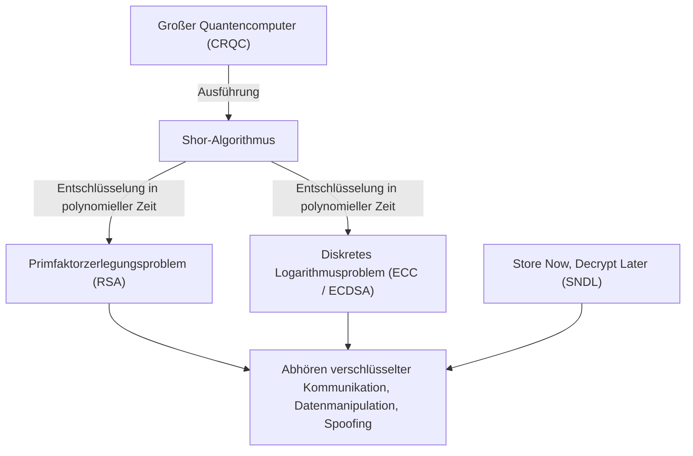
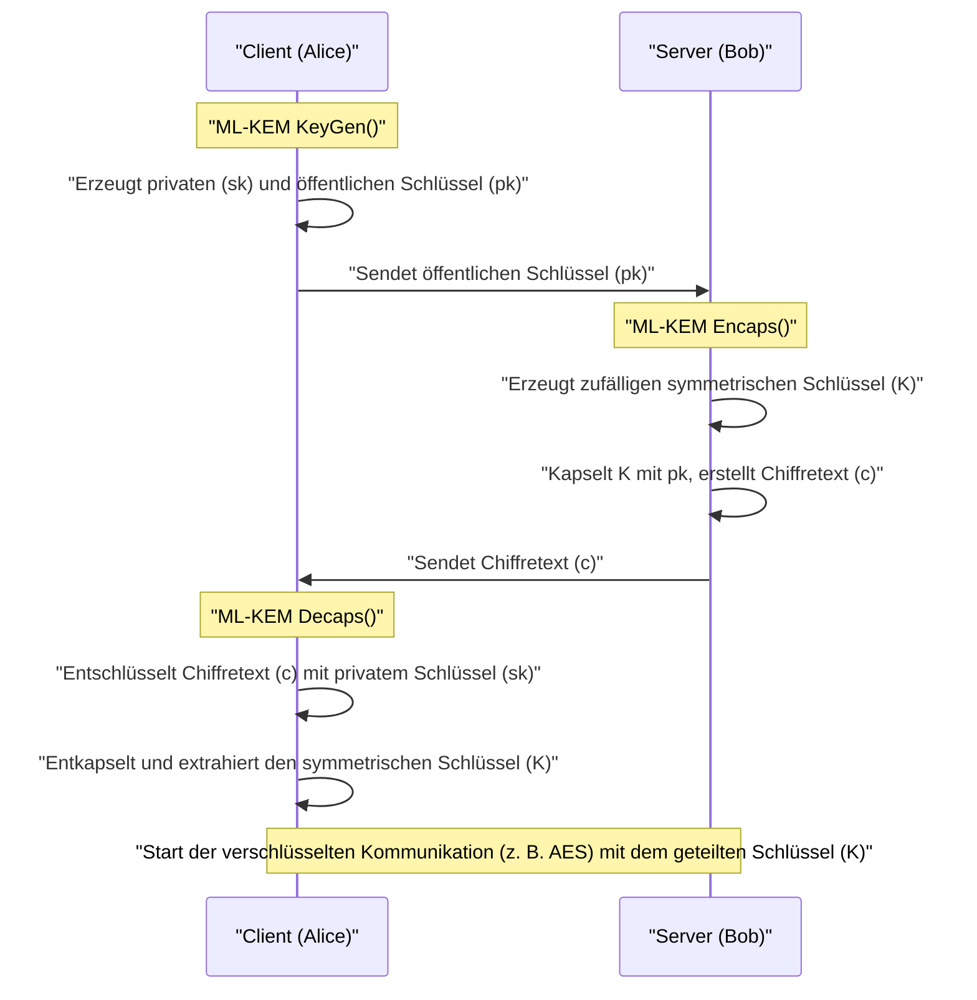
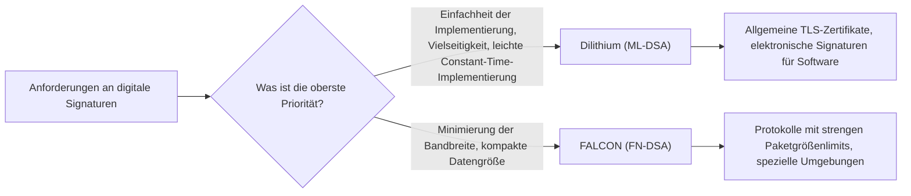

## 1. Einleitung: Die "Krise der Kryptographie" durch Quantencomputer

In der modernen Internetgesellschaft ist die Public-Key-Kryptographie eine unverzichtbare Infrastruktur zum Schutz der Vertraulichkeit von Kommunikation und der Datenintegrität. Die derzeit weit verbreiteten RSA- und Elliptische-Kurven-Kryptographie (ECC) stützen sich für ihre Sicherheit auf mathematische Hürden, nämlich die "Schwierigkeit der Primfaktorzerlegung riesiger zusammengesetzter Zahlen" und die "Schwierigkeit des diskreten Logarithmusproblems auf elliptischen Kurven". Es wurde bewiesen, dass klassische Computer (die Computer, die wir heute benutzen, einschließlich Supercomputern) länger als das Alter des Universums bräuchten, um diese mathematischen Probleme zu lösen, was die Grundlage für ihre Sicherheit darstellte.

Diese robuste Annahme wird jedoch durch Fortschritte in der Theorie und praktischen Anwendung von **Quantencomputern** grundlegend auf den Kopf gestellt. Der "**Shor-Algorithmus**", der 1994 von dem Kryptographen Peter Shor vorgestellt wurde, bewies theoretisch, dass sowohl das Primfaktorzerlegungsproblem als auch das Problem des diskreten Logarithmus in "polynomieller Zeit" entschlüsselt werden können, wenn er auf einem ausreichend leistungsfähigen, fehlertoleranten universellen Quantencomputer (CRQC: Cryptographically Relevant Quantum Computer) ausgeführt wird. Das bedeutet, dass alle derzeit verwendeten Public-Key-Kryptographien unwirksam werden.



Es ist sehr gefährlich zu denken: "Die vollständige Fertigstellung von Quantencomputern liegt noch Jahrzehnte in der Zukunft, also ist es kein Problem". Denn eine Angriffsmethode namens **Store Now, Decrypt Later (SNDL)** stellt bereits eine reale Bedrohung dar. Bei diesem Angriff speichern böswillige Staaten oder Hackerorganisationen große Mengen der derzeit verschlüsselten Kommunikationsdaten (wie TLS-Traffic) und entschlüsseln sie alle in dem Moment, in dem in Zukunft ein leistungsstarker Quantencomputer verfügbar wird. Staatsgeheimnisse, Infrastrukturinformationen und medizinische Daten, die über lange Zeiträume geschützt werden müssen, sind dieser Bedrohung bereits ausgesetzt.

Für symmetrische Schlüsselkryptographie (wie AES) und Hash-Funktionen (wie SHA-256) existiert zudem der 1996 entdeckte **Grover-Algorithmus**. Dieser reduziert den Rechenaufwand für Brute-Force-Angriffe auf die Quadratwurzel. Mit anderen Worten, das Sicherheitsniveau von AES-128 wird effektiv auf 2 hoch 64 halbiert. Im Quantenzeitalter wird daher die Verwendung längerer Schlüssel und Hash-Längen wie AES-256 und SHA-384 empfohlen.

Um dieser beispiellosen Kryptographie-Krise zu begegnen, wurde die **Post-Quanten-Kryptographie (Post-Quantum Cryptography: PQC)** entwickelt, die auf neuen mathematischen Problemen basiert, welche auch mit Quantencomputern schwer zu lösen sind. Basierend auf den Ergebnissen des vom National Institute of Standards and Technology (NIST) der USA geleiteten PQC-Standardisierungsprozesses erläutert dieser Artikel detailliert die wichtigsten PQC-Algorithmen, von ihren mathematischen Hintergründen über ihre Mechanismen bis hin zu Architekturvergleichen.

---

## 2. Der PQC-Standardisierungsprozess von NIST: Gesamtbild und Geschichte

Der Übergang zu neuen Kryptographietechnologien, der die Neugestaltung von Protokollen, Systemaktualisierungen und den Austausch von Hardware umfasst, dauert Jahre bis Jahrzehnte. Daher haben Kryptographen auf der ganzen Welt frühzeitig die Erforschung von PQC vorangetrieben. Eine zentrale Rolle hat dabei das US-amerikanische NIST (National Institute of Standards and Technology) gespielt. Im Jahr 2016 rief NIST den PQC-Standardisierungsprozess aus und nahm Vorschläge für völlig neue kryptographische Algorithmen aus der weltweiten Kryptographie-Community entgegen.

Gegenstand der Standardisierung waren die folgenden zwei Hauptkategorien:
1. **Public-Key-Kryptographie / Schlüsselkapselungsmechanismen (KEM: Key Encapsulation Mechanism)**: Ein Mechanismus zum sicheren Teilen (Verteilen) von symmetrischen Schlüsseln für die Verschlüsselung von Kommunikationskanälen, z. B. in TLS-Verbindungen.
2. **Digitale Signaturen (Digital Signatures)**: Ein Mechanismus für Software-Updates und digitale Zertifikate, um zu beweisen, dass Daten nicht manipuliert wurden und kein Spoofing des Absenders vorliegt (Authentizität).

Nach etwa sechs Jahren intensiver Evaluation, Analyse und kryptanalytischem Wettbewerb (Runde 1 bis Runde 3) sowie einer zusätzlichen Evaluierung (Runde 4) für einige Algorithmen, wurden im Jahr 2024 die folgenden Algorithmen offiziell als Federal Information Processing Standards (FIPS) veröffentlicht und somit als künftige weltweite Standards festgelegt:

- **FIPS 203 (ML-KEM)**: KEM basierend auf CRYSTALS-Kyber
- **FIPS 204 (ML-DSA)**: Digitale Signatur basierend auf CRYSTALS-Dilithium
- **FIPS 205 (SLH-DSA)**: Zustandlose Hash-basierte Signatur basierend auf SPHINCS+
- **(In zukünftiger Planung) FN-DSA**: Digitale Signatur basierend auf FALCON

Die ausgewählten Algorithmen stützen sich auf jeweils unterschiedliche mathematische "Schwierigkeitsprobleme", sodass eine Vielfalt (Crypto Agility) gewährleistet ist. Sollte in Zukunft eine fatale Schwachstelle in einem Algorithmus entdeckt werden, wird so verhindert, dass das gesamte System zusammenbricht. Im Standardisierungsprozess nahm die gitterbasierte Kryptographie (Lattice-based cryptography) aufgrund ihrer Leistung die Hauptrolle ein, jedoch wurden hashbasierte und codebasierte Kryptographien als starke Backups übernommen.

---

## 3. Klassifizierung der wichtigsten mathematischen Ansätze in PQC

PQC-Algorithmen lassen sich nach den mathematischen Problemen, die ihre Sicherheit begründen, in die folgenden fünf Hauptkategorien einteilen. In diesem Artikel gehen wir speziell auf die ersten drei näher ein.

1. **Gitterbasierte Kryptographie (Lattice-based Cryptography)**:
   Basiert auf dem Problem des kürzesten Vektors (Shortest Vector Problem, SVP), dem Problem des nächsten Vektors (Closest Vector Problem, CVP) in mehrdimensionalen Gitterräumen sowie dem davon abgeleiteten LWE-Problem. Dies ist das Herzstück der NIST-Standardisierung; Kyber, Dilithium und FALCON gehören dazu. Es bietet die beste Balance aus Verarbeitungsgeschwindigkeit, Public-Key-Größe und Chiffretextgröße und eignet sich daher für allgemeine Anwendungen.
2. **Hash-basierte Kryptographie (Hash-based Cryptography)**:
   Stützt sich für ihre Sicherheit ausschließlich auf die "Kollisionsresistenz" und die "Einweg-Eigenschaft" von kryptographischen Hash-Funktionen (wie SHA-2 und SHAKE). Sie ist nur auf digitale Signaturen (wie SPHINCS+) anwendbar, bietet jedoch die stärksten Sicherheitsbeweise und zeichnet sich durch extrem hohe Resistenz gegen unbekannte mathematische Angriffe aus.
3. **Code-basierte Kryptographie (Code-based Cryptography)**:
   Basiert auf der Theorie der Fehlerkorrekturcodes und stützt sich auf die Schwierigkeit des Syndrom-Decodierungsproblems (Syndrome Decoding Problem). Ein typisches Beispiel ist das in den 1970er Jahren vorgeschlagene Classic McEliece, das eine lange Geschichte und bewährte Sicherheit aufweist, aber den Nachteil extrem großer Public-Key-Größen im Megabyte-Bereich hat.
4. **Multivariate polynomische Kryptographie (Multivariate Polynomial Cryptography)**:
   Basiert auf der Schwierigkeit, Lösungen für Systeme von multivariaten quadratischen Gleichungen über endlichen Körpern zu finden (MQ-Problem). Sie wurde hauptsächlich für digitale Signaturen (wie Rainbow) vorgeschlagen, jedoch wurde während der finalen NIST-Runde eine leistungsstarke Angriffsmethode entdeckt, die es ermöglichte, sie auf einem einzigen PC in wenigen Tagen zu knacken, weshalb viele dieser Algorithmen aus der Standardisierung herausfielen.
5. **Isogenie-basierte Kryptographie (Isogeny-based Cryptography)**:
   Basiert auf dem Problem der Wegfindung auf Isogenie-Graphen elliptischer Kurven. Sie hatte sehr kleine Schlüsselgrößen und galt als legitimer Nachfolger von ECC. Der finale Kandidat "SIKE" wurde jedoch 2022 mithilfe klassischer Mathematik (z.B. Castryck-Decru-Angriff) auf einem normalen PC in nur wenigen Stunden vollständig geknackt, was ein dramatisches Ende darstellte und die Schwierigkeit und Gefahr des PQC-Designs symbolisiert.

---

## 4. Die Tiefen der Gitterkryptographie: LWE-Problem und die mathematischen Grundlagen von Module-LWE

Die **Gitterkryptographie**, die derzeit als vielversprechendster Ansatz gilt und im Zentrum der Standardisierung steht. Die Grundlage ihrer Sicherheit ist das **LWE-Problem (Learning with Errors: Lernen mit Fehlern)**. Es wurde 2005 von Oded Regev vorgestellt, eine bahnbrechende Leistung, für die er den Gödel-Preis erhielt. Ohne das Verständnis des LWE-Problems kann man die moderne PQC nicht diskutieren.

### 4.1. Was ist das LWE-Problem (Learning with Errors)?

Betrachten wir zunächst ein einfaches lineares Gleichungssystem. Angenommen, es gibt unter einem Modul $q$ eine bekannte zufällige Matrix $A$ und einen unbekannten geheimen Vektor $\vec{s}$, und ihr Produkt $\vec{b}$ sei gegeben.

$$ \vec{b} = A\vec{s} \pmod q $$

In diesem Fall ist es einfach, das unbekannte $\vec{s}$ aus den öffentlichen Informationen $A$ und $\vec{b}$ zu ermitteln. Mit dem klassischen "Gaußschen Eliminationsverfahren" kann $\vec{s}$ leicht in polynomieller Zeit berechnet werden.

Wenn wir dieser Gleichung jedoch einen "kleinen absichtlichen Fehler (Rauschen)" hinzufügen, steigt der Schwierigkeitsgrad des Problems dramatisch an. Das ist das **LWE-Problem**.

Wir bereiten einen unbekannten geheimen Vektor $\vec{s} \in \mathbb{Z}_q^n$ und eine zufällig gewählte Matrix $A \in \mathbb{Z}_q^{m \times n}$ vor. Darüber hinaus bereiten wir einen Fehlervektor $\vec{e} \in \mathbb{Z}_q^m$ vor, dessen Werte nach einer Normal- oder Binomialverteilung ausgewählt wurden und "ausreichend klein" sind, und berechnen $\vec{b}$ wie folgt:

$$ \vec{b} = A\vec{s} + \vec{e} \pmod q $$

Das **Search-LWE-Problem** besteht darin, "die geheimen Informationen $\vec{s}$ aus den öffentlichen Informationen $(A, \vec{b})$ zu ermitteln". Durch die Anwesenheit dieses Fehlers $\vec{e}$ werden algebraische Lösungsmethoden wie die Gaußsche Elimination scheitern, da der Fehler $\vec{e}$ durch die Addition und Subtraktion von Gleichungen schneeballartig anwächst, bis er schließlich von zufälligen Werten nicht mehr zu unterscheiden ist.

Das Großartige am LWE-Problem ist, dass es einen starken theoretischen Beweis (Reduktion) gibt: Sofern kein Quantenalgorithmus existiert, der "Worst-Case-Probleme auf Gittern" wie GapSVP (Entscheidungsproblem des kürzesten Vektors) oder SIVP (Problem der kürzesten unabhängigen Vektoren) lösen kann, kann das LWE-Problem auch im Durchschnittsfall (Average-case) nicht gelöst werden. Das bedeutet, dass selbst zufällig generierte kryptographische Schlüssel eine robuste, durch theoretische Obergrenzen untermauerte Sicherheit garantieren.

### 4.2. Dramatische Effizienzsteigerung durch Ring-LWE und Module-LWE

Das gewöhnliche LWE-Problem (Standard-LWE) hat eine sehr klare Sicherheitsbasis, ist jedoch unpraktisch, da die Größe der Matrix $A$ extrem anwächst und Schlüsselgrößen im Megabyte-Bereich entstehen. Daher wurde ein Ansatz vorgeschlagen, Polynomringe (Polynomial Rings) zu nutzen, um eine algebraische Struktur einzuführen.

Beim **Ring-LWE-Problem** werden anstelle einfacher Vektoren oder Matrizen Elemente (Polynome) eines bestimmten Polynomrings $R_q$ verwendet. Die in den NIST-Standards am häufigsten verwendeten sind Kreisteilungs-Polynomringe wie:

$$ R_q = \mathbb{Z}_q[X]/(X^n + 1) $$

Hier ist $n$ eine Potenz von 2 (z. B. 256) und $q$ eine geeignete Primzahl. Auf diesem Ring werden Elemente $a, s, e \in R_q$ verwendet, um $b = a \cdot s + e \pmod q$ zu berechnen. Da ein einziges Polynom $a$ über $n$ Koeffizienten verfügt, können Daten erheblich komprimiert werden. Darüber hinaus ermöglicht die Verwendung der **NTT (Number Theoretic Transform: Zahlentheoretische Transformation)**, einer Endliche-Körper-Version der schnellen Fourier-Transformation (FFT), extrem schnelle Polynommultiplikationen in $O(n \log n)$ Rechenschritten.

Bei Ring-LWE bestand jedoch die Sorge, dass "aufgrund der speziellen algebraischen Ringstruktur unbekannte Schwachstellen existieren könnten". Ein weiteres technisches Problem war, dass bei der Änderung des Sicherheitsniveaus (z.B. äquivalent zu AES-128, 192, 256) der Polynomgrad $n$ selbst geändert werden musste, wodurch die gesamte Implementierung, wie etwa der NTT-Algorithmus, umgeschrieben werden musste.

Deshalb haben die standardisierten Algorithmen Kyber und Dilithium das **Module-LWE (M-LWE) Problem** übernommen. Module-LWE ist ein Kompromiss, der genau in der Mitte zwischen dem strukturlosen Standard-LWE und dem zu stark strukturierten Ring-LWE liegt, indem es $k \times k$ Matrizen (Module) verwendet, deren Komponenten Elemente des Polynomrings $R_q$ sind:

$$ \vec{b} = A\vec{s} + \vec{e} \pmod{R_q} \quad (A \in R_q^{k \times k}, \vec{s}, \vec{e} \in R_q^k) $$

Der größte Vorteil von Module-LWE ist, dass das Sicherheitsniveau leicht skaliert werden kann, indem lediglich die Matrixdimension $k$ geändert wird, während der Polynomgrad $n$ ($n=256$ in den NIST-Standards) konstant bleibt.
Zum Beispiel wird bei Kyber die Dimension $k$ wie folgt angepasst:
- **Kyber512 (Level 1)**: $k = 2$ (entspricht AES-128)
- **Kyber768 (Level 3)**: $k = 3$ (entspricht AES-192)
- **Kyber1024 (Level 5)**: $k = 4$ (entspricht AES-256)

Dies machte es möglich, den zugrunde liegenden NTT-Code und Hardware-Schaltungen für Polynomoperationen über alle Sicherheitsstufen hinweg zu 100% wiederzuverwenden, was die Sicherheit und Effizienz der Implementierung drastisch verbesserte.

---

## 5. CRYSTALS-Kyber (ML-KEM): Der Schlüsselkapselungsmechanismus der nächsten Generation

CRYSTALS-Kyber, offiziell als **FIPS 203 (ML-KEM)** standardisiert, ist ein Schlüsselkapselungsmechanismus (KEM), der auf dem oben erwähnten Module-LWE-Problem basiert. Er wird de facto der künftige weltweite Standard für das sichere Teilen von Sitzungsschlüsseln in Protokollen wie TLS 1.3 und SSH sein.

### 5.1. Architektur des KEM (Key Encapsulation Mechanism)

In der PQC-Ära wird anstelle des direkten Ansatzes von RSA, bei dem "der Client einen symmetrischen Schlüssel erstellt, ihn mit dem öffentlichen Schlüssel des Servers verschlüsselt und sendet", das Kapselungs-Framework KEM zum Standard.



### 5.2. Der interne Algorithmus von Kyber und die Fujisaki-Okamoto-Transformation

Das Design von Kyber ist sehr raffiniert. Zunächst wird ein Public-Key-Kryptosystem (Kyber.CPAPKE) konstruiert, das nur gegen CPA (Chosen-Plaintext Attacks) sicher ist. Durch die Anwendung einer kryptographisch sehr mächtigen Methode namens **Fujisaki-Okamoto-Transformation (Fujisaki-Okamoto Transform)** wird dieses System zu einem vollständigen KEM aufgerüstet, das auch gegen CCA (Adaptive Chosen-Ciphertext Attacks) sicher ist.

Der zentrale Verschlüsselungs- und Entschlüsselungsmechanismus von CPAPKE funktioniert wie folgt:

1. **Schlüsselerzeugung (Key Generation)**:
   - Eine Matrix $A \in R_q^{k \times k}$ im NTT-Bereich wird aus einem zufälligen Seed generiert. Der Modul $q$ ist $3329$.
   - Der geheime Vektor $\vec{s}$ und der Fehlervektor $\vec{e}$ mit kleinen Koeffizienten werden aus einer zentrierten Binomialverteilung (CBD) abgetastet.
   - Es wird $\vec{t} = A\vec{s} + \vec{e}$ berechnet. Der öffentliche Schlüssel ist $(A, \vec{t})$, der private Schlüssel ist $\vec{s}$. (In der Praxis wird $A$ als Seed veröffentlicht, um Bandbreite zu sparen).

2. **Verschlüsselung (Encryption)**:
   - Die zu teilende 32-Byte-Nachricht (Schlüsselmaterial) $m$ wird in ein Polynom kodiert.
   - Ein neuer zufälliger Vektor $\vec{r}$ und kleine Fehler $\vec{e_1}, e_2$ werden generiert.
   - $\vec{u} = A^T\vec{r} + \vec{e_1}$ 
   - $v = \vec{t}^T\vec{r} + e_2 + \lfloor q/2 \rceil \cdot m$
   - Der Chiffretext ist $(\vec{u}, v)$.

3. **Entschlüsselung (Decryption)**:
   - Der Empfänger berechnet $v - \vec{s}^T\vec{u}$.
   - Wenn wir diese Gleichung ausklappen, erhalten wir:
     $v - \vec{s}^T\vec{u} = (\vec{t}^T\vec{r} + e_2 + \lfloor q/2 \rceil \cdot m) - \vec{s}^T(A^T\vec{r} + \vec{e_1})$
   - Setzen wir hier $\vec{t} = A\vec{s} + \vec{e}$ ein, heben sich die Hauptterme $\vec{s}^TA^T\vec{r}$ auf.
   - Übrig bleibt $\lfloor q/2 \rceil \cdot m + (\vec{e}^T\vec{r} + e_2 - \vec{s}^T\vec{e_1})$.
   - Da die Terme in den Klammern "Produkte und Summen kleiner Fehler" sind, bleibt das Ganze ein ausreichend kleiner Wert (Rauschen). Daher kann durch Schwellenwertbestimmung, ob jeder Koeffizient näher an $0$ oder $q/2$ liegt, das Bit der ursprünglichen Nachricht $m$ (0 oder 1) völlig fehlerfrei wiederhergestellt werden.

Die größte Stärke von Kyber liegt in seiner enormen **Verarbeitungsgeschwindigkeit** und der **moderaten Schlüsselgröße**. Bei Kyber768 beträgt die Public-Key-Größe 1.184 Bytes und die Chiffretextgröße 1.088 Bytes. Auch wenn dies im Vergleich zu RSA-3072 (Schlüsselgröße ca. 384 Bytes) größer ist, passt es ohne Paketfragmentierung in die MTU (Maximum Transmission Unit) moderner Internetkommunikation und hat kaum negative Auswirkungen auf die Netzwerklatenz.

---

## 6. CRYSTALS-Dilithium (ML-DSA): Gitterbasierte universelle digitale Signatur

Bei der Standardisierung digitaler Signaturen konkurrierten Algorithmen mit unterschiedlichen Designphilosophien innerhalb desselben gitterbasierten Ansatzes. Unter diesen wurde **CRYSTALS-Dilithium** als universelle digitale Signatur **FIPS 204 (ML-DSA)** ausgewählt.

### 6.1. Das "Fiat-Shamir with Aborts"-Paradigma

Dilithium ist, wie Kyber, ein digitales Signaturschema, das auf Module-LWE (und dem Module-SIS-Problem) basiert. Die Grundlage seines Designs ist das extrem wichtige Paradigma der **"Fiat-Shamir-Transformation mit Abbrüchen (Fiat-Shamir with Aborts)"**.

Die Fiat-Shamir-Transformation an sich ist eine Standardmethode zur Umwandlung interaktiver Zero-Knowledge-Beweisprotokolle in nicht-interaktive digitale Signaturen. Der Beweiser (Signierende) erzeugt ein Commitment $y$, berechnet $w = Ay$ und leitet es durch eine Hash-Funktion, um eine zufällige Challenge $c$ zu erhalten, und berechnet die Antwort $z = y + cs$.

Wenn dies jedoch einfach in der Gitterkryptographie angewendet wird, verzerrt sich die Verteilung der Antwort $z$ abhängig vom Wert des privaten Schlüssels $s$. Dies führte zu dem fatalen Problem, dass ein Angreifer, der viele Signaturen beobachtet, nach und nach Informationen über den privaten Schlüssel $s$ erlangen konnte (ein mathematisches Leck, das Seitenkanalangriffen ähnelt).

Das Dilithium-Designteam (Lyubashevsky et al.) führte eine Methode namens **"Rejection Sampling (Verwerfungsmethode)"** ein. Dabei wird der gesamte Signaturprozess abgebrochen (Abort), wenn die Koeffizienten des berechneten Ergebnisses $z$ nicht in einen voreingestellten sicheren Schwellenwertbereich fallen, und die Berechnung mit einer neuen Zufallszahl $y$ von vorn begonnen.

Dadurch folgt die letztendlich ausgegebene Signatur $z$ einer vollkommen gleichmäßigen Verteilung, die völlig unabhängig vom privaten Schlüssel ist, wodurch Informationslecks mathematisch vollständig verhindert werden konnten.

### 6.2. Vorteile von Dilithium und einfache Implementierung

Ein großer Designvorteil von Dilithium besteht darin, dass es im Signaturerzeugungsprozess **überhaupt kein** komplexes "Sampling aus Gauß-Verteilungen" oder "Fließkommaoperationen" verwendet. Da es nur mit Sampling aus einer Gleichverteilung, einfachen ganzzahligen Modulo-Operationen, NTT und Hash-Funktionen (SHAKE) implementiert werden kann, ist es in einer Vielzahl von Umgebungen – vom eingebetteten Mikrocontroller bis zum Cloud-Server – einfach sicher und in konstanter Zeit (Constant-time) zu implementieren. Dies macht es sehr widerstandsfähig gegen physische Seitenkanalangriffe wie Timing-Angriffe.

---

## 7. FALCON (FN-DSA): Die ultimativ kompakte Gittersignatur

Das NIST hat als eine weitere gitterbasierte Signatur mit anderen Eigenschaften als Dilithium **FALCON (Fast-Fourier Lattice-based Compact Signatures over NTRU)** als Standardisierungskandidaten ausgewählt (derzeit als FN-DSA im Entwurfsstadium).

### 7.1. NTRU-Gitter und Gauß-Sampling

Das Hauptmerkmal von FALCON ist, dass es nicht das LWE-Problem, sondern das seit 1996 existierende und historische **NTRU-Gitter (N-th degree Truncated polynomial Ring Units)** verwendet. Darüber hinaus nutzt es das **"Hash-and-Sign"**-Paradigma, das auf dem GPV-Framework (Gentry-Peikert-Vaikuntanathan) basiert.

Bei Hash-and-Sign wird der Hash-Wert der Nachricht als Zielpunkt im Raum betrachtet und der diesem Punkt am nächsten liegende Gitterpunkt (eine ungefähre Lösung des Problems des nächsten Vektors) als Signatur gefunden. Hierfür müssen Punkte nach einer diskreten Gauß-Verteilung abgetastet werden, wofür die "kurze Basis guter Qualität", der private Schlüssel, verwendet wird.

FALCON beschleunigt diese rechenintensive Aufgabe drastisch durch eine Technik namens **"Fast Fourier Orthogonalization (FFO)"**.

### 7.2. Vor- und Nachteile von FALCON

Der überwältigende Vorteil von FALCON ist, dass **seine Signaturgröße und Public-Key-Größe extrem klein (kompakt)** sind. Während die Signaturgröße von Dilithium3 etwa 3.309 Bytes beträgt, liegt sie bei FALCON-512 bei nur ca. 666 Bytes. Auch der öffentliche Schlüssel ist mit 897 Bytes sehr klein, was es zum Retter in Umgebungen mit extrem eingeschränkter Bandbreite, für IoT-Geräte oder bestimmte Netzwerkprotokolle macht.

Allerdings gibt es einen gravierenden Nachteil. Da die Signaturerzeugung zwangsläufig komplexes diskretes Gauß-Sampling mit **Fließkommaoperationen (64-Bit IEEE 754)** erfordert, ist eine Constant-Time-Implementierung zur Vermeidung von Timing-Leaks äußerst schwierig, und der Code bläht sich auf. Aus diesem Grund positioniert sich FALCON im Gegensatz zur allgemeinen Nutzung (Dilithium) als leistungsstarker, spezialisierter Algorithmus für spezifische Anwendungen.



---

## 8. SPHINCS+ (SLH-DSA): Hash-basierte Signatur mit der stärksten Sicherheit

Für den Worst-Case, dass die Sicherheit der Gitterkryptographie in Zukunft durch den Durchbruch eines genialen Mathematikers gebrochen wird, hat NIST **FIPS 205 (SLH-DSA)**, sprich **SPHINCS+**, als Standard mit einem völlig anderen Ansatz als die Gitterkryptographie festgelegt.

SPHINCS+ wird als **hash-basierte Signatur** klassifiziert. Die Basis seiner Sicherheit stützt sich nur auf einen einzigen Punkt: "Die verwendete kryptographische Hash-Funktion (wie SHA-2 oder SHAKE256) muss kollisionsresistent und eine Einwegfunktion sein". Da es nicht von mathematischen Problemen mit spezifischen algebraischen Strukturen wie LWE oder Primfaktorzerlegung abhängt, bietet es eine extrem robuste Sicherheit (die konservativste Sicherheit). Egal, wie mächtige Quantenalgorithmen in Zukunft erscheinen mögen, es kann abgewehrt werden, indem man einfach die Ausgabelänge der Hash-Funktion erhöht.

### 8.1. Zustandslose Architektur mit WOTS+ und FORS

Die Geschichte der hash-basierten Signaturen reicht weit in die 1970er Jahre zu Lamport-Signaturen und Winternitz-Einmal-Signaturen (WOTS) zurück. Dabei handelte es sich um Wegwerfschlüssel, mit denen "nur einmal sicher signiert" werden konnte. Um diese mehrfach verwendbar zu machen, wurden Algorithmen wie XMSS (eXtended Merkle Signature Scheme) oder LMS entwickelt, die einen Merkle-Baum kombinieren, um unzählige Einmalschlüssel mit einem einzigen Root-Hash zu verwalten.

XMSS und LMS wiesen jedoch den großen Nachteil auf, dass sie **"zustandsbehaftet (stateful)"** waren. Bei jeder Signatur musste der Index-Status ("der wievielte Einmalschlüssel wurde verwendet") strikt im nichtflüchtigen Speicher mitgeschrieben werden. Wenn der Zustand z. B. durch das Wiederherstellen eines VM-Snapshots zurückgesetzt wird und derselbe Einmalschlüssel ein zweites Mal verwendet wird, ist der private Schlüssel sofort kompromittiert und das System bricht zusammen.

SPHINCS+ ist eine **"zustandslose (stateless)"** hash-basierte Signatur, die dieses lästige Zustandsmanagement gelöst hat.
Seine Kerntechnologie besteht aus folgender Kombination:
1. **WOTS+ (Winternitz One-Time Signature Plus)**: Eine grundlegende Einmal-Signatur.
2. **FORS (Forest of Random Subsets)**: Eine Few-Time-Signature-Technologie. Sie gewährleistet die Sicherheit, auch wenn derselbe Schlüssel ein paar Mal wiederverwendet wird.
3. **Hyper-Tree (Riesige Baumstruktur)**: Eine gigantische Struktur, bei der Merkle-Bäume mehrschichtig übereinandergelegt werden.

Bei der Signierung mit SPHINCS+ wird, anstatt Zustände zu verwalten, mittels Pseudozufallszahlen zufällig einer der unzähligen FORS-Schlüssel an der Basis des Hyper-Trees ausgewählt. Da die Anzahl der Blätter am Baum astronomisch hoch ist, wird die Wahrscheinlichkeit (Kollision), denselben Schlüssel zufällig zweimal zu wählen, verschwindend gering, was letztlich zur Zustandslosigkeit führt.

Die einzige und größte Schwäche von SPHINCS+ ist die **extrem große Signaturgröße**. Je nach Parametern erreicht die Signaturgröße 17 bis 49 Kilobytes, und die Signaturerzeugung ist im Vergleich zur Gitterkryptographie überwältigend langsam. Daher wird sie eher nicht für das alltägliche Webbrowsing eingesetzt, sondern für Anwendungen wie Software-Update-Signaturen oder Root-Zertifikate (CA), bei denen nicht häufig signiert wird, aber langfristige absolute Sicherheit zwingend erforderlich ist.

---

## 9. Code-basierte Kryptographie: Der gute alte Riese Classic McEliece

Ein wichtiger Ansatz, der als Finalist in Runde 4 des NIST-Standardisierungsprozesses weiterhin evaluiert wird, ist **Classic McEliece**, das auf **code-basierter Kryptographie** beruht.

Dieser Algorithmus wurde 1978 von Robert McEliece vorgeschlagen und ist neben RSA einer der ältesten in der Geschichte der Public-Key-Kryptographie. Er verwendet algebraisch-geometrische Codes, sogenannte "Goppa-Codes". Dabei wird eine Nachricht durch absichtliches Hinzufügen von Fehlern (Rauschvektoren) verschlüsselt. Nur wer die Paritätsprüfmatrix des Goppa-Codes als privaten Schlüssel besitzt, kann die starke Fehlerkorrekturfähigkeit nutzen, um die Fehler zu entfernen und die ursprüngliche Nachricht zu entschlüsseln. Dies basiert auf dem **"Syndrom-Decodierungsproblem (Syndrome Decoding Problem)"**.

$$ \vec{c} = \vec{m} G + \vec{e} $$
(Wobei $G$ die verschlüsselte Generatormatrix als öffentlicher Schlüssel und $\vec{e}$ der Fehlervektor vom Gewicht $t$ ist)

Das Erstaunliche an Classic McEliece ist seine überwältigende Erfolgsbilanz: **Obwohl es seit seinem Entwurf vor über 40 Jahren intensiver kryptanalytischer Forschung von Kryptographen auf der ganzen Welt ausgesetzt war, wurde nie eine grundlegende Schwachstelle entdeckt.** Unter allen PQC-Ansätzen besitzt es die "durch die Zeit am besten bewiesene, robuste Sicherheit".

Darüber hinaus hat es den Vorteil, dass die Chiffretextgröße sehr klein ist (nur etwa 100 bis 200 Bytes). Es hat jedoch den fatalen Nachteil, dass **die Public-Key-Größe in den Megabyte-Bereich (MB) reicht**. Selbst auf der niedrigsten Sicherheitsstufe (entsprechend AES-128) ist der öffentliche Schlüssel ca. 250 KB groß, auf höheren Stufen übersteigt er 1 MB.

Aus diesem Grund eignet es sich überhaupt nicht für Anwendungsfälle wie den TLS-Handshake, bei denen der öffentliche Schlüssel bei jeder Kommunikation über das Netzwerk gesendet wird. In speziellen Anwendungsfällen jedoch, bei denen der öffentliche Schlüssel im Voraus im System platziert werden kann, wie etwa beim Schlüsselaustausch für VPNs, bei in Firmware hartkodierten öffentlichen Schlüsseln oder bei Satellitenkommunikation, wird er aufgrund seiner starken Sicherheit weiterhin als äußerst vielversprechende Option betrachtet.

---

## 10. Leistungsvergleich und Kompromisse der einzelnen PQC-Algorithmen

Die Leistungsmerkmale der bisher diskutierten Hauptalgorithmen bei gängigen Sicherheitsniveaus (NIST Level 2 bis 3, entsprechend AES-128 bis 192) sind in der folgenden Tabelle zusammengefasst.

| Algorithmus (Standardname) | Kategorie | Mathematische Grundlage | Public-Key-Größe | Private-Key-Größe | Chiffretext-/Signaturgröße | Verarbeitungsgeschwindigkeit | Hauptmerkmale und Anwendungen |
| :--- | :--- | :--- | :--- | :--- | :--- | :--- | :--- |
| **Kyber768**<br>(ML-KEM) | KEM | Module-LWE | 1.184 Bytes | 2.400 Bytes | 1.088 Bytes | Sehr schnell | Beste Balance aus Schlüsselgröße und Geschwindigkeit. Universeller KEM-Standard für z. B. TLS 1.3. |
| **Dilithium3**<br>(ML-DSA) | Signatur | Module-LWE | 1.952 Bytes | 4.032 Bytes | 3.309 Bytes | Erzeugung & Verifizierung schnell | Einfache Implementierung. Universeller Standard für digitale Signaturen. |
| **FALCON-512**<br>(FN-DSA) | Signatur | NTRU-Gitter | 897 Bytes | 1.281 Bytes | 666 Bytes | Erzeugung eher langsam, Verifizierung ultraschnell | Minimale Signaturgröße. Erfordert jedoch Fließkommaoperationen. Für Embedded & IoT. |
| **SPHINCS+**<br>(SLH-DSA) | Signatur | Hash-Funktion | 32 Bytes | 64 Bytes | ca. 17.000 Bytes | Erzeugung sehr langsam | Mathematisches Ausfallrisiko fast null. Hochsicherheitsanwendungen wie Root-Zertifikate. |
| **Classic McEliece** | KEM | Goppa-Code | **ca. 1,04 MB** | 13.568 Bytes | **188 Bytes** | Kapselung ist schnell | 40 Jahre bewiesene Sicherheit. Riesiger öffentlicher Schlüssel. Für Umgebungen mit Hartkodierung. |

### Kompromisse verstehen
In der Welt der PQC gibt es keinen einzigen magischen Algorithmus mit den Eigenschaften "kleine Größe, hohe Geschwindigkeit und perfekte mathematische Garantie".
- **Internet-Standards (Kyber / Dilithium)**: Bieten die beste Leistungsbalance und eignen sich am besten als Drop-In-Ersatz für heutiges RSA/ECC.
- **Ultimativer Konservativismus (SPHINCS+)**: Wird gewählt, wenn man auf Kosten von Datengröße und Verarbeitungsgeschwindigkeit eine absolute Versicherung gegen zukünftige mathematische Durchbrüche haben möchte.
- **Für spezielle Umgebungen (FALCON / Classic McEliece)**: Spezialwaffen, die je nach Umgebungsbeschränkungen ausgewählt werden, z. B. bei extrem geringer Bandbreite oder der Möglichkeit der Vorabverteilung.

---

## 11. Herausforderungen bei der praktischen Anwendung und die praktische Lösung der "hybriden Kryptographie"

Mit dem Abschluss der NIST-Standardisierung und der offiziellen Veröffentlichung der FIPS-Standards hat die PQC-Migration (**PQC Migration**) der IT-Infrastruktur weltweit ernsthaft begonnen. Googles Chrome-Browser, Apples iMessage (PQ3-Protokoll) und Netzwerkanbieter wie Cloudflare haben die PQC-Unterstützung bereits in ihre Protokolle implementiert und mit dem praktischen Einsatz begonnen.

Ein abrupter und vollständiger Wechsel zu neuen kryptographischen Algorithmen ist jedoch mit sehr hohen Risiken verbunden. Angenommen, ein brillanter Mathematiker entdeckt in einigen Jahren eine fatale Angriffsmethode auf Gitterkryptographien wie Kyber (einen mathematischen Fehler, der auch mit klassischen Computern gelöst werden könnte), dann würde das gesamte davon abhängige System in einem Augenblick schutzlos sein.

Der realistische und empfohlene Ansatz, um dieses Unsicherheitsrisiko zu mindern, ist die **"hybride Kryptographie (Hybrid Cryptography)"**.

In der hybriden Kryptographie werden sowohl bestehende klassische Kryptographien mit jahrelanger Erfolgsgeschichte (z.B. elliptische Kurven wie X25519) als auch neue PQC (z.B. Kyber768) gleichzeitig für den Schlüsselaustausch verwendet. Jeder Algorithmus generiert unabhängig voneinander symmetrische Schlüsselkomponenten. Schließlich werden beide Komponenten mithilfe einer sicheren Schlüsselableitungsfunktion (Key Derivation Function, KDF) gemischt, um das endgültige Master-Secret zu generieren.

```mermaid
graph TD
    A["Client"] -->|① Sendet öffentlichen Schlüssel von X25519 + öffentlichen Schlüssel von Kyber| B["Server"]
    B -->|② Antwortet mit geteiltem Schlüssel von X25519 + gekapseltem Chiffretext von Kyber| A
    A --> C{"Ableitung des Master-Secrets (KDF)"}
    B --> C
    C -->|Eingabe: (X25519 gemeinsamer Schlüssel) || (Kyber gemeinsamer Schlüssel)| D["Sicherer Kommunikationsschlüssel (AES-256 / ChaCha20)"]
    D -->|"Widerstandsfähig gegen Quantenbedrohungen UND klassische Schwachstellen"| E["Sichere hybride verschlüsselte Kommunikation (TLS 1.3)"]
```

Dadurch entsteht eine robuste zweischichtige Sicherheit: "Selbst wenn Quantencomputer realisiert und ECC geknackt werden, schützt Kyber die Kommunikation", und umgekehrt "Sollte ein unbekannter mathematischer Fehler in Kyber gefunden werden, schützt ECC die Kommunikation". Ein prominentes Beispiel ist der IETF-Standardisierungsentwurf **X25519MLKEM768 (früher X25519Kyber768)**. Die heutige Kommunikation zwischen Webbrowsern und modernsten Servern nutzt genau diese hybride Methode.

Darüber hinaus wird im Systemdesign das Konzept der **Crypto Agility (Kryptographische Agilität)** zu einer zwingenden Anforderung für die zukünftige Systementwicklung. Dies bedeutet, eine Architektur aufzubauen, "die nicht übermäßig von einem bestimmten kryptographischen Algorithmus abhängt und schnell auf einen anderen Algorithmus umstellen kann (z.B. von Kyber auf McEliece, von Dilithium auf SPHINCS+), sollte ein Algorithmus scheitern".

---

## 12. Fazit: Ein neuer Horizont der Kryptographie

Die Menschheitstraum-Technologie des Quantencomputers ist ironischerweise zur größten Bedrohung geworden, um unsere lange als vertrauenswürdig erachteten mathematischen Verteidigungslinien wie "Primfaktorzerlegung" und das "diskrete Logarithmusproblem" zu durchbrechen. Dennoch haben Kryptographen auf der ganzen Welt nicht aufgegeben. Stattdessen haben sie komplexere und tiefgründigere mehrdimensionale mathematische Gebiete wie Gittertheorie, Hash-Funktions-Bäume und Fehlerkorrekturcodes erschlossen, um mit der Post-Quanten-Kryptographie (PQC) ein neues Bollwerk zu errichten.

Der Abschluss der NIST-Standardisierung mit FIPS 203 (ML-KEM), FIPS 204 (ML-DSA) und FIPS 205 (SLH-DSA) ist nicht das Ziel. Es ist nur der erste Schritt einer epischen PQC-Migration, die noch Jahrzehnte dauern wird. Für Softwareentwickler und Systemarchitekten wird es die große technische Herausforderung der Zukunft sein, herauszufinden, wie man die "Zunahme der Schlüsselgrößen" und "Veränderungen bei den Berechnungskosten", die diese neuen Algorithmen mit sich bringen, optimal an Netzwerkprotokolle und Systeme anpasst.

Der Kampf zwischen Quantencomputern und Kryptographie ist ein spannendes Feld, in dem die menschliche Erforschung der Mathematik und die technologische Evolution am intensivsten aufeinandertreffen. Ich hoffe, dieser Artikel hat Ihnen ein tieferes Verständnis der wunderschönen mathematischen Theorie hinter der PQC sowie der erstaunlichen Mechanismen der einzelnen Algorithmen, die die Zukunft der Cybersicherheit prägen werden, vermittelt.

---
*References:*
* *NIST Post-Quantum Cryptography Standardization Program*
* *FIPS 203: Module-Lattice-Based Key-Encapsulation Mechanism Standard*
* *FIPS 204: Module-Lattice-Based Digital Signature Standard*
* *FIPS 205: Stateless Hash-Based Digital Signature Standard*

