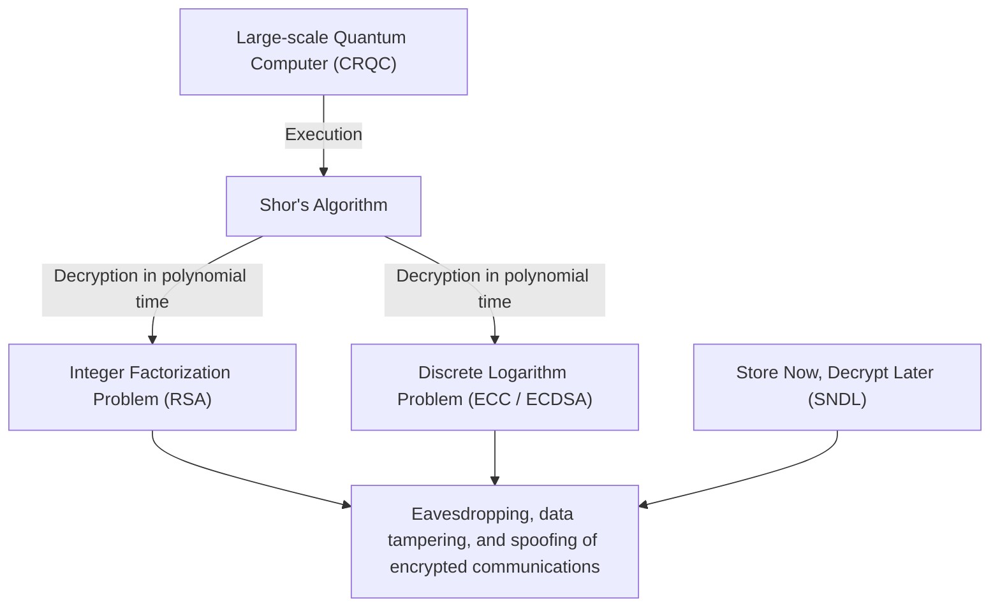
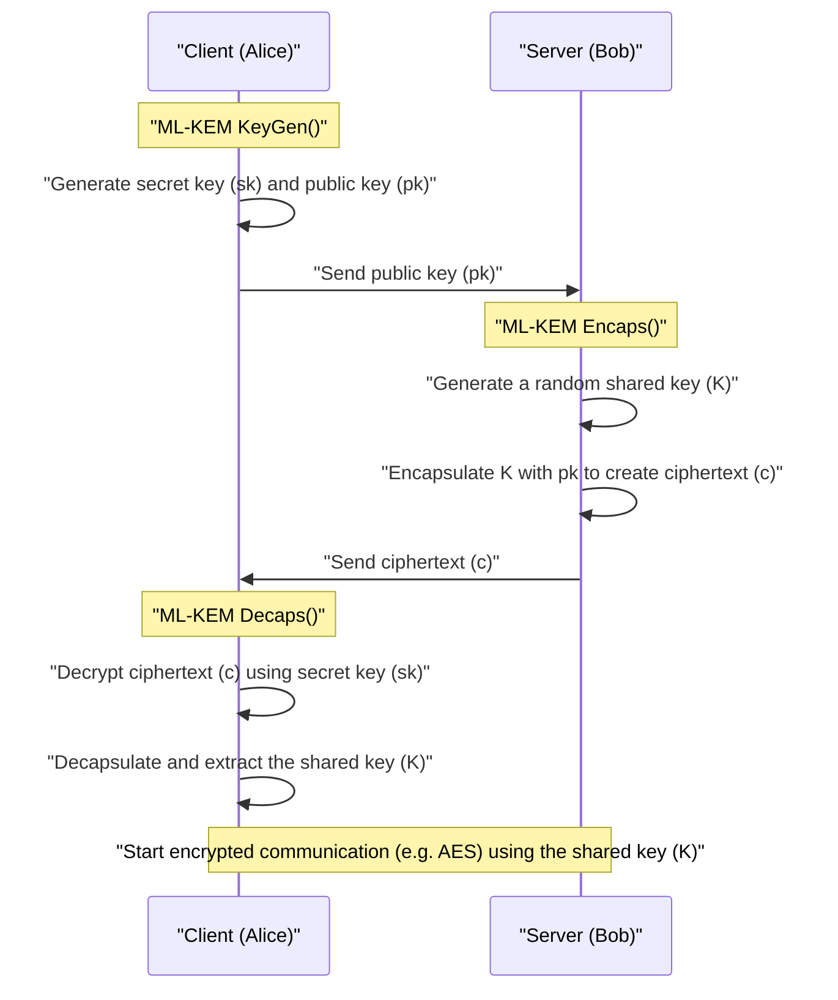
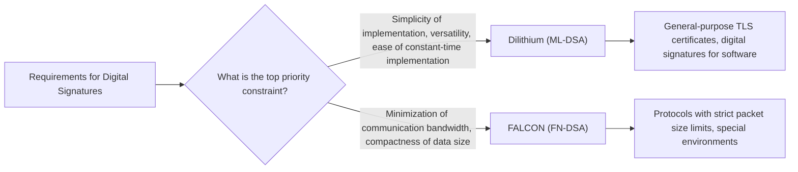

## 1. Introduction: The "Cryptography Crisis" Brought by Quantum Computers

In modern internet society, public-key cryptography is indispensable infrastructure for protecting the confidentiality of communications and data integrity. The widely used RSA cryptography and Elliptic Curve Cryptography (ECC) rely on the mathematical barriers of "the difficulty of factoring large composite numbers" and "the difficulty of the discrete logarithm problem on elliptic curves," respectively. It has been proven that classical computers (including the supercomputers we use today) would take longer than the age of the universe to solve these mathematical problems, which has been the basis of their security.

However, this solid premise is about to be completely overturned by the theory and practical advancement of **quantum computers**. The "**Shor's Algorithm**", published by cryptographer Peter Shor in 1994, theoretically proved that the integer factorization problem and the discrete logarithm problem can be solved in "polynomial time" by running it on a sufficiently capable Cryptographically Relevant Quantum Computer (CRQC). This means that all public-key cryptography currently in use will be rendered powerless.



It is extremely dangerous to think that "there is no problem because the full-scale completion of quantum computers is still decades away." This is because an attack method called **Store Now, Decrypt Later (SNDL)** is already a real threat. This is an attack where malicious states or hacker organizations save a massive amount of currently encrypted communication data (such as TLS traffic) in storage and decrypt all of it the moment a powerful quantum computer becomes available in the future. State secrets, infrastructure information, and medical data that need long-term protection are already exposed to this threat.

Furthermore, for symmetric-key cryptography (such as AES) and hash functions (such as SHA-256), there is **Grover's Algorithm**, discovered in 1996. This reduces the computational complexity of a brute-force attack to its square root. In other words, the security level of AES-128 is effectively halved to $2^{64}$, so it is recommended to use longer keys and hash lengths, such as AES-256 and SHA-384, in the quantum era.

To counter this unprecedented cryptography crisis, **Post-Quantum Cryptography (PQC)** was born, which is based on new mathematical problems that are difficult to decrypt even with a quantum computer. This article provides an extremely detailed explanation of the major PQC algorithms, from their mathematical background to their mechanisms and architectural comparisons, based on the results of the PQC standardization process led by the National Institute of Standards and Technology (NIST) in the United States.

---

## 2. Overview and History of the NIST PQC Standardization Project

Transitioning cryptographic technologies takes years to decades, including redesigning protocols, updating systems, and replacing hardware. Therefore, cryptographers around the world have been advancing PQC research since early on. The US NIST (National Institute of Standards and Technology) has played a central role in this. In 2016, NIST announced a public call for the PQC standardization process and accepted entirely new cryptographic algorithm proposals from the global cryptographic community.

The targets for standardization were the following two main categories:
1. **Public-Key Cryptography / Key Encapsulation Mechanism (KEM)**: A mechanism for securely sharing (distributing) a shared key to encrypt the communication path, such as in TLS connections.
2. **Digital Signatures**: A mechanism to prove that data has not been tampered with and that there is no spoofing of the sender (authenticity) in software updates and electronic certificates.

After a fierce competition of evaluation, analysis, and cryptanalysis spanning about 6 years (Round 1 to Round 3), further evaluation for Round 4 was conducted for some algorithms. As a result, the following algorithms were officially published as Federal Information Processing Standards (FIPS) in 2024 and established as the future global standards:

- **FIPS 203 (ML-KEM)**: KEM based on CRYSTALS-Kyber
- **FIPS 204 (ML-DSA)**: Digital signature based on CRYSTALS-Dilithium
- **FIPS 205 (SLH-DSA)**: Stateless hash-based signature based on SPHINCS+
- **(Scheduled for future formulation) FN-DSA**: Digital signature based on FALCON

These selected algorithms rely on different mathematical "hardness problems," ensuring diversity (Crypto Agility) so that even if a fatal vulnerability is discovered in one algorithm in the future, the entire system will not collapse. In the standardization process, lattice-based cryptography became the main player mainly due to its performance, but hash-based cryptography and code-based cryptography were adopted as powerful backups.

---

## 3. Classification of Major Mathematical Approaches in PQC

PQC algorithms are broadly divided into the following five categories based on the mathematical problems that form the basis of their security. This article delves deeply into the top three in particular.

1. **Lattice-based Cryptography**:
   Based on the Shortest Vector Problem (SVP) and Closest Vector Problem (CVP) in multidimensional lattice spaces, and the derived LWE problem. It is the center of NIST standardization, and Kyber, Dilithium, and FALCON fall into this category. It has the best balance of processing speed, public key size, and ciphertext size, making it suitable for general-purpose use.
2. **Hash-based Cryptography**:
   Relies solely on the "collision resistance" and "one-wayness" of cryptographic hash functions (such as SHA-2 and SHAKE) for its security basis. It is only applicable to digital signatures (such as SPHINCS+), but its security proof is the strongest, and it features extremely high resistance to unknown mathematical attacks.
3. **Code-based Cryptography**:
   Based on the theory of error-correcting codes, it relies on the difficulty of the Syndrome Decoding Problem. Classic McEliece, proposed in the 1970s, is a representative example, having a very long history and proven security, but on the other hand, the public key size is extremely large, in the megabyte range.
4. **Multivariate Polynomial Cryptography**:
   Based on the difficulty of finding a solution to a system of multivariate quadratic equations over a finite field (MQ problem). It was mainly proposed as digital signatures (such as Rainbow), but during the final round of NIST, a powerful attack method that could crack it in a few days on a single PC was discovered, and many algorithms dropped out of the standardization.
5. **Isogeny-based Cryptography**:
   Based on the path-finding problem on an isogeny graph of elliptic curves. The key size is very small, and it was expected to be a legitimate successor to ECC, but "SIKE," the final candidate, was completely broken in just a few hours on a normal PC in 2022 using classical mathematics (such as the Castryck-Decru attack), marking a dramatic end that symbolized the difficulty and terror of PQC design.

---

## 4. The Abyss of Lattice Cryptography: Mathematical Foundation of the LWE Problem and Module-LWE

**Lattice-based cryptography** is currently considered the most promising and has become the center of standardization. At the root of its security is the **LWE (Learning with Errors) problem**. Proposed by Oded Regev in 2005, this groundbreaking achievement earned him the Gödel Prize. One cannot talk about modern PQC without understanding the LWE problem.

### 4.1. What is the LWE (Learning with Errors) Problem?

First, consider a simple system of linear equations. Suppose there is a known random matrix $A$ and an unknown secret vector $\vec{s}$ under a certain modulus $q$ (modulo $q$), and their product $\vec{b}$ is given:

$$ \vec{b} = A\vec{s} \pmod q $$

In this case, it is easy to find the unknown $\vec{s}$ from the public information $A$ and $\vec{b}$. Using the classical algorithm "Gaussian elimination," $\vec{s}$ can be easily calculated in polynomial time.

However, adding a "small intentional error (noise)" to this equation dramatically increases the difficulty of the problem. This is the **LWE problem**.

Prepare an unknown secret vector $\vec{s} \in \mathbb{Z}_q^n$ and a randomly chosen matrix $A \in \mathbb{Z}_q^{m \times n}$. Furthermore, prepare an error vector $\vec{e} \in \mathbb{Z}_q^m$ whose "elements have sufficiently small values," chosen according to a normal or binomial distribution, and calculate $\vec{b}$ as follows:

$$ \vec{b} = A\vec{s} + \vec{e} \pmod q $$

The **Search LWE problem** is the problem of "finding the secret information $\vec{s}$ from the public information $(A, \vec{b})$." Due to the existence of this error $\vec{e}$, if one attempts an algebraic solution such as Gaussian elimination, the error $\vec{e}$ amplifies like a snowball in the process of adding and subtracting equations, ultimately becoming indistinguishable from random values and breaking down.

The greatness of the LWE problem lies in the fact that there is a powerful theoretical proof (reduction) that unless there is a quantum algorithm that can solve GapSVP (Decision Shortest Vector Problem) and SIVP (Shortest Independent Vector Problem), which are "worst-case hardness" problems on lattices, the LWE problem cannot be solved in the average-case either. In other words, even for a randomly generated cryptographic key, it is guaranteed to have robust security backed by a theoretical upper bound.

### 4.2. Dramatic Efficiency Improvement by Ring-LWE and Module-LWE

The normal LWE problem (Standard LWE) has a very clear basis for security, but the size of the matrix $A$ becomes very large, and the key size reaches the megabyte class, making it impractical. Therefore, an approach was proposed to provide an algebraic structure by utilizing Polynomial Rings.

In the **Ring-LWE problem**, instead of simple vectors and matrices, elements (polynomials) of a certain polynomial ring $R_q$ are used. The following cyclotomic polynomial ring is generally used in the NIST standard:

$$ R_q = \mathbb{Z}_q[X]/(X^n + 1) $$

Here, $n$ is a power of 2 (e.g., 256), and $q$ is an appropriate prime number. Over this ring, using elements $a, s, e \in R_q$, $b = a \cdot s + e \pmod q$ is calculated. Because a single polynomial $a$ has $n$ coefficients, data can be significantly compressed, and by using the finite field version of the Fast Fourier Transform (FFT) called **NTT (Number Theoretic Transform)**, ultra-fast polynomial multiplication becomes possible with a computational complexity of $O(n \log n)$.

However, Ring-LWE had concerns that "there might be an unknown vulnerability due to the special algebraic structure of the ring." Furthermore, there was an engineering challenge that when changing the security level (such as AES-128, 192, 256 equivalent), the degree $n$ of the polynomial itself had to be changed, and the entire implementation, such as the NTT algorithm, had to be rewritten accordingly.

Therefore, the **Module-LWE (M-LWE) problem** was adopted by standardization algorithms such as Kyber and Dilithium. Module-LWE is a compromise situated exactly halfway between the structureless Standard LWE and the overly structured Ring-LWE, using a $k \times k$ matrix (module) whose components are elements of the polynomial ring $R_q$:

$$ \vec{b} = A\vec{s} + \vec{e} \pmod{R_q} \quad (A \in R_q^{k \times k}, \vec{s}, \vec{e} \in R_q^k) $$

The greatest advantage of Module-LWE is that the security level can be easily scaled simply by changing the matrix dimension $k$ while keeping the polynomial degree $n$ (in the NIST standard, $n=256$) fixed.
For example, in Kyber, the dimension $k$ is adjusted as follows:
- **Kyber512 (Level 1)**: $k = 2$ (equivalent to AES-128)
- **Kyber768 (Level 3)**: $k = 3$ (equivalent to AES-192)
- **Kyber1024 (Level 5)**: $k = 4$ (equivalent to AES-256)

This made it possible to reuse 100% of the underlying NTT code and polynomial operation hardware circuits across all security levels, dramatically improving implementation security and efficiency.

---

## 5. CRYSTALS-Kyber (ML-KEM): Next-Generation Key Encapsulation Mechanism

CRYSTALS-Kyber, officially standardized as **FIPS 203 (ML-KEM)**, is a Key Encapsulation Mechanism (KEM) based on the aforementioned Module-LWE problem. It will become the de facto global standard for securely sharing session keys in TLS 1.3, SSH, and the like in the future.

### 5.1. Architecture of KEM (Key Encapsulation Mechanism)

In the PQC era, instead of a direct approach like RSA where "the client creates a common key, encrypts it with the server's public key, and sends it," a KEM encapsulation framework becomes the standard.



### 5.2. Kyber's Internal Algorithm Mechanism and the Fujisaki-Okamoto Transform

Kyber's design is highly sophisticated. First, it constructs a public-key encryption scheme (Kyber.CPAPKE) that is secure only against CPA (Chosen Plaintext Attack), and then adopts a design that upgrades it into a complete KEM that is secure against CCA (Adaptive Chosen Ciphertext Attack) by applying a cryptographically extremely powerful method called the **Fujisaki-Okamoto Transform**.

The core encryption and decryption mechanisms of CPAPKE are as follows:

1. **Key Generation**:
   - From a random seed value, generate a matrix $A \in R_q^{k \times k}$ in the NTT domain. The modulus $q$ used is $3329$.
   - Sample a secret vector $\vec{s}$ and an error vector $\vec{e}$ with small coefficients from a Centered Binomial Distribution (CBD).
   - Calculate $\vec{t} = A\vec{s} + \vec{e}$. The public key is $(A, \vec{t})$, and the secret key is $\vec{s}$. (In reality, $A$ is published as a seed value to save bandwidth).

2. **Encryption**:
   - Encode the 32-byte message to be shared (shared key material) $m$ into a polynomial.
   - Generate a new random vector $\vec{r}$ and small errors $\vec{e_1}, e_2$.
   - $\vec{u} = A^T\vec{r} + \vec{e_1}$ 
   - $v = \vec{t}^T\vec{r} + e_2 + \lfloor q/2 \rceil \cdot m$
   - The ciphertext is $(\vec{u}, v)$.

3. **Decryption**:
   - The receiver calculates $v - \vec{s}^T\vec{u}$.
   - Expanding this formula mathematically yields the following:
     $v - \vec{s}^T\vec{u} = (\vec{t}^T\vec{r} + e_2 + \lfloor q/2 \rceil \cdot m) - \vec{s}^T(A^T\vec{r} + \vec{e_1})$
   - Substituting $\vec{t} = A\vec{s} + \vec{e}$ here cancels out the main term $\vec{s}^TA^T\vec{r}$.
   - What remains is $\lfloor q/2 \rceil \cdot m + (\vec{e}^T\vec{r} + e_2 - \vec{s}^T\vec{e_1})$.
   - Since the terms in parentheses are "products and sums of small errors," they remain sufficiently small values (noise) as a whole. Therefore, by making a threshold judgment on whether each coefficient is close to $0$ or close to $q/2$, the bits (0 or 1) of the original message $m$ can be completely restored without error.

Kyber's greatest strengths are its overwhelming **processing speed** and **moderate key size**. For Kyber768, the public key size is 1,184 bytes and the ciphertext size is 1,088 bytes. While larger compared to RSA-3072 (key size around 384 bytes), it can fit within the MTU (Maximum Transmission Unit) of modern internet communications without packet fragmentation, having almost no adverse effect on network latency.

---

## 6. CRYSTALS-Dilithium (ML-DSA): General-Purpose Lattice-Based Digital Signature

In the standardization of digital signatures, algorithms with different design philosophies within the same lattice cryptography approach competed against each stands. Among them, **CRYSTALS-Dilithium** was selected as **FIPS 204 (ML-DSA)** for general-purpose digital signatures.

### 6.1. The Fiat-Shamir with Aborts Paradigm

Like Kyber, Dilithium is a digital signature scheme based on the Module-LWE (and Module-SIS problem). The design base uses an extremely important paradigm called "**Fiat-Shamir with Aborts**".

The Fiat-Shamir transform itself is a standard method for converting an interactive zero-knowledge proof protocol into a non-interactive digital signature. The prover (signer) generates a commitment $y$, calculates $w = Ay$, passes it through a hash function to obtain a random challenge $c$, and calculates the response $z = y + cs$.

However, simply applying this to lattice cryptography caused a fatal problem (side-channel-like mathematical leakage) where the distribution of the response $z$ was distorted depending on the value of the secret key $s$, gradually leaking information about the secret key $s$ to an attacker observing many signatures.

The Dilithium design team (Lyubashevsky et al.) introduced a method called "**Rejection Sampling**", where if the coefficients of the calculated signature $z$ do not fall within a pre-set safe threshold, the entire signature process is aborted and recalculated from the beginning using a new random number $y$.

As a result, the finally output signature $z$ has a completely uniform distribution independent of the secret key, succeeding in completely preventing mathematical information leakage.

### 6.2. Dilithium's Advantages and Ease of Implementation

A major design advantage of Dilithium is that it **does not use** complex "sampling from a Gaussian distribution" or "floating-point arithmetic" at all in the signature generation process. Because it can be implemented using only sampling from a uniform distribution, simple integer modulo arithmetic, NTT, and a hash function (SHAKE), it is easy to implement securely and in constant-time in a wide range of environments, from embedded microcontrollers to cloud servers. This gives it robust resistance against physical side-channel attacks such as timing attacks.

---

## 7. FALCON (FN-DSA): Ultimately Compact Lattice Signature

NIST selected **FALCON (Fast-Fourier Lattice-based Compact Signatures over NTRU)**, another lattice-based signature with different characteristics from Dilithium, as a standardization candidate (currently drafting as FN-DSA).

### 7.1. NTRU Lattices and Gaussian Sampling

FALCON's greatest feature is that it uses not the LWE problem but the historical **NTRU (N-th degree Truncated polynomial Ring Units) lattices** that have existed since 1996. Furthermore, it adopts the "**Hash-and-Sign**" paradigm based on the GPV (Gentry-Peikert-Vaikuntanathan) framework.

In Hash-and-Sign, the hash value of a message is set as a target point in space, and finding the point on the lattice closest to that point (an approximate solution to the closest vector problem) serves as the signature. To do this, it is necessary to sample points according to a discrete Gaussian distribution using a "high-quality short basis" as the secret key.

FALCON dramatically accelerated this heavy computation using a method called "**Fast Fourier Orthogonalization (FFO)**".

### 7.2. Pros and Cons of FALCON

The overwhelming advantage of FALCON is that its **signature size and public key size are extremely small (compact)**. While the signature size of Dilithium3 is about 3,309 bytes, the signature size of FALCON-512 is only about 666 bytes. The public key is also very small at 897 bytes, making it a lifesaver in environments with extremely limited communication bandwidth, IoT devices, or specific network protocols.

However, there is a significant drawback. Because discrete Gaussian sampling, which involves complex **floating-point arithmetic (64-bit IEEE 754)**, is essential during signature generation, constant-time implementation to prevent timing leakage is extremely difficult, and the code becomes huge. For this reason, FALCON is positioned as a powerful specialized algorithm for specific uses, in contrast to the general-purpose Dilithium.



---

## 8. SPHINCS+ (SLH-DSA): Hash-Based Signature Boasting the Strongest Security

To prepare for the worst-case scenario (a rare event) where the security of lattice cryptography is broken by a brilliant mathematician's breakthrough in the future, NIST formulated **FIPS 205 (SLH-DSA)**, namely **SPHINCS+**, as a standard with a completely different approach from lattice cryptography.

SPHINCS+ is classified as a **hash-based signature**. The basis of its security relies solely on "the cryptographic hash functions used (such as SHA-2 and SHAKE256) having collision resistance and one-wayness." Because it does not depend on mathematical problems with specific algebraic structures like LWE or integer factorization, it boasts extremely robust security (the most conservative security) where even if any powerful quantum algorithm appears in the future, one can simply counter it by increasing the output length of the hash function.

### 8.1. Stateless Architecture with WOTS+ and FORS

The history of hash-based signatures is old, dating back to Lamport signatures and Winternitz One-Time Signatures (WOTS) in the 1970s. These were disposable keys that could "securely sign only once." To make them usable multiple times, algorithms like XMSS (eXtended Merkle Signature Scheme) and LMS were developed, combining a Merkle Tree to manage countless one-time keys with a single root hash.

However, XMSS and LMS had a fatal flaw of being "**stateful**". It was necessary to strictly record the index state of "which one-time key was used" in non-volatile memory every time a signature was made, and if the state rolled back due to something like restoring a virtual machine snapshot and the same one-time key was used twice, the secret key would leak immediately, and the system would collapse.

SPHINCS+ is a "**stateless**" hash-based signature that solves this state management hassle.
Its core technology is the following combination:
1. **WOTS+ (Winternitz One-Time Signature Plus)**: A basic one-time signature.
2. **FORS (Forest of Random Subsets)**: A Few-Time Signature technology. It remains secure even if the same key is reused a few times.
3. **Hyper-Tree**: A massive structure of multi-layered Merkle Trees.

When signing with SPHINCS+, instead of managing state, it uses a pseudorandom number to randomly select one of a vast number of FORS keys at the bottom of the Hyper-Tree to sign. Because the number of leaves in the tree is astronomically large, the probability of accidentally picking the same key twice (collision) is negligibly small, resulting in a stateless realization.

The sole and greatest weakness of SPHINCS+ is that its **signature size is extremely large**. Depending on the parameters, the signature size can reach 17 to 49 kilobytes, and the signature generation speed is also overwhelmingly slower than lattice cryptography. Therefore, rather than for daily web browsing, it is intended for uses where signatures are not made frequently and long-term absolute security is strongly required, such as software update signatures and root Certificate Authority (CA) certificates.

---

## 9. Code-Based Cryptography: The Good Old Giant, Classic McEliece

In the NIST standardization process, an important approach still being evaluated as a final candidate for Round 4 is **Classic McEliece** of **code-based cryptography**.

Proposed by Robert McEliece in 1978, this algorithm is one of the oldest in the history of public-key cryptography, alongside RSA. It utilizes algebraic geometry codes called "Goppa codes," where a message is intentionally encrypted with an error (noise vector) added, and only the person holding the parity check matrix of the Goppa code as a secret key can remove the error using powerful error-correcting capabilities to decrypt the original message. This is based on the "**Syndrome Decoding Problem**".

$$ \vec{c} = \vec{m} G + \vec{e} $$
(where $G$ is the scrambled generator matrix which is the public key, and $\vec{e}$ is the error vector of weight $t$)

The amazing thing about Classic McEliece is its overwhelming track record: **despite more than 40 years passing since its proposal and being exposed to intense cryptanalysis research by cryptographers worldwide, no fundamental vulnerability has ever been discovered**. It possesses the most "time-proven robust security" among PQC.

Furthermore, it has the advantage of a very small ciphertext size (only about 100 to 200 bytes). However, it has a fatal flaw in that **the public key size is in the megabyte (MB) range**. Even at the lowest security level (AES-128 equivalent), the public key is about 250KB, and it exceeds 1MB at higher levels.

For this reason, it cannot be applied at all to uses where the public key is transmitted over a network during every communication, such as in TLS handshakes. However, in special use cases where public keys can be pre-deployed in systems, such as sharing pre-shared keys for VPNs, hardcoding public keys in firmware, or satellite communications, it continues to be considered a highly promising option due to its robust security.

---

## 10. Performance Comparison and Trade-offs of Each PQC Algorithm

The performance characteristics of the major algorithms explained so far at typical security levels (equivalent to NIST Level 2-3, AES-128-192 levels) are summarized in the table below.

| Algorithm (Standard Name) | Category | Mathematical Basis | Public Key Size | Secret Key Size | Ciphertext/Signature Size | Processing Speed Trend | Main Features and Uses |
| :--- | :--- | :--- | :--- | :--- | :--- | :--- | :--- |
| **Kyber768**<br>(ML-KEM) | KEM | Module-LWE | 1,184 Bytes | 2,400 Bytes | 1,088 Bytes | Very fast | Best balance of key size and speed. General-purpose KEM standard such as TLS 1.3. |
| **Dilithium3**<br>(ML-DSA) | Signature | Module-LWE | 1,952 Bytes | 4,032 Bytes | 3,309 Bytes | Fast for both generation and verification | Simple implementation. General-purpose digital signature standard. |
| **FALCON-512**<br>(FN-DSA) | Signature | NTRU Lattice | 897 Bytes | 1,281 Bytes | 666 Bytes | Signature generation is slower, verification is ultra-fast | Minimal signature size. However, requires floating-point operations. For embedded/IoT. |
| **SPHINCS+**<br>(SLH-DSA) | Signature | Hash Function | 32 Bytes | 64 Bytes | Approx. 17,000 Bytes | Generation is very slow | Mathematical failure risk is almost zero. High security uses like root certificates. |
| **Classic McEliece** | KEM | Goppa Code | **Approx. 1.04 MB** | 13,568 Bytes | **188 Bytes** | Encapsulation is fast | 40 years of security track record. Giant public key. For hardcodable environments. |

### Understanding the Trade-offs
In the world of PQC, there is no single magical algorithm that has "small size, fast speed, and perfect mathematical guarantees."
- **The Internet Standard (Kyber / Dilithium)**: The best balance of performance, making it the most suitable for a drop-in replacement of current RSA/ECC.
- **Ultimate Conservatism (SPHINCS+)**: Chosen when one wants absolute insurance against future mathematical breakthroughs, even at the expense of data size or processing speed.
- **For Special Environments (FALCON / Classic McEliece)**: Specialized weapons chosen according to environmental constraints, such as when communication bandwidth is extremely narrow or when pre-distribution is possible.

---

## 11. Challenges Toward Practical Application and the Practical Solution of "Hybrid Cryptography"

With the completion of standardization by NIST and the official issuance of FIPS standards, the PQC migration of IT infrastructure worldwide has begun in earnest. Google's Chrome browser, Apple's iMessage (PQ3 protocol), and network providers like Cloudflare have already implemented PQC support in their protocols and started actual operations.

However, completely switching to new cryptographic algorithms all at once comes with a very high risk. If a brilliant mathematician were to discover a fatal attack method (a mathematical flaw solvable even by classical computers) against lattice cryptography like Kyber a few years from now, entire systems relying on it would instantly become completely defenseless.

A practical and recommended approach to mitigate this uncertainty risk is "**Hybrid Cryptography**".

In hybrid cryptography, key exchange is performed using both a classical cryptographic algorithm with a long track record (e.g., Elliptic Curve Cryptography like X25519) and a new PQC algorithm (e.g., Kyber768) simultaneously. Shared key components are generated individually with each algorithm, and finally, a secure Key Derivation Function (KDF) is used to mix the two components to generate the final master secret.

```mermaid
graph TD
    A["Client"] -->|1. Send X25519 Public Key + Kyber Public Key| B["Server"]
    B -->|2. Return X25519 Shared Key + Kyber Encapsulated Ciphertext| A
    A --> C{"Derive Master Secret (KDF)"}
    B --> C
    C -->|Input: (X25519 Shared Key) || (Kyber Shared Key)| D["Secure Communication Key (AES-256 / ChaCha20)"]
    D -->|"Resistant to both quantum threats & classical vulnerabilities"| E["Secure Hybrid Encrypted Communication (TLS 1.3)"]
```

This achieves a robust two-tiered security: "even if a quantum computer becomes a reality and ECC is broken, Kyber protects the communication," and conversely, "even if an unknown mathematical flaw is found in Kyber, ECC protects the communication." A representative example is the **X25519MLKEM768 (formerly X25519Kyber768)** draft being standardized by the IETF, and communications between current web browsers and cutting-edge servers are already being carried out precisely using this hybrid method.

Furthermore, the concept of **Crypto Agility**, building a system architecture that "does not overly rely on a specific cryptographic algorithm and can quickly switch to another algorithm (e.g., from Kyber to McEliece, or Dilithium to SPHINCS+) in the event an algorithm fails," will be an essential requirement in future system development.

---

## 12. Conclusion: A New Horizon for Cryptographic Technology

Ironically, quantum computers, the dream technology of humanity, have become the greatest threat to breaking the mathematical defenses of "integer factorization" and "discrete logarithm problems" that we have trusted for many years. However, cryptographers around the world did not succumb to this; they pioneered more complex and profound multi-dimensional mathematical fields such as lattice theory, hash function trees, and error-correcting codes, and built a new defense called Post-Quantum Cryptography (PQC).

The completion of standardizations by NIST for FIPS 203 (ML-KEM), FIPS 204 (ML-DSA), and FIPS 205 (SLH-DSA) is not the goal. It is just the first step in the grand journey of PQC migration that will continue for decades to come. For software engineers and system architects, how to optimally adapt the "increased key sizes" and "changed computational costs" brought by these new algorithms into network protocols and systems will be a major technical challenge moving forward.

The battle between quantum computers and cryptography is an exciting area where humanity's mathematical exploration and the evolution of technology intersect most fiercely. Through this article, we hope you have deeply understood the beautiful mathematical theories behind PQC and the amazing mechanisms of each algorithm that will shape the future of cybersecurity.

---
*References:*
* *NIST Post-Quantum Cryptography Standardization Program*
* *FIPS 203: Module-Lattice-Based Key-Encapsulation Mechanism Standard*
* *FIPS 204: Module-Lattice-Based Digital Signature Standard*
* *FIPS 205: Stateless Hash-Based Digital Signature Standard*
