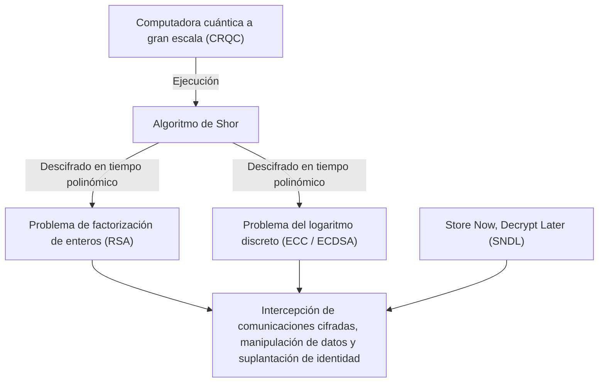
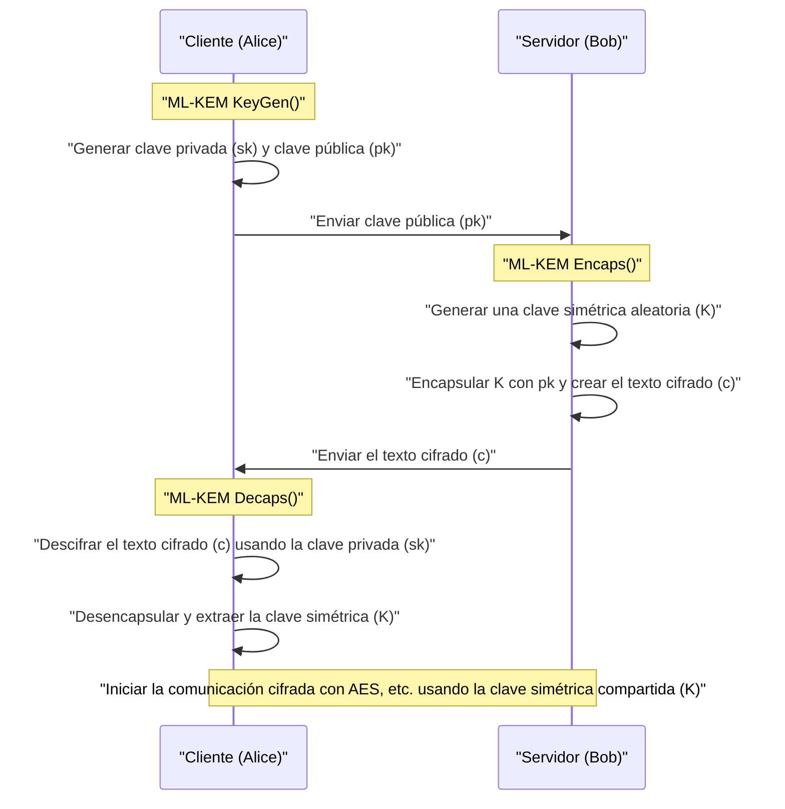
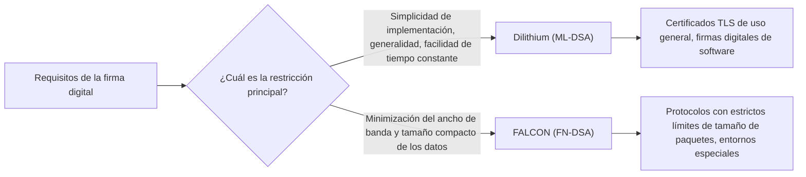

## 1. Introducción: La "crisis criptográfica" provocada por las computadoras cuánticas

En la sociedad de Internet moderna, la tecnología de criptografía de clave pública es una infraestructura indispensable para proteger la confidencialidad de las comunicaciones y la integridad de los datos. Los criptosistemas ampliamente utilizados en la actualidad, como RSA y la criptografía de curva elíptica (ECC), garantizan la seguridad dependiendo de barreras matemáticas como la "dificultad de factorizar números compuestos enormes" o la "dificultad del problema del logaritmo discreto sobre curvas elípticas", respectivamente. En las computadoras clásicas (las computadoras que usamos hoy en día, incluidas las supercomputadoras), se ha demostrado que resolver estos problemas matemáticos tomaría más tiempo que la edad del universo, lo cual ha sido la base de su seguridad.

Sin embargo, esta sólida premisa está a punto de ser anulada por los avances en la teoría y aplicación práctica de la **computadora cuántica**. El "**Algoritmo de Shor**", publicado por el criptógrafo Peter Shor en 1994, demostró teóricamente que el problema de la factorización de enteros y el problema del logaritmo discreto se pueden resolver en "tiempo polinómico" si se ejecutan en una computadora cuántica de propósito general tolerante a fallas (CRQC: Cryptographically Relevant Quantum Computer) con suficiente rendimiento. Esto significa que toda la criptografía de clave pública que se usa actualmente será inutilizada.



Es muy peligroso pensar que "la finalización a gran escala de las computadoras cuánticas está a décadas de distancia, así que no hay problema". Esto se debe a que un método de ataque llamado **Store Now, Decrypt Later (SNDL: Almacenar ahora, descifrar después)** ya es una amenaza real. Se trata de un ataque en el que naciones hostiles o grupos de hackers almacenan cantidades masivas de datos de comunicación cifrados actuales (como el tráfico TLS) en sistemas de almacenamiento y los descifran todos en el instante en que una potente computadora cuántica esté disponible en el futuro. Los secretos de estado, la información de infraestructuras y los datos médicos que deben protegerse a largo plazo ya están expuestos a esta amenaza.

Además, existe el **Algoritmo de Grover**, descubierto en 1996, contra la criptografía de clave simétrica (como AES) y las funciones hash (como SHA-256). Esto reduce a la raíz cuadrada la cantidad de cálculo para los ataques de fuerza bruta. Es decir, dado que el nivel de seguridad de AES-128 se reduce a la mitad (a 2 a la potencia de 64), se recomienda utilizar claves o longitudes de hash más largas en la era cuántica, como AES-256 o SHA-384.

Para contrarrestar esta crisis criptográfica sin precedentes, nació la **Criptografía Poscuántica (Post-Quantum Cryptography: PQC)**, basada en nuevos problemas matemáticos que son difíciles de descifrar incluso utilizando una computadora cuántica. Basándose en los resultados del proceso de estandarización de PQC liderado por el Instituto Nacional de Estándares y Tecnología de los EE. UU. (NIST), este artículo explica detalladamente los principales algoritmos de PQC, desde sus fundamentos matemáticos hasta su funcionamiento y comparación de arquitectura.

---

## 2. Visión general e historia del proyecto de estandarización PQC por el NIST

La transición de las tecnologías criptográficas, incluyendo el rediseño de protocolos, actualizaciones de sistemas y reemplazo de hardware, toma de varios años a décadas. Por lo tanto, criptógrafos de todo el mundo han avanzado tempranamente en la investigación de PQC. El papel central lo ha desempeñado el NIST de EE. UU. En 2016, el NIST convocó un proceso de estandarización de PQC, recibiendo propuestas para algoritmos criptográficos completamente nuevos de la comunidad criptográfica mundial.

Los dos principales objetivos de estandarización fueron:
1. **Criptografía de clave pública / Mecanismo de encapsulación de claves (KEM: Key Encapsulation Mechanism)**: Un mecanismo para compartir (distribuir) de forma segura claves simétricas para cifrar rutas de comunicación, como en conexiones TLS.
2. **Firmas digitales (Digital Signatures)**: Un mecanismo para probar que los datos no han sido manipulados y que no hay suplantación del remitente (autenticidad) en las actualizaciones de software y certificados digitales.

Después de unos 6 años de competencia extremadamente intensa de evaluación, análisis y criptoanálisis (Ronda 1 a Ronda 3), se realizó una evaluación adicional en la Ronda 4 para algunos algoritmos. Como resultado, en 2024 los siguientes algoritmos fueron publicados formalmente como Estándares Federales de Procesamiento de Información (FIPS), estableciéndose como los futuros estándares mundiales:

- **FIPS 203 (ML-KEM)**: KEM basado en CRYSTALS-Kyber
- **FIPS 204 (ML-DSA)**: Firma digital basada en CRYSTALS-Dilithium
- **FIPS 205 (SLH-DSA)**: Firma basada en hash sin estado basada en SPHINCS+
- **(Programado para el futuro) FN-DSA**: Firma digital basada en FALCON

Estos algoritmos seleccionados dependen de "problemas de dificultad" matemáticos diferentes. Esto asegura la diversidad (Crypto Agility) para que, incluso si se descubre una vulnerabilidad fatal en un algoritmo en el futuro, todo el sistema no colapse. En el proceso de estandarización, la criptografía basada en retículos (Lattice-based cryptography) tomó el papel principal en términos de rendimiento, pero la criptografía basada en hash y la criptografía basada en códigos fueron adoptadas como poderosos respaldos.

---

## 3. Clasificación de los principales enfoques matemáticos de PQC

Los algoritmos PQC se dividen principalmente en las siguientes cinco categorías según los problemas matemáticos que son la base de su seguridad. Este artículo profundizará especialmente en los tres primeros.

1. **Criptografía basada en retículos (Lattice-based Cryptography)**:
   Se basa en el Problema del Vector Más Corto (SVP) y el Problema del Vector Más Cercano (CVP) en un espacio de retículo multidimensional, y el problema LWE derivado de ellos. Es el centro de la estandarización del NIST e incluye Kyber, Dilithium y FALCON. Tiene el mejor equilibrio entre velocidad de procesamiento, tamaño de clave pública y tamaño de texto cifrado, lo que lo hace adecuado para un uso general.
2. **Criptografía basada en hash (Hash-based Cryptography)**:
   Su seguridad se basa únicamente en la "resistencia a colisiones" y la "unidireccionalidad" de funciones hash criptográficas (como SHA-2 o SHAKE). Solo es aplicable a firmas digitales (como SPHINCS+), pero su prueba de seguridad es la más robusta, caracterizándose por una resistencia extremadamente alta contra ataques matemáticos desconocidos.
3. **Criptografía basada en códigos (Code-based Cryptography)**:
   Se basa en la teoría de códigos de corrección de errores y depende de la dificultad del Problema de Decodificación de Síndrome (Syndrome Decoding Problem). Classic McEliece, propuesto en la década de 1970, es representativo, poseyendo una historia muy larga y seguridad probada, pero el tamaño de la clave pública es extremadamente grande (en megabytes).
4. **Criptografía de polinomios multivariables (Multivariate Polynomial Cryptography)**:
   Se basa en la dificultad de resolver sistemas de ecuaciones cuadráticas multivariables sobre un campo finito (problema MQ). Propuesto principalmente como firmas digitales (como Rainbow), pero durante la ronda final del NIST se descubrió un poderoso método de ataque que podía romperlo en unos pocos días en una sola PC, causando que muchos algoritmos quedaran fuera de la estandarización.
5. **Criptografía basada en isogenias (Isogeny-based Cryptography)**:
   Se basa en el problema de búsqueda de caminos en grafos de isogenias de curvas elípticas. Tenía claves de tamaño muy pequeño y se esperaba que fuera el verdadero sucesor de ECC, pero su candidato final, "SIKE", fue completamente descifrado en 2022 utilizando matemáticas clásicas (como el ataque de Castryck-Decru) en una PC ordinaria en solo unas pocas horas, un dramático final que simboliza la dificultad y el terror de diseñar PQC.

---

## 4. El abismo de la criptografía basada en retículos: Problema LWE y fundamentos matemáticos de Module-LWE

Actualmente vista como la más prometedora y el centro de la estandarización está la **criptografía basada en retículos**. La base de su seguridad es el **problema LWE (Learning with Errors: Aprendizaje con errores)**. Propuesto por Oded Regev en 2005, recibió el Premio Gödel por este logro histórico. No podemos hablar del PQC moderno sin entender el problema LWE.

### 4.1. ¿Qué es el problema LWE (Learning with Errors)?

Primero, consideremos un sistema simple de ecuaciones lineales. Supongamos que bajo un módulo $q$ (módulo $q$), hay una matriz aleatoria conocida $A$ y un vector secreto desconocido $\vec{s}$, y se da su producto $\vec{b}$.

$$ \vec{b} = A\vec{s} \pmod q $$

En este caso, es fácil encontrar el desconocido $\vec{s}$ a partir de la información pública $A$ y $\vec{b}$. Usando el algoritmo clásico de la "eliminación de Gauss", $\vec{s}$ puede calcularse fácilmente en tiempo polinómico.

Sin embargo, si añadimos un "pequeño error (ruido) intencional" a esta ecuación, el nivel de dificultad del problema se dispara drásticamente. Este es el **problema LWE**.

Preparamos un vector secreto desconocido $\vec{s} \in \mathbb{Z}_q^n$ y una matriz elegida al azar $A \in \mathbb{Z}_q^{m \times n}$. Además, preparamos un vector de error $\vec{e} \in \mathbb{Z}_q^m$ "cuyos valores de elementos son suficientemente pequeños" elegidos de acuerdo con una distribución normal o binomial, y calculamos $\vec{b}$ de la siguiente manera:

$$ \vec{b} = A\vec{s} + \vec{e} \pmod q $$

El **problema Search LWE** es el problema de "encontrar la información secreta $\vec{s}$ a partir de la información pública $(A, \vec{b})$". Debido a la existencia de este error $\vec{e}$, si se intenta usar métodos de solución algebraica como la eliminación de Gauss, el error $\vec{e}$ se amplifica exponencialmente en el proceso de sumar y restar ecuaciones, llegando a ser indistinguible de valores aleatorios y fallando por completo.

La maravilla del problema LWE es que existe una poderosa prueba teórica (reducción) de que a menos que exista un algoritmo cuántico capaz de resolver GapSVP (Problema de decisión del vector más corto) o SIVP (Problema del vector independiente más corto), que son "problemas de complejidad en el peor de los casos (Worst-case hardness)" en retículos, el problema LWE tampoco puede resolverse en el caso promedio (Average-case). Es decir, incluso para claves criptográficas generadas al azar, se garantiza una fuerte seguridad respaldada por límites teóricos.

### 4.2. Mejoras dramáticas en eficiencia mediante Ring-LWE y Module-LWE

El problema LWE ordinario (Standard LWE) tiene una base de seguridad muy clara, pero el tamaño de la matriz $A$ se vuelve muy grande y el tamaño de la clave se vuelve de la clase de megabytes, lo que lo hace poco práctico. Por lo tanto, se propuso el enfoque de usar Anillos Polinómicos (Polynomial Rings) para tener una estructura algebraica.

En el **problema Ring-LWE**, en lugar de simples vectores o matrices, se utilizan elementos (polinomios) de un cierto anillo polinómico $R_q$. En los estándares del NIST, se usa generalmente el siguiente anillo polinómico ciclotómico.

$$ R_q = \mathbb{Z}_q[X]/(X^n + 1) $$

Aquí, $n$ es una potencia de 2 (ej. 256) y $q$ es un número primo adecuado. Sobre este anillo, usando los elementos $a, s, e \in R_q$, calculamos $b = a \cdot s + e \pmod q$. Dado que un polinomio $a$ tiene $n$ coeficientes, los datos pueden comprimirse significativamente, y además, al usar la versión de campo finito de la Transformada Rápida de Fourier (FFT) llamada **NTT (Number Theoretic Transform: Transformada de Teoría de Números)**, es posible la multiplicación ultrarrápida de polinomios con una complejidad computacional de $O(n \log n)$.

Sin embargo, había preocupaciones con Ring-LWE de que "podrían existir vulnerabilidades desconocidas debido a la estructura algebraica especial del anillo". Además, existía un desafío de ingeniería en el que al cambiar el nivel de seguridad (equivalente a AES-128, 192, 256, etc.), el grado del polinomio $n$ en sí tenía que cambiarse, lo que requería reescribir toda la implementación como el algoritmo NTT.

Por lo tanto, los algoritmos estandarizados Kyber y Dilithium adoptaron el **problema Module-LWE (M-LWE)**. Module-LWE es un compromiso situado justo entre el Standard LWE sin estructura y el Ring-LWE que tiene demasiada estructura, utilizando una matriz (módulo) de $k \times k$ cuyos componentes son elementos del anillo polinómico $R_q$.

$$ \vec{b} = A\vec{s} + \vec{e} \pmod{R_q} \quad (A \in R_q^{k \times k}, \vec{s}, \vec{e} \in R_q^k) $$

La mayor ventaja de Module-LWE es que el nivel de seguridad puede escalarse fácilmente cambiando solo la dimensión $k$ de la matriz mientras se mantiene fijo el grado del polinomio $n$ ($n=256$ en el estándar NIST).
Por ejemplo, en el caso de Kyber, la dimensión $k$ se ajusta de la siguiente manera:
- **Kyber512 (Nivel 1)**: $k = 2$ (equivalente a AES-128)
- **Kyber768 (Nivel 3)**: $k = 3$ (equivalente a AES-192)
- **Kyber1024 (Nivel 5)**: $k = 4$ (equivalente a AES-256)

Esto permite que el código NTT subyacente y los circuitos de hardware para las operaciones polinómicas se reutilicen al 100% en todos los niveles de seguridad, mejorando drásticamente la seguridad y eficiencia de la implementación.

---

## 5. CRYSTALS-Kyber (ML-KEM): El mecanismo de encapsulación de claves de próxima generación

Formalmente estandarizado como **FIPS 203 (ML-KEM)**, CRYSTALS-Kyber es un mecanismo de encapsulación de claves (KEM) basado en el problema Module-LWE antes mencionado. En el futuro, será el estándar mundial de facto para compartir claves de sesión de forma segura en TLS 1.3, SSH y otros.

### 5.1. Arquitectura de KEM (Key Encapsulation Mechanism)

En la era PQC, el estándar será el marco de encapsulación KEM en lugar del enfoque directo como RSA donde "el cliente crea una clave simétrica, la cifra con la clave pública del servidor y la envía".



### 5.2. Mecanismo del algoritmo interno de Kyber y la Transformada de Fujisaki-Okamoto

El diseño de Kyber es muy refinado. Primero, construye un esquema de criptografía de clave pública (Kyber.CPAPKE) que solo es seguro contra ataques de texto plano elegido (CPA), y luego aplica un método criptográficamente muy poderoso llamado **Transformada de Fujisaki-Okamoto (Fujisaki-Okamoto Transform)** para actualizarlo a un KEM completo que también es seguro contra ataques de texto cifrado adaptativamente elegido (CCA).

El núcleo del mecanismo de cifrado y descifrado de CPAPKE es el siguiente:

1. **Generación de claves (Key Generation)**:
   - A partir de un valor semilla aleatorio, se genera una matriz $A \in R_q^{k \times k}$ en el dominio NTT. Se utiliza el módulo $q = 3329$.
   - A partir de una distribución binomial centrada (CBD), se muestrean un vector secreto $\vec{s}$ y un vector de error $\vec{e}$ con coeficientes pequeños.
   - Se calcula $\vec{t} = A\vec{s} + \vec{e}$. La clave pública es $(A, \vec{t})$ y la clave privada es $\vec{s}$. (En la práctica, $A$ se publica como un valor semilla para ahorrar ancho de banda).

2. **Cifrado (Encryption)**:
   - Se codifica el mensaje de 32 bytes (material de la clave simétrica) $m$ que se desea compartir en un polinomio.
   - Se genera un nuevo vector aleatorio $\vec{r}$ y errores pequeños $\vec{e_1}, e_2$.
   - $\vec{u} = A^T\vec{r} + \vec{e_1}$ 
   - $v = \vec{t}^T\vec{r} + e_2 + \lfloor q/2 \rceil \cdot m$
   - El texto cifrado es $(\vec{u}, v)$.

3. **Descifrado (Decryption)**:
   - El receptor calcula $v - \vec{s}^T\vec{u}$.
   - Expandiendo esta fórmula matemáticamente, obtenemos:
     $v - \vec{s}^T\vec{u} = (\vec{t}^T\vec{r} + e_2 + \lfloor q/2 \rceil \cdot m) - \vec{s}^T(A^T\vec{r} + \vec{e_1})$
   - Sustituyendo $\vec{t} = A\vec{s} + \vec{e}$, el término principal $\vec{s}^TA^T\vec{r}$ se cancela.
   - Lo que queda es $\lfloor q/2 \rceil \cdot m + (\vec{e}^T\vec{r} + e_2 - \vec{s}^T\vec{e_1})$.
   - Dado que los términos entre paréntesis son "productos o sumas de errores pequeños", en conjunto siguen siendo un valor lo suficientemente pequeño (ruido). Por lo tanto, al aplicar un umbral para determinar si cada coeficiente está más cerca de $0$ o $q/2$, es posible recuperar los bits (0 o 1) del mensaje original $m$ sin ningún error.

La mayor fortaleza de Kyber es su abrumadora **velocidad de procesamiento** y **tamaño de clave moderado**. Para Kyber768, el tamaño de la clave pública es de 1,184 bytes y el tamaño del texto cifrado es de 1,088 bytes. Aunque es mayor en comparación con RSA-3072 (tamaño de clave de unos 384 bytes), puede caber dentro de la Unidad Máxima de Transmisión (MTU) de las comunicaciones modernas de Internet sin fragmentación de paquetes y casi no tiene un efecto adverso en la latencia de la red.

---

## 6. CRYSTALS-Dilithium (ML-DSA): Firma digital de propósito general basada en retículos

En la estandarización de las firmas digitales, los algoritmos con diferentes filosofías de diseño dentro del mismo enfoque de criptografía de retículos compitieron entre sí. Entre ellos, **CRYSTALS-Dilithium** fue seleccionado como **FIPS 204 (ML-DSA)** como una firma digital de propósito general.

### 6.1. El paradigma de Fiat-Shamir con Abortos

Dilithium, al igual que Kyber, es un esquema de firma digital basado en el problema Module-LWE (y el problema Module-SIS). Un paradigma extremadamente importante llamado "**Fiat-Shamir with Aborts (Transformada de Fiat-Shamir con abortos)**" se utiliza como base para su diseño.

La propia transformación de Fiat-Shamir es un método estándar para convertir un protocolo de prueba de conocimiento cero interactivo en una firma digital no interactiva. El probador (firmante) genera un compromiso $y$, calcula $w = Ay$ y lo pasa a través de una función hash para obtener un desafío aleatorio $c$, luego calcula la respuesta $z = y + cs$.

Sin embargo, si esto se aplica simplemente en la criptografía de retículos, la distribución de la respuesta $z$ se distorsiona dependiendo del valor de la clave privada $s$, lo que causaba un problema fatal donde la información sobre la clave privada $s$ se filtraría gradualmente a un atacante que observara un gran número de firmas (una fuga matemática similar a un ataque de canal lateral).

El equipo de diseño de Dilithium (Lyubashevsky et al.) introdujo una técnica llamada "**Muestreo de Rechazo (Rejection Sampling)**", donde si los coeficientes del resultado de la firma $z$ no caen dentro de un rango de umbral seguro predeterminado, todo el proceso de firma es descartado (Abort) y se recalcula desde el principio usando un nuevo número aleatorio $y$.

Como resultado, la firma final $z$ que se emite se convierte en una distribución completamente uniforme independiente de la clave privada en absoluto, logrando prevenir completamente la fuga de información matemáticamente.

### 6.2. Ventajas y facilidad de implementación de Dilithium

La gran ventaja en el diseño de Dilithium es que **no utiliza en absoluto** el complejo "muestreo de la distribución gaussiana" o "cálculos de punto flotante" en el proceso de generación de firmas. Puede implementarse de forma segura y en tiempo constante (Constant-time) en una amplia gama de entornos, desde microcontroladores integrados hasta servidores en la nube, ya que solo requiere muestreo de una distribución uniforme, simples operaciones modulares de enteros, NTT y funciones hash (SHAKE). Esto lo hace muy resistente contra ataques físicos de canal lateral como los ataques de temporización.

---

## 7. FALCON (FN-DSA): Firmas de retículo ultracompactas

El NIST seleccionó **FALCON (Fast-Fourier Lattice-based Compact Signatures over NTRU)** como otro candidato estándar de firma basada en retículos con características diferentes a Dilithium (actualmente en redacción como FN-DSA).

### 7.1. Retículos NTRU y muestreo gaussiano

La principal característica de FALCON es que utiliza **retículos NTRU (N-th degree Truncated polynomial Ring Units)**, que tienen una larga historia desde 1996, en lugar del problema LWE. Además, adopta el paradigma "**Hash-and-Sign (Hash y Firmar)**" basado en el marco GPV (Gentry-Peikert-Vaikuntanathan).

En Hash-and-Sign, el valor hash del mensaje se utiliza como un punto objetivo en el espacio, y el punto en el retículo más cercano a ese punto (una solución aproximada del problema del vector más cercano) se encuentra para que sirva como la firma. Esto requiere muestrear puntos según una distribución gaussiana discreta, utilizando la clave privada que es una "base corta de buena calidad".

FALCON aceleró dramáticamente este cálculo pesado usando una técnica llamada "**Ortogonalización rápida de Fourier (Fast Fourier Orthogonalization: FFO)**".

### 7.2. Ventajas y desventajas de FALCON

La abrumadora ventaja de FALCON es que **el tamaño de la firma y el tamaño de la clave pública son extremadamente pequeños (compactos)**. Mientras que el tamaño de la firma de Dilithium3 es de aproximadamente 3,309 bytes, el tamaño de la firma de FALCON-512 es de solo unos 666 bytes. La clave pública también es muy pequeña, 897 bytes, lo que lo convierte en un salvador en entornos donde el ancho de banda de comunicación está extremadamente restringido, dispositivos IoT o protocolos de red específicos.

Sin embargo, hay una gran desventaja. Dado que el muestreo gaussiano discreto que involucra operaciones complejas de **punto flotante (64-bit IEEE 754)** es obligatorio durante la generación de la firma, es extremadamente difícil lograr una implementación en tiempo constante (Constant-time implementation) para evitar fugas de temporización, y el código también se vuelve enorme. Por esta razón, FALCON se posiciona como un algoritmo especializado poderoso para propósitos específicos, en contraste con el uso general (Dilithium).



---

## 8. SPHINCS+ (SLH-DSA): Firma basada en hash con la máxima seguridad

En preparación para el peor de los casos en el que la seguridad de la criptografía de retículos se vea comprometida por un avance matemático de genios en el futuro, el NIST formuló **FIPS 205 (SLH-DSA)**, es decir, **SPHINCS+**, como un estándar con un enfoque completamente diferente a la criptografía de retículos.

SPHINCS+ está clasificado como una **firma basada en hash**. La base de su seguridad se basa únicamente en un punto: "que la función hash criptográfica utilizada (como SHA-2 o SHAKE256) posea resistencia a colisiones y unidireccionalidad". Como no depende de problemas matemáticos con una estructura algebraica específica como LWE o la factorización prima, cuenta con una seguridad extremadamente fuerte (la seguridad más conservadora), en el sentido de que no importa cuán poderosos sean los algoritmos cuánticos que aparezcan en el futuro, puede contrarrestarlos simplemente extendiendo la longitud de salida de la función hash.

### 8.1. Arquitectura sin estado mediante WOTS+ y FORS

La historia de las firmas basadas en hash es antigua, remontándose a la firma de Lamport y la firma de un solo uso de Winternitz (WOTS) en la década de 1970. Estas eran claves desechables que "solo podían firmar de forma segura una vez". Para hacerlas reutilizables múltiples veces, se desarrollaron algoritmos como XMSS (eXtended Merkle Signature Scheme) y LMS que combinan árboles de Merkle para gestionar innumerables claves de un solo uso con un único hash raíz.

Sin embargo, XMSS y LMS tenían el defecto grave de ser "**con estado (Stateful)**". Cada vez que se realizaba una firma, el estado del índice de "qué clave de un solo uso se usó" tenía que registrarse estrictamente en la memoria no volátil, y si el estado se revertía debido a la restauración de una instantánea de máquina virtual, etc., y se usaba la misma clave de un solo uso dos veces, la clave privada se filtraría inmediatamente y el sistema colapsaría.

SPHINCS+ es una firma basada en hash "**sin estado (Stateless)**" que resolvió esta molestia en la gestión de estados.
Su tecnología central es una combinación de lo siguiente:
1. **WOTS+ (Winternitz One-Time Signature Plus)**: Una firma básica de un solo uso.
2. **FORS (Forest of Random Subsets)**: Una tecnología de firma de pocas veces (Few-Time Signature). Mantiene la seguridad incluso si la misma clave se reutiliza unas cuantas veces.
3. **Hyper-Tree (Estructura de árbol gigante)**: Una estructura gigantesca que superpone árboles de Merkle en múltiples capas.

En SPHINCS+, al realizar una firma, en lugar de mantener el estado, selecciona aleatoriamente una usando números pseudoaleatorios de un gran número de claves FORS en la base del Hyper-Tree para firmar. Como el número de hojas en el árbol es astronómicamente alto, la probabilidad de elegir la misma clave dos veces por accidente (colisión) es insignificantemente pequeña, lo que resulta en la realización de la falta de estado.

La única y mayor debilidad de SPHINCS+ es que su **tamaño de firma es extremadamente grande**. Dependiendo de los parámetros, el tamaño de la firma puede alcanzar de 17 kilobytes a 49 kilobytes, y la velocidad de generación de la firma es abrumadoramente más lenta en comparación con la criptografía de retículos. Por lo tanto, se prevé que se utilice para propósitos que no requieren firmas frecuentes y exigen una seguridad absoluta a largo plazo, como firmas de actualización de software y certificados de autoridades de certificación raíz (CA), en lugar del uso diario en la navegación web.

---

## 9. Criptografía basada en códigos: El viejo gigante Classic McEliece

En el proceso de estandarización del NIST, un enfoque importante que aún se está evaluando como candidato final de la Ronda 4 es **Classic McEliece**, de la **criptografía basada en códigos**.

Propuesto por Robert McEliece en 1978, este algoritmo es uno de los más antiguos en la historia de la criptografía de clave pública junto a RSA. Utiliza un código de geometría algebraica llamado "Código Goppa", cifra agregando intencionalmente un error (vector de ruido) al mensaje, y se basa en el "**Problema de Decodificación de Síndrome (Syndrome Decoding Problem)**" donde solo aquellos con una matriz de comprobación de paridad de código Goppa como clave privada pueden eliminar el error usando una fuerte capacidad de corrección de errores y descifrar el mensaje original.

$$ \vec{c} = \vec{m} G + \vec{e} $$
($G$ es la matriz generadora codificada que es la clave pública, $\vec{e}$ es un vector de error de peso $t$)

Lo asombroso de Classic McEliece es **su abrumador historial, en el que no se ha descubierto ni una sola vulnerabilidad intrínseca, a pesar de que han pasado más de 40 años desde su propuesta y de haber estado expuesto a una intensa investigación criptoanalítica por parte de criptógrafos de todo el mundo**. Tiene la "fuerte seguridad probada por el tiempo" más alta entre los PQC.

Además, tiene la ventaja de que el tamaño del texto cifrado es muy pequeño (solo unos 100-200 bytes). Sin embargo, tiene el defecto fatal de que **el tamaño de la clave pública se mide en megabytes (MB)**. Incluso en el nivel de seguridad más bajo (equivalente a AES-128), la clave pública es de unos 250 KB y supera 1 MB en niveles más altos.

Debido a esto, no es aplicable en absoluto para usos donde la clave pública se transmite a través de la red en cada comunicación, como en un handshake TLS. Sin embargo, en casos de uso especiales donde las claves públicas pueden distribuirse previamente en el sistema, como intercambios de claves precompartidas de VPN, codificación rígida de claves públicas en firmware o comunicaciones por satélite, sigue siendo evaluado como una opción extremadamente prometedora debido a su robusta seguridad.

---

## 10. Comparación de rendimiento y compensaciones de cada algoritmo PQC

Las características de rendimiento de los principales algoritmos discutidos hasta ahora, en niveles de seguridad típicos (equivalentes a los niveles 2-3 de NIST, niveles AES-128-192), se resumen en la siguiente tabla.

| Algoritmo (Nombre estándar) | Categoría | Base matemática | Tamaño de clave pública | Tamaño de clave privada | Tamaño de texto cifrado/firma | Tendencia de velocidad | Características principales y usos |
| :--- | :--- | :--- | :--- | :--- | :--- | :--- | :--- |
| **Kyber768**<br>(ML-KEM) | KEM | Module-LWE | 1,184 Bytes | 2,400 Bytes | 1,088 Bytes | Muy rápido | El mejor equilibrio de tamaño de clave y velocidad. Estándar KEM de uso general como TLS 1.3. |
| **Dilithium3**<br>(ML-DSA) | Firma | Module-LWE | 1,952 Bytes | 4,032 Bytes | 3,309 Bytes | Rápido para generar y verificar | Implementación simple. Estándar de firma digital de propósito general. |
| **FALCON-512**<br>(FN-DSA) | Firma | Retículo NTRU | 897 Bytes | 1,281 Bytes | 666 Bytes | Generación algo lenta, verificación ultrarrápida | Tamaño de firma muy pequeño. Pero requiere operaciones de punto flotante. Para sistemas embebidos/IoT. |
| **SPHINCS+**<br>(SLH-DSA) | Firma | Función hash | 32 Bytes | 64 Bytes | Aprox. 17,000 Bytes | Generación muy lenta | Riesgo casi nulo de fallo matemático. Usos de alta seguridad como certificados raíz. |
| **Classic McEliece** | KEM | Código Goppa | **Aprox. 1.04 MB** | 13,568 Bytes | **188 Bytes** | Encapsulación rápida | 40 años de historial de seguridad. Clave pública enorme. Para entornos donde se puede codificar de forma rígida (hardcode). |

### Entendiendo las compensaciones
En el mundo de PQC, no existe un algoritmo único y mágico que sea "pequeño en tamaño, rápido en velocidad y perfecto en garantía matemática".
- **Estándar de Internet (Kyber / Dilithium)**: Tienen el mejor equilibrio de rendimiento y son los más adecuados para el reemplazo directo (drop-in replacement) desde los actuales RSA/ECC.
- **Conservadurismo definitivo (SPHINCS+)**: Se elige cuando se desea un seguro absoluto contra un avance matemático en el futuro, incluso a expensas del tamaño de los datos y la velocidad de procesamiento.
- **Para entornos especiales (FALCON / Classic McEliece)**: Armas especializadas elegidas según las limitaciones del entorno, como cuando el ancho de banda de comunicación es extremadamente estrecho o cuando es posible la distribución previa.

---

## 11. Desafíos para el uso práctico y la solución realista de la "Criptografía híbrida"

Con la finalización de la estandarización por parte del NIST y la emisión formal de las especificaciones FIPS, la migración a PQC de la infraestructura de TI global (**Migración PQC**) ha comenzado en serio. El navegador Chrome de Google, iMessage de Apple (protocolo PQ3) y los proveedores de red como Cloudflare ya han implementado el soporte PQC en sus protocolos y han iniciado su funcionamiento real.

Sin embargo, cambiar por completo y de forma repentina a nuevos algoritmos criptográficos conlleva un riesgo muy alto. Si un matemático genial descubre un método de ataque fatal contra la criptografía de retículos como Kyber (un defecto matemático resoluble incluso por computadoras clásicas) en unos años, todo el sistema que dependa de él quedará expuesto instantáneamente.

Un enfoque realista y recomendado para mitigar este riesgo de incertidumbre es la "**Criptografía híbrida (Hybrid Cryptography)**".

En la criptografía híbrida, el intercambio de claves se realiza utilizando tanto la criptografía clásica actual con un largo historial (ej., criptografía de curva elíptica como X25519) como la nueva PQC (ej., Kyber768) simultáneamente. Se genera un componente de clave simétrica de forma independiente con cada algoritmo, y finalmente se combinan los dos componentes utilizando una función de derivación de claves (KDF) segura para generar el secreto maestro final.

```mermaid
graph TD
    A["Cliente"] -->|① Enviar clave pública de X25519 + clave pública de Kyber| B["Servidor"]
    B -->|② Responder con clave compartida de X25519 + texto cifrado encapsulado de Kyber| A
    A --> C{"Derivación del secreto maestro (KDF)"}
    B --> C
    C -->|Entrada: (Clave simétrica de X25519) || (Clave simétrica de Kyber)| D["Clave de comunicación segura (AES-256 / ChaCha20)"]
    D -->|"Resistente tanto a amenazas cuánticas como a vulnerabilidades clásicas"| E["Comunicación segura cifrada híbrida (TLS 1.3)"]
```

Con esto, se logra una robusta seguridad en dos niveles: "Incluso si las computadoras cuánticas se vuelven realidad y ECC es descifrado, Kyber protege la comunicación" y, por el contrario, "Incluso si se encuentra un defecto matemático desconocido en Kyber, ECC protege la comunicación". Un ejemplo típico es el borrador **X25519MLKEM768 (anteriormente X25519Kyber768)** que está siendo estandarizado por el IETF, y la comunicación entre los navegadores web actuales y los servidores de última generación se realiza utilizando precisamente este método híbrido.

Además, el concepto de **Crypto Agility (Agilidad criptográfica)**, que consiste en construir en el diseño del sistema "una arquitectura que no dependa excesivamente de un algoritmo criptográfico específico y pueda cambiar rápidamente a otro algoritmo (por ejemplo, de Kyber a McEliece, de Dilithium a SPHINCS+) en caso de que el algoritmo falle", se convierte en un requisito indispensable para el desarrollo de sistemas en el futuro.

---

## 12. Conclusión: Un nuevo horizonte para la tecnología criptográfica

Irónicamente, la computadora cuántica, la tecnología soñada de la humanidad, se ha convertido en la mayor amenaza para romper las barreras matemáticas del "problema de la factorización de enteros" y el "problema del logaritmo discreto" en los que hemos depositado nuestra confianza durante muchos años. Sin embargo, los criptógrafos de todo el mundo no han cedido ante esto, sino que han explorado dominios matemáticos multidimensionales más complejos y profundos como la teoría de retículos, árboles de funciones hash y códigos de corrección de errores, construyendo un nuevo muro defensivo llamado Criptografía Poscuántica (PQC).

La finalización de la estandarización de FIPS 203 (ML-KEM), FIPS 204 (ML-DSA) y FIPS 205 (SLH-DSA) por parte del NIST no es la meta. Es solo el primer paso de un viaje épico llamado migración PQC que durará décadas. Para los ingenieros de software y arquitectos de sistemas, cómo adaptar de manera óptima "el aumento del tamaño de la clave" y el "cambio en el costo computacional" introducidos por estos nuevos algoritmos a los protocolos de red y sistemas será el gran desafío técnico del futuro.

La batalla entre las computadoras cuánticas y la criptografía es el campo emocionante donde la exploración matemática de la humanidad y la evolución de la tecnología se cruzan más intensamente. A través de este artículo, esperamos que haya comprendido profundamente la hermosa teoría matemática detrás del PQC y los sorprendentes mecanismos de cada algoritmo que darán forma al futuro de la ciberseguridad.

---
*Referencias:*
* *NIST Post-Quantum Cryptography Standardization Program*
* *FIPS 203: Module-Lattice-Based Key-Encapsulation Mechanism Standard*
* *FIPS 204: Module-Lattice-Based Digital Signature Standard*
* *FIPS 205: Stateless Hash-Based Digital Signature Standard*
