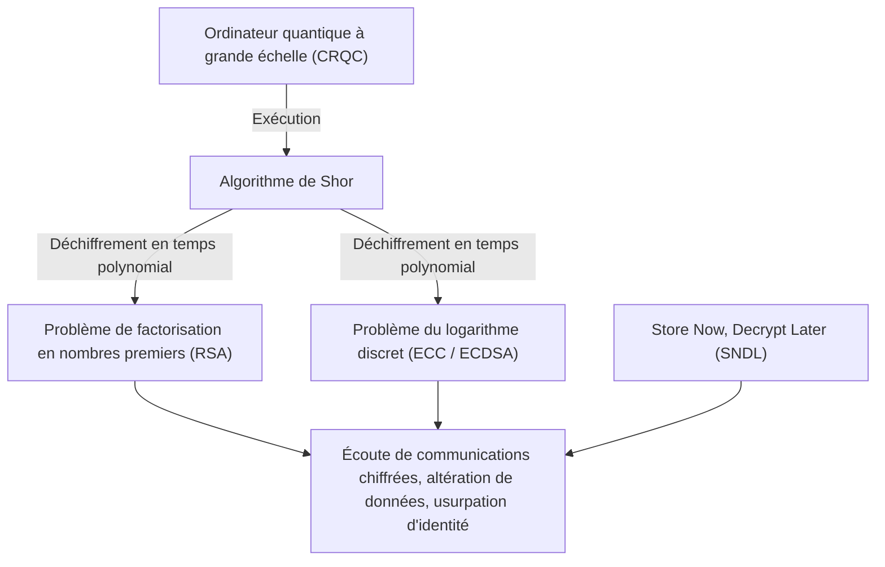
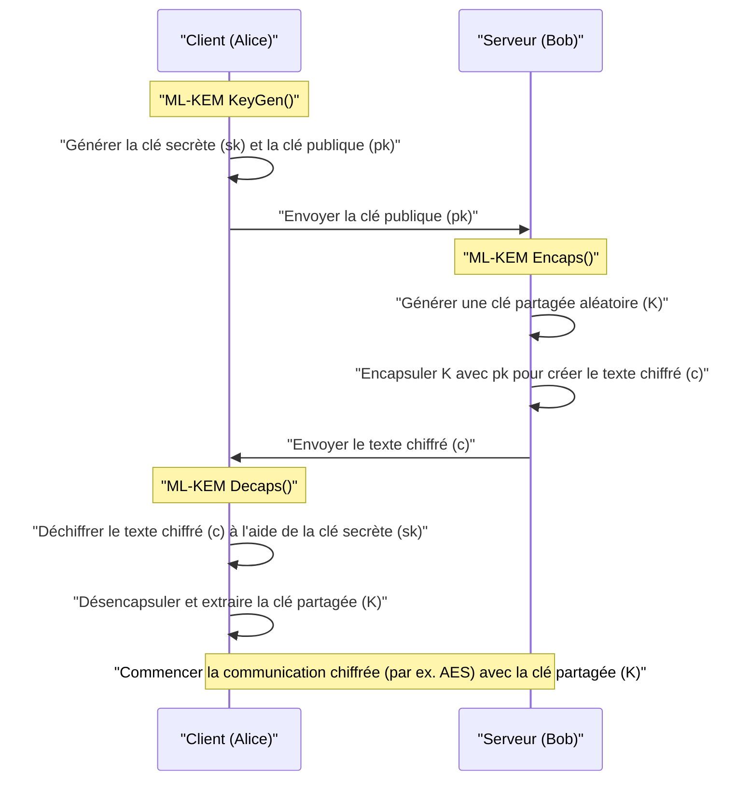
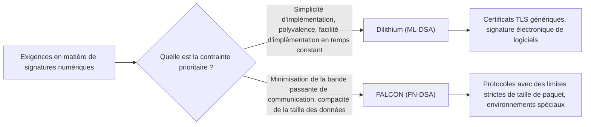
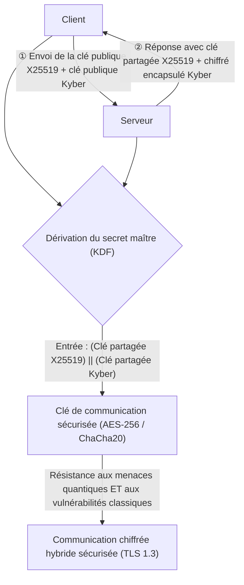

## 1. Introduction : La « crise de la cryptographie » provoquée par les ordinateurs quantiques

Dans la société Internet moderne, la cryptographie à clé publique est une infrastructure indispensable pour protéger la confidentialité des communications et l'intégrité des données. Les méthodes de cryptographie largement utilisées aujourd'hui, telles que RSA et la cryptographie sur les courbes elliptiques (ECC), reposent sur des barrières mathématiques telles que la « difficulté de la factorisation de très grands nombres composés » ou la « difficulté du problème du logarithme discret sur les courbes elliptiques » pour garantir leur sécurité. Avec les ordinateurs classiques (les ordinateurs que nous utilisons actuellement, y compris les superordinateurs), il a été prouvé qu'il faudrait plus de temps que l'âge de l'univers pour résoudre ces problèmes mathématiques, ce qui constitue le fondement de leur sécurité.

Cependant, cette prémisse solide est sur le point d'être fondamentalement bouleversée par l'avancée de la théorie et de la mise en pratique des **ordinateurs quantiques**. En 1994, l'algorithme de Shor, publié par le cryptographe Peter Shor (« **Algorithme de Shor** »), a prouvé théoriquement que les problèmes de factorisation et de logarithme discret pourraient être résolus en « temps polynomial » s'ils étaient exécutés sur un ordinateur quantique universel tolérant aux pannes (CRQC : Cryptographically Relevant Quantum Computer) d'une capacité suffisante. Cela signifie que toutes les cryptographies à clé publique utilisées actuellement seront rendues inefficaces.

Il est très dangereux de penser que « l'achèvement à grande échelle des ordinateurs quantiques n'est pas prévu avant plusieurs décennies, il n'y a donc pas de problème ». En effet, la méthode d'attaque appelée **Store Now, Decrypt Later (SNDL : Stocker maintenant, déchiffrer plus tard)** est déjà une menace réelle. Il s'agit d'une attaque dans laquelle des États malveillants ou des groupes de pirates stockent massivement les données de communication chiffrées actuelles (comme le trafic TLS) sur des supports de stockage, afin de les déchiffrer toutes dès qu'un ordinateur quantique puissant sera disponible à l'avenir. Les secrets d'État, les informations d'infrastructure et les données médicales qui doivent être protégées à long terme sont déjà exposés à cette menace.

De plus, il existe l'**algorithme de Grover**, découvert en 1996, qui s'applique à la cryptographie à clé symétrique (comme AES) et aux fonctions de hachage (comme SHA-256). Cet algorithme réduit la complexité de l'attaque par force brute à sa racine carrée. En d'autres termes, le niveau de sécurité de l'AES-128 est effectivement réduit de moitié, pour atteindre 2 à la puissance 64. Par conséquent, à l'ère quantique, il est recommandé d'utiliser des longueurs de clés et des longueurs de hachage plus grandes, telles que l'AES-256 et le SHA-384.

Pour faire face à cette crise cryptographique sans précédent, une nouvelle **cryptographie post-quantique (Post-Quantum Cryptography : PQC)** a vu le jour, reposant sur de nouveaux problèmes mathématiques difficiles à déchiffrer même avec des ordinateurs quantiques. Cet article explique de manière très détaillée, sur la base des résultats du processus de standardisation PQC mené par le National Institute of Standards and Technology (NIST) des États-Unis, les principaux algorithmes PQC, depuis leur contexte mathématique jusqu'à leurs mécanismes et la comparaison de leurs architectures.

---

## 2. Aperçu et histoire du projet de standardisation PQC par le NIST

La transition des technologies cryptographiques, qui implique la refonte des protocoles, la mise à jour des systèmes et le remplacement du matériel, prendra des années, voire des décennies. C'est pourquoi les cryptographes du monde entier ont commencé très tôt à faire des recherches sur la PQC. Le NIST (National Institute of Standards and Technology) américain a joué un rôle central dans ce domaine. En 2016, le NIST a lancé un appel public pour le processus de standardisation de la PQC et a accepté des propositions de tout nouveaux algorithmes cryptographiques de la part de la communauté cryptographique mondiale.

Les deux principales catégories ciblées par la standardisation étaient les suivantes :
1. **Cryptographie à clé publique / Mécanisme d'encapsulation de clé (KEM : Key Encapsulation Mechanism)** : Mécanisme permettant de partager (distribuer) en toute sécurité une clé symétrique pour chiffrer le canal de communication dans des connexions telles que TLS.
2. **Signatures numériques (Digital Signatures)** : Mécanisme permettant de prouver, dans les mises à jour logicielles et les certificats électroniques, que les données n'ont pas été altérées et qu'il n'y a pas d'usurpation d'identité de l'expéditeur (authenticité).

Après environ six années de concurrence acharnée en matière d'évaluation, d'analyse et de cryptanalyse (Round 1 à Round 3), une évaluation supplémentaire (Round 4) a été menée pour certains algorithmes. En conséquence, les algorithmes suivants ont été officiellement publiés en tant que Federal Information Processing Standards (FIPS) en 2024, s'établissant comme les futures normes mondiales.

- **FIPS 203 (ML-KEM)** : KEM basé sur CRYSTALS-Kyber
- **FIPS 204 (ML-DSA)** : Signature numérique basée sur CRYSTALS-Dilithium
- **FIPS 205 (SLH-DSA)** : Signature basée sur le hachage sans état (stateless) reposant sur SPHINCS+
- **(À formuler ultérieurement) FN-DSA** : Signature numérique basée sur FALCON

Ces algorithmes sélectionnés reposent chacun sur des « problèmes de difficulté » mathématiques différents. Ainsi, si une vulnérabilité fatale venait à être découverte dans l'un des algorithmes à l'avenir, la diversité (Crypto Agility) est assurée pour éviter que l'ensemble du système ne s'effondre. Dans le processus de standardisation, la cryptographie basée sur les réseaux (Lattice-based cryptography) a joué le rôle principal en raison de ses performances, mais la cryptographie basée sur le hachage et la cryptographie basée sur les codes ont été adoptées comme de solides solutions de secours.

---

## 3. Classification des principales approches mathématiques de la PQC

Les algorithmes PQC sont principalement classés en cinq catégories en fonction des problèmes mathématiques qui sous-tendent leur sécurité. Dans cet article, nous approfondirons particulièrement les trois premiers.

1. **Cryptographie basée sur les réseaux (Lattice-based Cryptography)** :
   Elle repose sur le problème du vecteur le plus court (SVP) et le problème du vecteur le plus proche (CVP) dans un espace de réseau multidimensionnel, ainsi que sur le problème LWE qui en dérive. Elle est au cœur de la standardisation du NIST, et Kyber, Dilithium et FALCON en font partie. Elle offre le meilleur équilibre entre la vitesse de traitement, la taille de la clé publique et la taille du texte chiffré, ce qui la rend adaptée à une utilisation polyvalente.
2. **Cryptographie basée sur le hachage (Hash-based Cryptography)** :
   Elle fonde sa sécurité uniquement sur la « résistance aux collisions » et la « propriété unidirectionnelle » des fonctions de hachage cryptographique (telles que SHA-2 et SHAKE). Bien qu'elle ne soit applicable qu'aux signatures numériques (comme SPHINCS+), ses preuves de sécurité sont les plus robustes et elle se caractérise par une résistance extrêmement élevée aux attaques mathématiques inconnues.
3. **Cryptographie basée sur les codes (Code-based Cryptography)** :
   Basée sur la théorie des codes correcteurs d'erreurs, elle dépend de la difficulté du problème du décodage de syndrome (Syndrome Decoding Problem). Le Classic McEliece, proposé dans les années 1970, en est représentatif et possède une très longue histoire et une sécurité éprouvée, bien que la taille de la clé publique soit extrêmement importante (de l'ordre du mégaoctet).
4. **Cryptographie polynomiale multivariée (Multivariate Polynomial Cryptography)** :
   Elle repose sur la difficulté de résoudre des systèmes d'équations quadratiques à plusieurs variables sur un corps fini (problème MQ). Principalement proposée pour les signatures numériques (comme Rainbow), une méthode d'attaque puissante permettant de la déchiffrer en quelques jours sur un simple PC a été découverte lors du dernier round du NIST, entraînant l'élimination de nombreux algorithmes de la standardisation.
5. **Cryptographie basée sur les isogénies (Isogeny-based Cryptography)** :
   Elle repose sur le problème de recherche de chemin sur des graphes d'isogénies de courbes elliptiques. Avec des tailles de clé très petites, elle était attendue comme le successeur légitime de l'ECC, mais « SIKE », le candidat final, a été complètement déchiffré en seulement quelques heures sur un PC normal en 2022 à l'aide de mathématiques classiques (comme l'attaque de Castryck-Decru), symbolisant la fin dramatique, ainsi que la difficulté et le danger liés à la conception de la PQC.

---

## 4. Les abysses de la cryptographie sur les réseaux : Les bases mathématiques du problème LWE et du Module-LWE

Considérée aujourd'hui comme la plus prometteuse et devenue le centre de la standardisation, voici la **cryptographie basée sur les réseaux (Lattice cryptography)**. À la base de sa sécurité se trouve le **problème LWE (Learning with Errors : Apprentissage avec erreurs)**. Proposé par Oded Regev en 2005, cette réalisation historique lui a valu le prix Gödel. Il est impossible de parler de la PQC moderne sans comprendre le problème LWE.

### 4.1. Qu'est-ce que le problème LWE (Learning with Errors) ?

Considérons tout d'abord un simple système d'équations linéaires. Sous un certain module $q$ (modulo $q$), supposons que nous ayons une matrice aléatoire connue $A$, un vecteur secret inconnu $\vec{s}$, et que leur produit $\vec{b}$ soit donné.

$$ \vec{b} = A\vec{s} \pmod q $$

Dans ce cas, il est facile de trouver le vecteur inconnu $\vec{s}$ à partir des informations publiques $A$ et $\vec{b}$. En utilisant un algorithme classique comme « l'élimination de Gauss (ou pivot de Gauss) », on peut facilement calculer $\vec{s}$ en temps polynomial.

Cependant, si l'on ajoute à cette équation une « petite erreur intentionnelle (bruit) », le niveau de difficulté du problème augmente considérablement. C'est ce qu'on appelle le **problème LWE**.

On prépare un vecteur secret inconnu $\vec{s} \in \mathbb{Z}_q^n$ et une matrice choisie au hasard $A \in \mathbb{Z}_q^{m \times n}$. De plus, un vecteur d'erreur $\vec{e} \in \mathbb{Z}_q^m$ dont « la valeur des éléments est suffisamment petite » est choisi selon une distribution normale ou binomiale, et $\vec{b}$ est calculé comme suit.

$$ \vec{b} = A\vec{s} + \vec{e} \pmod q $$

Le **problème Search LWE (LWE de recherche)** consiste à « trouver l'information secrète $\vec{s}$ à partir des informations publiques $(A, \vec{b})$ ». En raison de la présence de cette erreur $\vec{e}$, toute tentative d'utiliser des méthodes de résolution algébriques telles que l'élimination de Gauss fera que l'erreur $\vec{e}$ s'amplifiera de manière exponentielle lors de l'addition et de la soustraction des équations, devenant finalement indiscernable d'une valeur aléatoire et conduisant à un échec.

La puissance du problème LWE réside dans le fait qu'il existe une forte preuve théorique (réduction) affirmant que le problème LWE ne peut pas non plus être résolu en moyenne (Average-case), à moins qu'il n'existe un algorithme quantique capable de résoudre le problème du plus court vecteur de décision (GapSVP) ou le problème des vecteurs indépendants les plus courts (SIVP), qui sont des problèmes de « complexité dans le pire des cas (Worst-case hardness) » sur les réseaux. En d'autres termes, même pour des clés de chiffrement générées aléatoirement, une sécurité robuste, soutenue par des limites théoriques, est garantie.

### 4.2. Amélioration drastique de l'efficacité grâce à Ring-LWE et Module-LWE

Le problème LWE normal (Standard LWE) a une base de sécurité très claire, mais n'est pas pratique car la taille de la matrice $A$ devient très grande et les tailles de clés atteignent le niveau du mégaoctet. L'approche proposée a donc été d'utiliser des anneaux de polynômes (Polynomial Rings) pour lui donner une structure algébrique.

Dans le **problème Ring-LWE**, on utilise des éléments (polynômes) d'un certain anneau de polynômes $R_q$ au lieu de simples vecteurs et matrices. Dans la norme NIST, l'anneau de polynômes cyclotomiques suivant est généralement utilisé.

$$ R_q = \mathbb{Z}_q[X]/(X^n + 1) $$

Ici, $n$ est une puissance de 2 (par exemple 256) et $q$ est un nombre premier approprié. Sur cet anneau, on calcule $b = a \cdot s + e \pmod q$ en utilisant les éléments $a, s, e \in R_q$. Comme un seul polynôme $a$ possède $n$ coefficients, les données peuvent être considérablement compressées. De plus, l'utilisation d'une version de transformée de Fourier rapide (FFT) sur corps fini, appelée **NTT (Number Theoretic Transform : Transformée de la théorie des nombres)**, permet une multiplication de polynômes ultra-rapide avec une complexité de calcul de $O(n \log n)$.

Cependant, il y avait des inquiétudes concernant le Ring-LWE quant à « l'existence possible de vulnérabilités inconnues dues à la structure algébrique spécifique de l'anneau ». Il y avait également le défi d'ingénierie selon lequel, lors de la modification du niveau de sécurité (par exemple, équivalent à AES-128, 192, 256), il fallait modifier le degré $n$ du polynôme lui-même, ce qui nécessitait de réécrire l'ensemble de l'implémentation, y compris l'algorithme NTT.

C'est pourquoi les algorithmes standardisés Kyber et Dilithium ont adopté le **problème Module-LWE (M-LWE)**. Le Module-LWE est un compromis situé exactement entre le Standard LWE sans structure et le Ring-LWE qui possède trop de structure, en utilisant une matrice de taille $k \times k$ (module) dont les composants sont les éléments de l'anneau de polynômes $R_q$.

$$ \vec{b} = A\vec{s} + \vec{e} \pmod{R_q} \quad (A \in R_q^{k \times k}, \vec{s}, \vec{e} \in R_q^k) $$

Le plus grand avantage du Module-LWE est qu'il permet de faire évoluer facilement le niveau de sécurité en modifiant simplement la dimension $k$ de la matrice, tout en gardant fixe le degré $n$ du polynôme (dans la norme NIST, $n=256$).
Par exemple, pour Kyber, la dimension $k$ est ajustée de la manière suivante :
- **Kyber512 (Niveau 1)** : $k = 2$ (équivalent AES-128)
- **Kyber768 (Niveau 3)** : $k = 3$ (équivalent AES-192)
- **Kyber1024 (Niveau 5)** : $k = 4$ (équivalent AES-256)

Cela a permis de réutiliser à 100 % le code NTT sous-jacent et le circuit matériel des opérations polynomiales pour tous les niveaux de sécurité, ce qui a permis d'améliorer considérablement la sécurité et l'efficacité de l'implémentation.

---

## 5. CRYSTALS-Kyber (ML-KEM) : Le mécanisme d'encapsulation de clé de nouvelle génération

Officiellement standardisé sous le nom de **FIPS 203 (ML-KEM)**, CRYSTALS-Kyber est un mécanisme d'encapsulation de clé (KEM) basé sur le problème Module-LWE susmentionné. Il s'agira de la norme mondiale de facto pour le partage sécurisé des clés de session à l'avenir, notamment pour TLS 1.3 et SSH.

### 5.1. Architecture du KEM (Key Encapsulation Mechanism)

À l'ère de la PQC, l'approche directe telle que RSA où « le client crée une clé partagée, la chiffre avec la clé publique du serveur et l'envoie » est remplacée par le cadre d'encapsulation appelé KEM.

### 5.2. Fonctionnement interne de Kyber et Transformation de Fujisaki-Okamoto

La conception de Kyber est extrêmement raffinée. Tout d'abord, un schéma de chiffrement à clé publique (Kyber.CPAPKE), sûr uniquement contre les attaques à texte clair choisi (CPA), est construit, puis une technique cryptographique très puissante appelée **Transformation de Fujisaki-Okamoto (Fujisaki-Okamoto Transform)** est appliquée, ce qui permet de le faire évoluer vers un KEM complet et sûr contre les attaques à chiffré choisi adaptatif (CCA).

Le mécanisme de chiffrement et de déchiffrement au cœur de CPAPKE est le suivant :

1. **Génération de clé (Key Generation)** :
   - À partir d'une valeur de graine aléatoire (seed), générer une matrice $A \in R_q^{k \times k}$ sur le domaine NTT. Le modulo $q$ utilisé est $3329$.
   - Échantillonner un vecteur secret $\vec{s}$ et un vecteur d'erreur $\vec{e}$ avec de petits coefficients à partir d'une distribution binomiale centrée (CBD).
   - Calculer $\vec{t} = A\vec{s} + \vec{e}$. La clé publique est $(A, \vec{t})$ et la clé secrète est $\vec{s}$. (En pratique, $A$ est publiée en tant que valeur de graine (seed) pour économiser de la bande passante).

2. **Chiffrement (Encryption)** :
   - Encoder le message de 32 octets (matériau de la clé partagée) $m$ que l'on souhaite partager en un polynôme.
   - Générer un nouveau vecteur aléatoire $\vec{r}$ et de petites erreurs $\vec{e_1}, e_2$.
   - $\vec{u} = A^T\vec{r} + \vec{e_1}$ 
   - $v = \vec{t}^T\vec{r} + e_2 + \lfloor q/2 \rceil \cdot m$
   - Le texte chiffré est $(\vec{u}, v)$.

3. **Déchiffrement (Decryption)** :
   - Le destinataire calcule $v - \vec{s}^T\vec{u}$.
   - Le développement de cette équation donne ce qui suit.
     $v - \vec{s}^T\vec{u} = (\vec{t}^T\vec{r} + e_2 + \lfloor q/2 \rceil \cdot m) - \vec{s}^T(A^T\vec{r} + \vec{e_1})$
   - En remplaçant $\vec{t} = A\vec{s} + \vec{e}$, le terme principal $\vec{s}^TA^T\vec{r}$ s'annule.
   - Il reste $\lfloor q/2 \rceil \cdot m + (\vec{e}^T\vec{r} + e_2 - \vec{s}^T\vec{e_1})$.
   - Les termes entre parenthèses étant des « produits ou sommes de petites erreurs », l'ensemble reste une valeur (bruit) suffisamment petite. Par conséquent, en déterminant si chaque coefficient est proche de $0$ ou de $q/2$, les bits (0 ou 1) du message d'origine $m$ peuvent être parfaitement restaurés sans aucune erreur.

La plus grande force de Kyber réside dans sa **vitesse de traitement** impressionnante et sa **taille de clé modérée**. Pour Kyber768, la taille de la clé publique est de 1 184 octets et la taille du texte chiffré est de 1 088 octets. Bien qu'elles soient plus importantes par rapport à RSA-3072 (taille de clé d'environ 384 octets), il est possible de les faire tenir dans l'unité de transmission maximale (MTU) des communications Internet modernes sans fragmentation des paquets, ce qui n'a presque aucun impact négatif sur la latence du réseau.

---

## 6. CRYSTALS-Dilithium (ML-DSA) : Signature numérique polyvalente basée sur les réseaux

Dans la standardisation des signatures numériques, des algorithmes avec différentes philosophies de conception ont concouru au sein de la même approche de la cryptographie sur les réseaux. Parmi eux, **CRYSTALS-Dilithium** a été sélectionné comme signature numérique polyvalente sous le nom de **FIPS 204 (ML-DSA)**.

### 6.1. Le paradigme Fiat-Shamir with Aborts

Comme Kyber, Dilithium est un schéma de signature numérique basé sur le problème Module-LWE (ainsi que sur le problème Module-SIS). À la base de sa conception, le paradigme extrêmement important appelé « **Fiat-Shamir with Aborts (Transformation de Fiat-Shamir avec rejets)** » est utilisé.

La transformation de Fiat-Shamir elle-même est une méthode standard pour convertir un protocole interactif de preuve à divulgation nulle (zero-knowledge proof) en une signature numérique non interactive. Le prouveur (signataire) génère un engagement (commitment) $y$, calcule $w = Ay$ et le passe par une fonction de hachage pour obtenir un défi aléatoire $c$, puis calcule la réponse $z = y + cs$.

Cependant, dans la cryptographie sur les réseaux, l'application naïve de cette méthode entraînait un problème fatal (fuite mathématique de type canal auxiliaire) où la distribution de la réponse $z$ devenait asymétrique en fonction de la valeur de la clé secrète $s$, et un attaquant observant de nombreuses signatures obtiendrait peu à peu des informations sur la clé secrète $s$.

L'équipe de conception de Dilithium (Lyubashevsky et al.) a introduit une technique appelée « **Échantillonnage par rejet (Rejection Sampling)** » : si les coefficients du résultat de la signature $z$ ne tombent pas dans une plage de seuil de sécurité prédéfinie, l'ensemble du processus de signature est abandonné (Abort) et le calcul est recommencé depuis le début en utilisant un nouveau nombre aléatoire $y$.

Grâce à cela, la signature finale produite $z$ est une distribution complètement uniforme qui ne dépend en aucun cas de la clé secrète, réussissant à prévenir complètement la fuite d'informations sur le plan mathématique.

### 6.2. Les avantages de Dilithium et la facilité de son implémentation

Le grand avantage de la conception de Dilithium est qu'elle n'utilise **absolument pas** d'« échantillonnage complexe à partir de distributions gaussiennes » ou d'« opérations en virgule flottante » dans le processus de génération de signature. Puisqu'il peut être mis en œuvre uniquement avec un échantillonnage à partir d'une distribution uniforme, des opérations simples en modulo entier, des NTT et des fonctions de hachage (SHAKE), il est facile de l'implémenter de manière sécurisée et en temps constant (Constant-time) dans un large éventail d'environnements, allant des microcontrôleurs embarqués aux serveurs cloud. De ce fait, il possède également une forte résistance contre les attaques physiques par canal auxiliaire, telles que les attaques par chronométrage (timing attacks).

---

## 7. FALCON (FN-DSA) : Signature sur réseaux ultra-compacte

Le NIST a sélectionné **FALCON (Fast-Fourier Lattice-based Compact Signatures over NTRU)** comme autre candidat standard de signature basée sur les réseaux, avec des caractéristiques différentes de celles de Dilithium (actuellement en cours de rédaction en tant que FN-DSA).

### 7.1. Réseaux NTRU et échantillonnage gaussien

La plus grande caractéristique de FALCON est qu'il n'utilise pas le problème LWE, mais plutôt le **réseau NTRU (N-th degree Truncated polynomial Ring Units)**, très ancien et existant depuis 1996. De plus, il adopte le paradigme « **Hash-and-Sign (Hachage et Signature)** » basé sur le framework GPV (Gentry-Peikert-Vaikuntanathan).

Dans Hash-and-Sign, la valeur de hachage du message est utilisée comme point cible dans l'espace, et le point sur le réseau le plus proche de ce point (une solution approchée du problème du vecteur le plus proche) est trouvé pour servir de signature. Pour cela, il est nécessaire d'échantillonner des points selon une distribution gaussienne discrète en utilisant une « base courte de bonne qualité » qui est la clé secrète.

FALCON a considérablement accéléré ce calcul intensif en utilisant une technique appelée « **Orthogonalisation de Fourier rapide (Fast Fourier Orthogonalization : FFO)** ».

### 7.2. Avantages et inconvénients de FALCON

L'avantage écrasant de FALCON réside dans le fait que **la taille de sa signature et la taille de sa clé publique sont extrêmement petites (compactes)**. Alors que la taille de la signature de Dilithium3 est d'environ 3 309 octets, celle de FALCON-512 n'est que d'environ 666 octets. La clé publique est également très petite, avec 897 octets, ce qui en fait un sauveur dans les environnements où la bande passante de communication est extrêmement limitée, pour les appareils IoT et dans certains protocoles réseau.

Cependant, il existe un inconvénient majeur. Puisque l'échantillonnage gaussien discret impliquant des **opérations complexes en virgule flottante (64-bit IEEE 754)** est indispensable lors de la génération de la signature, l'implémentation en temps constant (Constant-time implementation) pour prévenir les fuites de temps est extrêmement difficile, et le code devient énorme. C'est pourquoi FALCON est positionné comme un puissant algorithme spécialisé pour des usages spécifiques, par opposition à l'utilisation polyvalente (Dilithium).

---

## 8. SPHINCS+ (SLH-DSA) : Signature basée sur le hachage offrant la plus forte sécurité

Pour se préparer au pire des scénarios (le cas échéant) où la sécurité de la cryptographie sur les réseaux serait brisée à l'avenir par une percée d'un brillant mathématicien, le NIST a formulé **FIPS 205 (SLH-DSA)**, c'est-à-dire **SPHINCS+**, en tant que norme basée sur une approche complètement différente de celle de la cryptographie sur les réseaux.

SPHINCS+ est classé comme une **signature basée sur le hachage**. Sa sécurité repose uniquement sur un seul point : « la fonction de hachage cryptographique utilisée (comme SHA-2 ou SHAKE256) possède une résistance aux collisions et une propriété unidirectionnelle ». Contrairement au LWE ou à la factorisation, qui dépendent de problèmes mathématiques possédant des structures algébriques spécifiques, SPHINCS+ peut faire face à n'importe quel algorithme quantique puissant qui pourrait apparaître à l'avenir, simplement en allongeant la longueur de sortie de la fonction de hachage. Il s'enorgueillit ainsi d'une sécurité extrêmement robuste (la sécurité la plus conservatrice).

### 8.1. Architecture sans état (stateless) avec WOTS+ et FORS

L'histoire des signatures basées sur le hachage est ancienne et remonte aux signatures Lamport et aux signatures à usage unique (One-Time Signatures) Winternitz (WOTS) des années 1970. Il s'agissait de clés jetables où « l'on ne peut signer en toute sécurité qu'une seule fois ». Afin de pouvoir les utiliser plusieurs fois, des algorithmes tels que XMSS (eXtended Merkle Signature Scheme) et LMS ont été développés en combinant des arbres de Merkle pour gérer d'innombrables clés à usage unique avec un seul hachage racine.

Cependant, XMSS et LMS présentaient un défaut majeur : ils étaient « **avec état (stateful)** ». Chaque fois qu'une signature était effectuée, il était nécessaire de conserver un enregistrement strict de l'état de l'index « quelle clé à usage unique a été utilisée » dans une mémoire non volatile. Si l'état était restauré (par exemple, par la restauration d'un snapshot de machine virtuelle) et que la même clé à usage unique était utilisée deux fois, la clé secrète serait immédiatement divulguée et le système s'effondrerait.

SPHINCS+ est une signature basée sur le hachage « **sans état (stateless)** » qui a résolu les tracas liés à la gestion des états.
Sa technologie de base est la combinaison suivante :
1. **WOTS+ (Winternitz One-Time Signature Plus)** : Signature à usage unique de base.
2. **FORS (Forest of Random Subsets)** : Technologie de signature à faible fréquence d'utilisation (Few-Time Signature). La sécurité est maintenue même si la même clé est réutilisée un petit nombre de fois.
3. **Hyper-Tree (Structure arborescente géante)** : Structure géante composée de plusieurs couches d'arbres de Merkle empilées.

Dans SPHINCS+, lors de la signature, au lieu de gérer des états, une clé FORS est sélectionnée de manière aléatoire parmi un nombre colossal de clés au bas de l'Hyper-Tree à l'aide d'un nombre pseudo-aléatoire pour effectuer la signature. Étant donné que le nombre de feuilles de l'arbre est astronomique, la probabilité de sélectionner la même clé deux fois par accident (collision) est si faible qu'elle peut être ignorée, ce qui permet d'atteindre l'absence d'état (stateless).

La seule et plus grande faiblesse de SPHINCS+ est que **la taille de sa signature est extrêmement grande**. Selon les paramètres, la taille de la signature peut atteindre 17 kilo-octets à 49 kilo-octets, et la vitesse de génération des signatures est également très lente par rapport à la cryptographie sur les réseaux. Par conséquent, il est prévu de l'utiliser dans des applications nécessitant une sécurité absolue à long terme et où les signatures ne sont pas effectuées fréquemment, telles que les signatures de mise à jour logicielle et les certificats d'Autorité de Certification (CA) racine, plutôt que pour la navigation Web quotidienne.

---

## 9. Cryptographie basée sur les codes : Classic McEliece, le bon vieux géant

Dans le processus de standardisation du NIST, **Classic McEliece**, de la **cryptographie basée sur les codes**, est une approche importante dont l'évaluation se poursuit toujours en tant que candidat final de la phase 4.

Proposé par Robert McEliece en 1978, cet algorithme est l'un des plus anciens de l'histoire de la cryptographie à clé publique, aux côtés du RSA. Il utilise des codes de géométrie algébrique appelés « codes de Goppa », qui ajoutent intentionnellement une erreur (vecteur de bruit) au message lors du chiffrement. Seule la personne possédant la matrice de contrôle de parité du code de Goppa comme clé secrète peut utiliser sa puissante capacité de correction d'erreurs pour supprimer l'erreur et déchiffrer le message d'origine, un principe basé sur le « **problème du décodage de syndrome (Syndrome Decoding Problem)** ».

$$ \vec{c} = \vec{m} G + \vec{e} $$
（$G$ est la matrice génératrice brouillée qui est la clé publique, et $\vec{e}$ est le vecteur d'erreur de poids $t$）

Ce qui est surprenant avec Classic McEliece, c'est son bilan impressionnant : **bien que plus de 40 ans se soient écoulés depuis sa proposition et qu'il ait fait l'objet d'intenses recherches de déchiffrement par des cryptographes du monde entier, aucune vulnérabilité intrinsèque n'y a jamais été découverte**. Il possède la « sécurité éprouvée par le temps » la plus solide de toute la PQC.

De plus, il a l'avantage d'avoir une taille de texte chiffré très petite (seulement 100 à 200 octets). Cependant, il présente un défaut majeur : **la taille de la clé publique est en mégaoctets (Mo)**. Même pour le niveau de sécurité le plus bas (équivalent à AES-128), la clé publique est d'environ 250 Ko, et elle dépasse 1 Mo pour des niveaux plus élevés.

Pour cette raison, il est totalement inadapté aux applications qui envoient des clés publiques sur le réseau à chaque communication, telles que les poignées de main TLS. Cependant, pour des cas d'utilisation spécifiques où la clé publique peut être placée à l'avance dans le système, comme l'échange de clés pré-partagées pour les VPN, le codage en dur de clés publiques dans le firmware ou la communication par satellite, il continue d'être considéré comme une option très prometteuse en raison de sa forte sécurité.

---

## 10. Comparaison des performances et compromis de chaque algorithme PQC

Le tableau suivant résume les caractéristiques de performance des principaux algorithmes abordés jusqu'à présent à des niveaux de sécurité courants (équivalents aux niveaux 2 à 3 du NIST, soit le niveau AES-128 à 192).

| Algorithme (Nom standard) | Catégorie | Base mathématique | Taille de la clé publique | Taille de la clé secrète | Taille du chiffré/signature | Tendance de la vitesse de traitement | Principales caractéristiques et utilisations |
| :--- | :--- | :--- | :--- | :--- | :--- | :--- | :--- |
| **Kyber768** (ML-KEM) | KEM | Module-LWE | 1 184 octets | 2 400 octets | 1 088 octets | Très rapide | Meilleur équilibre entre taille de clé et vitesse. Norme KEM générique comme TLS 1.3. |
| **Dilithium3** (ML-DSA) | Signature | Module-LWE | 1 952 octets | 4 032 octets | 3 309 octets | Génération et vérification rapides | Implémentation simple. Norme de signature numérique polyvalente. |
| **FALCON-512** (FN-DSA) | Signature | Réseaux NTRU | 897 octets | 1 281 octets | 666 octets | Génération plus lente, vérification ultra-rapide | Taille de signature minime. Nécessite des opérations en virgule flottante. Pour IoT/embarqué. |
| **SPHINCS+** (SLH-DSA) | Signature | Fonction de hachage | 32 octets | 64 octets | Env. 17 000 octets | Génération très lente | Risque mathématique quasi nul. Pour applications de haute sécurité comme certificats racine. |
| **Classic McEliece** | KEM | Codes de Goppa | **Env. 1.04 Mo** | 13 568 octets | **188 octets** | Encapsulation rapide | 40 ans de sécurité éprouvée. Clé publique énorme. Pour environnements avec codage en dur. |

### Comprendre les compromis
Dans le monde de la PQC, il n'existe pas d'algorithme unique et magique qui soit « petit en taille, rapide, et avec des garanties mathématiques parfaites ».
- **Les normes d'Internet (Kyber / Dilithium)** : Elles offrent le meilleur équilibre des performances et sont les mieux adaptées au remplacement direct (drop-in replacement) du RSA et de l'ECC actuels.
- **La conservativité ultime (SPHINCS+)** : Elle est choisie lorsque l'on souhaite une assurance absolue contre les futures percées mathématiques, même au prix de la taille des données et de la vitesse de traitement.
- **Pour des environnements spécifiques (FALCON / Classic McEliece)** : Ce sont des armes spécialisées choisies en fonction des contraintes de l'environnement, telles que des bandes passantes de communication extrêmement étroites ou la possibilité d'une distribution préalable.

---

## 11. Défis vers la mise en pratique et la solution réaliste de la « cryptographie hybride »

Avec l'achèvement de la standardisation par le NIST et la publication officielle des normes FIPS, la transition mondiale de l'infrastructure informatique vers la PQC (**Migration PQC**) a véritablement commencé. Le navigateur Chrome de Google, iMessage d'Apple (protocole PQ3) et les fournisseurs de réseaux comme Cloudflare ont déjà implémenté le support de la PQC dans leurs protocoles et ont commencé leur exploitation commerciale.

Cependant, basculer soudainement et complètement vers de nouveaux algorithmes de cryptographie comporte des risques très élevés. Si un brillant mathématicien venait à découvrir dans quelques années une faille mathématique fatale dans la cryptographie sur les réseaux (comme Kyber) qui pourrait être résolue même par un ordinateur classique, l'ensemble des systèmes qui en dépendent seraient instantanément exposés.

L'approche réaliste et recommandée pour atténuer ce risque d'incertitude est la « **cryptographie hybride (Hybrid Cryptography)** ».

Dans la cryptographie hybride, l'échange de clés est effectué en utilisant simultanément les cryptographies classiques actuelles ayant fait leurs preuves depuis longtemps (par exemple, la cryptographie sur courbe elliptique comme X25519) et les nouvelles PQC (par exemple, Kyber768). Les composants de la clé partagée sont générés individuellement par chaque algorithme, puis enfin, une fonction de dérivation de clé (KDF) sécurisée est utilisée pour mélanger les deux composants et générer le secret maître final.

Grâce à cela, il est possible d'atteindre une sécurité robuste à deux niveaux : « même si un ordinateur quantique est réalisé et que l'ECC est brisé, Kyber protège la communication », et inversement, « même si un défaut mathématique inconnu est trouvé dans Kyber, l'ECC protège la communication ». Un exemple typique est le brouillon **X25519MLKEM768 (anciennement X25519Kyber768)** en cours de standardisation à l'IETF, et la communication entre les navigateurs Web actuels et les serveurs de pointe est précisément réalisée à l'aide de cette méthode hybride.

De plus, le concept de **Crypto Agility (Agilité cryptographique)**, qui consiste à concevoir des systèmes avec « une architecture qui ne dépend pas excessivement d'un algorithme cryptographique spécifique et qui permet de basculer rapidement vers un autre algorithme (par exemple, de Kyber à McEliece, de Dilithium à SPHINCS+) en cas de compromission de l'algorithme », deviendra une exigence indispensable dans le développement futur des systèmes.

---

## 12. Conclusion : Un nouvel horizon pour les technologies cryptographiques

Paradoxalement, l'ordinateur quantique, la technologie de rêve de l'humanité, est devenu la plus grande menace, capable de briser les barrières mathématiques telles que la « factorisation en nombres premiers » et le « problème du logarithme discret » sur lesquelles nous nous reposons depuis de nombreuses années. Cependant, les cryptographes du monde entier ne se sont pas avoués vaincus et ont exploré des domaines mathématiques multidimensionnels plus complexes et profonds, tels que la théorie des réseaux, les arbres de fonctions de hachage et les codes correcteurs d'erreurs, pour bâtir une nouvelle barrière : la cryptographie post-quantique (PQC).

L'achèvement de la standardisation des normes FIPS 203 (ML-KEM), FIPS 204 (ML-DSA) et FIPS 205 (SLH-DSA) par le NIST n'est pas une ligne d'arrivée. Ce n'est que la première étape d'un voyage épique de migration vers la PQC qui durera plusieurs décennies. Pour les ingénieurs logiciels et les architectes système, le grand défi technique de l'avenir consistera à adapter au mieux l'« augmentation de la taille des clés » et les « changements de coûts de calcul » apportés par ces nouveaux algorithmes aux protocoles réseau et aux systèmes.

La bataille entre l'ordinateur quantique et la cryptographie est un domaine passionnant où la quête mathématique de l'humanité et l'évolution technologique se croisent de la manière la plus intense. À travers cet article, nous espérons que vous aurez acquis une compréhension approfondie de la belle théorie mathématique qui sous-tend la PQC, ainsi que des mécanismes surprenants de chaque algorithme qui façonnera l'avenir de la cybersécurité.

---
*Références :*
* *NIST Post-Quantum Cryptography Standardization Program*
* *FIPS 203: Module-Lattice-Based Key-Encapsulation Mechanism Standard*
* *FIPS 204: Module-Lattice-Based Digital Signature Standard*
* *FIPS 205: Stateless Hash-Based Digital Signature Standard*
