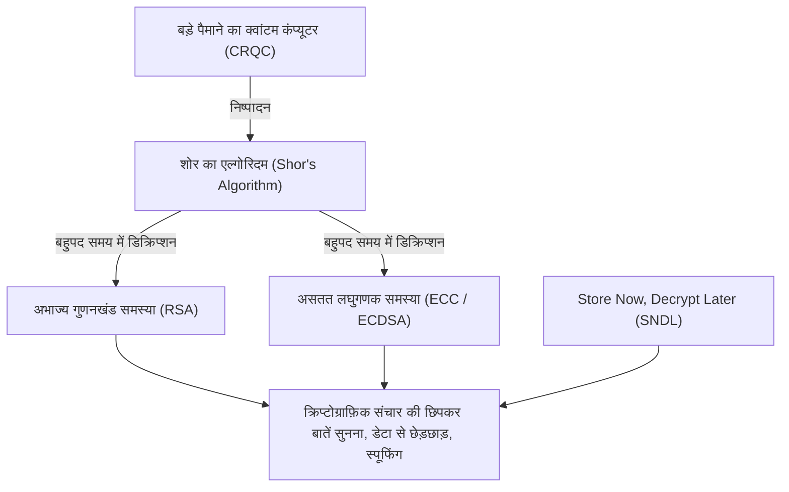
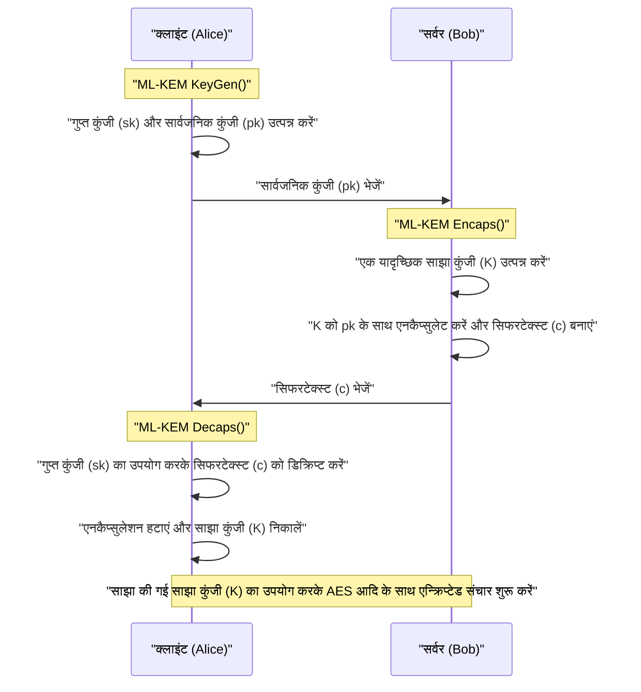
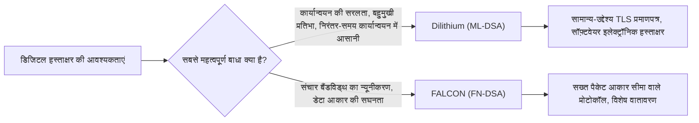

## 1. परिचय: क्वांटम कंप्यूटर द्वारा लाया गया 'क्रिप्टोग्राफी संकट'

आधुनिक इंटरनेट समाज में, संचार की गोपनीयता और डेटा की अखंडता की रक्षा के लिए पब्लिक-की क्रिप्टोग्राफी तकनीक बुनियादी ढांचे के रूप में अपरिहार्य है। वर्तमान में व्यापक रूप से उपयोग की जाने वाली RSA क्रिप्टोग्राफी और एलिप्टिक कर्व क्रिप्टोग्राफी (ECC), क्रमशः 'विशाल समग्र संख्याओं के अभाज्य गुणनखंड (prime factorization) की कठिनाई' और 'एलिप्टिक कर्व पर असतत लघुगणक समस्या (discrete logarithm problem) की कठिनाई' जैसी गणितीय बाधाओं पर निर्भर करके सुरक्षा सुनिश्चित करती हैं। शास्त्रीय कंप्यूटरों (सुपर कंप्यूटर सहित वर्तमान में हम जिन कंप्यूटरों का उपयोग कर रहे हैं) के साथ, यह सिद्ध हो चुका है कि इन गणितीय समस्याओं को हल करने में ब्रह्मांड की आयु से भी अधिक समय लगेगा, और यही उनकी सुरक्षा का आधार रहा है।

हालाँकि, यह मजबूत आधार **क्वांटम कंप्यूटर** के सिद्धांत और व्यावसायीकरण की प्रगति से पूरी तरह से पलटने वाला है। 1994 में क्रिप्टोग्राफर पीटर शोर (Peter Shor) द्वारा प्रकाशित '**शोर का एल्गोरिदम (Shor\'s Algorithm)**' सैद्धांतिक रूप से साबित करता है कि यदि इसे पर्याप्त प्रदर्शन वाले फॉल्ट-टॉलरेंट जनरल-परपज क्वांटम कंप्यूटर (CRQC: Cryptographically Relevant Quantum Computer) पर निष्पादित किया जाए, तो अभाज्य गुणनखंड समस्या और असतत लघुगणक समस्या को 'बहुपद समय (polynomial time)' में डिक्रिप्ट किया जा सकता है। इसका मतलब है कि वर्तमान में उपयोग की जाने वाली सभी पब्लिक-की क्रिप्टोग्राफी बेकार हो जाएंगी।



यह सोचना कि 'कोई समस्या नहीं है क्योंकि पूर्ण विकसित क्वांटम कंप्यूटर के पूरा होने में अभी दशकों बाकी हैं' बहुत खतरनाक है। क्योंकि, **Store Now, Decrypt Later (SNDL: अभी स्टोर करें, बाद में डिक्रिप्ट करें)** नामक हमले का तरीका पहले ही एक वास्तविक खतरा बन चुका है। यह एक ऐसा हमला है जहाँ दुर्भावनापूर्ण राष्ट्र या हैकर संगठन वर्तमान एन्क्रिप्टेड संचार डेटा (जैसे TLS ट्रैफ़िक) को बड़ी मात्रा में स्टोरेज में सहेज कर रखते हैं, और भविष्य में जैसे ही शक्तिशाली क्वांटम कंप्यूटर उपलब्ध होंगे, वे उन सभी को डिक्रिप्ट कर देंगे। राष्ट्रीय रहस्य, बुनियादी ढांचे की जानकारी, और चिकित्सा डेटा जिन्हें लंबे समय तक संरक्षित किया जाना चाहिए, पहले से ही इस खतरे के संपर्क में हैं।

इसके अलावा, सममित-कुंजी क्रिप्टोग्राफी (Symmetric-key cryptography जैसे AES) और हैश फ़ंक्शंस (जैसे SHA-256) के खिलाफ 1996 में खोजा गया **ग्रोवर का एल्गोरिदम (Grover's Algorithm)** मौजूद है। यह ब्रूट-फोर्स हमले (brute-force attack) की कम्प्यूटेशनल जटिलता को वर्गमूल (square root) तक कम कर देता है। दूसरे शब्दों में, AES-128 का सुरक्षा स्तर प्रभावी रूप से 2^64 तक आधा हो जाता है, इसलिए क्वांटम युग में AES-256 या SHA-384 जैसी लंबी कुंजियों या हैश लंबाई का उपयोग करने की सिफारिश की जाती है।

इस अभूतपूर्व क्रिप्टोग्राफ़िक संकट का मुकाबला करने के लिए, **पोस्ट-क्वांटम क्रिप्टोग्राफी (PQC)** का जन्म हुआ, जो नई गणितीय समस्याओं पर आधारित है जिन्हें क्वांटम कंप्यूटर का उपयोग करके भी हल करना मुश्किल है। इस लेख में, हम यू.एस. नेशनल इंस्टीट्यूट ऑफ स्टैंडर्ड एंड टेक्नोलॉजी (NIST) के नेतृत्व में PQC मानकीकरण प्रक्रिया के परिणामों के आधार पर प्रमुख PQC एल्गोरिदम के गणितीय पृष्ठभूमि, तंत्र और वास्तुकला की तुलना के बारे में विस्तार से बताएंगे।

---

## 2. NIST PQC मानकीकरण परियोजना का पूरा अवलोकन और इतिहास

क्रिप्टोग्राफ़िक तकनीक के संक्रमण में, प्रोटोकॉल के पुन: डिज़ाइन, सिस्टम अपडेट और हार्डवेयर प्रतिस्थापन आदि सहित कई वर्षों से लेकर दशकों तक का समय लगता है। इसलिए, दुनिया भर के क्रिप्टोग्राफ़रों ने बहुत पहले से PQC पर शोध करना शुरू कर दिया था। संयुक्त राज्य अमेरिका का NIST (नेशनल इंस्टीट्यूट ऑफ स्टैंडर्ड एंड टेक्नोलॉजी) इसमें केंद्रीय भूमिका निभा रहा है। NIST ने 2016 में PQC मानकीकरण प्रक्रिया के लिए आवेदन आमंत्रित किए और दुनिया भर के क्रिप्टोग्राफ़िक समुदाय से पूरी तरह से नए क्रिप्टोग्राफ़िक एल्गोरिदम के प्रस्ताव स्वीकार किए।

मानकीकरण के लक्ष्य निम्नलिखित 2 मुख्य श्रेणियां थीं:
1. **पब्लिक-की क्रिप्टोग्राफी / की एनकैप्सुलेशन मैकेनिज्म (KEM: Key Encapsulation Mechanism)**: TLS कनेक्शन आदि में संचार पथ को एन्क्रिप्ट करने के लिए सुरक्षित रूप से एक साझा कुंजी (common key) साझा (वितरित) करने का तंत्र।
2. **डिजिटल हस्ताक्षर (Digital Signatures)**: सॉफ़्टवेयर अपडेट और डिजिटल प्रमाणपत्रों में यह साबित करने का तंत्र कि डेटा के साथ कोई छेड़छाड़ नहीं की गई है और प्रेषक की पहचान सही है (प्रामाणिकता)।

लगभग 6 वर्षों के गहन मूल्यांकन, विश्लेषण और डिक्रिप्शन प्रतियोगिता (राउंड 1 से राउंड 3) के बाद, कुछ एल्गोरिदम के लिए राउंड 4 का अतिरिक्त मूल्यांकन किया गया। परिणामस्वरूप, 2024 में निम्नलिखित एल्गोरिदम औपचारिक संघीय सूचना प्रसंस्करण मानक (FIPS) के रूप में जारी किए गए और भविष्य के वैश्विक मानकों के रूप में स्थापित किए गए।

- **FIPS 203 (ML-KEM)**: CRYSTALS-Kyber पर आधारित KEM
- **FIPS 204 (ML-DSA)**: CRYSTALS-Dilithium पर आधारित डिजिटल हस्ताक्षर
- **FIPS 205 (SLH-DSA)**: SPHINCS+ पर आधारित स्टेटलेस हैश-आधारित हस्ताक्षर
- **(भविष्य की योजना) FN-DSA**: FALCON पर आधारित डिजिटल हस्ताक्षर

ये चयनित एल्गोरिदम विभिन्न गणितीय 'कठिनाई समस्याओं' पर निर्भर करते हैं, ताकि यदि भविष्य में किसी एक एल्गोरिदम में कोई गंभीर भेद्यता पाई जाती है, तो संपूर्ण सिस्टम ध्वस्त न हो और विविधता (Crypto Agility) सुनिश्चित की जा सके। मानकीकरण प्रक्रिया में, लैटिस-आधारित क्रिप्टोग्राफी (Lattice-based cryptography) ने मुख्य रूप से प्रदर्शन के मामले में प्रमुख भूमिका निभाई, लेकिन हैश-आधारित क्रिप्टोग्राफी और कोड-आधारित क्रिप्टोग्राफी को शक्तिशाली बैकअप के रूप में अपनाया गया है।

---

## 3. PQC के प्रमुख गणितीय दृष्टिकोणों का वर्गीकरण

PQC एल्गोरिदम को मुख्य रूप से 5 श्रेणियों में विभाजित किया गया है, जो उनकी सुरक्षा के आधार पर गणितीय समस्याओं पर निर्भर करते हैं। इस लेख में, हम विशेष रूप से शीर्ष 3 के बारे में विस्तार से जानेंगे।

1. **लैटिस-आधारित क्रिप्टोग्राफी (Lattice-based Cryptography)**:
   यह बहुआयामी लैटिस स्पेस में शॉर्टेस्ट वेक्टर प्रॉब्लम (SVP) और क्लोजेस्ट वेक्टर प्रॉब्लम (CVP), और उनसे प्राप्त LWE समस्या पर आधारित है। यह NIST मानकीकरण का केंद्र है, और इसमें Kyber, Dilithium और FALCON शामिल हैं। यह प्रसंस्करण गति, पब्लिक कुंजी आकार और सिफरटेक्स्ट (ciphertext) आकार का सबसे अच्छा संतुलन प्रदान करता है, और सामान्य उद्देश्य के उपयोग के लिए उपयुक्त है।
2. **हैश-आधारित क्रिप्टोग्राफी (Hash-based Cryptography)**:
   यह अपनी सुरक्षा को पूरी तरह से क्रिप्टोग्राफ़िक हैश फ़ंक्शंस (जैसे SHA-2 और SHAKE) के 'कोलिजन रेजिस्टेंस (Collision Resistance)' और 'वन-वेनेस (One-wayness)' पर आधारित करता है। यह केवल डिजिटल हस्ताक्षर (जैसे SPHINCS+) पर लागू होता है, लेकिन इसकी सुरक्षा का प्रमाण सबसे मजबूत है और यह अज्ञात गणितीय हमलों के प्रति अत्यधिक प्रतिरोधी है।
3. **कोड-आधारित क्रिप्टोग्राफी (Code-based Cryptography)**:
   त्रुटि-सुधार कोड के सिद्धांत पर आधारित, यह सिंड्रोम डिकोडिंग समस्या (Syndrome Decoding Problem) की कठिनाई पर निर्भर करता है। 1970 के दशक में प्रस्तावित Classic McEliece इसका प्रतिनिधि है, जिसका इतिहास बहुत लंबा है और सुरक्षा का ट्रैक रिकॉर्ड सिद्ध है, लेकिन दूसरी ओर, पब्लिक-की का आकार बहुत बड़ा (मेगाबाइट में) होता है।
4. **मल्टीवेरिएट पॉलीनोमियल क्रिप्टोग्राफी (Multivariate Polynomial Cryptography)**:
   परिमित क्षेत्र (finite field) पर मल्टीवेरिएट क्वाड्रैटिक समीकरणों की प्रणाली को हल करने की कठिनाई (MQ समस्या) पर आधारित है। इसे मुख्य रूप से डिजिटल हस्ताक्षर (जैसे Rainbow) के रूप में प्रस्तावित किया गया था, लेकिन NIST के अंतिम दौर के दौरान एक शक्तिशाली हमले की विधि खोजी गई जिसने इसे एक साधारण पीसी पर कुछ दिनों में क्रैक कर दिया, जिसके कारण कई एल्गोरिदम मानकीकरण से बाहर हो गए।
5. **आइसोजेनी-आधारित क्रिप्टोग्राफी (Isogeny-based Cryptography)**:
   एलिप्टिक कर्व्स के आइसोजेनी ग्राफ पर पथ-खोज समस्या (Path-finding problem) पर आधारित है। कुंजी का आकार बहुत छोटा है, और इसे ECC का सही उत्तराधिकारी माना जा रहा था, लेकिन अंतिम उम्मीदवार 'SIKE' को 2022 में क्लासिकल गणित (Castryck-Decru हमले आदि) का उपयोग करके एक साधारण पीसी पर कुछ ही घंटों में पूरी तरह से डिक्रिप्ट कर दिया गया, जो PQC डिजाइन की कठिनाई और खतरे का प्रतीक एक नाटकीय अंत था।

---

## 4. लैटिस क्रिप्टोग्राफी की गहराई: LWE समस्या और Module-LWE की गणितीय नींव

वर्तमान में सबसे आशाजनक माना जाने वाला और मानकीकरण का केंद्र **लैटिस क्रिप्टोग्राफी (Lattice-based cryptography)** है। इसकी सुरक्षा का आधार **LWE समस्या (Learning with Errors)** है। इसे 2005 में ओडेड रेगेव (Oded Regev) द्वारा प्रस्तावित किया गया था, और इस ऐतिहासिक उपलब्धि के लिए उन्हें गोडेल पुरस्कार (Gödel Prize) से सम्मानित किया गया। LWE समस्या को समझे बिना आधुनिक PQC के बारे में बात करना असंभव है।

### 4.1. LWE समस्या (Learning with Errors) क्या है?

सबसे पहले, आइए एक सरल रैखिक समीकरण प्रणाली (linear equation system) पर विचार करें। मान लीजिए कि किसी मॉड्यूलस $q$ (मॉड्यूलो $q$) के तहत एक ज्ञात यादृच्छिक (random) मैट्रिक्स $A$ है, एक अज्ञात गुप्त वेक्टर $\vec{s}$ है, और उनका गुणनफल $\vec{b}$ दिया गया है।

$$ \vec{b} = A\vec{s} \pmod q $$

इस समय, सार्वजनिक जानकारी $A$ और $\vec{b}$ से अज्ञात $\vec{s}$ को खोजना आसान है। यदि हम 'गौसियन एलिमिनेशन (Gaussian elimination)' जैसे शास्त्रीय एल्गोरिदम का उपयोग करते हैं, तो हम आसानी से बहुपद समय में $\vec{s}$ की गणना कर सकते हैं।

हालाँकि, यदि हम इस समीकरण में 'छोटी जानबूझकर की गई त्रुटि (शोर/noise)' जोड़ते हैं, तो समस्या की कठिनाई नाटकीय रूप से बढ़ जाती है। यही **LWE समस्या** है।

एक अज्ञात गुप्त वेक्टर $\vec{s} \in \mathbb{Z}_q^n$ और एक बेतरतीब ढंग से चुना गया मैट्रिक्स $A \in \mathbb{Z}_q^{m \times n}$ तैयार करें। इसके अलावा, एक त्रुटि वेक्टर $\vec{e} \in \mathbb{Z}_q^m$ तैयार करें जिसे सामान्य वितरण (normal distribution) या द्विपद वितरण (binomial distribution) के अनुसार चुना गया हो और जिसके 'तत्वों का मान पर्याप्त रूप से छोटा' हो, और $\vec{b}$ की गणना निम्नानुसार करें:

$$ \vec{b} = A\vec{s} + \vec{e} \pmod q $$

**Search LWE समस्या** वह समस्या है जिसमें 'सार्वजनिक जानकारी $(A, \vec{b})$ से गुप्त जानकारी $\vec{s}$ को खोजना' होता है। इस त्रुटि $\vec{e}$ की उपस्थिति के कारण, यदि हम गौसियन एलिमिनेशन जैसे बीजगणितीय समाधान (algebraic solution) करने का प्रयास करते हैं, तो समीकरणों को जोड़ने और घटाने की प्रक्रिया में त्रुटि $\vec{e}$ बहुत अधिक बढ़ जाती है, और अंततः यह यादृच्छिक मूल्यों से अप्रभेद्य हो जाती है और विफल हो जाती है।

LWE समस्या की महानता इस तथ्य में निहित है कि एक मजबूत सैद्धांतिक प्रमाण (reduction) मौजूद है कि जब तक कोई ऐसा क्वांटम एल्गोरिदम नहीं है जो लैटिस पर 'वर्स्ट-केस हार्डनेस (Worst-case hardness)' समस्याओं जैसे कि GapSVP (Decision Shortest Vector Problem) या SIVP (Shortest Independent Vector Problem) को हल कर सके, LWE समस्या को भी औसत मामले (Average-case) में हल नहीं किया जा सकता है। दूसरे शब्दों में, भले ही क्रिप्टोग्राफ़िक कुंजी बेतरतीब ढंग से उत्पन्न हो, यह गारंटी दी जाती है कि इसमें सैद्धांतिक ऊपरी सीमा द्वारा समर्थित मजबूत सुरक्षा है।

### 4.2. Ring-LWE और Module-LWE द्वारा नाटकीय दक्षता सुधार

सामान्य LWE समस्या (Standard LWE) में सुरक्षा का बहुत स्पष्ट आधार होता है, लेकिन मैट्रिक्स $A$ का आकार बहुत बड़ा हो जाता है, और कुंजी का आकार मेगाबाइट-श्रेणी का हो जाता है, जो व्यावहारिक नहीं है। इसलिए, पॉलीनोमियल रिंग्स (Polynomial Rings) का उपयोग करके एक बीजगणितीय संरचना बनाने का दृष्टिकोण प्रस्तावित किया गया था।

**Ring-LWE समस्या** में, साधारण वैक्टर या मैट्रिक्स के बजाय, हम एक निश्चित बहुपद वलय (polynomial ring) $R_q$ के तत्वों (बहुपद) का उपयोग करते हैं। NIST मानक आमतौर पर निम्नलिखित जैसे साइक्लोटोमिक बहुपद वलय (cyclotomic polynomial ring) का उपयोग करता है:

$$ R_q = \mathbb{Z}_q[X]/(X^n + 1) $$

यहाँ, $n$ 2 की घात (power of 2) (जैसे: 256) है, और $q$ एक उपयुक्त अभाज्य संख्या (prime number) है। इस रिंग पर, हम $b = a \cdot s + e \pmod q$ की गणना करने के लिए तत्वों $a, s, e \in R_q$ का उपयोग करते हैं। चूंकि एक बहुपद $a$ में $n$ गुणांक (coefficients) होते हैं, डेटा को काफी संपीड़ित (compressed) किया जा सकता है। इसके अलावा, **NTT (Number Theoretic Transform)** का उपयोग करके, जो कि फास्ट फूरियर ट्रांसफॉर्म (FFT) का एक परिमित क्षेत्र (finite field) संस्करण है, बहुपदों का गुणन $O(n \log n)$ की कम्प्यूटेशनल जटिलता के साथ बहुत तेज गति से संभव हो जाता है।

हालाँकि, Ring-LWE के साथ यह चिंता थी कि 'रिंग की विशेष बीजगणितीय संरचना के कारण अज्ञात कमजोरियाँ मौजूद हो सकती हैं'। इसके अलावा, जब सुरक्षा स्तर (जैसे AES-128, 192, 256 समतुल्य) बदलते हैं, तो बहुपद की डिग्री $n$ को ही बदलना पड़ता था, और इसके साथ NTT एल्गोरिदम आदि जैसे संपूर्ण कार्यान्वयन को फिर से लिखना पड़ता था, जो एक इंजीनियरिंग चुनौती थी।

इसलिए, मानकीकृत एल्गोरिदम Kyber और Dilithium ने **Module-LWE (M-LWE) समस्या** को अपनाया। Module-LWE संरचनाहीन Standard LWE और अत्यधिक संरचित Ring-LWE के बीच एक समझौता है, और बहुपद वलय $R_q$ के तत्वों से बने $k \times k$ मैट्रिक्स (मॉड्यूल) का उपयोग करता है।

$$ \vec{b} = A\vec{s} + \vec{e} \pmod{R_q} \quad (A \in R_q^{k \times k}, \vec{s}, \vec{e} \in R_q^k) $$

Module-LWE का सबसे बड़ा लाभ यह है कि बहुपद की डिग्री $n$ (NIST मानक में $n=256$) को स्थिर रखते हुए, मैट्रिक्स के आयाम (dimension) $k$ को बदलकर सुरक्षा स्तर को आसानी से बढ़ाया या घटाया जा सकता है।
उदाहरण के लिए, Kyber के मामले में, आयाम $k$ को निम्नानुसार समायोजित किया गया है:
- **Kyber512 (Level 1)**: $k = 2$ (AES-128 समतुल्य)
- **Kyber768 (Level 3)**: $k = 3$ (AES-192 समतुल्य)
- **Kyber1024 (Level 5)**: $k = 4$ (AES-256 समतुल्य)

इससे सभी सुरक्षा स्तरों पर बुनियादी NTT कोड और बहुपद गणना हार्डवेयर सर्किट का 100% पुन: उपयोग करना संभव हो गया, जिससे कार्यान्वयन की सुरक्षा और दक्षता में नाटकीय रूप से सुधार हुआ।

---

## 5. CRYSTALS-Kyber (ML-KEM): अगली पीढ़ी का की एनकैप्सुलेशन मैकेनिज्म (Key Encapsulation Mechanism)

**FIPS 203 (ML-KEM)** के रूप में औपचारिक रूप से मानकीकृत CRYSTALS-Kyber, उपर्युक्त Module-LWE समस्या पर आधारित एक की एनकैप्सुलेशन मैकेनिज्म (KEM) है। यह भविष्य में TLS 1.3 और SSH आदि में सत्र कुंजियों (session keys) को सुरक्षित रूप से साझा करने के लिए वास्तविक वैश्विक मानक बन जाएगा।

### 5.1. KEM (Key Encapsulation Mechanism) वास्तुकला (Architecture)

PQC युग में, RSA की तरह 'क्लाइंट एक साझा कुंजी बनाता है और इसे सर्वर की सार्वजनिक कुंजी के साथ एन्क्रिप्ट करके भेजता है' के सीधे दृष्टिकोण के बजाय, KEM का एनकैप्सुलेशन ढांचा मानक होगा।



### 5.2. Kyber के आंतरिक एल्गोरिदम का तंत्र और फुजिसाकी-ओकामोटो (Fujisaki-Okamoto) ट्रांसफॉर्म

Kyber का डिज़ाइन बहुत ही परिष्कृत है। सबसे पहले, यह एक पब्लिक-की क्रिप्टोग्राफी सिस्टम (Kyber.CPAPKE) बनाता है जो केवल CPA (Chosen Plaintext Attack) के खिलाफ सुरक्षित है, और फिर उस पर **फुजिसाकी-ओकामोटो ट्रांसफॉर्म (Fujisaki-Okamoto Transform)** नामक क्रिप्टोग्राफ़िक रूप से बहुत शक्तिशाली तकनीक को लागू करके, इसे एक पूर्ण KEM में अपग्रेड करने के लिए डिज़ाइन किया गया है जो CCA (Adaptive Chosen Ciphertext Attack) के खिलाफ भी सुरक्षित है।

CPAPKE के मूल एन्क्रिप्शन और डिक्रिप्शन तंत्र इस प्रकार हैं:

1. **कुंजी निर्माण (Key Generation)**:
   - एक यादृच्छिक बीज (random seed) मान से, NTT डोमेन पर मैट्रिक्स $A \in R_q^{k \times k}$ उत्पन्न करें। मॉड्यूलस $q$ का उपयोग $3329$ किया जाता है।
   - सेंटर्ड बाइनोमियल डिस्ट्रीब्यूशन (CBD) से, छोटे गुणांक वाले गुप्त वेक्टर $\vec{s}$ और त्रुटि वेक्टर $\vec{e}$ का नमूना लें।
   - $\vec{t} = A\vec{s} + \vec{e}$ की गणना करें। सार्वजनिक कुंजी $(A, \vec{t})$ है, गुप्त कुंजी $\vec{s}$ है। (व्यवहार में $A$ को एक बीज मान के रूप में प्रकाशित किया जाता है ताकि बैंडविड्थ बचाई जा सके)।

2. **एन्क्रिप्शन (Encryption)**:
   - 32-बाइट संदेश ($m$) (साझा कुंजी की सामग्री) जिसे आप साझा करना चाहते हैं, उसे एक बहुपद में एनकोड करें।
   - एक नया यादृच्छिक वेक्टर $\vec{r}$ और छोटी त्रुटियां $\vec{e_1}, e_2$ उत्पन्न करें।
   - $\vec{u} = A^T\vec{r} + \vec{e_1}$ 
   - $v = \vec{t}^T\vec{r} + e_2 + \lfloor q/2 \rceil \cdot m$
   - सिफरटेक्स्ट $(\vec{u}, v)$ बन जाता है।

3. **डिक्रिप्शन (Decryption)**:
   - प्राप्तकर्ता $v - \vec{s}^T\vec{u}$ की गणना करता है।
   - इस समीकरण का विस्तार करने पर यह निम्न प्रकार से बन जाता है:
     $v - \vec{s}^T\vec{u} = (\vec{t}^T\vec{r} + e_2 + \lfloor q/2 \rceil \cdot m) - \vec{s}^T(A^T\vec{r} + \vec{e_1})$
   - यहाँ $\vec{t} = A\vec{s} + \vec{e}$ को प्रतिस्थापित करने पर, मुख्य पद $\vec{s}^TA^T\vec{r}$ रद्द हो जाता है।
   - जो बचता है वह है $\lfloor q/2 \rceil \cdot m + (\vec{e}^T\vec{r} + e_2 - \vec{s}^T\vec{e_1})$।
   - चूँकि कोष्ठक में दिए गए पद 'छोटी त्रुटियों के उत्पाद और योग' हैं, इसलिए वे समग्र रूप से पर्याप्त छोटे मान (शोर) तक सीमित रहते हैं। इसलिए, प्रत्येक गुणांक $0$ के करीब है या $q/2$ के करीब है, इसकी थ्रेशोल्ड निर्णय (threshold judgment) करके, मूल संदेश $m$ के बिट्स (0 या 1) को बिना किसी त्रुटि के पूरी तरह से बहाल किया जा सकता है।

Kyber की सबसे बड़ी ताकत इसकी असाधारण **प्रसंस्करण गति** और **मध्यम कुंजी का आकार** है। Kyber768 के मामले में, सार्वजनिक कुंजी का आकार 1,184 बाइट्स है, और सिफरटेक्स्ट आकार 1,088 बाइट्स है, जो RSA-3072 (लगभग 384 बाइट्स के कुंजी आकार) की तुलना में बड़ा है, लेकिन यह आधुनिक इंटरनेट संचार के MTU (Maximum Transmission Unit) के भीतर पैकेट विखंडन (packet fragmentation) के बिना फिट हो सकता है, और इसका नेटवर्क लेटेंसी पर लगभग कोई प्रतिकूल प्रभाव नहीं पड़ता है।

---

## 6. CRYSTALS-Dilithium (ML-DSA): लैटिस-आधारित सामान्य-उद्देश्य डिजिटल हस्ताक्षर

डिजिटल हस्ताक्षरों के मानकीकरण में, समान लैटिस क्रिप्टोग्राफी दृष्टिकोण के भीतर भी विभिन्न डिजाइन दर्शन वाले एल्गोरिदम ने प्रतिस्पर्धा की। उनमें से, **CRYSTALS-Dilithium** को एक सामान्य-उद्देश्य डिजिटल हस्ताक्षर के रूप में **FIPS 204 (ML-DSA)** के लिए चुना गया था।

### 6.1. Fiat-Shamir with Aborts पैराडाइम

Kyber की तरह ही, Dilithium भी Module-LWE (और Module-SIS समस्या) पर आधारित एक डिजिटल हस्ताक्षर योजना है। डिज़ाइन का आधार एक अत्यंत महत्वपूर्ण पैराडाइम का उपयोग करता है जिसे '**Fiat-Shamir with Aborts (रद्द करने के साथ फिएट-शमीर ट्रांसफॉर्म)**' कहा जाता है।

फिएट-शमीर ट्रांसफॉर्म अपने आप में एक इंटरेक्टिव ज़ीरो-नॉलेज प्रूफ़ (interactive zero-knowledge proof) प्रोटोकॉल को गैर-इंटरेक्टिव डिजिटल हस्ताक्षर में बदलने की एक मानक विधि है। प्रूवर (हस्ताक्षरकर्ता) एक कमिटमेंट $y$ उत्पन्न करता है, $w = Ay$ की गणना करता है और इसे एक हैश फ़ंक्शन के माध्यम से गुजार कर एक यादृच्छिक चुनौती (random challenge) $c$ प्राप्त करता है, और प्रतिक्रिया $z = y + cs$ की गणना करता है।

हालाँकि, यदि इसे लैटिस क्रिप्टोग्राफी में सरलता से लागू किया जाता है, तो प्रतिक्रिया $z$ का वितरण गुप्त कुंजी $s$ के मान के आधार पर विकृत हो जाता है, और एक घातक समस्या (साइड-चैनल जैसी गणितीय जानकारी लीक होना) थी कि कई हस्ताक्षरों को देखने वाला हमलावर धीरे-धीरे गुप्त कुंजी $s$ की जानकारी लीक होते हुए प्राप्त कर लेगा।

Dilithium की डिज़ाइन टीम (Lyubashevsky और अन्य) ने एक तकनीक पेश की जिसे '**रिजेक्शन सैंपलिंग (Rejection Sampling)**' कहा जाता है, जिसमें यदि हस्ताक्षर की गणना के परिणाम $z$ के गुणांक पूर्व-निर्धारित सुरक्षित थ्रेशोल्ड सीमा के भीतर नहीं आते हैं, तो संपूर्ण हस्ताक्षर प्रक्रिया को छोड़ दिया जाता है (Abort) और एक नए यादृच्छिक संख्या $y$ का उपयोग करके खरोंच से गणना फिर से की जाती है।

नतीजतन, अंतिम रूप से आउटपुट होने वाला हस्ताक्षर $z$ गुप्त कुंजी पर बिल्कुल निर्भर नहीं करता है और यह पूरी तरह से एक समान वितरण (uniform distribution) बन जाता है, जो गणितीय रूप से सूचना रिसाव को पूरी तरह से रोकने में सफल रहा।

### 6.2. Dilithium के लाभ और कार्यान्वयन में आसानी

Dilithium के डिजाइन का एक बड़ा फायदा यह है कि यह हस्ताक्षर निर्माण प्रक्रिया में जटिल 'गाऊसी वितरण (Gaussian distribution) से सैंपलिंग' या 'फ्लोटिंग-पॉइंट गणना' का **बिल्कुल उपयोग नहीं करता है**। इसे केवल एक समान वितरण (uniform distribution) से सैंपलिंग, सरल पूर्णांक मॉड्यूलो अंकगणित, NTT और हैश फ़ंक्शंस (SHAKE) के साथ लागू किया जा सकता है, जिससे एम्बेडेड माइक्रोकंट्रोलर्स से लेकर क्लाउड सर्वर तक विभिन्न प्रकार के वातावरण में इसे सुरक्षित रूप से और निरंतर समय (constant-time) में लागू करना आसान हो जाता है। इसके कारण, यह टाइमिंग हमलों (timing attacks) जैसे भौतिक साइड-चैनल हमलों (side-channel attacks) के खिलाफ भी मजबूत प्रतिरोध रखता है।

---

## 7. FALCON (FN-DSA): अत्यधिक कॉम्पैक्ट लैटिस हस्ताक्षर

NIST ने Dilithium से भिन्न विशेषताओं वाले एक अन्य लैटिस-आधारित हस्ताक्षर के रूप में **FALCON (Fast-Fourier Lattice-based Compact Signatures over NTRU)** को मानकीकरण उम्मीदवार के रूप में चुना (वर्तमान में FN-DSA के रूप में मसौदा तैयार किया जा रहा है)।

### 7.1. NTRU लैटिस और गाऊसी सैंपलिंग (Gaussian Sampling)

FALCON की सबसे बड़ी विशेषता यह है कि यह LWE समस्या के बजाय **NTRU (N-th degree Truncated polynomial Ring Units) लैटिस** का उपयोग करता है, जिसका इतिहास 1996 से काफी पुराना है। इसके अलावा, यह GPV (Gentry-Peikert-Vaikuntanathan) ढांचे पर आधारित '**हैश-एंड-साइन (Hash-and-Sign)**' पैराडाइम को अपनाता है।

Hash-and-Sign में, संदेश का हैश मान अंतरिक्ष में एक लक्ष्य बिंदु के रूप में सेट किया जाता है, और उस बिंदु के सबसे करीब लैटिस पर बिंदु (क्लोजेस्ट वेक्टर प्रॉब्लम का अनुमानित समाधान) खोजना हस्ताक्षर बन जाता है। इसके लिए, गुप्त कुंजी 'अच्छी गुणवत्ता के छोटे आधार (good short basis)' का उपयोग करके असतत गाऊसी वितरण (discrete Gaussian distribution) के अनुसार बिंदुओं का नमूना लेना आवश्यक है।

FALCON ने '**फास्ट फूरियर ऑर्थोगोनलाइज़ेशन (Fast Fourier Orthogonalization: FFO)**' नामक तकनीक का उपयोग करके इस भारी गणना को नाटकीय रूप से तेज कर दिया।

### 7.2. FALCON के फायदे और नुकसान

FALCON का जबरदस्त फायदा यह है कि इसका **हस्ताक्षर आकार और सार्वजनिक कुंजी का आकार बहुत छोटा (कॉम्पैक्ट)** है। Dilithium3 का हस्ताक्षर आकार लगभग 3,309 बाइट्स है, जबकि FALCON-512 का हस्ताक्षर आकार केवल लगभग 666 बाइट्स है। सार्वजनिक कुंजी भी 897 बाइट्स पर बहुत छोटी है, जो इसे ऐसे वातावरणों में एक तारणहार बनाती है जहाँ संचार बैंडविड्थ बेहद सीमित है, या IoT उपकरणों और विशिष्ट नेटवर्क प्रोटोकॉल के लिए।

हालाँकि, एक महत्वपूर्ण नुकसान भी है। चूँकि हस्ताक्षर उत्पन्न करते समय जटिल **फ्लोटिंग-पॉइंट गणना (64-बिट IEEE 754)** के साथ असतत गाऊसी सैंपलिंग आवश्यक है, इसलिए समय रिसाव को रोकने के लिए निरंतर-समय कार्यान्वयन (Constant-time implementation) अत्यंत कठिन है, और कोड भी बड़ा हो जाता है। इस कारण से, FALCON को सामान्य-उद्देश्य के उपयोग (Dilithium) के विपरीत एक विशिष्ट अनुप्रयोग-केंद्रित शक्तिशाली विशेष एल्गोरिदम के रूप में रखा गया है।



---

## 8. SPHINCS+ (SLH-DSA): सबसे मजबूत सुरक्षा का दावा करने वाला हैश-आधारित हस्ताक्षर

उस सबसे खराब स्थिति (एक दुर्लभ घटना) की तैयारी में कि भविष्य में एक प्रतिभाशाली गणितज्ञ की सफलता से लैटिस क्रिप्टोग्राफी की सुरक्षा टूट सकती है, NIST ने लैटिस क्रिप्टोग्राफी से बिल्कुल अलग दृष्टिकोण के साथ एक मानक के रूप में **FIPS 205 (SLH-DSA)**, यानी **SPHINCS+** तैयार किया।

SPHINCS+ को **हैश-आधारित हस्ताक्षर** के रूप में वर्गीकृत किया गया है। इसकी सुरक्षा का आधार केवल एक बात पर निर्भर करता है: 'उपयोग किए जा रहे क्रिप्टोग्राफिक हैश फ़ंक्शंस (जैसे SHA-2 और SHAKE256) में कोलिजन रेजिस्टेंस (collision resistance) और वन-वेनेस (one-wayness) है'। चूँकि यह LWE या अभाज्य गुणनखंड जैसी किसी विशिष्ट बीजगणितीय संरचना वाली गणितीय समस्याओं पर निर्भर नहीं करता है, इसलिए यह अत्यंत मजबूत सुरक्षा (सबसे रूढ़िवादी सुरक्षा) का दावा करता है जिसका भविष्य में कोई भी शक्तिशाली क्वांटम एल्गोरिदम आने पर केवल हैश फ़ंक्शन की आउटपुट लंबाई बढ़ाकर मुकाबला किया जा सकता है।

### 8.1. WOTS+ और FORS द्वारा स्टेटलेस वास्तुकला (Stateless Architecture)

हैश-आधारित हस्ताक्षरों का एक लंबा इतिहास है, जो 1970 के दशक में लैम्पोर्ट सिग्नेचर (Lamport signatures) और विंटरनिट्ज़ वन-टाइम सिग्नेचर (WOTS) तक जाता है। ये डिस्पोजेबल कुंजियां (disposable keys) थीं जिन्हें 'केवल एक बार सुरक्षित रूप से हस्ताक्षर' किया जा सकता था। इन्हें कई बार उपयोग करने योग्य बनाने के लिए, XMSS (eXtended Merkle Signature Scheme) और LMS जैसे एल्गोरिदम विकसित किए गए, जो अनगिनत वन-टाइम कुंजियों को एकल रूट हैश के साथ प्रबंधित करने के लिए मर्कल ट्री (Merkle Tree) को मिलाते हैं।

हालाँकि, XMSS और LMS में एक बड़ी खामी थी कि वे '**स्टेटफुल (Stateful)**' थे। हर बार हस्ताक्षर किए जाने पर गैर-वाष्पशील मेमोरी (non-volatile memory) में इंडेक्स स्टेट को कड़ाई से रिकॉर्ड करना आवश्यक था कि 'कौन सी वन-टाइम कुंजी का उपयोग किया गया था', और यदि वर्चुअल मशीन के स्नैपशॉट को पुनर्स्थापित करने के कारण स्टेट वापस आ जाता है और उसी वन-टाइम कुंजी का दो बार उपयोग किया जाता है, तो गुप्त कुंजी तुरंत लीक हो जाएगी और सिस्टम ढह जाएगा।

SPHINCS+ एक '**स्टेटलेस (Stateless)**' हैश-आधारित हस्ताक्षर है जिसने इस राज्य प्रबंधन (state management) की परेशानी को हल किया।
इसकी मुख्य तकनीक निम्नलिखित का संयोजन है:
1. **WOTS+ (Winternitz One-Time Signature Plus)**: एक बुनियादी वन-टाइम हस्ताक्षर।
2. **FORS (Forest of Random Subsets)**: फ्यू-टाइम सिग्नेचर (Few-Time Signature) तकनीक। एक ही कुंजी को कुछ बार पुन: उपयोग करने पर भी सुरक्षा बनाए रखता है।
3. **Hyper-Tree (विशाल वृक्ष संरचना)**: एक विशाल संरचना जिसमें मर्कल ट्री को कई परतों में एक के ऊपर পুনরায় रखा गया है।

SPHINCS+ में, हस्ताक्षर करते समय स्टेट को प्रबंधित करने के बजाय, यह हाइपर-ट्री (Hyper-Tree) के आधार पर बड़ी संख्या में FORS कुंजियों में से एक को बेतरतीब ढंग से चुनने के लिए छद्म यादृच्छिक संख्याओं (pseudo-random numbers) का उपयोग करके हस्ताक्षर करता है। चूँकि पेड़ के पत्तों की संख्या खगोलीय रूप से बड़ी होती है, इसलिए संयोग से एक ही कुंजी को दो बार चुनने की संभावना (टकराव/collision) नगण्य रूप से छोटी हो जाती है, जिसके परिणामस्वरूप स्टेटलेस प्राप्त होता है।

SPHINCS+ की एकमात्र और सबसे बड़ी कमजोरी यह है कि इसका **हस्ताक्षर आकार बहुत बड़ा है**। मापदंडों के आधार पर, हस्ताक्षर का आकार 17 किलोबाइट से 49 किलोबाइट तक पहुँच सकता है, और हस्ताक्षर बनाने की गति लैटिस क्रिप्टोग्राफी की तुलना में बहुत धीमी है। इसलिए, यह रोजमर्रा के वेब ब्राउज़िंग में उपयोग किए जाने के बजाय, सॉफ़्टवेयर अपडेट सिग्नेचर या रूट सर्टिफ़िकेट अथॉरिटी (CA) सर्टिफ़िकेट जैसे अनुप्रयोगों में उपयोग किए जाने की उम्मीद है, जहाँ हस्ताक्षर अक्सर नहीं किए जाते हैं और लंबी अवधि के लिए पूर्ण सुरक्षा की दृढ़ता से आवश्यकता होती है।

---

## 9. कोड-आधारित क्रिप्टोग्राफी: Classic McEliece नामक एक पुराना अच्छा विशालकाय (Giant)

NIST की मानकीकरण प्रक्रिया में, राउंड 4 के अंतिम उम्मीदवार के रूप में अभी भी मूल्यांकन किए जा रहे महत्वपूर्ण दृष्टिकोणों में से एक **कोड-आधारित क्रिप्टोग्राफी** का **Classic McEliece** है।

1978 में रॉबर्ट मैकएलीस (Robert McEliece) द्वारा प्रस्तावित यह एल्गोरिदम पब्लिक-की क्रिप्टोग्राफी के इतिहास में RSA के साथ सबसे पुराने एल्गोरिदम में से एक है। यह 'गोप्पा कोड (Goppa code)' नामक एक बीजगणितीय ज्यामिति कोड (algebraic geometry code) का उपयोग करता है, और संदेश में जानबूझकर त्रुटियों (शोर वेक्टर) को जोड़कर इसे एन्क्रिप्ट करता है। यह '**सिंड्रोम डिकोडिंग समस्या (Syndrome Decoding Problem)**' पर आधारित है जहाँ केवल वह व्यक्ति जिसके पास गुप्त कुंजी के रूप में गोप्पा कोड का पैरिटी-चेक मैट्रिक्स (parity-check matrix) है, वह शक्तिशाली त्रुटि-सुधार (error-correction) क्षमता का उपयोग करके त्रुटि को दूर कर सकता है और मूल संदेश को डिक्रिप्ट कर सकता है।

$$ \vec{c} = \vec{m} G + \vec{e} $$
(यहाँ $G$ एक स्क्रैम्बल्ड जनरेटर मैट्रिक्स है जो सार्वजनिक कुंजी है, $\vec{e}$ वजन $t$ का त्रुटि वेक्टर है)

Classic McEliece की आश्चर्यजनक बात इसका प्रभावशाली ट्रैक रिकॉर्ड है: **प्रस्तावित किए जाने के 40 से अधिक वर्षों के बाद, और दुनिया भर के क्रिप्टोग्राफ़रों द्वारा तीव्र डिक्रिप्शन अनुसंधान के अधीन होने के बावजूद, इसकी कोई भी मौलिक भेद्यता कभी नहीं खोजी गई है**। यह PQC के बीच सबसे अधिक 'समय-परीक्षणित मजबूत सुरक्षा' रखता है।

इसके अलावा, इसका यह लाभ है कि सिफरटेक्स्ट का आकार बहुत छोटा (केवल 100 से 200 बाइट्स) होता है। हालाँकि, एक घातक खामी है कि **सार्वजनिक कुंजी का आकार मेगाबाइट (MB) में होता है**। सबसे निचले सुरक्षा स्तर (AES-128 समतुल्य) पर भी, सार्वजनिक कुंजी लगभग 250KB है, और उच्च स्तरों पर यह 1MB से अधिक हो जाती है।

इस कारण से, यह उन अनुप्रयोगों के लिए बिल्कुल लागू नहीं है जो TLS हैंडशेक की तरह संचार के हर बार नेटवर्क पर सार्वजनिक कुंजी भेजते हैं। हालाँकि, विशेष उपयोग के मामलों में जहाँ सार्वजनिक कुंजी को पहले से सिस्टम में रखा जा सकता है, जैसे कि VPN प्री-शेयर्ड कुंजियों का आदान-प्रदान, फ़र्मवेयर में सार्वजनिक कुंजियों को हार्डकोडिंग करना, या उपग्रह संचार, इसकी मजबूत सुरक्षा के कारण इसे एक अत्यंत आशाजनक विकल्प के रूप में माना जाना जारी है।

---

## 10. प्रत्येक PQC एल्गोरिदम के प्रदर्शन की तुलना और ट्रेड-ऑफ़ (Trade-offs)

अब तक बताए गए प्रमुख एल्गोरिदम के संबंध में, सामान्य सुरक्षा स्तरों (NIST Level 2 से 3 समतुल्य, AES-128 से 192 स्तर) पर प्रदर्शन विशेषताओं को निम्न तालिका में संक्षेपित किया गया है।

| एल्गोरिदम (मानक नाम) | श्रेणी | गणितीय आधार | सार्वजनिक कुंजी का आकार | गुप्त कुंजी का आकार | सिफरटेक्स्ट/हस्ताक्षर का आकार | प्रसंस्करण गति की प्रवृत्ति | मुख्य विशेषताएं और अनुप्रयोग |
| :--- | :--- | :--- | :--- | :--- | :--- | :--- | :--- |
| **Kyber768**<br>(ML-KEM) | KEM | Module-LWE | 1,184 Bytes | 2,400 Bytes | 1,088 Bytes | बहुत तेज़ | कुंजी के आकार और गति का सबसे अच्छा संतुलन। TLS 1.3 आदि के लिए सामान्य KEM मानक। |
| **Dilithium3**<br>(ML-DSA) | हस्ताक्षर | Module-LWE | 1,952 Bytes | 4,032 Bytes | 3,309 Bytes | निर्माण और सत्यापन दोनों में तेज़ | सरल कार्यान्वयन। सामान्य-उद्देश्य डिजिटल हस्ताक्षर मानक। |
| **FALCON-512**<br>(FN-DSA) | हस्ताक्षर | NTRU लैटिस | 897 Bytes | 1,281 Bytes | 666 Bytes | हस्ताक्षर निर्माण धीमा है, सत्यापन बहुत तेज़ | अत्यंत छोटा हस्ताक्षर आकार। हालाँकि फ्लोटिंग-पॉइंट गणना आवश्यक है। एम्बेडेड/IoT के लिए। |
| **SPHINCS+**<br>(SLH-DSA) | हस्ताक्षर | हैश फ़ंक्शन | 32 Bytes | 64 Bytes | लगभग 17,000 Bytes | निर्माण बहुत धीमा है | गणितीय विफलता का जोखिम लगभग शून्य है। रूट प्रमाणपत्र आदि जैसे उच्च-सुरक्षा अनुप्रयोग। |
| **Classic McEliece** | KEM | Goppa कोड | **लगभग 1.04 MB** | 13,568 Bytes | **188 Bytes** | एनकैप्सुलेशन तेज़ है | 40 वर्षों का सुरक्षा ट्रैक रिकॉर्ड। सार्वजनिक कुंजी विशाल है। उन वातावरणों के लिए जहाँ हार्डकोडिंग संभव है। |

### ट्रेड-ऑफ़ (Trade-offs) को समझना
PQC की दुनिया में, कोई एकल जादुई एल्गोरिदम नहीं है जो 'आकार में छोटा, गति में तेज़, और गणितीय गारंटी में परिपूर्ण' हो।
- **इंटरनेट मानक (Kyber / Dilithium)**: इनके प्रदर्शन का संतुलन सबसे अच्छा है और ये वर्तमान RSA/ECC से ड्रॉप-इन रिप्लेसमेंट (सीधे प्रतिस्थापित करने) के लिए सबसे उपयुक्त हैं।
- **अत्यधिक रूढ़िवादिता (SPHINCS+)**: यदि आप भविष्य की गणितीय सफलताओं के खिलाफ पूर्ण बीमा चाहते हैं, भले ही इसके लिए डेटा आकार और प्रसंस्करण गति का बलिदान देना पड़े, तो इसे चुना जाता है।
- **विशेष वातावरण के लिए (FALCON / Classic McEliece)**: ये विशेष हथियार हैं जिन्हें पर्यावरणीय बाधाओं के अनुसार चुना जाता है, जैसे कि जब संचार बैंडविड्थ बेहद संकीर्ण होती है, या पूर्व-वितरण संभव होता है।

---

## 11. व्यावसायीकरण की चुनौतियाँ और 'हाइब्रिड क्रिप्टोग्राफी (Hybrid Cryptography)' का व्यावहारिक समाधान

NIST के मानकीकरण के पूरा होने और FIPS मानकों के आधिकारिक तौर पर जारी होने के साथ, दुनिया भर में IT बुनियादी ढांचे का PQC संक्रमण (**PQC माइग्रेशन**) पूरी लगन से शुरू हो गया है। Google का क्रोम ब्राउज़र, Apple का iMessage (PQ3 प्रोटोकॉल), और Cloudflare जैसे नेटवर्क प्रदाताओं ने पहले ही अपने प्रोटोकॉल में PQC समर्थन लागू कर दिया है और वास्तविक संचालन शुरू कर दिया है।

हालाँकि, अचानक पूरी तरह से नए क्रिप्टोग्राफ़िक एल्गोरिदम में स्विच करने में बहुत अधिक जोखिम शामिल है। यदि कुछ वर्षों में कोई प्रतिभाशाली गणितज्ञ Kyber जैसे लैटिस क्रिप्टोग्राफी के खिलाफ एक घातक हमले का तरीका (एक गणितीय दोष जिसे शास्त्रीय कंप्यूटर से भी हल किया जा सकता है) खोज लेता है, तो उस पर निर्भर संपूर्ण सिस्टम एक पल में पूरी तरह से कमजोर हो जाएगा।

इस अनिश्चितता के जोखिम को कम करने के लिए एक व्यावहारिक और अनुशंसित दृष्टिकोण '**हाइब्रिड क्रिप्टोग्राफी (Hybrid Cryptography)**' है।

हाइब्रिड क्रिप्टोग्राफी में, कुंजियों का आदान-प्रदान वर्तमान क्लासिकल क्रिप्टोग्राफी के लंबे ट्रैक रिकॉर्ड (उदा: X25519 जैसी एलिप्टिक कर्व क्रिप्टोग्राफी) और नए PQC (उदा: Kyber768) दोनों का एक साथ उपयोग करके किया जाता है। प्रत्येक एल्गोरिदम अलग-अलग साझा कुंजी घटकों को उत्पन्न करता है, और अंततः दोनों घटकों को मिश्रित करने और अंतिम मास्टर सीक्रेट उत्पन्न करने के लिए एक सुरक्षित की डेरिवेशन फ़ंक्शन (Key Derivation Function: KDF) का उपयोग किया जाता है।

```mermaid
graph TD
    A["क्लाइंट"] -->|① X25519 सार्वजनिक कुंजी + Kyber सार्वजनिक कुंजी भेजें| B["सर्वर"]
    B -->|② X25519 साझा कुंजी + Kyber एनकैप्सुलेटेड सिफरटेक्स्ट वापस भेजें| A
    A --> C{"मास्टर सीक्रेट व्युत्पत्ति (KDF)"}
    B --> C
    C -->|इनपुट: (X25519 साझा कुंजी) || (Kyber साझा कुंजी)| D["सुरक्षित संचार कुंजी (AES-256 / ChaCha20)"]
    D -->|"क्वांटम खतरों और क्लासिकल कमजोरियों दोनों के प्रति प्रतिरोधी"| E["सुरक्षित हाइब्रिड क्रिप्टोग्राफ़िक संचार (TLS 1.3)"]
```

यह एक मजबूत टू-टियर सुरक्षा सुनिश्चित करता है, जहाँ 'यदि क्वांटम कंप्यूटर एक वास्तविकता बन जाते हैं और ECC टूट जाता है, तो Kyber संचार की रक्षा करेगा', और इसके विपरीत, 'यदि Kyber में कोई अज्ञात गणितीय दोष पाया जाता है, तो ECC संचार की रक्षा करेगा'। एक विशिष्ट उदाहरण के रूप में, IETF द्वारा मानकीकृत किया जा रहा **X25519MLKEM768 (पूर्व में X25519Kyber768)** मसौदा है, और वर्तमान में वेब ब्राउज़र और अत्याधुनिक सर्वरों के बीच संचार इस हाइब्रिड पद्धति का उपयोग करके किया जाता है।

इसके अलावा, सिस्टम डिज़ाइन में, **क्रिप्टो एजिलिटी (Crypto Agility)** की अवधारणा, जिसका अर्थ है 'विशिष्ट क्रिप्टोग्राफ़िक एल्गोरिदम पर अत्यधिक निर्भर न होना, और यदि कोई एल्गोरिदम विफल हो जाता है तो जल्दी से किसी अन्य एल्गोरिदम (उदा: Kyber से McEliece, Dilithium से SPHINCS+) में स्विच करने में सक्षम वास्तुकला बनाना', भविष्य के सिस्टम विकास के लिए एक आवश्यक आवश्यकता बन जाएगी।

---

## 12. निष्कर्ष: क्रिप्टोग्राफ़िक तकनीक का एक नया क्षितिज

क्वांटम कंप्यूटर, मानवता की स्वप्निल तकनीक, विडंबना यह है कि उन 'अभाज्य गुणनखंड' और 'असतत लघुगणक समस्या' की गणितीय बाधाओं को तोड़ने का सबसे बड़ा खतरा बन गई है जिन पर हमने कई वर्षों से भरोसा किया था। हालाँकि, इसके आगे झुकने के बजाय, दुनिया भर के क्रिप्टोग्राफ़रों ने लैटिस थ्योरी (lattice theory), हैश फ़ंक्शन ट्री और एरर-करेक्शन कोड जैसे अधिक जटिल और गहन बहुआयामी गणितीय क्षेत्रों का बीड़ा उठाया है, और पोस्ट-क्वांटम क्रिप्टोग्राफी (PQC) नामक एक नई बाधा बनाई है।

NIST द्वारा FIPS 203 (ML-KEM), FIPS 204 (ML-DSA), और FIPS 205 (SLH-DSA) का मानकीकरण पूरा होना कोई लक्ष्य नहीं है। यह PQC माइग्रेशन नामक महाकाव्य यात्रा का पहला कदम है जो आने वाले दशकों तक जारी रहेगा। सॉफ्टवेयर इंजीनियरों और सिस्टम आर्किटेक्ट्स के लिए, नेटवर्क प्रोटोकॉल और सिस्टम के लिए इन नए एल्गोरिदम द्वारा लाए गए 'कुंजी के आकार में वृद्धि' और 'कम्प्यूटेशनल लागत में परिवर्तन' को कैसे अनुकूल रूप से ढालना है, यह आगे चलकर एक बड़ी तकनीकी चुनौती होगी।

क्वांटम कंप्यूटर और क्रिप्टोग्राफी के बीच की लड़ाई एक रोमांचक क्षेत्र है जहाँ मानव का गणितीय अन्वेषण और तकनीकी विकास सबसे अधिक तीव्रता से मिलते हैं। मुझे उम्मीद है कि इस लेख के माध्यम से, आपको PQC के पीछे के सुंदर गणितीय सिद्धांत और साइबर सुरक्षा के भविष्य को आकार देने वाले प्रत्येक एल्गोरिदम के अद्भुत तंत्र की गहरी समझ प्राप्त हुई है।

---
*References:*
* *NIST Post-Quantum Cryptography Standardization Program*
* *FIPS 203: Module-Lattice-Based Key-Encapsulation Mechanism Standard*
* *FIPS 204: Module-Lattice-Based Digital Signature Standard*
* *FIPS 205: Stateless Hash-Based Digital Signature Standard*

