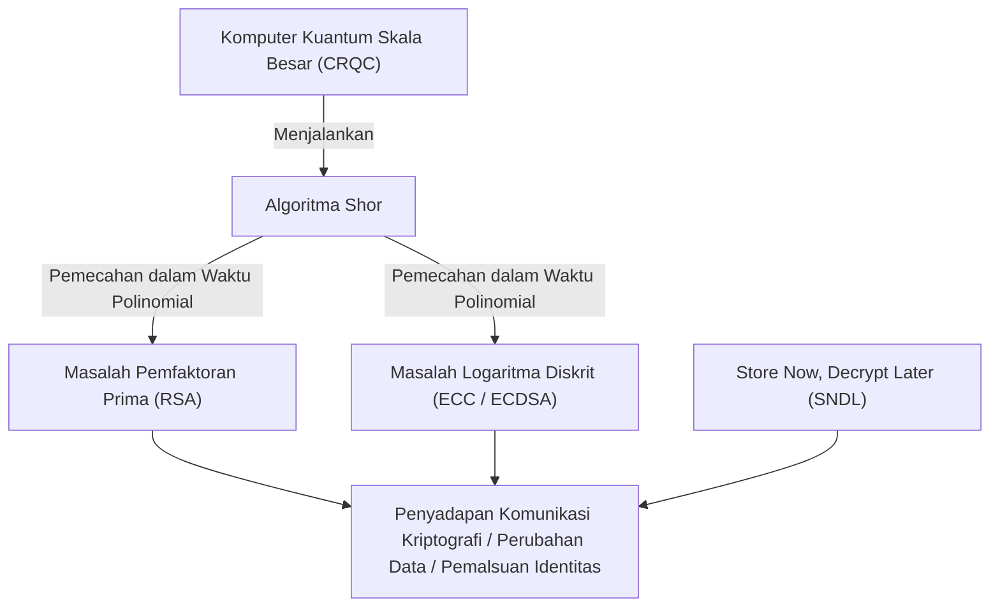
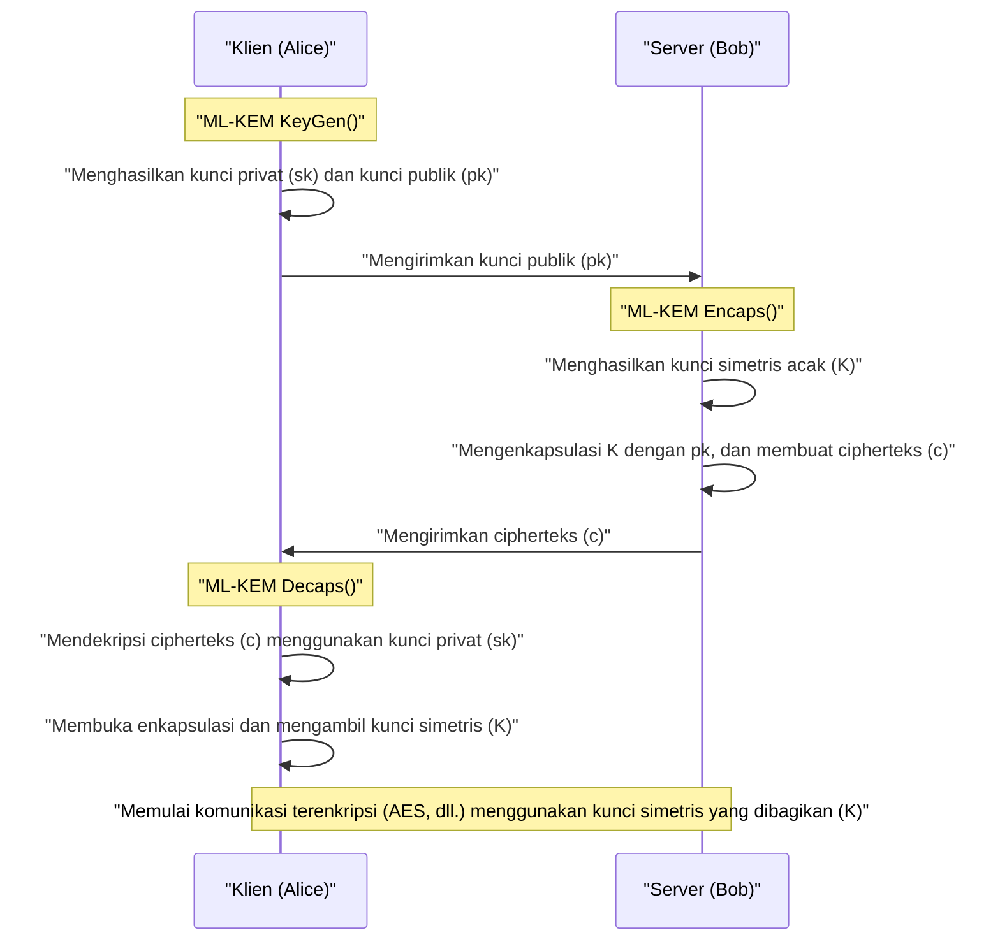
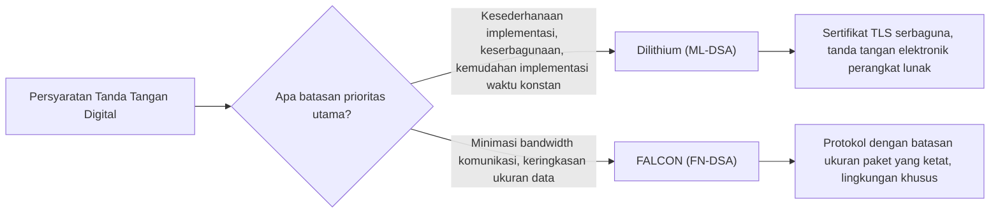

## 1. Pendahuluan: "Krisis Kriptografi" yang Dibawa oleh Komputer Kuantum

Dalam masyarakat internet modern, teknologi kriptografi kunci publik sangat diperlukan sebagai infrastruktur untuk melindungi kerahasiaan komunikasi dan integritas data. Kriptografi RSA dan Kriptografi Kurva Eliptik (ECC) yang banyak digunakan saat ini, masing-masing bergantung pada penghalang matematis berupa "kesulitan pemfaktoran bilangan komposit besar" dan "kesulitan masalah logaritma diskrit pada kurva eliptik" untuk menjamin keamanannya. Pada komputer klasik (termasuk superkomputer yang kita gunakan saat ini), telah dibuktikan bahwa memecahkan masalah matematis ini membutuhkan waktu yang lebih lama dari usia alam semesta, yang mana hal ini menjadi dasar dari keamanan tersebut.

Namun, premis yang kokoh ini akan dirobohkan oleh teori dan kemajuan praktis dari **komputer kuantum**. Pada tahun 1994, kriptografer Peter Shor menerbitkan "**Algoritma Shor**", yang secara teoretis membuktikan bahwa masalah pemfaktoran prima dan logaritma diskrit dapat dipecahkan dalam "waktu polinomial" dengan menjalankannya di atas komputer kuantum toleransi kesalahan tujuan umum (CRQC: Cryptographically Relevant Quantum Computer) dengan kinerja yang memadai. Ini berarti bahwa semua kriptografi kunci publik yang digunakan saat ini akan menjadi tidak berguna.



Adalah sangat berbahaya jika berpikir bahwa "tidak ada masalah karena penyelesaian komputer kuantum secara penuh masih beberapa dekade lagi". Ini karena metode serangan yang disebut **Store Now, Decrypt Later (SNDL: Simpan Sekarang, Dekripsi Nanti)** telah menjadi ancaman nyata. Ini adalah serangan di mana negara yang berniat jahat atau kelompok peretas menyimpan sejumlah besar data komunikasi terenkripsi saat ini (seperti lalu lintas TLS) dalam penyimpanan, dan mendekripsi semuanya pada saat komputer kuantum yang kuat tersedia di masa depan. Rahasia negara, informasi infrastruktur, dan data medis yang harus dilindungi dalam jangka panjang sudah terpapar pada ancaman ini.

Selain itu, ada juga **Algoritma Grover**, yang ditemukan pada tahun 1996, yang memengaruhi kriptografi kunci simetris (seperti AES) dan fungsi hash (seperti SHA-256). Hal ini mengurangi kompleksitas komputasi serangan brute force (uji coba menyeluruh) menjadi akar kuadratnya. Dengan kata lain, tingkat keamanan AES-128 secara efektif berkurang setengahnya menjadi 2 pangkat 64, sehingga pada era kuantum, penggunaan kunci yang lebih panjang dan panjang hash seperti AES-256 dan SHA-384 direkomendasikan.

Untuk melawan krisis kriptografi yang belum pernah terjadi sebelumnya ini, **Kriptografi Pasca-Kuantum (Post-Quantum Cryptography: PQC)** dilahirkan, yang didasarkan pada masalah matematis baru yang sulit dipecahkan bahkan dengan menggunakan komputer kuantum. Berdasarkan hasil proses standarisasi PQC yang dipimpin oleh National Institute of Standards and Technology (NIST) Amerika Serikat, artikel ini akan menjelaskan secara sangat rinci mengenai algoritma PQC utama, mulai dari latar belakang matematis, mekanisme, hingga perbandingan arsitekturnya.

---

## 2. Gambaran Lengkap dan Sejarah Proyek Standarisasi PQC oleh NIST

Transisi teknologi kriptografi membutuhkan waktu dari beberapa tahun hingga puluhan tahun, termasuk mendesain ulang protokol, memperbarui sistem, dan mengganti perangkat keras. Oleh karena itu, para ahli kriptografi di seluruh dunia telah memulai penelitian PQC sejak dini. Peran utama dalam hal ini dimainkan oleh NIST (National Institute of Standards and Technology) Amerika Serikat. Pada tahun 2016, NIST secara terbuka menyerukan proses standarisasi PQC dan menerima proposal untuk algoritma kriptografi yang sama sekali baru dari komunitas kriptografi di seluruh dunia.

Target standarisasi dibagi ke dalam dua kategori utama berikut:
1. **Kriptografi Kunci Publik / Mekanisme Enkapsulasi Kunci (KEM: Key Encapsulation Mechanism)**: Mekanisme untuk membagikan (mendistribusikan) kunci simetris secara aman untuk mengenkripsi jalur komunikasi, seperti pada koneksi TLS.
2. **Tanda Tangan Digital (Digital Signatures)**: Mekanisme untuk membuktikan bahwa tidak ada gangguan pada data dan tidak ada pemalsuan identitas pengirim (otentisitas) dalam pembaruan perangkat lunak atau sertifikat elektronik.

Setelah sekitar 6 tahun evaluasi, analisis, dan kompetisi kriptanalisis yang sangat ketat (Putaran 1 hingga Putaran 3), evaluasi tambahan pada Putaran 4 dilakukan untuk beberapa algoritma. Sebagai hasilnya, pada tahun 2024, algoritma berikut secara resmi diterbitkan sebagai Standar Pemrosesan Informasi Federal (FIPS) dan ditetapkan sebagai standar global di masa depan:

- **FIPS 203 (ML-KEM)**: KEM berdasarkan CRYSTALS-Kyber
- **FIPS 204 (ML-DSA)**: Tanda tangan digital berdasarkan CRYSTALS-Dilithium
- **FIPS 205 (SLH-DSA)**: Tanda tangan berbasis hash tanpa status berdasarkan SPHINCS+
- **(Rencana untuk draf masa depan) FN-DSA**: Tanda tangan digital berdasarkan FALCON

Algoritma yang terpilih ini bergantung pada "masalah kesulitan" matematis yang berbeda, memastikan keberagaman (Crypto Agility) sehingga sistem keseluruhan tidak akan runtuh jika kerentanan fatal ditemukan pada salah satu algoritma di masa depan. Dalam proses standarisasi, kriptografi berbasis kisi (Lattice-based cryptography) menjadi pemeran utama dari segi kinerja, sedangkan kriptografi berbasis hash dan kriptografi berbasis kode diadopsi sebagai cadangan yang kuat.

---

## 3. Klasifikasi Pendekatan Matematis Utama dari PQC

Algoritma PQC diklasifikasikan ke dalam lima kategori utama berikut berdasarkan masalah matematis yang menjadi dasar keamanannya. Artikel ini secara khusus akan menggali lebih dalam tentang tiga pendekatan teratas.

1. **Kriptografi Berbasis Kisi (Lattice-based Cryptography)**:
   Didasarkan pada Masalah Vektor Terpendek (SVP) dan Masalah Vektor Terdekat (CVP) dalam ruang kisi multidimensi, serta Masalah LWE yang diturunkan darinya. Ini merupakan inti dari standarisasi NIST, dengan contoh algoritma seperti Kyber, Dilithium, dan FALCON. Memiliki keseimbangan terbaik antara kecepatan pemrosesan, ukuran kunci publik, dan ukuran cipherteks (teks sandi), menjadikannya ideal untuk penggunaan serbaguna.
2. **Kriptografi Berbasis Hash (Hash-based Cryptography)**:
   Keamanannya hanya bergantung pada "ketahanan bentrokan (collision resistance)" dan "sifat satu arah (one-wayness)" dari fungsi hash kriptografis (seperti SHA-2 dan SHAKE). Hanya dapat diterapkan pada tanda tangan digital (seperti SPHINCS+), namun bukti keamanannya adalah yang paling kuat, dan ketahanannya terhadap serangan matematis yang belum diketahui sangat tinggi.
3. **Kriptografi Berbasis Kode (Code-based Cryptography)**:
   Didasarkan pada teori kode koreksi kesalahan, bergantung pada kesulitan Masalah Dekode Sindrom (Syndrome Decoding Problem). Classic McEliece yang diusulkan pada tahun 1970-an adalah algoritma yang paling representatif, dengan sejarah dan rekam jejak keamanan yang sangat panjang, namun di sisi lain ukuran kunci publiknya sangat besar, mencapai satuan megabita.
4. **Kriptografi Polinomial Multivariat (Multivariate Polynomial Cryptography)**:
   Didasarkan pada kesulitan menemukan solusi untuk sistem persamaan kuadrat multivariat pada medan berhingga (Masalah MQ). Terutama diusulkan untuk tanda tangan digital (seperti Rainbow), tetapi selama putaran final NIST, metode serangan kuat ditemukan yang memungkinkan algoritma tersebut dibobol hanya dalam beberapa hari menggunakan satu komputer pribadi, sehingga banyak algoritma dari jenis ini keluar dari standar.
5. **Kriptografi Berbasis Isogeni (Isogeny-based Cryptography)**:
   Didasarkan pada masalah pencarian jalur dalam grafik isogeni dari kurva eliptik. Ukuran kuncinya sangat kecil dan diharapkan menjadi penerus yang sah untuk ECC. Namun, kandidat finalnya yaitu "SIKE", sepenuhnya dipecahkan hanya dalam beberapa jam di PC biasa menggunakan matematika klasik (seperti serangan Castryck-Decru) pada tahun 2022. Ini menjadi akhir dramatis yang melambangkan kesulitan dan kengerian dalam mendesain PQC.

---

## 4. Kedalaman Kriptografi Kisi: Dasar Matematis Masalah LWE dan Module-LWE

Saat ini, yang paling diunggulkan dan menjadi pusat standarisasi adalah **Kriptografi Kisi (Lattice-based cryptography)**. Akar keamanannya terletak pada **Masalah LWE (Learning with Errors: Pembelajaran dengan Kesalahan)**. Diusulkan oleh Oded Regev pada tahun 2005, yang atas pencapaian terobosannya ini dianugerahi Hadiah Gödel. Pemahaman mengenai Masalah LWE adalah keharusan dalam membahas PQC modern.

### 4.1. Apa itu Masalah LWE (Learning with Errors)

Pertama, mari kita pertimbangkan sistem persamaan linear sederhana. Misalkan dalam modulus $q$, terdapat matriks acak $A$ yang diketahui dan vektor rahasia $\vec{s}$ yang tidak diketahui, serta hasil kalinya yaitu $\vec{b}$ diberikan:

$$ \vec{b} = A\vec{s} \pmod q $$

Dalam hal ini, menemukan $\vec{s}$ yang tidak diketahui dari informasi publik $A$ dan $\vec{b}$ adalah mudah. Dengan menggunakan algoritma klasik "Eliminasi Gaussian", $\vec{s}$ dapat dihitung dengan mudah dalam waktu polinomial.

Namun, dengan menambahkan "kesalahan yang disengaja dan kecil (noise)" pada persamaan ini, tingkat kesulitan masalah melonjak secara dramatis. Inilah **Masalah LWE**.

Kita menyiapkan vektor rahasia tak diketahui $\vec{s} \in \mathbb{Z}_q^n$ dan matriks yang dipilih secara acak $A \in \mathbb{Z}_q^{m \times n}$. Selanjutnya, kita menyiapkan vektor kesalahan $\vec{e} \in \mathbb{Z}_q^m$ yang "nilai elemennya cukup kecil", yang dipilih berdasarkan distribusi normal atau distribusi binomial, dan menghitung $\vec{b}$ sebagai berikut:

$$ \vec{b} = A\vec{s} + \vec{e} \pmod q $$

**Masalah Search LWE** adalah masalah untuk "menemukan informasi rahasia $\vec{s}$ dari informasi publik $(A, \vec{b})$". Karena adanya kesalahan $\vec{e}$ ini, apabila kita mencoba memecahkannya secara aljabar seperti eliminasi Gaussian, proses penambahan dan pengurangan persamaan akan melipatgandakan kesalahan $\vec{e}$ seperti bola salju, dan akhirnya menjadi berantakan karena nilai tidak dapat dibedakan dengan angka acak.

Kehebatan dari Masalah LWE terletak pada bukti teoretis yang kuat (reduksi) bahwa, selama tidak ada algoritma kuantum yang dapat menyelesaikan masalah GapSVP (Masalah Keputusan Vektor Terpendek) atau SIVP (Masalah Vektor Independen Terpendek) yang merupakan masalah "kompleksitas waktu kasus terburuk (Worst-case hardness)" pada kisi, maka masalah LWE tidak akan dapat dipecahkan bahkan pada "kasus rata-rata (Average-case)". Ini berarti, meskipun kunci enkripsi dihasilkan secara acak, tingkat keamanan yang kuat yang didukung oleh batas teoretis tetap terjamin.

### 4.2. Ring-LWE dan Module-LWE untuk Peningkatan Efisiensi yang Dramatis

Masalah LWE biasa (Standard LWE) memiliki dasar keamanan yang sangat jelas, namun ukuran matriks $A$ menjadi sangat besar, dan ukuran kuncinya bisa mencapai tingkat megabita sehingga tidak praktis. Oleh karena itu, pendekatan yang diusulkan adalah dengan memberikan struktur aljabar menggunakan Gelanggang Polinomial (Polynomial Rings).

Pada **Masalah Ring-LWE**, sebagai pengganti vektor atau matriks sederhana, digunakan elemen (polinomial) dari suatu gelanggang polinomial $R_q$. Umumnya, gelanggang polinomial siklotomik berikut digunakan dalam standar NIST:

$$ R_q = \mathbb{Z}_q[X]/(X^n + 1) $$

Di sini, $n$ adalah pangkat dari 2 (misalnya, 256), dan $q$ adalah bilangan prima yang sesuai. Pada gelanggang ini, dengan menggunakan elemen $a, s, e \in R_q$, kita menghitung $b = a \cdot s + e \pmod q$. Karena satu polinomial $a$ memiliki $n$ buah koefisien, data dapat dikompresi secara signifikan. Selanjutnya, dengan menggunakan versi medan berhingga dari Transformasi Fourier Cepat (FFT) yang disebut **NTT (Number Theoretic Transform: Transformasi Teoretis Bilangan)**, perkalian polinomial dapat dilakukan secara sangat cepat dengan kompleksitas komputasi $O(n \log n)$.

Namun, terdapat kekhawatiran pada Ring-LWE bahwa "mungkin terdapat kerentanan tersembunyi akibat struktur aljabar gelanggang yang khusus". Selain itu, ketika mengubah tingkat keamanan (seperti setara AES-128, 192, 256), derajat polinomial $n$ itu sendiri perlu diubah, yang menghadirkan tantangan rekayasa karena keseluruhan implementasi, seperti algoritma NTT, harus ditulis ulang.

Oleh karena itu, algoritma standar Kyber dan Dilithium mengadopsi **Masalah Module-LWE (M-LWE)**. Module-LWE merupakan kompromi di antara Standard LWE yang tidak terstruktur dan Ring-LWE yang terlalu terstruktur, dengan menggunakan matriks (modul) berukuran $k \times k$ yang elemennya berasal dari gelanggang polinomial $R_q$.

$$ \vec{b} = A\vec{s} + \vec{e} \pmod{R_q} \quad (A \in R_q^{k \times k}, \vec{s}, \vec{e} \in R_q^k) $$

Keuntungan terbesar dari Module-LWE adalah kemudahannya dalam menskalakan tingkat keamanan hanya dengan mengubah dimensi matriks $k$, sambil tetap mempertahankan derajat polinomial $n$ secara konstan (dalam standar NIST, $n=256$).
Misalnya, pada kasus Kyber, dimensi $k$ disesuaikan sebagai berikut:
- **Kyber512 (Level 1)**: $k = 2$ (Setara AES-128)
- **Kyber768 (Level 3)**: $k = 3$ (Setara AES-192)
- **Kyber1024 (Level 5)**: $k = 4$ (Setara AES-256)

Dengan demikian, kode dasar NTT dan sirkuit perangkat keras komputasi polinomial dapat digunakan kembali hingga 100% pada semua level keamanan, sehingga sangat meningkatkan keamanan dan efisiensi implementasi.

---

## 5. CRYSTALS-Kyber (ML-KEM): Mekanisme Enkapsulasi Kunci Generasi Berikutnya

CRYSTALS-Kyber, yang secara resmi distandarisasi sebagai **FIPS 203 (ML-KEM)**, adalah mekanisme enkapsulasi kunci (KEM) yang didasarkan pada Masalah Module-LWE seperti yang dijelaskan di atas. Ini akan menjadi standar global de facto masa depan untuk membagikan kunci sesi secara aman dalam TLS 1.3, SSH, dan lain-lain.

### 5.1. Arsitektur KEM (Key Encapsulation Mechanism)

Di era PQC, alih-alih pendekatan langsung seperti RSA di mana "klien membuat kunci simetris dan mengenkripsinya dengan kunci publik server sebelum mengirim", kerangka kerja enkapsulasi KEM akan menjadi standar.



### 5.2. Mekanisme Algoritma Internal Kyber dan Transformasi Fujisaki-Okamoto

Desain Kyber sangatlah elegan. Pertama, algoritma membangun skema kriptografi kunci publik yang hanya aman terhadap CPA (Serangan Teks Terang Dipilih) (Kyber.CPAPKE). Kemudian, skema ini ditingkatkan ke KEM yang sepenuhnya aman terhadap CCA (Serangan Cipherteks Dipilih Secara Adaptif) dengan menerapkan metode kriptografi yang sangat kuat yang disebut **Transformasi Fujisaki-Okamoto (Fujisaki-Okamoto Transform)**.

Inti dari mekanisme enkripsi dan dekripsi CPAPKE adalah sebagai berikut:

1. **Pembuatan Kunci (Key Generation)**:
   - Dari nilai seed acak, matriks $A \in R_q^{k \times k}$ pada domain NTT dihasilkan. Modulus $q$ yang digunakan adalah $3329$.
   - Dari Distribusi Binomial Terpusat (CBD), vektor rahasia $\vec{s}$ dan vektor kesalahan $\vec{e}$ dengan koefisien kecil disampel.
   - Menghitung $\vec{t} = A\vec{s} + \vec{e}$. Kunci publik adalah $(A, \vec{t})$, dan kunci privat adalah $\vec{s}$. (Dalam praktiknya, $A$ dipublikasikan sebagai nilai seed untuk menghemat bandwidth).

2. **Enkripsi (Encryption)**:
   - Pesan 32 bita (materi untuk kunci simetris) $m$ yang ingin dibagikan, dienkode ke dalam bentuk polinomial.
   - Menghasilkan vektor acak baru $\vec{r}$ dan kesalahan kecil $\vec{e_1}, e_2$.
   - $\vec{u} = A^T\vec{r} + \vec{e_1}$ 
   - $v = \vec{t}^T\vec{r} + e_2 + \lfloor q/2 \rceil \cdot m$
   - Cipherteks (Teks sandi) adalah $(\vec{u}, v)$.

3. **Dekripsi (Decryption)**:
   - Penerima menghitung $v - \vec{s}^T\vec{u}$.
   - Jika kita mengekspansi persamaan ini:
     $v - \vec{s}^T\vec{u} = (\vec{t}^T\vec{r} + e_2 + \lfloor q/2 \rceil \cdot m) - \vec{s}^T(A^T\vec{r} + \vec{e_1})$
   - Substitusi $\vec{t} = A\vec{s} + \vec{e}$, maka suku utama $\vec{s}^TA^T\vec{r}$ akan saling meniadakan.
   - Yang tersisa adalah $\lfloor q/2 \rceil \cdot m + (\vec{e}^T\vec{r} + e_2 - \vec{s}^T\vec{e_1})$.
   - Suku dalam tanda kurung adalah "perkalian atau penjumlahan dari kesalahan-kesalahan kecil", sehingga secara keseluruhan nilainya tetap cukup kecil (noise). Oleh karena itu, dengan memeriksa batas (threshold) untuk setiap koefisien apakah nilainya lebih dekat ke $0$ atau ke $q/2$, bit dari pesan asli $m$ (0 atau 1) dapat dipulihkan dengan sempurna tanpa kesalahan.

Kekuatan terbesar Kyber terletak pada **kecepatan pemrosesan yang luar biasa** dan **ukuran kuncinya yang wajar**. Pada Kyber768, ukuran kunci publiknya adalah 1.184 bita, dan ukuran cipherteksnya 1.088 bita. Meski lebih besar bila dibandingkan dengan RSA-3072 (ukuran kunci sekitar 384 bita), ukurannya masih muat ke dalam MTU (Maximum Transmission Unit) jaringan internet modern tanpa perlunya memecah paket data, sehingga hampir tidak memengaruhi latensi jaringan.

---

## 6. CRYSTALS-Dilithium (ML-DSA): Tanda Tangan Digital Serbaguna Berbasis Kisi

Dalam proses standarisasi tanda tangan digital, berbagai algoritma dengan filosofi desain berbeda dalam pendekatan kriptografi kisi saling bersaing. **CRYSTALS-Dilithium** terpilih sebagai **FIPS 204 (ML-DSA)** untuk tanda tangan digital serbaguna.

### 6.1. Paradigma Fiat-Shamir dengan Aborts

Seperti Kyber, Dilithium adalah skema tanda tangan digital berdasarkan Masalah Module-LWE (dan Masalah Module-SIS). Desain dasarnya menggunakan paradigma sangat penting yang disebut "**Fiat-Shamir with Aborts (Transformasi Fiat-Shamir dengan Pembatalan)**".

Transformasi Fiat-Shamir sendiri merupakan metode standar untuk mengubah protokol pembuktian tanpa-pengetahuan interaktif menjadi tanda tangan digital non-interaktif. Pembukti (penanda tangan) menghasilkan komitmen $y$, menghitung $w = Ay$, dan melewatkannya melalui fungsi hash untuk mendapatkan tantangan acak $c$, lalu menghitung tanggapan $z = y + cs$.

Namun, jika diterapkan secara langsung pada kriptografi kisi, distribusi dari tanggapan $z$ akan terdistorsi tergantung pada nilai kunci privat $s$. Penyerang yang mengamati sejumlah besar tanda tangan akan mendapatkan kebocoran informasi tentang kunci privat $s$ secara bertahap. Ini merupakan masalah yang fatal (kebocoran matematis serupa saluran samping).

Tim desain Dilithium (Lyubashevsky dkk.) memperkenalkan teknik yang disebut "**Penolakan Pengambilan Sampel (Rejection Sampling)**", di mana jika koefisien hasil tanda tangan $z$ tidak berada dalam ambang batas aman yang ditetapkan sebelumnya, seluruh proses tanda tangan akan dibatalkan (Abort) dan perhitungan diulang kembali dari awal menggunakan bilangan acak $y$ yang baru.

Dengan cara ini, tanda tangan $z$ yang dihasilkan akhirnya menjadi distribusi seragam yang sempurna dan sama sekali tidak bergantung pada kunci privat, sehingga kebocoran informasi berhasil dicegah sepenuhnya secara matematis.

### 6.2. Keuntungan Dilithium dan Kemudahan Implementasinya

Keuntungan besar dalam desain Dilithium adalah bahwa algoritma ini **sama sekali tidak menggunakan** "pengambilan sampel dari distribusi Gaussian" yang kompleks atau "operasi titik mengambang (floating-point)" dalam proses pembuatan tanda tangan. Algoritma ini hanya memerlukan pengambilan sampel dari distribusi seragam, operasi modulo bilangan bulat sederhana, NTT, dan fungsi hash (SHAKE). Karenanya, Dilithium mudah diimplementasikan secara aman dan dalam waktu konstan (Constant-time) di berbagai lingkungan, dari mikrokontroler tersemat (embedded) hingga server awan. Hal ini memberikannya daya tahan yang kuat terhadap serangan saluran samping fisik (physical side-channel attacks) seperti serangan pewaktuan.

---

## 7. FALCON (FN-DSA): Tanda Tangan Kisi Paling Ringkas

NIST telah memilih **FALCON (Fast-Fourier Lattice-based Compact Signatures over NTRU)** sebagai kandidat standarisasi lain untuk tanda tangan berbasis kisi, dengan karakteristik yang berbeda dari Dilithium (saat ini sedang dalam tahap penyusunan draf sebagai FN-DSA).

### 7.1. Kisi NTRU dan Pengambilan Sampel Gaussian

Fitur terbesar FALCON adalah bahwa alih-alih menggunakan Masalah LWE, algoritma ini menggunakan **kisi NTRU (N-th degree Truncated polynomial Ring Units)**, yang memiliki sejarah panjang sejak tahun 1996. Selain itu, FALCON mengadopsi paradigma "**Hash-and-Sign (Hash-dan-Tanda-tangani)**" berdasarkan kerangka kerja GPV (Gentry-Peikert-Vaikuntanathan).

Dalam Hash-and-Sign, nilai hash dari pesan dijadikan sebagai titik target di dalam suatu ruang, dan tanda tangannya adalah titik pada kisi yang paling dekat dengan titik target tersebut (solusi perkiraan untuk Masalah Vektor Terdekat). Hal ini memerlukan pengambilan sampel titik-titik berdasarkan distribusi Gaussian diskrit menggunakan kunci privat berupa "basis pendek yang baik".

FALCON secara drastis mempercepat komputasi yang berat ini dengan menggunakan metode yang disebut "**Ortogonalisasi Fourier Cepat (Fast Fourier Orthogonalization: FFO)**".

### 7.2. Kelebihan dan Kekurangan FALCON

Keuntungan FALCON yang sangat besar adalah **ukuran tanda tangan dan ukuran kunci publiknya yang sangat kecil (ringkas)**. Ukuran tanda tangan Dilithium3 adalah sekitar 3.309 bita, sedangkan ukuran tanda tangan FALCON-512 hanya sekitar 666 bita. Kunci publiknya juga sangat kecil, hanya 897 bita, menjadikannya sebagai penyelamat untuk lingkungan di mana bandwidth komunikasi sangat terbatas, perangkat IoT, dan protokol jaringan tertentu.

Namun, FALCON memiliki kelemahan yang serius. Pembuatan tanda tangannya mutlak membutuhkan pengambilan sampel Gaussian diskrit yang melibatkan **operasi titik mengambang (64-bit IEEE 754)** yang kompleks. Hal ini membuat implementasi waktu konstan (Constant-time implementation) yang diperlukan untuk mencegah kebocoran informasi melalui waktu eksekusi (timing leakage) menjadi sangat sulit, dan kodenya menjadi sangat besar. Akibatnya, alih-alih menjadi algoritma serbaguna (seperti Dilithium), FALCON diposisikan sebagai algoritma yang dikhususkan dan kuat untuk tujuan-tujuan tertentu.



---

## 8. SPHINCS+ (SLH-DSA): Tanda Tangan Berbasis Hash dengan Keamanan Terkuat

Sebagai persiapan untuk skenario terburuk di masa depan di mana keamanan kriptografi kisi dapat ditembus oleh terobosan dari matematikawan jenius, NIST merumuskan **FIPS 205 (SLH-DSA)**, yaitu **SPHINCS+**, sebagai standar kriptografi dengan pendekatan yang sama sekali berbeda dari kriptografi kisi.

SPHINCS+ diklasifikasikan sebagai **tanda tangan berbasis hash**. Keamanannya semata-mata bergantung pada satu hal: "fungsi hash kriptografis yang digunakan (seperti SHA-2 atau SHAKE256) memiliki ketahanan bentrokan (collision resistance) dan sifat satu arah". Karena SPHINCS+ tidak bergantung pada masalah matematis dengan struktur aljabar tertentu seperti LWE atau pemfaktoran prima, SPHINCS+ memiliki tingkat keamanan yang luar biasa kuat (keamanan paling konservatif). Tidak peduli seberapa kuat algoritma kuantum yang muncul di masa depan, pertahanan dapat dilakukan cukup dengan memperpanjang ukuran keluaran dari fungsi hash.

### 8.1. Arsitektur Tanpa Status (Stateless) melalui WOTS+ dan FORS

Sejarah tanda tangan berbasis hash cukup panjang, kembali ke Tanda Tangan Lamport dan Tanda Tangan Sekali Pakai Winternitz (WOTS) pada tahun 1970-an. Semua ini adalah kunci sekali pakai yang "hanya bisa ditandatangani secara aman satu kali". Agar kunci ini dapat digunakan berkali-kali, algoritma seperti XMSS (eXtended Merkle Signature Scheme) dan LMS dikembangkan dengan menggabungkan Pohon Merkle (Merkle Tree) guna mengelola jumlah kunci sekali pakai yang tidak terbatas dengan satu hash akar (root hash).

Namun, XMSS dan LMS memiliki kelemahan yang fatal, yaitu bersifat "**Stateful (Mempertahankan Status)**". Setiap kali tanda tangan dibuat, status indeks mengenai "kunci sekali pakai ke berapa yang digunakan" harus direkam secara ketat ke dalam memori non-volatil. Jika status ini dikembalikan (rollback), misalnya melalui pemulihan snapshot mesin virtual, dan kunci sekali pakai yang sama digunakan dua kali, kunci privat akan segera bocor dan sistem akan runtuh.

SPHINCS+ adalah tanda tangan berbasis hash yang "**Stateless (Tanpa Status)**", yang memecahkan kerumitan dalam manajemen status ini.
Teknologi intinya merupakan gabungan dari:
1. **WOTS+ (Winternitz One-Time Signature Plus)**: Tanda tangan sekali pakai dasar.
2. **FORS (Forest of Random Subsets)**: Teknologi Tanda Tangan Beberapa Kali (Few-Time Signature). Kunci yang sama masih tetap aman digunakan kembali beberapa kali.
3. **Hyper-Tree (Struktur pohon raksasa)**: Struktur masif yang merupakan pelapisan berbagai Pohon Merkle secara bertumpuk.

Dalam SPHINCS+, pada saat menandatangani, alih-alih mengelola status, sistem secara acak memilih satu dari sejumlah besar kunci FORS yang terletak di bagian bawah Hyper-Tree dengan menggunakan angka pseudo-acak. Karena jumlah daun pada pohon ini sangatlah banyak, kemungkinan secara kebetulan memilih kunci yang sama dua kali (benturan) menjadi sangat kecil sehingga bisa diabaikan. Sebagai hasilnya, sifat tanpa status (stateless) berhasil diwujudkan.

Satu-satunya sekaligus kelemahan terbesar dari SPHINCS+ adalah bahwa **ukuran tanda tangannya sangat besar**. Bergantung pada parameternya, ukuran tanda tangannya dapat mencapai 17 hingga 49 kilobita, dan kecepatan pembentukan tanda tangannya pun jauh lebih lambat dibandingkan kriptografi kisi. Oleh karena itu, ketimbang digunakan untuk penjelajahan web harian, SPHINCS+ lebih ditujukan untuk aplikasi yang tidak membutuhkan proses tanda tangan berfrekuensi tinggi, tetapi sangat menuntut keamanan absolut untuk jangka waktu yang panjang, seperti tanda tangan untuk pembaruan perangkat lunak atau sertifikat pada Otoritas Sertifikat Akar (Root CA).

---

## 9. Kriptografi Berbasis Kode: Raksasa Tua yang Hebat, Classic McEliece

Dalam proses standarisasi NIST, salah satu pendekatan penting yang saat ini masih terus dievaluasi sebagai kandidat akhir Putaran 4 adalah **Classic McEliece**, yaitu algoritma **Kriptografi Berbasis Kode**.

Algoritma yang diusulkan oleh Robert McEliece pada tahun 1978 ini merupakan salah satu algoritma paling tua dalam sejarah kriptografi kunci publik, sejajar dengan RSA. Algoritma ini menggunakan kode geometri aljabar yang disebut "Kode Goppa", di mana pesan dienkripsi dengan sengaja menambahkan kesalahan (vektor noise). Dasar keamanannya bersandar pada "**Masalah Dekode Sindrom (Syndrome Decoding Problem)**", yang menetapkan bahwa hanya pemilik matriks uji paritas Kode Goppa sebagai kunci privatlah yang mampu menggunakan kekuatan koreksi kesalahan untuk menghapus noise tersebut dan memulihkan teks aslinya.

$$ \vec{c} = \vec{m} G + \vec{e} $$
(Di mana $G$ adalah kunci publik berupa matriks generator yang diacak, dan $\vec{e}$ adalah vektor kesalahan dengan bobot $t$)

Hal yang menakjubkan dari Classic McEliece adalah bahwa **meskipun telah berumur lebih dari 40 tahun sejak pertama kali diusulkan dan telah dipelajari secara intensif oleh kriptografer di seluruh dunia untuk diretas, belum ada satu pun kerentanan mendasar yang pernah ditemukan pada algoritma ini**. Di antara semua PQC, algoritma ini memiliki "keamanan terkuat yang telah teruji oleh waktu".

Selain itu, algoritma ini memiliki keunggulan berupa ukuran cipherteks (teks sandi) yang sangat kecil (hanya sekitar 100-200 bita). Namun, terdapat kelemahan yang sangat fatal: **ukuran kunci publiknya mencapai satuan megabita (MB)**. Bahkan pada tingkat keamanan terendah (setara AES-128), kunci publiknya berukuran sekitar 250 KB, dan melebihi 1 MB untuk tingkat keamanan yang lebih tinggi.

Oleh karena itu, algoritma ini sama sekali tidak cocok untuk aplikasi seperti jabat tangan TLS di mana kunci publik harus selalu dikirim melalui jaringan pada tiap awal komunikasi. Namun, untuk kasus penggunaan khusus di mana kunci publik dapat ditempatkan sebelumnya ke dalam sistem secara statis, seperti pada pertukaran kunci pra-berbagi VPN, hardcoding kunci publik ke dalam firmware, atau pada komunikasi satelit, rekam jejak keamanannya yang kokoh menjadikan algoritma ini sebagai pilihan yang sangat menjanjikan untuk dipertimbangkan.

---

## 10. Perbandingan Kinerja dan Tarik-Ulur (Trade-off) Setiap Algoritma PQC

Mengenai algoritma-algoritma utama yang telah dibahas sejauh ini, karakteristik kinerjanya pada tingkat keamanan yang umum (Setara Level 2-3 NIST, atau tingkat AES-128-192) dirangkum dalam tabel di bawah ini.

| Algoritma (Nama Standar) | Kategori | Dasar Matematis | Ukuran Kunci Publik | Ukuran Kunci Privat | Ukuran Cipherteks/Tanda Tangan | Tren Kecepatan Pemrosesan | Karakteristik Utama dan Penggunaan |
| :--- | :--- | :--- | :--- | :--- | :--- | :--- | :--- |
| **Kyber768**<br>(ML-KEM) | KEM | Module-LWE | 1.184 Bita | 2.400 Bita | 1.088 Bita | Sangat cepat | Keseimbangan terbaik antara ukuran kunci & kecepatan. Standar KEM serbaguna seperti untuk TLS 1.3. |
| **Dilithium3**<br>(ML-DSA) | Tanda Tangan | Module-LWE | 1.952 Bita | 4.032 Bita | 3.309 Bita | Pembuatan & verifikasi sangat cepat | Implementasi sederhana. Standar tanda tangan digital serbaguna. |
| **FALCON-512**<br>(FN-DSA) | Tanda Tangan | Kisi NTRU | 897 Bita | 1.281 Bita | 666 Bita | Pembuatan tanda tangan agak lambat, verifikasi super cepat | Ukuran tanda tangan sangat kecil. Tetapi memerlukan operasi titik mengambang. Untuk IoT/perangkat tersemat. |
| **SPHINCS+**<br>(SLH-DSA) | Tanda Tangan | Fungsi Hash | 32 Bita | 64 Bita | Sekitar 17.000 Bita | Pembuatan tanda tangan sangat lambat | Risiko kegagalan secara matematis hampir nol. Untuk penggunaan berkeamanan tinggi seperti sertifikat akar (root). |
| **Classic McEliece** | KEM | Kode Goppa | **Sekitar 1,04 MB** | 13.568 Bita | **188 Bita** | Enkapsulasi sangat cepat | Rekam jejak keamanan selama 40 tahun. Kunci publik raksasa. Untuk lingkungan yang dapat di-hardcode. |

### Memahami Tarik-Ulur (Trade-off)
Dalam dunia PQC, tidak ada satu algoritma ajaib yang menawarkan "ukuran kecil, kecepatan tinggi, dan jaminan matematis sempurna" secara sekaligus.
- **Standar Internet (Kyber / Dilithium)**: Memiliki keseimbangan kinerja terbaik, dan sangat ideal sebagai pengganti langsung (drop-in replacement) untuk sistem RSA/ECC saat ini.
- **Konservatisme Ekstrem (SPHINCS+)**: Menjadi pilihan ketika menginginkan jaminan mutlak terhadap penemuan terobosan matematis di masa depan, meskipun harus mengorbankan ukuran data dan kecepatan pemrosesan.
- **Untuk Lingkungan Khusus (FALCON / Classic McEliece)**: Senjata spesialis yang dipilih untuk menyesuaikan kendala lingkungan, misalnya ketika bandwidth komunikasi sangat sempit atau ketika distribusi kunci publik di awal dimungkinkan.

---

## 11. Tantangan Menuju Penggunaan Praktis dan Solusi Realistis: "Kriptografi Hibrida"

Dengan selesainya proses standarisasi oleh NIST dan penerbitan standar FIPS secara resmi, migrasi infrastruktur IT secara global menuju PQC (**Migrasi PQC**) telah benar-benar dimulai. Peramban Chrome dari Google, iMessage dari Apple (Protokol PQ3), serta penyedia jaringan seperti Cloudflare, telah mulai mengimplementasikan dukungan PQC dalam protokol mereka dan mengoperasikannya dalam lingkungan nyata.

Namun, mengalihkan seluruh sistem sepenuhnya secara mendadak ke algoritma kriptografi yang baru memiliki risiko yang sangat tinggi. Misalnya, jika seorang matematikawan jenius dalam beberapa tahun ke depan menemukan teknik serangan fatal terhadap kriptografi kisi seperti Kyber (suatu cacat matematis yang bahkan dapat diselesaikan oleh komputer klasik), maka sistem mana pun yang bergantung padanya akan segera terekspos tanpa perlindungan sedikit pun.

Pendekatan yang realistis dan direkomendasikan untuk memitigasi risiko ketidakpastian ini adalah menggunakan "**Kriptografi Hibrida (Hybrid Cryptography)**".

Dalam Kriptografi Hibrida, kriptografi klasik saat ini yang memiliki rekam jejak panjang (seperti Kriptografi Kurva Eliptik X25519) dan PQC baru (seperti Kyber768) digunakan secara bersamaan untuk melakukan pertukaran kunci. Masing-masing algoritma digunakan untuk menghasilkan komponen kunci simetris secara mandiri. Kemudian, pada tahap akhir, komponen-komponen ini dicampur menggunakan Fungsi Derivasi Kunci (KDF: Key Derivation Function) yang aman guna menghasilkan rahasia utama (master secret) yang final.

```mermaid
graph TD
    A["Klien"] -->|① Mengirim Kunci Publik X25519 + Kunci Publik Kyber| B["Server"]
    B -->|② Membalas Kunci Bersama X25519 + Cipherteks Enkapsulasi Kyber| A
    A --> C{"Derivasi Rahasia Utama (KDF)"}
    B --> C
    C -->|Input: (Kunci Simetris X25519) || (Kunci Simetris Kyber)| D["Kunci Komunikasi Aman (AES-256 / ChaCha20)"]
    D -->|"Tahan Terhadap Ancaman Kuantum & Kerentanan Klasik Sekaligus"| E["Komunikasi Kriptografi Hibrida yang Aman (TLS 1.3)"]
```

Dengan metode ini, dicapai keamanan dua lapis yang kokoh: "bahkan jika komputer kuantum terwujud dan mematahkan ECC, Kyber akan melindungi komunikasi", dan sebaliknya, "bahkan jika cacat matematis yang tidak diketahui ditemukan pada Kyber, ECC akan melindungi komunikasi". Contoh representatifnya adalah draf **X25519MLKEM768 (sebelumnya X25519Kyber768)**, yang saat ini sedang distandarisasi di IETF. Komunikasi antara peramban web saat ini dan server-server mutakhir benar-benar menggunakan metode hibrida ini.

Selain itu, konsep **Crypto Agility (Kelincahan Kriptografi)**, yakni "membangun arsitektur yang tidak bergantung secara berlebihan pada satu algoritma kriptografi tertentu, dan mampu beralih dengan cepat ke algoritma lain (misalnya dari Kyber ke McEliece, atau dari Dilithium ke SPHINCS+) apabila algoritma tersebut terkompromi", akan menjadi persyaratan mutlak dalam pengembangan sistem di masa mendatang.

---

## 12. Kesimpulan: Cakrawala Baru Teknologi Kriptografi

Ironisnya, teknologi komputer kuantum yang menjadi impian umat manusia kini merupakan ancaman terbesar yang mampu menghancurkan dinding pertahanan matematis seperti "Pemfaktoran Prima" dan "Masalah Logaritma Diskrit", yang selama ini telah kita percayai. Meskipun demikian, alih-alih menyerah, para ahli kriptografi di seluruh dunia justru merintis bidang matematis multi-dimensi yang jauh lebih kompleks dan mendalam, seperti teori kisi, pohon fungsi hash, dan kode koreksi kesalahan, untuk mendirikan dinding pertahanan baru yang disebut Kriptografi Pasca-Kuantum (PQC).

Penyelesaian standarisasi FIPS 203 (ML-KEM), FIPS 204 (ML-DSA), dan FIPS 205 (SLH-DSA) oleh NIST bukanlah garis akhir. Ini hanyalah langkah pertama dalam perjalanan agung yang disebut Migrasi PQC, yang akan berlanjut selama beberapa dekade ke depan. Bagi teknisi perangkat lunak (software engineers) dan arsitek sistem, mengadaptasi secara optimal dampak perubahan dari algoritma-algoritma baru ini, seperti "membesarnya ukuran kunci" dan "perubahan biaya komputasi", pada protokol jaringan dan sistem akan menjadi tantangan teknis yang besar di masa depan.

Pertarungan antara komputer kuantum dan kriptografi merupakan area yang paling menarik, di mana eksplorasi matematis umat manusia dan evolusi teknologi saling beririsan dengan sangat tajam. Kami berharap melalui artikel ini, Anda dapat memahami secara mendalam teori matematis yang indah di balik PQC, serta mekanisme luar biasa dari masing-masing algoritma yang membentuk masa depan keamanan siber.

---
*Referensi:*
* *NIST Post-Quantum Cryptography Standardization Program*
* *FIPS 203: Module-Lattice-Based Key-Encapsulation Mechanism Standard*
* *FIPS 204: Module-Lattice-Based Digital Signature Standard*
* *FIPS 205: Stateless Hash-Based Digital Signature Standard*
