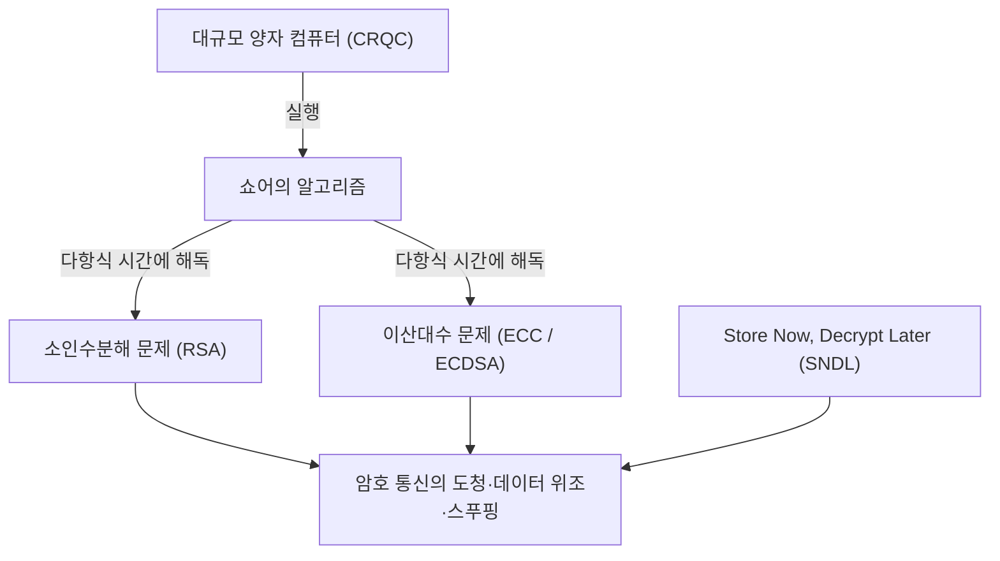
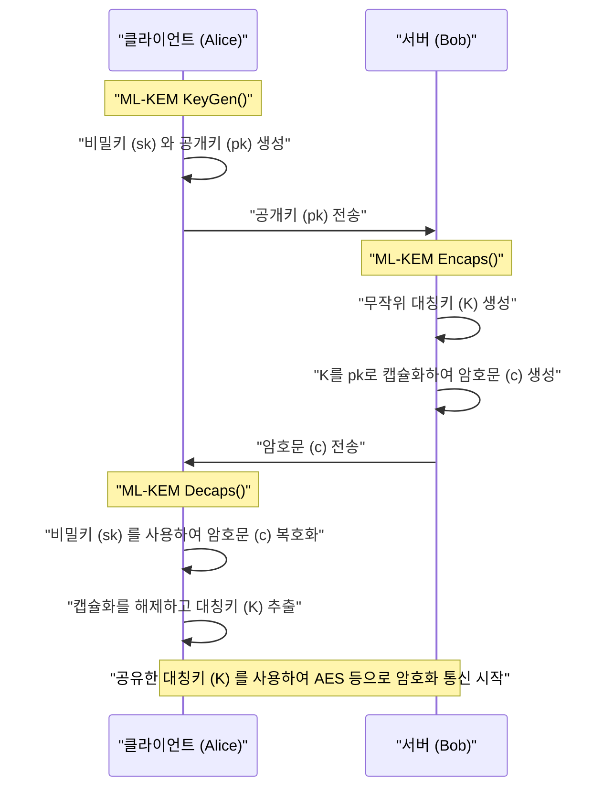
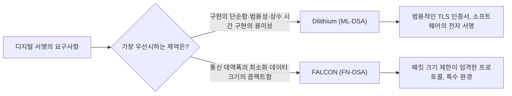

## 1. 시작하며: 양자 컴퓨터가 가져올 '암호의 위기'

현대 인터넷 사회에서 통신의 기밀성과 데이터의 무결성을 보호하기 위해 공개키 암호 기술은 인프라로서 필수 불가결합니다. 현재 널리 사용되고 있는 RSA 암호나 타원 곡선 암호(ECC)는 각각 '거대한 합성수의 소인수분해의 어려움'이나 '타원 곡선 상의 이산대수 문제의 어려움'이라는 수학적인 장벽에 의존하여 안전성을 담보하고 있습니다. 고전적인 컴퓨터(슈퍼컴퓨터를 포함하여 현재 우리가 사용하고 있는 컴퓨터)에서는 이러한 수학적 문제를 풀기 위해서는 우주의 나이보다 더 오랜 시간이 걸린다고 증명되어 있으며, 그것이 안전성의 근거가 되어 왔습니다.

그러나 이 견고한 전제는 **양자 컴퓨터**의 이론과 실용화의 진전으로 인해 근본적으로 뒤집히려 하고 있습니다. 1994년에 암호학자 피터 쇼어(Peter Shor)가 발표한 '**쇼어의 알고리즘(Shor's Algorithm)**'은 충분한 성능을 가진 오류 내성 범용 양자 컴퓨터(CRQC: Cryptographically Relevant Quantum Computer)에서 실행함으로써 소인수분해 문제나 이산대수 문제를 '다항식 시간'에 해독할 수 있음을 이론적으로 증명했습니다. 이는 현재 사용되고 있는 공개키 암호가 모두 무력화됨을 의미합니다.



"양자 컴퓨터의 본격적인 완성은 아직 수십 년 후의 일이므로 문제없다"라고 생각하는 것은 매우 위험합니다. 왜냐하면, **Store Now, Decrypt Later (SNDL: 지금 저장하고 나중에 복호화한다)** 라고 불리는 공격 기법이 이미 현실적인 위협이 되고 있기 때문입니다. 이는 악의적인 국가나 해커 조직이 현재 암호화된 통신 데이터(TLS 트래픽 등)를 대량으로 스토리지에 저장해 두었다가, 장래에 강력한 양자 컴퓨터를 이용할 수 있게 되는 순간 그것들을 모두 복호화하는 공격입니다. 국가 기밀, 인프라 정보, 장기간 보호해야 할 의료 데이터 등은 이미 이러한 위협에 노출되어 있습니다.

또한 대칭키 암호(AES 등)나 해시 함수(SHA-256 등)에 대해서도 1996년에 발견된 **그로버의 알고리즘(Grover's Algorithm)** 이 존재합니다. 이로 인해 무차별 대입 공격(브루트 포스)의 계산량이 제곱근으로 감소합니다. 즉, AES-128의 보안 수준은 실질적으로 2의 64승으로 반감되기 때문에, 양자 시대에는 AES-256이나 SHA-384와 같은 더 긴 키나 해시 길이를 사용하는 것이 권장됩니다.

이 전례 없는 암호 위기에 대항하기 위해 탄생한 것이 바로 양자 컴퓨터를 사용해도 해독이 어려운 새로운 수학적 문제에 기반한 **양자 내성 암호(Post-Quantum Cryptography: PQC)** 입니다. 본 기사에서는 미국 국립표준기술연구소(NIST)가 주도하여 진행해 온 PQC 표준화 프로세스의 결과에 바탕을 두고, 주요 PQC 알고리즘에 대해 그 수학적 배경부터 작동 원리, 아키텍처 비교까지 매우 상세하게 해설합니다.

---

## 2. NIST의 PQC 표준화 프로젝트의 전모와 역사

암호 기술의 전환에는 프로토콜의 재설계, 시스템 업데이트, 하드웨어 교체 등을 포함하여 수년에서 수십 년의 시간이 걸립니다. 그렇기 때문에 전 세계의 암호학자들은 초기부터 PQC 연구를 진행해 왔습니다. 그 중심적인 역할을 맡아온 곳이 미국의 NIST(국립표준기술연구소)입니다. NIST는 2016년에 PQC의 표준화 프로세스를 공모하여 전 세계의 암호 커뮤니티로부터 전혀 새로운 암호 알고리즘의 제안을 받았습니다.

표준화 대상이 된 것은 다음 두 가지 주요 카테고리입니다.
1. **공개키 암호 / 키 캡슐화 메커니즘 (KEM: Key Encapsulation Mechanism)**: TLS 연결 등에서 통신 경로를 암호화하기 위한 대칭키를 안전하게 공유(분배)하기 위한 구조.
2. **디지털 서명 (Digital Signatures)**: 소프트웨어 업데이트나 전자 인증서에서 데이터가 위조되지 않았음과 송신자의 스푸핑이 없음(진정성)을 증명하기 위한 구조.

약 6년에 걸친 매우 치열한 평가·분석 및 암호 해독 경쟁(Round 1~Round 3)을 거쳐, 일부 알고리즘에 대해서는 Round 4의 추가 평가가 이루어졌습니다. 그 결과, 2024년에 다음 알고리즘들이 정식 연방 정보 처리 표준(FIPS)으로 발행되어 향후 세계 표준으로 확정되었습니다.

- **FIPS 203 (ML-KEM)**: CRYSTALS-Kyber 기반 KEM
- **FIPS 204 (ML-DSA)**: CRYSTALS-Dilithium 기반 디지털 서명
- **FIPS 205 (SLH-DSA)**: SPHINCS+ 기반 상태 비저장(Stateless) 해시 기반 서명
- **(향후 책정 예정) FN-DSA**: FALCON 기반 디지털 서명

선정된 이 알고리즘들은 의존하는 수학적인 '어려움 문제'가 각각 달라서, 어느 한 알고리즘에서 장래 치명적인 취약점이 발견되더라도 시스템 전체가 붕괴하지 않도록 다양성(Crypto Agility)이 확보되어 있습니다. 표준화 과정에서는 주로 성능 면에서 격자 기반 암호(Lattice-based cryptography)가 주역이 되었지만, 해시 기반 암호나 코드 기반 암호가 강력한 백업으로 채택되었습니다.

---

## 3. PQC의 주요 수학적 접근 방식 분류

PQC 알고리즘은 그 안전성의 근거가 되는 수학적 문제에 따라 주로 다음 5가지 카테고리로 크게 나뉩니다. 본 기사에서는 특히 상위 3가지에 대해 자세히 파고듭니다.

1. **격자 기반 암호 (Lattice-based Cryptography)**:
   다차원 격자 공간에서의 최단 벡터 문제(SVP)나 최근접 벡터 문제(CVP), 그리고 여기서 파생된 LWE 문제에 기반합니다. NIST 표준화의 중심이며, Kyber, Dilithium, FALCON이 이에 해당합니다. 처리 속도, 공개키 크기, 암호문 크기의 균형이 가장 뛰어나 범용적인 사용에 적합합니다.
2. **해시 기반 암호 (Hash-based Cryptography)**:
   암호학적 해시 함수(SHA-2, SHAKE 등)의 '충돌 저항성'과 '일방향성'에만 안전성의 근거를 둡니다. 디지털 서명(SPHINCS+ 등)에만 적용 가능하지만, 안전성 증명이 가장 확고하며 미지의 수학적 공격에 대한 내성이 극히 높은 것이 특징입니다.
3. **코드 기반 암호 (Code-based Cryptography)**:
   오류 정정 코드 이론에 기반하여 신드롬 복호화 문제(Syndrome Decoding Problem)의 어려움에 의존합니다. 1970년대에 제안된 Classic McEliece가 대표적으로, 매우 긴 역사와 입증된 안전성을 가지는 반면 공개키의 크기가 메가바이트 단위로 극단적으로 큽니다.
4. **다변수 다항식 암호 (Multivariate Polynomial Cryptography)**:
   유한체 상의 다변수 연립 이차방정식의 해를 구하는 것(MQ 문제)의 어려움에 기반합니다. 주로 디지털 서명(Rainbow 등)으로 제안되었으나, NIST의 최종 라운드 진행 중에 PC 1대로 며칠 만에 해독되는 강력한 공격 기법이 발견되어 많은 알고리즘이 표준화에서 탈락했습니다.
5. **동종 사상 암호 (Isogeny-based Cryptography)**:
   타원 곡선의 동종 사상(Isogeny) 그래프 상에서의 경로 탐색 문제에 기반합니다. 키 크기가 매우 작아 ECC의 정당한 후계자로 기대되었으나, 최종 후보였던 'SIKE'가 2022년에 고전적인 수학(Castryck-Decru 공격 등)을 이용하여 일반 PC에서 불과 몇 시간 만에 완전히 해독되어 PQC 설계의 어려움과 두려움을 상징하는 극적인 결말을 맞았습니다.

---

## 4. 격자 암호의 심연: LWE 문제와 Module-LWE의 수학적 기초

현재 가장 유력하게 여겨지며 표준화의 중심이 된 **격자 기반 암호**. 그 안전성의 근저에 있는 것이 **LWE 문제 (Learning with Errors: 오차가 있는 학습 문제)** 입니다. 2005년에 Oded Regev가 제창하였고, 이 획기적인 공적으로 그는 괴델상(Gödel Prize)을 수상했습니다. LWE 문제를 이해하지 않고서는 현대의 PQC를 논할 수 없습니다.

### 4.1. LWE 문제(Learning with Errors)란 무엇인가

먼저 간단한 연립 일차 방정식을 생각해 봅시다. 어떤 법 $q$ (모듈로 $q$) 하에서 알려진 임의의 행렬 $A$와 알려지지 않은 비밀 벡터 $\vec{s}$가 있고 그 곱인 $\vec{b}$가 주어졌다고 가정합시다.

$$ \vec{b} = A\vec{s} \pmod q $$

이때 공개 정보인 $A$와 $\vec{b}$로부터 미지의 $\vec{s}$를 구하는 것은 간단합니다. 고전적인 알고리즘인 '가우스 소거법'을 사용하면 다항식 시간에 쉽게 $\vec{s}$를 계산할 수 있습니다.

그러나 이 식에 '작고 의도적인 오차(노이즈)'를 더하면 문제의 난이도가 극적으로 상승합니다. 이것이 바로 **LWE 문제**입니다.

미지의 비밀 벡터 $\vec{s} \in \mathbb{Z}_q^n$과 임의로 선택된 행렬 $A \in \mathbb{Z}_q^{m \times n}$를 준비합니다. 나아가 정규분포나 이항분포 등에 따라 선택된 '요소의 값이 충분히 작은' 오차 벡터 $\vec{e} \in \mathbb{Z}_q^m$를 준비하고 다음과 같이 $\vec{b}$를 계산합니다.

$$ \vec{b} = A\vec{s} + \vec{e} \pmod q $$

**Search LWE 문제**란 "공개 정보 $(A, \vec{b})$로부터 비밀 정보 $\vec{s}$를 구하라"는 문제입니다. 이 오차 $\vec{e}$가 존재함으로써 가우스 소거법 등 대수학적 해법을 시도하려 하면, 방정식을 더하고 빼는 과정에서 오차 $\vec{e}$가 눈덩이처럼 증폭되어 최종적으로 무작위 값과 구별할 수 없게 되어 파탄 나고 맙니다.

LWE 문제의 대단한 점은 '격자 상의 최악 경우 계산 복잡도 문제(Worst-case hardness)'인 GapSVP(판정 최단 벡터 문제)나 SIVP(최단 독립 벡터 문제)를 풀 수 있는 양자 알고리즘이 존재하지 않는 한, LWE 문제도 평균적(Average-case)으로 풀 수 없다는 강력한 이론적 증명(환원)이 존재한다는 것입니다. 즉, 무작위로 생성된 암호키라 하더라도 이론적인 한계에 의해 뒷받침되는 확고한 안전성을 가짐이 보장되어 있습니다.

### 4.2. Ring-LWE와 Module-LWE를 통한 극적인 효율화

일반적인 LWE 문제(Standard LWE)는 안전성의 근거가 매우 명확하지만, 행렬 $A$의 크기가 매우 커져 키 크기가 메가바이트 급이 되므로 실용적이지 않습니다. 그래서 제안된 것이 다항식 환(Polynomial Rings)을 이용하여 대수적인 구조를 갖게 하는 접근 방식입니다.

**Ring-LWE 문제**에서는 단순한 벡터나 행렬 대신, 어떤 다항식 환 $R_q$의 원소(다항식)를 사용합니다. NIST 표준에서 일반적으로 사용되는 것은 다음과 같은 원분 다항식 환(Cyclotomic Polynomial Ring)입니다.

$$ R_q = \mathbb{Z}_q[X]/(X^n + 1) $$

여기서 $n$은 2의 거듭제곱(예: 256), $q$는 적당한 소수입니다. 이 환 위에서 요소 $a, s, e \in R_q$를 이용하여 $b = a \cdot s + e \pmod q$를 계산합니다. 하나의 다항식 $a$가 $n$개의 계수를 갖기 때문에 데이터를 대폭 압축할 수 있으며, 나아가 **NTT (Number Theoretic Transform: 수론 변환)** 라는 고속 푸리에 변환(FFT)의 유한체 버전을 사용함으로써 $O(n \log n)$의 계산량으로 초고속으로 다항식 곱셈이 가능해집니다.

하지만 Ring-LWE에는 '환의 특수한 대수 구조로 인한 미지의 취약점이 존재할지도 모른다'는 우려가 있었습니다. 또한 보안 수준(AES-128, 192, 256 상당 등)을 변경할 때 다항식의 차수 $n$ 자체를 변경해야 하며, 이에 따라 NTT 알고리즘 등 구현 전체를 다시 작성해야 한다는 공학적인 과제가 있었습니다.

그래서 표준화 알고리즘인 Kyber나 Dilithium이 채택한 것이 바로 **Module-LWE (M-LWE) 문제**입니다. Module-LWE는 구조가 없는 Standard LWE와 너무 많은 구조를 가진 Ring-LWE의 딱 중간에 위치하는 절충안이며, 다항식 환 $R_q$의 요소를 성분으로 하는 $k \times k$의 행렬(모듈)을 사용합니다.

$$ \vec{b} = A\vec{s} + \vec{e} \pmod{R_q} \quad (A \in R_q^{k \times k}, \vec{s}, \vec{e} \in R_q^k) $$

Module-LWE의 가장 큰 이점은 다항식의 차수 $n$(NIST 표준에서는 $n=256$)을 고정한 채 행렬의 차원 $k$만 변경하여 쉽게 보안 수준을 확장(Scale)할 수 있다는 점입니다.
예를 들어 Kyber의 경우 다음과 같이 차원 $k$를 조정합니다.
- **Kyber512 (Level 1)**: $k = 2$ (AES-128 상당)
- **Kyber768 (Level 3)**: $k = 3$ (AES-192 상당)
- **Kyber1024 (Level 5)**: $k = 4$ (AES-256 상당)

이로 인해 기반이 되는 NTT의 코드나 다항식 연산의 하드웨어 회로를 모든 보안 수준에서 100% 재사용할 수 있게 되어 구현의 안전성과 효율성이 극적으로 향상되었습니다.

---

## 5. CRYSTALS-Kyber (ML-KEM): 차세대 키 캡슐화 메커니즘

**FIPS 203 (ML-KEM)** 으로 공식 표준화된 CRYSTALS-Kyber는 앞서 언급한 Module-LWE 문제에 기반한 키 캡슐화 메커니즘(KEM)입니다. 앞으로 TLS 1.3이나 SSH 등에서 세션 키를 안전하게 공유하기 위한 사실상의 세계 표준이 될 것입니다.

### 5.1. KEM (Key Encapsulation Mechanism) 아키텍처

PQC의 시대에서는 RSA처럼 '클라이언트가 대칭키를 만들어 서버의 공개키로 암호화해서 보낸다'는 직접적인 접근 방식이 아니라, KEM이라는 캡슐화의 틀이 표준이 됩니다.



### 5.2. Kyber 내부 알고리즘의 원리와 후지사키-오카모토 변환(Fujisaki-Okamoto Transform)

Kyber의 설계는 매우 세련되었습니다. 먼저 CPA(선택 평문 공격)에 대해서만 안전한 공개키 암호 방식(Kyber.CPAPKE)을 구축하고, 여기에 **후지사키-오카모토 변환 (Fujisaki-Okamoto Transform)** 이라고 불리는 암호학적으로 매우 강력 기법을 적용함으로써 CCA(적응적 선택 암호문 공격)에 대해서도 안전한 완전한 KEM으로 업그레이드하는 설계를 채택했습니다.

CPAPKE의 핵심이 되는 암호화와 복호화의 메커니즘은 다음과 같습니다.

1. **키 생성 (Key Generation)**:
   - 임의의 시드 값으로부터 NTT 도메인 상의 행렬 $A \in R_q^{k \times k}$를 생성합니다. 법 $q$는 $3329$가 사용됩니다.
   - 중심 이항 분포(CBD)로부터 작은 계수를 갖는 비밀 벡터 $\vec{s}$와 오차 벡터 $\vec{e}$를 샘플링합니다.
   - $\vec{t} = A\vec{s} + \vec{e}$를 계산합니다. 공개키는 $(A, \vec{t})$, 비밀키는 $\vec{s}$입니다. (실제로는 $A$는 시드 값으로서 공개되어 대역폭을 절약합니다).

2. **암호화 (Encryption)**:
   - 공유하려는 32바이트 메시지(대칭키의 재료) $m$을 다항식으로 인코딩합니다.
   - 새로운 임의의 벡터 $\vec{r}$과 작은 오차 $\vec{e_1}, e_2$를 생성합니다.
   - $\vec{u} = A^T\vec{r} + \vec{e_1}$ 
   - $v = \vec{t}^T\vec{r} + e_2 + \lfloor q/2 \rceil \cdot m$
   - 암호문은 $(\vec{u}, v)$가 됩니다.

3. **복호화 (Decryption)**:
   - 수신자는 $v - \vec{s}^T\vec{u}$를 계산합니다.
   - 이 식을 수식으로 전개하면 다음과 같이 됩니다.
     $v - \vec{s}^T\vec{u} = (\vec{t}^T\vec{r} + e_2 + \lfloor q/2 \rceil \cdot m) - \vec{s}^T(A^T\vec{r} + \vec{e_1})$
   - 여기서 $\vec{t} = A\vec{s} + \vec{e}$를 대입하면 주항인 $\vec{s}^TA^T\vec{r}$가 상쇄됩니다.
   - 남는 것은 $\lfloor q/2 \rceil \cdot m + (\vec{e}^T\vec{r} + e_2 - \vec{s}^T\vec{e_1})$이 됩니다.
   - 괄호 안의 항은 '작은 오차끼리의 곱이나 합'이므로 전체적으로도 충분히 작은 값(노이즈)에 머무릅니다. 따라서 각 계수가 $0$에 가까운지 $q/2$에 가까운지를 임계값 판정함으로써 원래 메시지 $m$의 비트(0 또는 1)를 완전히 오류 없이 복원할 수 있습니다.

Kyber의 가장 큰 강점은 그 압도적인 **처리 속도**와 **적절한 키 크기**에 있습니다. Kyber768의 경우 공개키 크기는 1,184바이트, 암호문 크기는 1,088바이트이며, RSA-3072(키 크기 약 384바이트) 등과 비교하면 크지만 현대 인터넷 통신의 MTU(Maximum Transmission Unit) 내에 패킷 분할 없이 담는 것이 가능하여 네트워크 지연(Latency)에 거의 악영향을 주지 않습니다.

---

## 6. CRYSTALS-Dilithium (ML-DSA): 격자 기반 범용 디지털 서명

디지털 서명의 표준화에 있어서는, 같은 격자 암호 접근 방식 중에서도 다른 설계 사상을 가진 알고리즘들이 경쟁했습니다. 그중에서 범용적인 디지털 서명으로서 **FIPS 204 (ML-DSA)** 로 선정된 것이 **CRYSTALS-Dilithium**입니다.

### 6.1. Fiat-Shamir with Aborts 패러다임

Dilithium은 Kyber와 마찬가지로 Module-LWE(및 Module-SIS 문제)에 기반한 디지털 서명 체계입니다. 설계의 기본 바탕에는 '**Fiat-Shamir with Aborts (중도 종료를 동반한 피아트-샤미르 변환)**'라는 매우 중요한 패러다임이 사용되었습니다.

피아트-샤미르 변환 자체는 대화형 영지식 증명 프로토콜을 비대화형 디지털 서명으로 변환하기 위한 표준적인 기법입니다. 증명자(서명자)가 약속(Commitment) $y$를 생성하고, $w = Ay$를 계산하여 해시 함수에 통과시킴으로써 임의의 챌린지(Challenge) $c$를 얻고 응답 $z = y + cs$를 계산합니다.

하지만 격자 암호에서 이를 단순히 적용하면 응답 $z$의 분포가 비밀키 $s$의 값에 의존하여 왜곡되어 버리고, 다수의 서명을 관측한 공격자에게 비밀키 $s$의 정보가 조금씩 유출되어 버리는 치명적인 문제(부채널 방식의 수학적 유출)가 있었습니다.

Dilithium의 설계팀(Lyubashevsky 등)은 서명의 계산 결과 $z$의 계수가 미리 설정된 안전한 임계값 범위 내에 들어가지 않을 경우 해당 서명 프로세스 전체를 파기(Abort)하고, 새로운 난수 $y$를 사용하여 처음부터 계산을 다시 하는 '**기각 샘플링(Rejection Sampling)**'이라는 기법을 도입했습니다.

이를 통해 최종적으로 출력되는 서명 $z$는 비밀키에 전혀 의존하지 않는 완전한 균등 분포가 되어, 정보 유출을 수학적으로 완전히 막는 데 성공했습니다.

### 6.2. Dilithium의 이점과 구현의 용이성

Dilithium 설계상의 큰 이점은 서명 생성 프로세스에서 복잡한 '가우스 분포로부터의 샘플링'이나 '부동소수점 연산'을 **전혀 사용하지 않는다**는 점입니다. 균등 분포로부터의 샘플링과 단순한 정수 모듈로 연산, NTT 및 해시 함수(SHAKE)만으로 구현할 수 있기 때문에 임베디드 마이크로컨트롤러에서 클라우드 서버에 이르기까지 폭넓은 환경에서 안전하고 상수 시간(Constant-time)에 구현하기가 용이합니다. 이로 인해 타이밍 공격 등 물리적인 부채널 공격에 대해서도 강력한 내성을 가집니다.

---

## 7. FALCON (FN-DSA): 궁극적으로 콤팩트한 격자 서명

NIST는 Dilithium과는 다른 특성을 가진 또 다른 격자 기반 서명으로서 **FALCON (Fast-Fourier Lattice-based Compact Signatures over NTRU)** 을 표준화 후보로 선정했습니다(현재 FN-DSA로 초안 작성 중).

### 7.1. NTRU 격자와 가우스 샘플링

FALCON의 가장 큰 특징은 LWE 문제가 아니라 1996년부터 존재하는 역사가 오래된 **NTRU (N-th degree Truncated polynomial Ring Units) 격자**를 사용한다는 점입니다. 더 나아가 GPV (Gentry-Peikert-Vaikuntanathan) 프레임워크에 기반한 '**해시 앤 사인 (Hash-and-Sign)**' 패러다임을 채택하고 있습니다.

해시 앤 사인(Hash-and-Sign)에서는 메시지의 해시 값을 공간 내의 타깃 점으로 삼고, 그 점에 가장 가까운 격자 상의 점(최근접 벡터 문제의 근사해)을 찾는 것으로 서명을 합니다. 여기에는 비밀키인 '품질이 좋은 짧은 기저(Basis)'를 사용하여 이산 가우스 분포에 따라 점을 샘플링할 필요가 있습니다.

FALCON은 이 무거운 계산을 '**고속 푸리에 직교화 (Fast Fourier Orthogonalization: FFO)**'라는 기법을 사용하여 극적으로 고속화했습니다.

### 7.2. FALCON의 장점과 단점

FALCON의 압도적인 장점은 그 **서명 크기와 공개키 크기가 극히 작다(콤팩트하다)** 는 것입니다. Dilithium3의 서명 크기가 약 3,309바이트인 것에 반해, FALCON-512의 서명 크기는 불과 약 666바이트입니다. 공개키 역시 897바이트로 매우 작아 통신 대역폭이 극단적으로 제한되는 환경이나 IoT 기기, 특정 네트워크 프로토콜에서는 구세주가 됩니다.

그러나 중대한 단점이 존재합니다. 서명 생성 시에 복잡한 **부동소수점 연산(64-bit IEEE 754)** 을 동반하는 이산 가우스 샘플링이 필수이기 때문에 타이밍 정보 유출을 방지하는 상수 시간 구현(Constant-time implementation)이 매우 어렵고 코드도 거대해집니다. 이 때문에 FALCON은 범용적인 이용(Dilithium)에 대비되는 특정 용도 지향의 강력한 특화형 알고리즘이라는 위치를 갖습니다.



---

## 8. SPHINCS+ (SLH-DSA): 최강의 안전성을 자랑하는 해시 기반 서명

격자 암호의 안전성이 장래에 천재적인 수학자의 돌파구에 의해 무너진다는 최악의 시나리오(만약의 사태)에 대비하여, NIST는 격자 암호와는 전혀 다른 접근 방식을 가진 표준으로서 **FIPS 205 (SLH-DSA)**, 즉 **SPHINCS+**를 책정했습니다.

SPHINCS+는 **해시 기반 서명**으로 분류됩니다. 그 안전성의 근거는 "사용하는 암호학적 해시 함수(SHA-2나 SHAKE256 등)가 충돌 저항성과 일방향성을 갖는다는 것"이라는 단 1점에만 의존하고 있습니다. LWE나 소인수분해와 같이 특정 대수 구조를 가진 수학적 문제에 의존하지 않기 때문에 장래에 어떤 강력한 양자 알고리즘이 등장하더라도 해시 함수의 출력 길이를 단순하게 늘리는 것만으로 대항할 수 있다는, 극히 확고한 안전성(가장 보수적인 보안)을 자랑합니다.

### 8.1. WOTS+ 와 FORS에 의한 상태 비저장(Stateless) 아키텍처

해시 기반 서명의 역사는 오래되어 1970년대의 램포트 서명(Lamport signature)이나 윈터니츠 일회용 서명(WOTS)으로 거슬러 올라갑니다. 이것들은 "단 1번만 안전하게 서명할 수 있다"는 일회용 키였습니다. 이를 여러 번 사용할 수 있도록 하기 위해 머클 트리(Merkle Tree)를 조합하여 무수한 일회용 키를 하나의 루트 해시로 관리하는 XMSS(eXtended Merkle Signature Scheme)나 LMS와 같은 알고리즘이 개발되었습니다.

그러나 XMSS나 LMS에는 '**상태 저장형(Stateful)**'이라는 중대한 결점이 있었습니다. 서명할 때마다 "몇 번째 일회용 키를 사용했는가"라는 인덱스 상태를 비휘발성 메모리에 엄밀하게 계속 기록해야 하며, 만약 가상 머신의 스냅샷 복원 등으로 상태가 되돌아가 동일한 일회용 키를 두 번 사용해 버리면 비밀키가 즉시 유출되어 시스템이 붕괴하고 맙니다.

SPHINCS+는 이러한 상태 관리의 번거로움을 해결한 '**상태 비저장형(Stateless)**' 해시 기반 서명입니다.
그 핵심 기술은 다음의 조합입니다.
1. **WOTS+ (Winternitz One-Time Signature Plus)**: 기본적인 일회용 서명.
2. **FORS (Forest of Random Subsets)**: 소수 회 서명(Few-Time Signature) 기술. 같은 키를 몇 번 정도는 재사용해도 안전성을 유지함.
3. **Hyper-Tree (거대한 트리 구조)**: 머클 트리를 다층적으로 겹겹이 쌓아 올린 거대한 구조.

SPHINCS+에서는 서명을 할 때 상태를 관리하는 대신, Hyper-Tree 밑바닥에 있는 방대한 수의 FORS 키 중에서 의사 난수를 사용하여 임의로 하나를 골라내어 서명합니다. 트리의 잎사귀 수가 천문학적으로 많기 때문에 같은 키를 우연히 두 번 고를 확률(충돌)이 무시할 수 있을 만큼 작아져 결과적으로 상태 비저장(Stateless)을 실현하고 있습니다.

SPHINCS+의 유일하고도 가장 큰 약점은 **서명 크기가 극히 크다**는 것입니다. 파라미터에 따라 다르지만 서명 크기는 17킬로바이트~49킬로바이트에 달하며, 서명 생성 속도도 격자 암호에 비해 압도적으로 느려집니다. 그 때문에 일상적인 웹 브라우징에서의 사용보다는 소프트웨어 업데이트 서명이나 루트 인증기관(CA)의 인증서 등 자주 서명을 하지 않으면서도 장기간의 절대적인 안전성이 강하게 요구되는 용도에서의 사용이 상정되어 있습니다.

---

## 9. 코드 기반 암호: Classic McEliece라는 좋고 오래된 거인

NIST 표준화 프로세스에서 Round 4의 최종 후보로서 현재도 계속 평가받고 있는 중요한 접근 방식이 **코드 기반 암호**인 **Classic McEliece**입니다.

1978년 Robert McEliece가 제안한 이 알고리즘은 공개키 암호 역사 중에서도 RSA와 더불어 가장 오래된 것 중 하나입니다. 'Goppa 코드(고파 부호)'라고 불리는 대수 기하 코드를 이용하여 메시지에 의도적으로 오류(노이즈 벡터)를 더해 암호화하고, 비밀키로서 Goppa 코드의 패리티 검사 행렬을 가진 자만이 강력한 오류 정정 능력을 사용해 오류를 제거하고 원래의 메시지를 복호화할 수 있다는 '**신드롬 복호화 문제 (Syndrome Decoding Problem)**'에 기반하고 있습니다.

$$ \vec{c} = \vec{m} G + \vec{e} $$
($G$는 공개키인 스크램블된 생성 행렬, $\vec{e}$는 가중치 $t$의 오류 벡터)

Classic McEliece의 놀라운 점은 **제안된 지 40년 이상 지났고 전 세계의 암호학자에 의한 치열한 해독 연구에 노출되어 왔음에도 불구하고, 그 본질적인 취약점이 한 번도 발견되지 않았다**는 압도적인 실적에 있습니다. PQC 중에서 가장 '시간이 증명한 확고한 안전성'을 가지고 있습니다.

게다가 암호문의 크기가 매우 작다(불과 100~200바이트 정도)는 이점이 있습니다. 하지만 **공개키 크기가 메가바이트(MB) 단위가 된다**는 치명적인 결점이 존재합니다. 가장 낮은 보안 수준(AES-128 상당)에서도 공개키가 약 250KB, 높은 수준에서는 1MB를 넘습니다.

이 때문에 TLS 핸드셰이크처럼 통신할 때마다 공개키를 네트워크 상에 전송하는 용도에는 전혀 적용할 수 없습니다. 하지만 VPN의 사전 공유 키 교환, 펌웨어에 공개키를 하드코딩하는 경우, 또는 위성 통신 등 공개키를 시스템에 사전에 배치할 수 있는 특수한 유스케이스에서는 그 확고한 안전성 덕분에 매우 유망한 선택지로 계속 검토되고 있습니다.

---

## 10. 각 PQC 알고리즘의 성능 비교 및 트레이드오프

지금까지 해설해 온 주요 알고리즘에 대해 일반적인 보안 수준(NIST Level 2~3 상당, AES-128~192 레벨)에서의 성능 특성을 아래 표로 정리했습니다.

| 알고리즘 (표준명) | 카테고리 | 수학적 기반 | 공개키 크기 | 비밀키 크기 | 암호문/서명 크기 | 처리 속도 경향 | 주요 특징 및 용도 |
| :--- | :--- | :--- | :--- | :--- | :--- | :--- | :--- |
| **Kyber768**<br>(ML-KEM) | KEM | Module-LWE | 1,184 Bytes | 2,400 Bytes | 1,088 Bytes | 매우 빠름 | 키 크기·속도의 밸런스가 최고. TLS 1.3 등 범용 KEM 표준. |
| **Dilithium3**<br>(ML-DSA) | 서명 | Module-LWE | 1,952 Bytes | 4,032 Bytes | 3,309 Bytes | 생성·검증 모두 빠름 | 구현이 단순. 범용적인 디지털 서명 표준. |
| **FALCON-512**<br>(FN-DSA) | 서명 | NTRU 격자 | 897 Bytes | 1,281 Bytes | 666 Bytes | 서명 생성은 느린 편, 검증은 초고속 | 서명 크기가 극소. 단 부동소수점 연산이 필요. 임베디드·IoT용. |
| **SPHINCS+**<br>(SLH-DSA) | 서명 | 해시 함수 | 32 Bytes | 64 Bytes | 약 17,000 Bytes | 생성이 매우 느림 | 수학적 파탄 위험이 거의 제로. 루트 인증서 등 고보안 용도. |
| **Classic McEliece** | KEM | Goppa 코드 | **약 1.04 MB** | 13,568 Bytes | **188 Bytes** | 캡슐화는 빠름 | 40년의 안전성 실적. 공개키가 거대. 하드코딩 가능한 환경용. |

### 트레이드오프에 대한 이해
PQC의 세계에서는 "크기가 작고, 속도가 빠르며, 수학적 보장도 완벽한" 마법과 같은 단일 알고리즘은 존재하지 않습니다.
- **인터넷의 표준 (Kyber / Dilithium)**: 성능 밸런스가 가장 좋으며, 현재의 RSA/ECC를 드롭인 리플레이스먼트(그대로 교체하는 것) 하기에 가장 적합합니다.
- **궁극의 보수성 (SPHINCS+)**: 데이터 크기나 처리 속도를 희생해서라도 장래의 수학적 돌파구에 대한 절대적인 보험을 원할 경우에 선택됩니다.
- **특수 환경용 (FALCON / Classic McEliece)**: 통신 대역폭이 극단적으로 좁거나 혹은 사전 배포가 가능한 등, 환경 제약에 맞춰 선택되는 특화형 무기입니다.

---

## 11. 실용화를 향한 과제와 '하이브리드 암호'라는 현실적 해답

NIST의 표준화가 완료되고 FIPS 규격이 정식으로 발행됨에 따라 전 세계 IT 인프라의 PQC 전환(**PQC 마이그레이션**)이 본격적으로 시작되었습니다. Google의 Chrome 브라우저, Apple의 iMessage(PQ3 프로토콜), Cloudflare와 같은 네트워크 제공자들은 이미 프로토콜에 PQC 지원을 구현하여 실제 운용을 시작하고 있습니다.

하지만 새로운 암호 알고리즘으로 갑자기 완전히 전환하는 데에는 매우 높은 위험이 따릅니다. 만약 Kyber와 같은 격자 암호에 대해 몇 년 뒤 어떤 천재 수학자가 치명적인 공격 기법(고전 컴퓨터로도 풀 수 있는 수학적 결함)을 발견할 경우, 그에 의존하고 있는 시스템 전체가 순식간에 발가벗겨지게 됩니다.

이러한 불확실성 위험을 경감하기 위한 현실적이고 권장되는 접근 방식이 '**하이브리드 암호(Hybrid Cryptography)**'입니다.

하이브리드 암호에서는 다년간의 실적이 있는 현행 고전적 암호(예: X25519 등의 타원 곡선 암호)와 새로운 PQC(예: Kyber768)를 모두 동시에 사용하여 키 교환을 수행합니다. 각각의 알고리즘에서 개별적으로 대칭키 성분을 생성하고 마지막으로 안전한 키 도출 함수(KDF)를 이용하여 두 성분을 혼합해 최종적인 마스터 시크릿을 생성합니다.

```mermaid
graph TD
    A["클라이언트"] -->|① X25519의 공개키 + Kyber의 공개키 전송| B["서버"]
    B -->|② X25519의 대칭키 + Kyber의 캡슐화 암호문 반환| A
    A --> C{"마스터 시크릿 도출 (KDF)"}
    B --> C
    C -->|입력: (X25519의 대칭키) || (Kyber의 대칭키)| D["안전한 통신키 (AES-256 / ChaCha20)"]
    D -->|"양자의 위협 & 고전적인 취약성 양쪽에 내성"| E["안전한 하이브리드 암호 통신 (TLS 1.3)"]
```

이를 통해 "만일 양자 컴퓨터가 실현되어 ECC가 깨지더라도 Kyber가 통신을 지키고", 반대로 "만일 Kyber에 미지의 수학적 결함이 발견되더라도 ECC가 통신을 지킨다"는 견고한 이중 안전성을 실현할 수 있습니다. 대표적인 예로 IETF에서 표준화가 진행 중인 **X25519MLKEM768 (구 X25519Kyber768)** 초안이 있으며, 현재 웹 브라우저와 최첨단 서버 간의 통신은 바로 이 하이브리드 방식을 이용하여 이루어지고 있습니다.

또한 시스템 설계에 있어서 "특정 암호 알고리즘에 과도하게 의존하지 않고 알고리즘이 파탄 났을 때 신속하게 다른 알고리즘(예: Kyber에서 McEliece로, Dilithium에서 SPHINCS+로)으로 전환할 수 있는 아키텍처"를 구축하는 **Crypto Agility(암호 민첩성)** 의 개념이 향후 시스템 개발에 있어 필수 요건이 됩니다.

---

## 12. 맺음말: 암호 기술의 새로운 지평선

양자 컴퓨터라는 인류의 꿈의 기술은 아이러니하게도 우리가 오랫동안 신뢰해 온 '소인수분해'나 '이산대수 문제'라는 수학적 방벽을 무너뜨리는 최대의 위협이 되었습니다. 그러나 전 세계의 암호학자들은 이에 굴하지 않고 격자 이론, 해시 함수 트리, 오류 정정 코드와 같은 보다 복잡하고 심오한 다차원 수학적 영역을 개척하여 양자 내성 암호(PQC)라는 새로운 방벽을 구축했습니다.

NIST의 FIPS 203 (ML-KEM), FIPS 204 (ML-DSA), FIPS 205 (SLH-DSA) 표준화 완료는 끝이 아닙니다. 앞으로 수십 년간 이어질 PQC 마이그레이션이라는 장대한 여정의 첫걸음에 불과합니다. 소프트웨어 엔지니어나 시스템 아키텍트에게 있어서, 이 새로운 알고리즘들이 가져오는 '키 크기 증가'나 '계산 비용 변화'를 네트워크 프로토콜과 시스템에 어떻게 최적으로 적응시켜 나갈지가 앞으로의 큰 기술적 과제가 될 것입니다.

양자 컴퓨터와 암호의 싸움은 인류의 수학적 탐구와 기술의 진화가 가장 치열하게 교차하는 흥미진진한 영역입니다. 본 기사를 통해 PQC의 배후에 있는 아름다운 수학 이론과 사이버 보안의 미래를 형성할 각 알고리즘의 놀라운 메커니즘에 대해 깊이 이해하셨기를 바랍니다.

---
*References:*
* *NIST Post-Quantum Cryptography Standardization Program*
* *FIPS 203: Module-Lattice-Based Key-Encapsulation Mechanism Standard*
* *FIPS 204: Module-Lattice-Based Digital Signature Standard*
* *FIPS 205: Stateless Hash-Based Digital Signature Standard*
