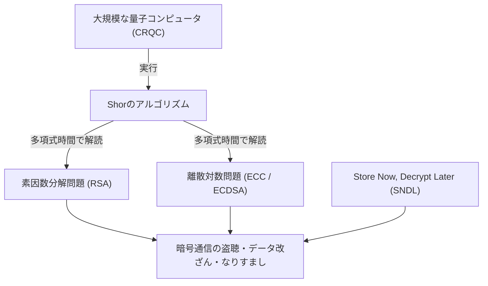
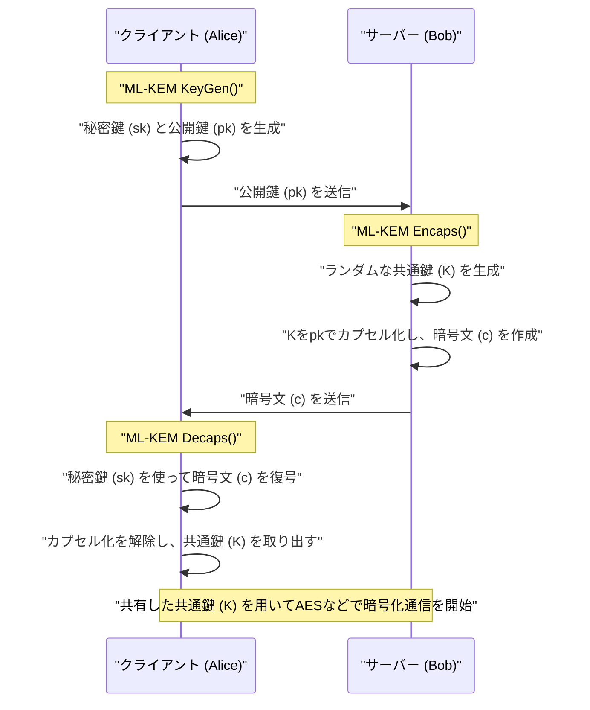
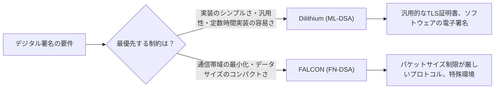

## 1. はじめに：量子コンピュータがもたらす「暗号の危機」

現代のインターネット社会において、通信の機密性やデータの完全性を守るために公開鍵暗号技術はインフラとして必要不可欠です。現在広く利用されているRSA暗号や楕円曲線暗号（ECC）は、それぞれ「巨大な合成数の素因数分解の困難性」や「楕円曲線上の離散対数問題の困難性」という数学的な壁に依存して安全性を担保しています。古典的なコンピュータ（スーパーコンピュータを含む現在私たちが使っているコンピュータ）では、これらの数学的問題を解くためには宇宙の年齢よりも長い時間がかかると証明されており、それが安全性の根拠となってきました。

しかし、この堅牢な前提は**量子コンピュータ**の理論と実用化の進展によって根底から覆されようとしています。1994年に暗号学者ピーター・ショア（Peter Shor）が発表した「**Shorのアルゴリズム**」は、十分な性能を持つ誤り耐性汎用量子コンピュータ（CRQC: Cryptographically Relevant Quantum Computer）上で実行することで、素因数分解問題や離散対数問題を「多項式時間」で解読できることを理論的に証明しました。これは、現在使われている公開鍵暗号がすべて無力化されることを意味します。



「量子コンピュータの本格的な完成はまだ数十年先だから問題ない」と考えるのは非常に危険です。なぜなら、**Store Now, Decrypt Later (SNDL：今すぐ保存し、後で復号する)**と呼ばれる攻撃手法がすでに現実の脅威となっているからです。これは、悪意のある国家やハッカー組織が、現在の暗号化された通信データ（TLSのトラフィックなど）を大量にストレージに保存しておき、将来強力な量子コンピュータが利用可能になった瞬間にそれらをすべて復号するという攻撃です。国家機密、インフラ情報、長期間保護すべき医療データなどは、すでにこの脅威に晒されています。

また、対称鍵暗号（AESなど）やハッシュ関数（SHA-256など）に対しても、1996年に発見された**Groverのアルゴリズム**が存在します。これにより、総当たり攻撃（ブルートフォース）の計算量が平方根に削減されます。つまり、AES-128のセキュリティレベルは実質的に2の64乗に半減するため、量子時代においてはAES-256やSHA-384といった、より長い鍵やハッシュ長を使用することが推奨されています。

この未曾有の暗号危機に対抗するために誕生したのが、量子コンピュータを用いても解読が困難な新しい数学的問題に基づいた**耐量子計算機暗号（Post-Quantum Cryptography: PQC）**です。本記事では、米国国立標準技術研究所（NIST）が主導して進めてきたPQC標準化プロセスの結果に基づき、主要なPQCアルゴリズムについて、その数学的背景から仕組み、アーキテクチャの比較までを極めて詳細に解説します。

---

## 2. NISTによるPQC標準化プロジェクトの全貌と歴史

暗号技術の移行には、プロトコルの再設計、システムのアップデート、ハードウェアの交換などを含め、数年から数十年の時間がかかります。そのため、世界中の暗号学者たちは早期からPQCの研究を進めてきました。その中心的な役割を担ってきたのが米国のNIST（国立標準技術研究所）です。NISTは2016年にPQCの標準化プロセスを公募し、全世界の暗号コミュニティから全く新しい暗号アルゴリズムの提案を受け付けました。

標準化の対象となったのは以下の2つの主要カテゴリです。
1. **公開鍵暗号 / 鍵カプセル化メカニズム (KEM: Key Encapsulation Mechanism)**: TLS接続などで、通信経路を暗号化するための共通鍵を安全に共有（配送）するための仕組み。
2. **デジタル署名 (Digital Signatures)**: ソフトウェアのアップデートや電子証明書において、データの改ざんがないことや、送信者のなりすましがないこと（真正性）を証明するための仕組み。

約6年間にわたる非常に激しい評価・解析と暗号解読の競争（Round 1〜Round 3）を経て、さらに一部のアルゴリズムについてはRound 4の追加評価が行われました。その結果、2024年に以下のアルゴリズムが正式な連邦情報処理標準（FIPS）として発行され、今後の世界の標準として確定しました。

- **FIPS 203 (ML-KEM)**: CRYSTALS-Kyberに基づくKEM
- **FIPS 204 (ML-DSA)**: CRYSTALS-Dilithiumに基づくデジタル署名
- **FIPS 205 (SLH-DSA)**: SPHINCS+に基づくステートレスハッシュベース署名
- **（今後の策定予定）FN-DSA**: FALCONに基づくデジタル署名

これらの選定されたアルゴリズムは、依拠する数学的な「困難性問題」がそれぞれ異なっており、ある一つのアルゴリズムに将来致命的な脆弱性が発見された場合でも、システム全体が崩壊しないように多様性（Crypto Agility）が確保されています。標準化プロセスでは、主に格子暗号（Lattice-based cryptography）が性能の面から主役となりましたが、ハッシュベース暗号や符号ベース暗号が強力なバックアップとして採用されています。

---

## 3. PQCの主要な数学的アプローチの分類

PQCアルゴリズムは、その安全性の根拠となる数学的な問題によって、主に以下の5つのカテゴリに大別されます。本記事では特に上位3つについて詳しく掘り下げます。

1. **格子暗号 (Lattice-based Cryptography)**:
   多次元の格子空間における最短ベクトル問題（SVP）や最近接ベクトル問題（CVP）、およびそこから派生したLWE問題に基づきます。NIST標準化の中心であり、Kyber、Dilithium、FALCONが該当します。処理速度、公開鍵サイズ、暗号文サイズのバランスが最も優れており、汎用的な利用に適しています。
2. **ハッシュベース暗号 (Hash-based Cryptography)**:
   暗号学的ハッシュ関数（SHA-2やSHAKEなど）の「衝突耐性」と「一方向性」のみに安全性の根拠を置きます。デジタル署名（SPHINCS+など）にのみ適用可能ですが、安全性の証明が最も強固であり、未知の数学的攻撃に対する耐性が極めて高いのが特徴です。
3. **符号ベース暗号 (Code-based Cryptography)**:
   誤り訂正符号の理論に基づき、シンドローム復号問題（Syndrome Decoding Problem）の困難性に依存します。1970年代に提案されたClassic McElieceが代表的で、非常に長い歴史と実績のある安全性を持つ反面、公開鍵のサイズがメガバイト単位と極端に大きくなります。
4. **多変数多項式暗号 (Multivariate Polynomial Cryptography)**:
   有限体上の多変数連立二次方程式の解を求めること（MQ問題）の困難性に基づきます。主にデジタル署名（Rainbowなど）として提案されましたが、NISTの最終ラウンドの最中にパソコン1台で数日で解読されるという強力な攻撃手法が発見され、多くのアルゴリズムが標準化から脱落しました。
5. **同種写像暗号 (Isogeny-based Cryptography)**:
   楕円曲線の同種写像（Isogeny）グラフ上での経路探索問題に基づきます。鍵サイズが非常に小さく、ECCの正当な後継として期待されていましたが、最終候補であった「SIKE」が2022年に古典的な数学（Castryck-Decru攻撃など）を用いて通常のPCでわずか数時間で完全に解読されてしまい、PQC設計の難しさと恐ろしさを象徴する劇的な幕引きとなりました。

---

## 4. 格子暗号の深淵：LWE問題とModule-LWEの数学的基礎

現在最も有力視され、標準化の中心となった**格子暗号**。その安全性の根底にあるのが**LWE問題 (Learning with Errors: 誤差付き学習問題)**です。2005年にOded Regevによって提唱され、この画期的な功績により彼はGödel賞を受賞しました。LWE問題の理解なくして現代のPQCを語ることはできません。

### 4.1. LWE問題 (Learning with Errors) とは何か

まず、簡単な連立一次方程式を考えてみましょう。ある法 $q$ （モジュロ $q$）のもとで、既知のランダムな行列 $A$ と、未知の秘密のベクトル $\vec{s}$ があり、その積 $\vec{b}$ が与えられたとします。

$$ \vec{b} = A\vec{s} \pmod q $$

このとき、公開情報である $A$ と $\vec{b}$ から、未知の $\vec{s}$ を求めるのは簡単です。古典的なアルゴリズムである「ガウスの消去法（掃き出し法）」を使えば、多項式時間で容易に $\vec{s}$ を計算できます。

しかし、この式に「小さな意図的な誤差（ノイズ）」を加えると、問題の難易度が劇的に跳ね上がります。これが**LWE問題**です。

未知の秘密ベクトル $\vec{s} \in \mathbb{Z}_q^n$ と、ランダムに選ばれた行列 $A \in \mathbb{Z}_q^{m \times n}$ を用意します。さらに、正規分布や二項分布などに従って選ばれた「要素の値が十分に小さい」誤差ベクトル $\vec{e} \in \mathbb{Z}_q^m$ を用意し、次のように $\vec{b}$ を計算します。

$$ \vec{b} = A\vec{s} + \vec{e} \pmod q $$

**Search LWE問題**とは、「公開情報 $(A, \vec{b})$ から秘密情報 $\vec{s}$ を求めよ」という問題です。この誤差 $\vec{e}$ が存在することにより、ガウスの消去法などの代数的な解法を行おうとすると、方程式を足し引きする過程で誤差 $\vec{e}$ が雪だるま式に増幅されてしまい、最終的にランダムな値と区別がつかなくなり破綻してしまいます。

LWE問題の凄さは、「格子上の最悪時計算量問題（Worst-case hardness）」であるGapSVP（判定最短ベクトル問題）やSIVP（最短独立ベクトル問題）を解くことができる量子アルゴリズムが存在しない限り、LWE問題も平均的（Average-case）に解くことができない、という強力な理論的証明（還元）が存在する点です。つまり、ランダムに生成された暗号鍵であっても、理論的な上限に裏打ちされた強固な安全性を持つことが保証されています。

### 4.2. Ring-LWE と Module-LWE による劇的な効率化

通常のLWE問題（Standard LWE）は安全性の根拠が非常に明確ですが、行列 $A$ のサイズが非常に大きくなり、鍵サイズがメガバイト級になるため実用的ではありません。そこで提案されたのが、多項式環（Polynomial Rings）を利用して代数的な構造を持たせるアプローチです。

**Ring-LWE問題**では、単なるベクトルや行列の代わりに、ある多項式環 $R_q$ の元（多項式）を使用します。NIST標準で一般的に用いられるのは以下のような円分多項式環です。

$$ R_q = \mathbb{Z}_q[X]/(X^n + 1) $$

ここで、$n$ は 2 のべき乗（例：256）、$q$ は適当な素数です。この環の上で、要素 $a, s, e \in R_q$ を用いて $b = a \cdot s + e \pmod q$ を計算します。一つの多項式 $a$ が $n$ 個の係数を持つため、データを大幅に圧縮でき、さらに**NTT (Number Theoretic Transform: 数論変換)**という高速フーリエ変換（FFT）の有限体バージョンを用いることで、$O(n \log n)$ の計算量で超高速に多項式の乗算が可能になります。

しかし、Ring-LWEには「環の特殊な代数構造に起因する未知の脆弱性が存在するかもしれない」という懸念がありました。また、セキュリティレベル（AES-128, 192, 256相当など）を変更する際に、多項式の次数 $n$ そのものを変える必要があり、それに伴いNTTのアルゴリズムなど実装全体を書き直さなければならないという工学的な課題がありました。

そこで、標準化アルゴリズムであるKyberやDilithiumが採用したのが**Module-LWE (M-LWE) 問題**です。Module-LWEは、無構造なStandard LWEと、構造を持ちすぎるRing-LWEのちょうど中間に位置する妥協案であり、多項式環 $R_q$ の要素を成分とする $k \times k$ の行列（モジュール）を使用します。

$$ \vec{b} = A\vec{s} + \vec{e} \pmod{R_q} \quad (A \in R_q^{k \times k}, \vec{s}, \vec{e} \in R_q^k) $$

Module-LWEの最大の利点は、多項式の次数 $n$（NIST標準では $n=256$）を固定したまま、行列の次元 $k$ を変えるだけで容易にセキュリティレベルをスケールさせることができる点です。
例えばKyberの場合、以下のように次元 $k$ を調整します。
- **Kyber512 (Level 1)**: $k = 2$ （AES-128相当）
- **Kyber768 (Level 3)**: $k = 3$ （AES-192相当）
- **Kyber1024 (Level 5)**: $k = 4$ （AES-256相当）

これにより、基盤となるNTTのコードや多項式演算のハードウェア回路を全セキュリティレベルで100%再利用することが可能になり、実装の安全性と効率性が劇的に向上しました。

---

## 5. CRYSTALS-Kyber (ML-KEM)：次世代の鍵カプセル化メカニズム

**FIPS 203 (ML-KEM)** として正式に標準化されたCRYSTALS-Kyberは、前述のModule-LWE問題に基づく鍵カプセル化メカニズム (KEM) です。今後、TLS 1.3やSSHなどでセッションキーを安全に共有するための事実上の世界標準となります。

### 5.1. KEM (Key Encapsulation Mechanism) のアーキテクチャ

PQCの時代では、RSAのように「クライアントが共通鍵を作ってサーバーの公開鍵で暗号化して送る」という直接的なアプローチではなく、KEMというカプセル化の枠組みが標準となります。



### 5.2. Kyberの内部アルゴリズムの仕組みと藤崎・岡本変換

Kyberの設計は非常に洗練されています。まず、CPA（選択平文攻撃）に対してのみ安全な公開鍵暗号方式（Kyber.CPAPKE）を構築し、それに**藤崎・岡本変換 (Fujisaki-Okamoto Transform)** と呼ばれる暗号学的に非常に強力な手法を適用することで、CCA（適応的選択暗号文攻撃）に対しても安全な完全なKEMへとアップグレードする設計を採用しています。

CPAPKEの核となる暗号化と復号のメカニズムは以下の通りです。

1. **鍵生成 (Key Generation)**:
   - ランダムなシード値から、NTTドメイン上の行列 $A \in R_q^{k \times k}$ を生成します。法 $q$ は $3329$ が使われます。
   - 中心二項分布（CBD）から、小さな係数を持つ秘密ベクトル $\vec{s}$ と誤差ベクトル $\vec{e}$ をサンプリングします。
   - $\vec{t} = A\vec{s} + \vec{e}$ を計算します。公開鍵は $(A, \vec{t})$、秘密鍵は $\vec{s}$ です。（実際には $A$ はシード値として公開され、帯域を節約します）。

2. **暗号化 (Encryption)**:
   - 共有したい32バイトのメッセージ（共通鍵の材料）$m$ を多項式にエンコードします。
   - 新たなランダムなベクトル $\vec{r}$ と、小さな誤差 $\vec{e_1}, e_2$ を生成します。
   - $\vec{u} = A^T\vec{r} + \vec{e_1}$ 
   - $v = \vec{t}^T\vec{r} + e_2 + \lfloor q/2 \rceil \cdot m$
   - 暗号文は $(\vec{u}, v)$ となります。

3. **復号 (Decryption)**:
   - 受信者は $v - \vec{s}^T\vec{u}$ を計算します。
   - この式を数式展開すると以下のようになります。
     $v - \vec{s}^T\vec{u} = (\vec{t}^T\vec{r} + e_2 + \lfloor q/2 \rceil \cdot m) - \vec{s}^T(A^T\vec{r} + \vec{e_1})$
   - ここで $\vec{t} = A\vec{s} + \vec{e}$ を代入すると、主項である $\vec{s}^TA^T\vec{r}$ が相殺されます。
   - 残るのは $\lfloor q/2 \rceil \cdot m + (\vec{e}^T\vec{r} + e_2 - \vec{s}^T\vec{e_1})$ となります。
   - 括弧内の項は「小さな誤差同士の積や和」であるため、全体としても十分に小さな値（ノイズ）に留まります。したがって、各係数が $0$ に近いか $q/2$ に近いかを閾値判定することで、元のメッセージ $m$ のビット（0 または 1）を完全にエラーなく復元することができます。

Kyberの最大の強みは、その圧倒的な**処理速度**と**適度な鍵サイズ**です。Kyber768の場合、公開鍵サイズは1,184バイト、暗号文サイズは1,088バイトであり、RSA-3072（鍵サイズ約384バイト）などと比較すると大きいものの、現代のインターネット通信のMTU（Maximum Transmission Unit）内にパケット分割なしで収めることが可能であり、ネットワークのレイテンシにほとんど悪影響を与えません。

---

## 6. CRYSTALS-Dilithium (ML-DSA)：格子ベースの汎用デジタル署名

デジタル署名の標準化においては、同じ格子暗号アプローチの中でも異なる設計思想を持つアルゴリズムが競い合いました。その中で汎用的なデジタル署名として**FIPS 204 (ML-DSA)** に選定されたのが**CRYSTALS-Dilithium**です。

### 6.1. Fiat-Shamir with Aborts パラダイム

DilithiumはKyberと同じくModule-LWE（およびModule-SIS問題）に基づくデジタル署名スキームです。設計のベースには「**Fiat-Shamir with Aborts (中途終了を伴うフィアット・シャミア変換)**」という極めて重要なパラダイムが用いられています。

Fiat-Shamir変換自体は、対話型のゼロ知識証明プロトコルを非対話型のデジタル署名へと変換するための標準的な手法です。証明者（署名者）がコミットメント $y$ を生成し、$w = Ay$ を計算してハッシュ関数に通すことで、ランダムなチャレンジ $c$ を得て、応答 $z = y + cs$ を計算します。

しかし、格子暗号においてこれを単純に適用すると、応答 $z$ の分布が秘密鍵 $s$ の値に依存して歪んでしまい、多数の署名を観測した攻撃者に秘密鍵 $s$ の情報が少しずつ漏洩してしまうという致命的な問題（サイドチャネル的な数学的漏洩）がありました。

Dilithiumの設計チーム（Lyubashevskyら）は、署名の計算結果 $z$ の係数が、あらかじめ設定された安全な閾値の範囲内に収まらなかった場合、その署名プロセス全体を破棄（Abort）して、新しい乱数 $y$ を使って最初から計算をやり直す「**棄却サンプリング (Rejection Sampling)**」という手法を導入しました。

これにより、最終的に出力される署名 $z$ は秘密鍵に一切依存しない完全な均一分布となり、情報漏洩を数学的に完全に防ぐことに成功しました。

### 6.2. Dilithiumの利点と実装の容易さ

Dilithiumの設計上の大きな利点は、署名生成プロセスにおいて複雑な「ガウス分布からのサンプリング」や「浮動小数点演算」を**一切使用しない**点です。一様分布からのサンプリングと、単純な整数モジュロ演算、NTT、およびハッシュ関数（SHAKE）のみで実装できるため、組み込みのマイクロコントローラからクラウドサーバーまで、幅広い環境で安全かつ定数時間（Constant-time）で実装することが容易です。これにより、タイミング攻撃などの物理的なサイドチャネル攻撃に対しても強固な耐性を持ちます。

---

## 7. FALCON (FN-DSA)：究極にコンパクトな格子署名

NISTは、Dilithiumとは異なる特性を持つもう一つの格子ベース署名として**FALCON (Fast-Fourier Lattice-based Compact Signatures over NTRU)** を標準化候補として選定しました（現在FN-DSAとしてドラフト策定中）。

### 7.1. NTRU格子とガウスサンプリング

FALCONの最大の特徴は、LWE問題ではなく、1996年から存在する歴史の古い**NTRU (N-th degree Truncated polynomial Ring Units) 格子**を使用している点です。さらに、GPV (Gentry-Peikert-Vaikuntanathan) フレームワークに基づく「**ハッシュ・アンド・サイン (Hash-and-Sign)**」パラダイムを採用しています。

Hash-and-Signでは、メッセージのハッシュ値を空間内のターゲット点とし、その点に最も近い格子上の点（最近接ベクトル問題の近似解）を見つけることで署名とします。これには、秘密鍵である「質の良い短い基底」を用いて、離散ガウス分布に従って点をサンプリングする必要があります。

FALCONは、この重い計算を「**高速フーリエ直交化 (Fast Fourier Orthogonalization: FFO)**」という手法を用いて劇的に高速化しました。

### 7.2. FALCONのメリットとデメリット

FALCONの圧倒的なメリットは、その**署名サイズと公開鍵サイズが極めて小さい（コンパクトである）**ことです。Dilithium3の署名サイズが約3,309バイトであるのに対し、FALCON-512の署名サイズはわずか約666バイトです。公開鍵も897バイトと非常に小さく、通信帯域が極端に制限される環境や、IoTデバイス、特定のネットワークプロトコルにおいては救世主となります。

しかし、重大なデメリットが存在します。署名生成時に複雑な**浮動小数点演算（64-bit IEEE 754）**を伴う離散ガウスサンプリングが必須となるため、タイミング漏洩を防ぐ定数時間実装（Constant-time implementation）が極めて難しく、コードも巨大化します。このため、FALCONは汎用的な利用（Dilithium）に対する、特定用途向けの強力な特化型アルゴリズムという位置付けになります。



---

## 8. SPHINCS+ (SLH-DSA)：最強の安全性を誇るハッシュベース署名

格子暗号の安全性が、将来的に天才的な数学者のブレイクスルーによって破られるという最悪のシナリオ（万が一の事態）に備えて、NISTは格子暗号とは全く異なるアプローチを持つ標準として **FIPS 205 (SLH-DSA)**、すなわち**SPHINCS+**を策定しました。

SPHINCS+は**ハッシュベース署名**に分類されます。その安全性の根拠は、「用いている暗号学的ハッシュ関数（SHA-2やSHAKE256など）が衝突耐性と一方向性を持つこと」という、ただ1点のみに依存しています。LWEや素因数分解のような、特定の代数構造を持つ数学的問題に依存していないため、将来的にどんな強力な量子アルゴリズムが登場しようとも、ハッシュ関数の出力長を単純に伸ばすだけで対抗できるという、極めて強固な安全性（最も保守的なセキュリティ）を誇ります。

### 8.1. WOTS+ と FORS によるステートレスアーキテクチャ

ハッシュベース署名の歴史は古く、1970年代のLamport署名やWinternitzワンタイム署名（WOTS）に遡ります。これらは「1回だけ安全に署名できる」という使い捨ての鍵でした。これを複数回使えるようにするために、マークル木（Merkle Tree）を組み合わせて無数のワンタイム鍵を一つのルートハッシュで管理するXMSS（eXtended Merkle Signature Scheme）やLMSといったアルゴリズムが開発されました。

しかし、XMSSやLMSには「**ステートフル（状態保持型）**」であるという重大な欠点がありました。署名するたびに「何番目のワンタイム鍵を使用したか」というインデックス状態を不揮発性メモリに厳密に記録し続ける必要があり、もし仮想マシンのスナップショットの復元などで状態が巻き戻り、同じワンタイム鍵を二度使ってしまうと、秘密鍵が即座に漏洩してシステムが崩壊してしまいます。

SPHINCS+は、この状態管理の煩わしさを解決した「**ステートレス（状態非保持型）**」のハッシュベース署名です。
その中核技術は以下の組み合わせです。
1. **WOTS+ (Winternitz One-Time Signature Plus)**: 基本的なワンタイム署名。
2. **FORS (Forest of Random Subsets)**: 少回数署名（Few-Time Signature）技術。同じ鍵を数回程度なら再利用しても安全性を保つ。
3. **Hyper-Tree (巨大な木構造)**: マークル木を多層的に重ね合わせた巨大な構造。

SPHINCS+では、署名を行う際、状態を管理する代わりに、Hyper-Treeの底辺にある膨大な数のFORS鍵の中から、擬似乱数を用いてランダムに一つを選び出して署名します。木の葉の数が天文学的に多いため、同じ鍵を偶然二度選んでしまう確率（コリジョン）が無視できるほど小さくなり、結果としてステートレスを実現しています。

SPHINCS+の唯一にして最大の弱点は、**署名サイズが極めて大きい**ことです。パラメータにもよりますが、署名サイズは17キロバイト〜49キロバイトにも達し、署名生成速度も格子暗号に比べて圧倒的に遅くなります。そのため、日常的なWebブラウジングでの利用よりも、ソフトウェアのアップデート署名やルート認証局（CA）の証明書など、頻繁に署名を行わず、かつ長期間の絶対的な安全性が強く求められる用途での利用が想定されています。

---

## 9. 符号ベース暗号：Classic McElieceという古き良き巨人

NISTの標準化プロセスにおいて、Round 4の最終候補として現在も評価が継続されている重要なアプローチが、**符号ベース暗号**の**Classic McEliece**です。

1978年にRobert McElieceによって提案されたこのアルゴリズムは、公開鍵暗号の歴史の中でもRSAと並んで最も古いものの一つです。「Goppa符号（ゴッパ符号）」と呼ばれる代数幾何符号を利用しており、メッセージに意図的にエラー（ノイズベクトル）を加えて暗号化し、秘密鍵としてGoppa符号のパリティ検査行列を持つ者だけが、強力な誤り訂正能力を使ってエラーを取り除き、元のメッセージを復号できる、という「**シンドローム復号問題 (Syndrome Decoding Problem)**」に基づいています。

$$ \vec{c} = \vec{m} G + \vec{e} $$
（$G$ は公開鍵であるスクランブルされた生成行列、$\vec{e}$ は重み $t$ のエラーベクトル）

Classic McElieceの驚くべき点は、**提案から40年以上経過し、世界中の暗号学者による激しい解読の研究に晒されてきたにもかかわらず、その本質的な脆弱性が一度も発見されていない**という、圧倒的な実績にあります。PQCの中で最も「時間が証明した強固な安全性」を持っています。

さらに、暗号文のサイズが非常に小さい（わずか100〜200バイト程度）というメリットがあります。しかし、**公開鍵のサイズがメガバイト（MB）単位になる**という致命的な欠点が存在します。最も低いセキュリティレベル（AES-128相当）でも公開鍵が約250KB、高いレベルでは1MBを超えます。

このため、TLSハンドシェイクのように通信のたびに公開鍵をネットワーク上で送信する用途には全く適用できません。しかし、VPNの事前共有鍵の交換、ファームウェアへの公開鍵のハードコード、あるいは衛星通信など、公開鍵をシステムに事前に配置できる特殊なユースケースにおいては、その強固な安全性から極めて有望な選択肢として検討が続けられています。

---

## 10. 各PQCアルゴリズムの性能比較とトレードオフ

ここまで解説してきた主要なアルゴリズムについて、一般的なセキュリティレベル（NIST Level 2〜3相当、AES-128〜192レベル）での性能特性を以下の表にまとめました。

| アルゴリズム (標準名) | カテゴリ | 数学的基盤 | 公開鍵サイズ | 秘密鍵サイズ | 暗号文/署名サイズ | 処理速度の傾向 | 主な特徴と用途 |
| :--- | :--- | :--- | :--- | :--- | :--- | :--- | :--- |
| **Kyber768**<br>(ML-KEM) | KEM | Module-LWE | 1,184 Bytes | 2,400 Bytes | 1,088 Bytes | 非常に高速 | 鍵サイズ・速度のバランスが最高。TLS 1.3などの汎用KEM標準。 |
| **Dilithium3**<br>(ML-DSA) | 署名 | Module-LWE | 1,952 Bytes | 4,032 Bytes | 3,309 Bytes | 生成・検証ともに高速 | 実装がシンプル。汎用的なデジタル署名標準。 |
| **FALCON-512**<br>(FN-DSA) | 署名 | NTRU格子 | 897 Bytes | 1,281 Bytes | 666 Bytes | 署名生成は遅め、検証は超高速 | 署名サイズが極小。ただし浮動小数点演算が必要。組込・IoT向け。 |
| **SPHINCS+**<br>(SLH-DSA) | 署名 | ハッシュ関数 | 32 Bytes | 64 Bytes | 約 17,000 Bytes | 生成が非常に遅い | 数学的な破綻リスクがほぼゼロ。ルート証明書など高セキュリティ用途。 |
| **Classic McEliece** | KEM | Goppa符号 | **約 1.04 MB** | 13,568 Bytes | **188 Bytes** | カプセル化は高速 | 40年の安全性実績。公開鍵が巨大。ハードコード可能な環境向け。 |

### トレードオフの理解
PQCの世界においては、「サイズが小さく、速度が速く、数学的保証も完璧」という魔法のような単一のアルゴリズムは存在しません。
- **インターネットの標準 (Kyber / Dilithium)**: パフォーマンスのバランスが最も良く、現在のRSA/ECCからのドロップイン・リプレイスメント（そのまま置き換えること）に最も適しています。
- **究極の保守性 (SPHINCS+)**: データサイズや処理速度を犠牲にしてでも、将来的な数学的ブレイクスルーに対する絶対的な保険が欲しい場合に選択されます。
- **特殊環境向け (FALCON / Classic McEliece)**: 通信帯域が極端に狭い、あるいは事前配布が可能など、環境の制約に合わせて選ばれる特化型の武器です。

---

## 11. 実用化に向けた課題と「ハイブリッド暗号」という現実解

NISTによる標準化が完了し、FIPS規格が正式に発行されたことで、世界中のITインフラのPQC移行（**PQCマイグレーション**）が本格的にスタートしました。GoogleのChromeブラウザ、AppleのiMessage（PQ3プロトコル）、Cloudflareなどのネットワークプロバイダは、すでにPQCのサポートをプロトコルに実装し、実運用を開始しています。

しかし、新しい暗号アルゴリズムにいきなり完全に切り替えることには非常に高いリスクが伴います。仮にKyberなどの格子暗号に対して、数年後にある天才数学者が致命的な攻撃手法（古典コンピュータでも解けるような数学的欠陥）を発見した場合、それに依存しているシステム全体が一瞬にして丸裸になってしまいます。

この不確実性リスクを軽減するための現実的かつ推奨されるアプローチが「**ハイブリッド暗号 (Hybrid Cryptography)**」です。

ハイブリッド暗号では、長年の実績がある現行の古典的暗号（例：X25519などの楕円曲線暗号）と、新しいPQC（例：Kyber768）の両方を同時に使用して鍵交換を行います。それぞれのアルゴリズムで個別に共通鍵成分を生成し、最後に安全な鍵導出関数（KDF）を用いて二つの成分を混ぜ合わせ、最終的なマスターシークレットを生成します。

```mermaid
graph TD
    A["クライアント"] -->|① X25519の公開鍵 + Kyberの公開鍵 を送信| B["サーバー"]
    B -->|② X25519の共有鍵 + Kyberのカプセル化暗号文 を返信| A
    A --> C{"マスターシークレットの導出 (KDF)"}
    B --> C
    C -->|入力: (X25519の共通鍵) || (Kyberの共通鍵)| D["セキュアな通信鍵 (AES-256 / ChaCha20)"]
    D -->|"量子の脅威 ＆ 古典的な脆弱性 の両方に耐性"| E["安全なハイブリッド暗号通信 (TLS 1.3)"]
```

これにより、「万が一量子コンピュータが実現してECCが破られてもKyberが通信を守り」、逆に「万が一Kyberに未知の数学的欠陥が見つかってもECCが通信を守る」という、堅牢な二段構えの安全性を実現できます。代表的な例として、IETFで標準化が進められている **X25519MLKEM768 (旧 X25519Kyber768)** ドラフトがあり、現在のWebブラウザと最先端のサーバー間の通信は、まさにこのハイブリッド方式を用いて行われています。

また、システム設計において「特定の暗号アルゴリズムに過度に依存せず、アルゴリズムが破綻した際に迅速に別のアルゴリズム（例：KyberからMcElieceへ、DilithiumからSPHINCS+へ）に切り替えられるアーキテクチャ」を構築する **Crypto Agility（暗号の俊敏性）** の概念が、今後のシステム開発において必須の要件となります。

---

## 12. まとめ：暗号技術の新たな地平線

量子コンピュータという人類の夢のテクノロジーは、皮肉にも私たちが長年信頼を寄せてきた「素因数分解」や「離散対数問題」という数学的防壁を打ち破る最大の脅威となりました。しかし、世界中の暗号学者たちはそれに屈することなく、格子理論、ハッシュ関数木、誤り訂正符号といったより複雑で深遠な多次元の数学的領域を開拓し、耐量子計算機暗号（PQC）という新たな防壁を築き上げました。

NISTによるFIPS 203 (ML-KEM)、FIPS 204 (ML-DSA)、FIPS 205 (SLH-DSA) の標準化完了は、ゴールではありません。これから数十年続くPQCマイグレーションという壮大な旅の第一歩に過ぎません。ソフトウェアエンジニアやシステムアーキテクトにとって、これらの新アルゴリズムがもたらす「鍵サイズの増大」や「計算コストの変化」をネットワークプロトコルやシステムにどのように最適に適応させていくかが、これからの大きな技術的課題となるでしょう。

量子コンピュータと暗号の戦いは、人類の数学的探求とテクノロジーの進化が最も激しく交差するエキサイティングな領域です。本記事を通じて、PQCの背後にある美しい数学の理論と、サイバーセキュリティの未来を形作る各アルゴリズムの驚くべきメカニズムについて、深く理解していただけたなら幸いです。

---
*References:*
* *NIST Post-Quantum Cryptography Standardization Program*
* *FIPS 203: Module-Lattice-Based Key-Encapsulation Mechanism Standard*
* *FIPS 204: Module-Lattice-Based Digital Signature Standard*
* *FIPS 205: Stateless Hash-Based Digital Signature Standard*

