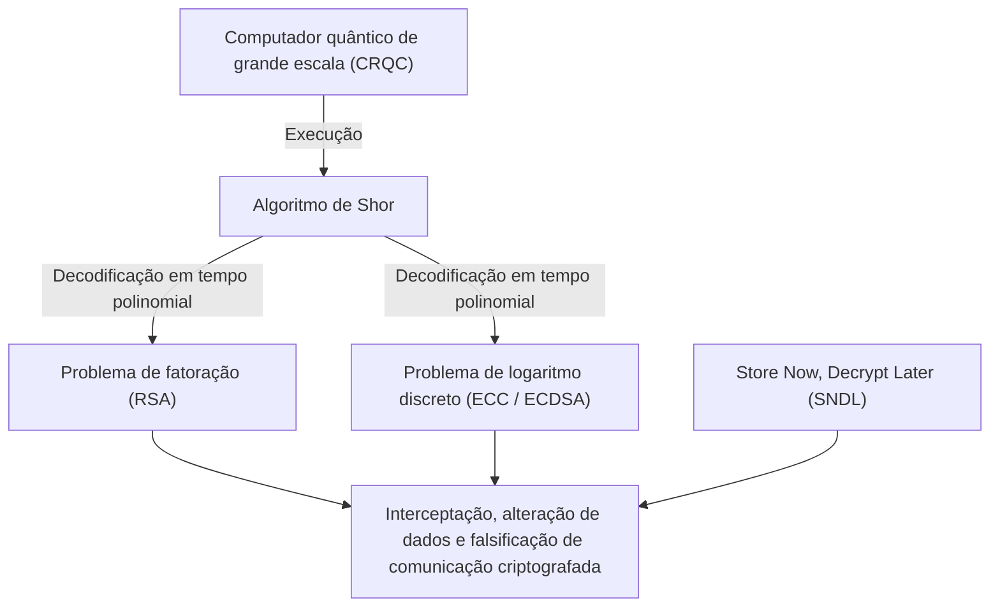
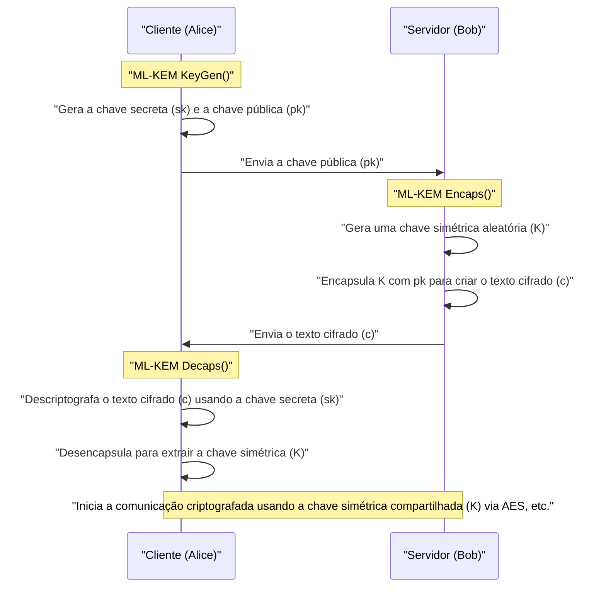
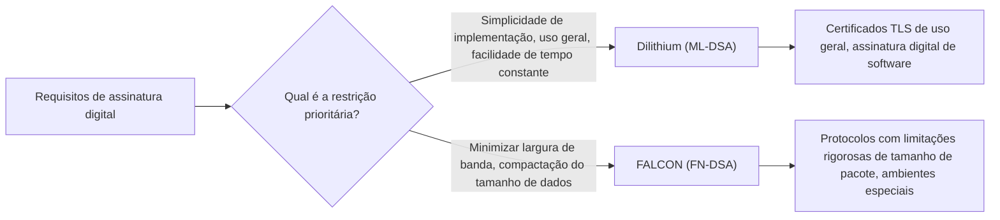

## 1. Introdução: A "crise da criptografia" trazida pelos computadores quânticos

Na sociedade da internet moderna, a tecnologia de criptografia de chave pública é infraestrutura indispensável para proteger a confidencialidade das comunicações e a integridade dos dados. A criptografia RSA e a criptografia de curva elíptica (ECC), amplamente utilizadas hoje, dependem de barreiras matemáticas, respectivamente a "dificuldade de fatoração de números compostos gigantescos" e a "dificuldade do problema do logaritmo discreto em curvas elípticas", para garantir a segurança. Em computadores clássicos (os computadores que usamos hoje, incluindo supercomputadores), está provado que resolver esses problemas matemáticos levaria mais tempo do que a idade do universo, o que tem sido a base de sua segurança.

No entanto, essa premissa robusta está prestes a ser fundamentalmente derrubada pelo progresso na teoria e aplicação prática dos **computadores quânticos**. O "**Algoritmo de Shor**", publicado em 1994 pelo criptógrafo Peter Shor, provou teoricamente que problemas de fatoração de primos e logaritmos discretos podem ser resolvidos em "tempo polinomial" executando-os em um computador quântico universal tolerante a falhas (CRQC: Cryptographically Relevant Quantum Computer) com desempenho suficiente. Isso significa que toda a criptografia de chave pública atualmente em uso será neutralizada.



É muito perigoso pensar que "não há problema porque a conclusão em grande escala dos computadores quânticos ainda está a décadas de distância". Isso ocorre porque o método de ataque chamado **Store Now, Decrypt Later (SNDL: Armazene agora, descriptografe depois)** já se tornou uma ameaça real. Trata-se de um ataque em que nações maliciosas ou organizações de hackers armazenam grandes quantidades de dados de comunicação atualmente criptografados (como o tráfego TLS) e os descriptografam todos no momento em que computadores quânticos poderosos se tornarem disponíveis no futuro. Segredos de estado, informações de infraestrutura e dados médicos que devem ser protegidos a longo prazo já estão expostos a essa ameaça.

Além disso, para criptografia de chave simétrica (como AES) e funções de hash (como SHA-256), existe o **Algoritmo de Grover**, descoberto em 1996. Isso reduz a complexidade computacional dos ataques de força bruta (brute force) à sua raiz quadrada. Em outras palavras, o nível de segurança do AES-128 é efetivamente reduzido pela metade, para 2 à potência de 64, portanto, na era quântica, recomenda-se usar chaves mais longas e comprimentos de hash como AES-256 e SHA-384.

A **Criptografia Pós-Quântica (PQC)**, baseada em novos problemas matemáticos difíceis de decifrar, mesmo usando computadores quânticos, nasceu para combater essa crise criptográfica sem precedentes. Neste artigo, com base nos resultados do processo de padronização PQC liderado pelo Instituto Nacional de Padrões e Tecnologia dos EUA (NIST), explicaremos os principais algoritmos PQC em detalhes extremos, desde sua base matemática até seus mecanismos e comparação de arquitetura.

---

## 2. Todo o escopo e história do projeto de padronização PQC do NIST

A transição da tecnologia de criptografia leva anos ou até décadas, incluindo o redesenho de protocolos, atualizações de sistema, substituição de hardware, etc. Por esse motivo, criptógrafos de todo o mundo vêm avançando na pesquisa PQC desde cedo. O NIST dos EUA desempenhou um papel central nisso. O NIST abriu o processo de padronização PQC ao público em 2016 e aceitou propostas de algoritmos de criptografia completamente novos da comunidade criptográfica global.

As duas categorias principais para padronização foram as seguintes:
1. **Criptografia de chave pública / Mecanismo de encapsulamento de chaves (KEM: Key Encapsulation Mechanism)**: Um mecanismo para compartilhar de forma segura uma chave simétrica para criptografar o caminho de comunicação, como em conexões TLS.
2. **Assinaturas digitais (Digital Signatures)**: Um mecanismo para provar que os dados não foram alterados e que não há falsificação pelo remetente (autenticidade) em atualizações de software e certificados digitais.

Após quase 6 anos de feroz avaliação, análise e competição criptoanalítica (Rodada 1 à Rodada 3), alguns algoritmos também foram submetidos a uma avaliação adicional na Rodada 4. Como resultado, em 2024, os seguintes algoritmos foram oficialmente emitidos como Padrões Federais de Processamento de Informação (FIPS) e foram estabelecidos como padrões globais futuros.

- **FIPS 203 (ML-KEM)**: KEM baseado em CRYSTALS-Kyber
- **FIPS 204 (ML-DSA)**: Assinatura digital baseada em CRYSTALS-Dilithium
- **FIPS 205 (SLH-DSA)**: Assinatura baseada em hash sem estado baseada em SPHINCS+
- **(Planejado para formulação futura) FN-DSA**: Assinatura digital baseada em FALCON

Cada um desses algoritmos selecionados se baseia em diferentes "problemas de dificuldade" matemáticos, garantindo diversidade (Crypto Agility) de modo que, mesmo se uma vulnerabilidade fatal for descoberta em um algoritmo no futuro, o sistema inteiro não entrará em colapso. No processo de padronização, a criptografia baseada em reticulados (Lattice-based cryptography) assumiu o papel principal principalmente do ponto de vista do desempenho, mas a criptografia baseada em hash e a criptografia baseada em código foram adotadas como backups fortes.

---

## 3. Classificação das principais abordagens matemáticas para PQC

Os algoritmos PQC são categorizados principalmente nas 5 áreas a seguir com base nos problemas matemáticos em que baseiam sua segurança. Neste artigo, nos aprofundaremos principalmente nas três primeiras.

1. **Criptografia baseada em reticulados (Lattice-based Cryptography)**:
   Baseia-se no Problema do Vetor Mais Curto (SVP) e no Problema do Vetor Mais Próximo (CVP) em espaços de reticulados multidimensionais, e no problema LWE derivado deles. É o centro da padronização do NIST, incluindo Kyber, Dilithium e FALCON. Possui o melhor equilíbrio entre velocidade de processamento, tamanho da chave pública e tamanho do texto cifrado, sendo adequado para uso geral.
2. **Criptografia baseada em hash (Hash-based Cryptography)**:
   Baseia sua segurança unicamente na "resistência à colisão" e "unidirecionalidade" das funções de hash criptográficas (como SHA-2 e SHAKE). É aplicável apenas a assinaturas digitais (SPHINCS+, etc.), mas tem a prova matemática mais forte de segurança e é caracterizada por uma resistência extremamente alta a ataques matemáticos desconhecidos.
3. **Criptografia baseada em código (Code-based Cryptography)**:
   Baseado na teoria de códigos de correção de erros, depende da dificuldade do Problema de Decodificação de Síndrome (Syndrome Decoding Problem). O Classic McEliece, proposto na década de 1970, é representativo e, embora tenha uma longa história e segurança comprovada, o tamanho da chave pública é extremamente grande, chegando a megabytes.
4. **Criptografia polinomial multivariada (Multivariate Polynomial Cryptography)**:
   Baseia-se na dificuldade de encontrar soluções para um sistema de equações quadráticas simultâneas multivariadas sobre um corpo finito (problema MQ). Foi proposto principalmente para assinaturas digitais (como Rainbow), mas durante a rodada final do NIST, descobriu-se um método de ataque poderoso que o decifrou em alguns dias em um único PC, levando muitos algoritmos a serem retirados da padronização.
5. **Criptografia baseada em isogenia (Isogeny-based Cryptography)**:
   Baseado no problema de encontrar caminhos em grafos de isogenia (Isogeny) de curvas elípticas. Com um tamanho de chave muito pequeno, era esperado que fosse o sucessor legítimo da ECC, mas seu candidato final, "SIKE", foi completamente decifrado em poucas horas num PC normal usando matemática clássica (como o ataque de Castryck-Decru) em 2022, resultando num final dramático que simboliza a dificuldade e o terror do design de PQC.

---

## 4. O abismo da criptografia baseada em reticulados: A base matemática do problema LWE e do Module-LWE

Atualmente considerada a mais promissora e o centro da padronização, a **criptografia baseada em reticulados**. Na raiz de sua segurança está o **Problema LWE (Learning with Errors: Aprendizado com Erros)**. Proposto por Oded Regev em 2005, essa conquista inovadora lhe rendeu o Prêmio Gödel. A compreensão moderna da PQC é impossível sem entender o problema LWE.

### 4.1. O que é o problema LWE (Learning with Errors)?

Primeiro, vamos considerar um sistema simples de equações lineares. Suponha que, sob um certo módulo $q$ (módulo $q$), temos uma matriz aleatória conhecida $A$, um vetor secreto desconhecido $\vec{s}$, e seu produto $\vec{b}$ é dado.

$$ \vec{b} = A\vec{s} \pmod q $$

Neste caso, é fácil encontrar o desconhecido $\vec{s}$ a partir das informações públicas $A$ e $\vec{b}$. Usando o clássico "método de eliminação de Gauss", $\vec{s}$ pode ser facilmente calculado em tempo polinomial.

No entanto, adicionar um "pequeno erro (ruído) intencional" a esta equação aumenta drasticamente a dificuldade do problema. Este é o **problema LWE**.

Preparamos um vetor secreto desconhecido $\vec{s} \in \mathbb{Z}_q^n$ e uma matriz escolhida aleatoriamente $A \in \mathbb{Z}_q^{m \times n}$. Além disso, preparamos um vetor de erro $\vec{e} \in \mathbb{Z}_q^m$, escolhido de acordo com uma distribuição normal ou binomial, cujos "valores dos elementos são suficientemente pequenos", e calculamos $\vec{b}$ da seguinte forma:

$$ \vec{b} = A\vec{s} + \vec{e} \pmod q $$

O **Problema LWE de Busca (Search LWE)** é o problema de "encontrar a informação secreta $\vec{s}$ a partir da informação pública $(A, \vec{b})$". Devido à existência deste erro $\vec{e}$, se você tentar métodos algébricos como a eliminação de Gauss, o erro $\vec{e}$ será amplificado como uma bola de neve durante a adição e subtração das equações, tornando-se indistinguível de valores aleatórios e, em última análise, colapsando.

A maravilha do problema LWE é que existe uma prova teórica forte (redução) de que, a menos que haja um algoritmo quântico que possa resolver os problemas de complexidade do pior caso (Worst-case hardness) no reticulado, como o GapSVP (Problema de Decisão do Vetor Mais Curto) ou SIVP (Problema de Vetores Independentes Mais Curtos), o problema LWE também não pode ser resolvido no caso médio (Average-case). Em outras palavras, mesmo chaves criptográficas geradas aleatoriamente têm garantia de forte segurança apoiada por limites teóricos.

### 4.2. Aumento drástico na eficiência através do Ring-LWE e Module-LWE

O problema LWE normal (Standard LWE) tem uma base de segurança muito clara, mas o tamanho da matriz $A$ se torna muito grande, resultando em chaves na ordem de megabytes, tornando-o impraticável. A abordagem proposta para resolver isso foi usar anéis polinomiais (Polynomial Rings) para introduzir estrutura algébrica.

No **problema Ring-LWE**, em vez de simples vetores e matrizes, usamos os elementos (polinômios) de um anel polinomial $R_q$. O anel polinomial ciclotômico a seguir é comumente usado nos padrões do NIST:

$$ R_q = \mathbb{Z}_q[X]/(X^n + 1) $$

Aqui, $n$ é uma potência de 2 (por exemplo: 256) e $q$ é um número primo apropriado. Neste anel, calculamos $b = a \cdot s + e \pmod q$ usando elementos $a, s, e \in R_q$. Como um único polinômio $a$ tem $n$ coeficientes, os dados podem ser consideravelmente compactados, e usando a **NTT (Transformada Teórica dos Números: Number Theoretic Transform)**, que é uma versão de corpo finito da Transformada Rápida de Fourier (FFT), a multiplicação de polinômios torna-se ultrarrápida com complexidade $O(n \log n)$.

No entanto, o Ring-LWE tinha a preocupação de que "vulnerabilidades desconhecidas poderiam existir devido à estrutura algébrica especial do anel". Além disso, para alterar o nível de segurança (por exemplo, equivalente a AES-128, 192, 256), o próprio grau do polinômio $n$ precisava ser alterado, e com isso, toda a implementação, como o algoritmo NTT, tinha que ser reescrita, apresentando um desafio de engenharia.

Portanto, o **problema Module-LWE (M-LWE)** foi adotado pelos algoritmos padronizados Kyber e Dilithium. Module-LWE é um compromisso, situando-se exatamente entre o Standard LWE, sem estrutura, e o Ring-LWE, excessivamente estruturado. Ele usa uma matriz $k \times k$ (módulo) cujos elementos são componentes do anel polinomial $R_q$.

$$ \vec{b} = A\vec{s} + \vec{e} \pmod{R_q} \quad (A \in R_q^{k \times k}, \vec{s}, \vec{e} \in R_q^k) $$

A maior vantagem do Module-LWE é que, mantendo o grau do polinômio $n$ constante ($n=256$ no padrão NIST), o nível de segurança pode ser facilmente escalado simplesmente mudando a dimensão da matriz $k$.
Por exemplo, no caso do Kyber, a dimensão $k$ é ajustada da seguinte forma:
- **Kyber512 (Nível 1)**: $k = 2$ (equivalente a AES-128)
- **Kyber768 (Nível 3)**: $k = 3$ (equivalente a AES-192)
- **Kyber1024 (Nível 5)**: $k = 4$ (equivalente a AES-256)

Isso tornou possível reutilizar 100% do código NTT subjacente e circuitos de hardware de operações polinomiais em todos os níveis de segurança, melhorando drasticamente a segurança e a eficiência da implementação.

---

## 5. CRYSTALS-Kyber (ML-KEM): O Mecanismo de Encapsulamento de Chaves de Próxima Geração

O CRYSTALS-Kyber, oficialmente padronizado como **FIPS 203 (ML-KEM)**, é um mecanismo de encapsulamento de chaves (KEM) baseado no problema Module-LWE descrito acima. No futuro, se tornará o padrão global de fato para compartilhar chaves de sessão com segurança em TLS 1.3, SSH, etc.

### 5.1. Arquitetura do KEM (Key Encapsulation Mechanism)

Na era da PQC, a abordagem de encapsulamento de KEM torna-se padrão, em vez da abordagem direta como no RSA, onde "o cliente cria uma chave simétrica e a criptografa com a chave pública do servidor e a envia".



### 5.2. O mecanismo algorítmico interno do Kyber e a Transformada de Fujisaki-Okamoto

O design do Kyber é extremamente refinado. Primeiro, constrói-se um esquema de criptografia de chave pública (Kyber.CPAPKE) seguro apenas contra CPA (Ataque de Texto Simples Escolhido). Em seguida, aplicando um método criptográfico muito poderoso chamado **Transformada de Fujisaki-Okamoto (Fujisaki-Okamoto Transform)**, ele é atualizado para um KEM completo, seguro até mesmo contra CCA (Ataque de Texto Cifrado Escolhido Adaptativo).

Os mecanismos principais de criptografia e descriptografia do CPAPKE são os seguintes:

1. **Geração de Chave (Key Generation)**:
   - A partir de um valor semente aleatório, gera uma matriz $A \in R_q^{k \times k}$ no domínio NTT. O módulo $q$ usado é $3329$.
   - Um vetor secreto $\vec{s}$ e um vetor de erro $\vec{e}$ com coeficientes pequenos são amostrados de uma distribuição binomial centralizada (CBD).
   - Calcula $\vec{t} = A\vec{s} + \vec{e}$. A chave pública é $(A, \vec{t})$ e a chave secreta é $\vec{s}$. (Na prática, $A$ é revelado como um valor de semente para economizar largura de banda).

2. **Criptografia (Encryption)**:
   - Uma mensagem de 32 bytes a ser compartilhada (o material para a chave simétrica) $m$ é codificada em um polinômio.
   - Um novo vetor aleatório $\vec{r}$ e pequenos erros $\vec{e_1}, e_2$ são gerados.
   - $\vec{u} = A^T\vec{r} + \vec{e_1}$ 
   - $v = \vec{t}^T\vec{r} + e_2 + \lfloor q/2 \rceil \cdot m$
   - O texto cifrado é $(\vec{u}, v)$.

3. **Descriptografia (Decryption)**:
   - O receptor calcula $v - \vec{s}^T\vec{u}$.
   - Expandindo esta fórmula, obtemos o seguinte:
     $v - \vec{s}^T\vec{u} = (\vec{t}^T\vec{r} + e_2 + \lfloor q/2 \rceil \cdot m) - \vec{s}^T(A^T\vec{r} + \vec{e_1})$
   - Substituindo $\vec{t} = A\vec{s} + \vec{e}$ aqui, o termo principal $\vec{s}^TA^T\vec{r}$ se cancela.
   - O que resta é $\lfloor q/2 \rceil \cdot m + (\vec{e}^T\vec{r} + e_2 - \vec{s}^T\vec{e_1})$.
   - O termo entre parênteses é "o produto ou soma de pequenos erros", então permanece um valor pequeno (ruído) como um todo. Portanto, julgando pelos limites se cada coeficiente está perto de $0$ ou de $q/2$, os bits (0 ou 1) da mensagem original $m$ podem ser perfeitamente restaurados sem erros.

A maior força do Kyber é sua impressionante **velocidade de processamento** e **tamanho de chave moderado**. Para o Kyber768, o tamanho da chave pública é de 1.184 bytes e o tamanho do texto cifrado é de 1.088 bytes. Embora sejam maiores em comparação com o RSA-3072 (tamanho da chave em torno de 384 bytes), eles podem caber dentro do MTU (Maximum Transmission Unit) das comunicações modernas da internet sem fragmentação de pacotes, tendo um efeito adverso quase nulo na latência da rede.

---

## 6. CRYSTALS-Dilithium (ML-DSA): Assinatura digital de uso geral baseada em reticulado

Na padronização de assinaturas digitais, algoritmos com diferentes filosofias de design competiram mesmo na mesma abordagem de criptografia baseada em reticulado. Dentre eles, **CRYSTALS-Dilithium** foi selecionado como **FIPS 204 (ML-DSA)** para ser a assinatura digital de uso geral.

### 6.1. Paradigma Fiat-Shamir com Abortos

Como o Kyber, Dilithium é um esquema de assinatura digital baseado no problema Module-LWE (e no problema Module-SIS). O design é baseado no paradigma extremamente importante chamado "**Fiat-Shamir with Aborts (Transformada de Fiat-Shamir com Interrupções)**".

A transformada Fiat-Shamir em si é um método padrão para converter um protocolo de prova de conhecimento zero interativo em uma assinatura digital não interativa. O provador (assinante) gera um compromisso $y$, calcula $w = Ay$, passa-o por uma função de hash para obter um desafio aleatório $c$ e calcula a resposta $z = y + cs$.

No entanto, quando isso é aplicado de forma simples à criptografia baseada em reticulado, a distribuição da resposta $z$ torna-se enviesada dependendo do valor da chave secreta $s$, levando a um problema fatal (vazamento matemático do tipo canal lateral) em que as informações da chave secreta $s$ vazam gradualmente para um invasor que observa um grande número de assinaturas.

A equipe de design do Dilithium (Lyubashevsky et al.) introduziu um método chamado "**Rejection Sampling (Amostragem de Rejeição)**": se os coeficientes do resultado do cálculo da assinatura $z$ não se enquadrarem em um intervalo de limite de segurança predefinido, todo o processo de assinatura é abortado, e os cálculos são reiniciados desde o início usando um novo número aleatório $y$.

Como resultado, a assinatura final $z$ tem uma distribuição perfeitamente uniforme, completamente independente da chave secreta, evitando totalmente qualquer vazamento matemático de informações.

### 6.2. Vantagens e facilidade de implementação do Dilithium

Uma grande vantagem de design do Dilithium é que ele **não usa de forma alguma** "amostragem de distribuição gaussiana" ou "operações de ponto flutuante" complexas no processo de geração de assinatura. Como pode ser implementado apenas com amostragem de distribuição uniforme, aritmética modular de inteiros simples, NTT e funções de hash (SHAKE), é fácil de implementar de forma segura e com tempo constante (Constant-time) em uma ampla variedade de ambientes, de microcontroladores embarcados a servidores em nuvem. Isso lhe dá uma forte resistência contra ataques físicos de canal lateral, como ataques de tempo.

---

## 7. FALCON (FN-DSA): Assinatura de reticulado extremamente compacta

O NIST selecionou **FALCON (Fast-Fourier Lattice-based Compact Signatures over NTRU)**, outra assinatura baseada em reticulado com características diferentes do Dilithium, como um candidato de padronização (atualmente em elaboração como FN-DSA).

### 7.1. Reticulado NTRU e Amostragem Gaussiana

A maior característica do FALCON é que ele usa **reticulados NTRU (N-th degree Truncated polynomial Ring Units)**, com uma longa história que remonta a 1996, em vez do problema LWE. Além disso, adota o paradigma "**Hash-and-Sign (Fazer hash e assinar)**" baseado na estrutura GPV (Gentry-Peikert-Vaikuntanathan).

No Hash-and-Sign, o valor do hash da mensagem é o ponto alvo no espaço, e o ponto no reticulado mais próximo desse ponto (a solução aproximada para o Problema do Vetor Mais Próximo) torna-se a assinatura. Isso requer a amostragem de pontos de acordo com uma distribuição gaussiana discreta, usando uma "base curta e de boa qualidade" que é a chave secreta.

O FALCON acelerou drasticamente esse cálculo pesado usando uma técnica chamada "**Ortogonalização Rápida de Fourier (Fast Fourier Orthogonalization: FFO)**".

### 7.2. Vantagens e Desvantagens do FALCON

A vantagem esmagadora do FALCON é que **o tamanho da assinatura e da chave pública são extremamente pequenos (compactos)**. Enquanto o tamanho da assinatura do Dilithium3 é de cerca de 3.309 bytes, o tamanho da assinatura do FALCON-512 é de apenas cerca de 666 bytes. A chave pública também é bem pequena, 897 bytes, tornando-se uma salvação em ambientes com limitações severas de largura de banda, dispositivos IoT e determinados protocolos de rede.

No entanto, há uma desvantagem significativa. Como a amostragem gaussiana discreta, que requer cálculos complexos de **ponto flutuante (64 bits IEEE 754)**, é obrigatória na geração de assinaturas, é extremamente difícil conseguir uma implementação em tempo constante para evitar o vazamento de tempo, e o código se torna massivo. Devido a isso, o FALCON é posicionado como um algoritmo altamente especializado para aplicações específicas, ao invés de uso geral (como o Dilithium).



---

## 8. SPHINCS+ (SLH-DSA): Assinatura baseada em hash que ostenta a maior segurança

Em preparação para o pior cenário, onde a segurança da criptografia baseada em reticulados seja no futuro quebrada por avanços de matemáticos geniais, o NIST estabeleceu o **FIPS 205 (SLH-DSA)**, ou seja, **SPHINCS+**, como padrão, possuindo uma abordagem completamente diferente da criptografia de reticulado.

O SPHINCS+ é classificado como uma **assinatura baseada em hash**. O fundamento para sua segurança depende de um único ponto: "a função hash criptográfica usada (como SHA-2 ou SHAKE256) tem resistência a colisões e unidirecionalidade". Como não depende de problemas matemáticos com uma estrutura algébrica específica, como LWE ou fatoração, ele possui uma segurança extremamente robusta (a segurança mais conservadora): não importa quão poderosos os algoritmos quânticos se tornem no futuro, isso pode ser contra-atacado simplesmente estendendo o comprimento da saída da função hash.

### 8.1. Arquitetura Stateless com WOTS+ e FORS

O histórico das assinaturas baseadas em hash é antigo, remontando à Assinatura Lamport e à Assinatura de Uso Único de Winternitz (WOTS) da década de 1970. Eram chaves descartáveis que "podiam ser usadas para assinar com segurança apenas uma vez". Para permitir o uso múltiplo, algoritmos como XMSS (eXtended Merkle Signature Scheme) e LMS foram desenvolvidos, combinando a Árvore de Merkle para gerenciar um número infinito de chaves descartáveis com um único hash raiz.

No entanto, XMSS e LMS tinham uma falha grave: eram "**Stateful (com retenção de estado)**". Exigia-se gravar o estado do índice de "qual chave descartável foi usada" na memória não-volátil rigorosamente a cada assinatura. Se, por exemplo, ao restaurar um snapshot de uma máquina virtual, o estado retrocedesse e a mesma chave fosse usada duas vezes, a chave secreta vazaria instantaneamente e o sistema entraria em colapso.

O SPHINCS+ é uma assinatura baseada em hash "**Stateless (sem retenção de estado)**" que resolve essa complexidade do gerenciamento de estado.
A tecnologia principal é a seguinte combinação:
1. **WOTS+ (Winternitz One-Time Signature Plus)**: Uma assinatura básica de uso único.
2. **FORS (Forest of Random Subsets)**: Tecnologia de Assinatura de Poucas Vezes (Few-Time Signature). A segurança é mantida mesmo se a mesma chave for reutilizada algumas vezes.
3. **Hyper-Tree (Estrutura de árvore gigante)**: Uma estrutura massiva com Árvores de Merkle sobrepostas em múltiplas camadas.

Na execução da assinatura, em vez de gerenciar o estado, o SPHINCS+ seleciona aleatoriamente usando números pseudoaleatórios uma das enormes quantidades de chaves FORS na base da Hyper-Tree e assina com ela. Como o número de folhas da árvore é astronomicamente grande, a probabilidade de escolher a mesma chave duas vezes por acaso (colisão) é baixa o suficiente para ser ignorada, realizando assim a propriedade stateless.

A única e maior fraqueza do SPHINCS+ é o **tamanho gigantesco de suas assinaturas**. Dependendo dos parâmetros, o tamanho pode variar de 17 kilobytes a 49 kilobytes, e a velocidade de geração de assinatura é esmagadoramente mais lenta em comparação com a criptografia de reticulado. Assim, o SPHINCS+ se destina a usos onde as assinaturas não são muito frequentes e a segurança absoluta de longo prazo é fortemente exigida, como assinatura para atualizações de software ou certificados de Autoridade de Certificação (CA) Raiz, ao invés da navegação web do dia-a-dia.

---

## 9. Criptografia baseada em código: O bom e velho gigante Classic McEliece

Uma abordagem importante que ainda está sendo avaliada como candidato final da Rodada 4 no processo de padronização do NIST é o **Classic McEliece**, uma **criptografia baseada em código**.

Proposto em 1978 por Robert McEliece, este algoritmo, juntamente com o RSA, é um dos mais antigos na história da criptografia de chave pública. Utiliza "Códigos de Goppa", um código geométrico algébrico. Baseia-se no "**Problema de Decodificação de Síndrome (Syndrome Decoding Problem)**", em que a mensagem é criptografada adicionando um erro intencional (vetor de ruído), e apenas aquele com a matriz de verificação de paridade do código de Goppa como chave secreta pode usar recursos poderosos de correção de erros para remover o ruído e recuperar a mensagem original.

$$ \vec{c} = \vec{m} G + \vec{e} $$
(Onde $G$ é a matriz geradora codificada (scrambled) atuando como chave pública, e $\vec{e}$ é o vetor de erro com peso $t$)

O que é mais incrível no Classic McEliece é o seu retrospecto avassalador: **apesar de mais de 40 anos desde a sua proposta, e sujeito a intensas pesquisas de criptoanálise em todo o mundo, nenhuma vulnerabilidade fundamental foi descoberta**. Ele tem a "segurança robusta mais bem comprovada pelo tempo" na PQC.

Além disso, tem a vantagem de um tamanho de texto cifrado extremamente pequeno (apenas cerca de 100 a 200 bytes). No entanto, há a desvantagem fatal de que **o tamanho da chave pública chega à ordem de megabytes (MB)**. Mesmo no nível de segurança mais baixo (equivalente ao AES-128), a chave pública é de cerca de 250 KB e excede 1 MB nos níveis mais altos.

Portanto, não é aplicável em cenários onde a chave pública é transmitida pela rede em toda comunicação, como no handshake TLS. No entanto, em casos de uso especiais onde a chave pública pode ser pré-implantada no sistema (hardcoded), como na troca de chaves pré-compartilhadas em VPNs, chaves públicas no firmware ou comunicações por satélite, continua a ser investigada como uma escolha extremamente promissora devido à sua sólida segurança.

---

## 10. Comparação de desempenho de cada algoritmo PQC e trade-offs

Aqui está um resumo das características de desempenho nos níveis comuns de segurança (níveis 2 a 3 do NIST, equivalentes ao AES-128 a 192) para os principais algoritmos explicados até agora.

| Algoritmo (Nome padrão) | Categoria | Base Matemática | Tamanho da chave pública | Tamanho da chave secreta | Tamanho texto cifrado/assin. | Tendência da vel. de processamento | Principais características e usos |
| :--- | :--- | :--- | :--- | :--- | :--- | :--- | :--- |
| **Kyber768**<br>(ML-KEM) | KEM | Module-LWE | 1.184 Bytes | 2.400 Bytes | 1.088 Bytes | Muito rápida | Melhor equilíbrio de tamanho e velocidade. Padrão genérico de KEM para TLS 1.3, etc. |
| **Dilithium3**<br>(ML-DSA) | Assinatura | Module-LWE | 1.952 Bytes | 4.032 Bytes | 3.309 Bytes | Geração e verificação rápidas | Implementação simples. Padrão genérico de assinatura digital. |
| **FALCON-512**<br>(FN-DSA) | Assinatura | Reticulado NTRU | 897 Bytes | 1.281 Bytes | 666 Bytes | Geração de assin. um pouco lenta, verificação ultrarrápida | Tamanho de assinatura mínimo. Porém, exige ponto flutuante. Focado em sistemas embarcados/IoT. |
| **SPHINCS+**<br>(SLH-DSA) | Assinatura | Função Hash | 32 Bytes | 64 Bytes | Aprox. 17.000 Bytes | Geração muito lenta | Risco quase nulo de colapso matemático. Uso para alta segurança como certificados raiz. |
| **Classic McEliece** | KEM | Código Goppa | **Aprox. 1,04 MB** | 13.568 Bytes | **188 Bytes** | Encapsulamento rápido | 40 anos de histórico de segurança. Chave pública imensa. Para ambientes com hardcode. |

### Compreendendo os trade-offs
No mundo PQC, não existe um único algoritmo mágico que seja "pequeno em tamanho, rápido em velocidade e com garantia matemática perfeita".
- **Padrões da Internet (Kyber / Dilithium)**: Possuem o melhor equilíbrio de desempenho, e são os mais adequados para um substituto direto (drop-in replacement) dos atuais RSA/ECC.
- **Conservadorismo Final (SPHINCS+)**: Selecionado quando você deseja uma garantia absoluta (seguro) contra avanços matemáticos futuros, mesmo com o sacrifício do tamanho dos dados e da velocidade de processamento.
- **Para ambientes especiais (FALCON / Classic McEliece)**: Armas de especialização escolhidas com base nas restrições do ambiente, como quando a largura de banda de comunicação é extremamente restrita ou quando a pré-distribuição é possível.

---

## 11. Desafios de implementação prática e a solução realística da "Criptografia Híbrida"

Com a conclusão da padronização pelo NIST e a emissão oficial do FIPS, a transição PQC das infraestruturas de TI mundiais (**migração PQC**) começou a sério. O navegador Chrome do Google, o iMessage da Apple (Protocolo PQ3), provedores de rede como Cloudflare, entre outros, já integraram o suporte PQC em seus protocolos e iniciaram operações reais.

Porém, existe um risco muito elevado em realizar uma transição completa e imediata para novos algoritmos de criptografia. Se, por exemplo, um matemático genial descobrir uma falha fatal de ataque (uma vulnerabilidade matemática decifrável até mesmo em um computador clássico) na criptografia de reticulado como o Kyber nos próximos anos, todo o sistema que depende dele será exposto instantaneamente.

Uma abordagem realística e recomendada para mitigar este risco de incerteza é a "**Criptografia Híbrida (Hybrid Cryptography)**".

Na criptografia híbrida, você usa simultaneamente a criptografia clássica com longo histórico de confiabilidade (por exemplo: criptografia de curva elíptica como X25519) e o novo PQC (por exemplo: Kyber768) para realizar a troca de chaves. Os componentes de chaves comuns são gerados de forma independente por cada algoritmo e, finalmente, as duas partes são combinadas por meio de uma Função de Derivação de Chave (KDF) segura para gerar o segredo mestre final.

```mermaid
graph TD
    A["Cliente"] -->|① Envia chave pública X25519 + chave pública Kyber| B["Servidor"]
    B -->|② Retorna chave compartilhada X25519 + texto cifrado encapsulado Kyber| A
    A --> C{"Derivação do Segredo Mestre (KDF)"}
    B --> C
    C -->|Entrada: (chave comum X25519) || (chave comum Kyber)| D["Chave de comunicação segura (AES-256 / ChaCha20)"]
    D -->|"Resistente às ameaças quânticas e às vulnerabilidades clássicas"| E["Comunicação segura por criptografia híbrida (TLS 1.3)"]
```

Isso realiza uma postura de segurança robusta de dois níveis: "Mesmo que um computador quântico seja construído e a ECC seja quebrada, o Kyber protegerá a comunicação", e inversamente, "Mesmo que uma falha matemática desconhecida seja descoberta no Kyber, a ECC protegerá a comunicação". Como exemplo representativo, existe o rascunho **X25519MLKEM768 (antigo X25519Kyber768)** sendo padronizado na IETF, e a comunicação entre os navegadores Web atuais e servidores de ponta já é realizada usando exatamente esse método híbrido.

Além disso, na concepção do sistema, o conceito de "**Crypto Agility (Agilidade Criptográfica)**" – a arquitetura que permite não depender excessivamente de um algoritmo de criptografia específico e de poder mudar rapidamente para outro algoritmo (por exemplo, de Kyber para McEliece, de Dilithium para SPHINCS+) se um algoritmo for quebrado – se tornará um requisito indispensável para o desenvolvimento de sistemas no futuro.

---

## 12. Conclusão: Uma Nova Fronteira Tecnológica Criptográfica

Ironia do destino, o computador quântico, uma tecnologia dos sonhos da humanidade, tornou-se a maior ameaça a romper as paredes defensivas matemáticas, a "fatoração" e o "problema do logaritmo discreto", nas quais confiamos por muitos anos. No entanto, criptógrafos de todo o mundo, sem se renderem, abriram domínios matemáticos multidimensionais muito mais profundos e complexos baseados em teorias de reticulados, árvores de funções hash e códigos de correção de erros, construindo novas muralhas defensivas conhecidas como Criptografia Pós-Quântica (PQC).

O término da padronização de FIPS 203 (ML-KEM), FIPS 204 (ML-DSA) e FIPS 205 (SLH-DSA) pelo NIST não é a linha de chegada. É apenas o primeiro passo na épica jornada de migração para PQC que durará décadas. Para engenheiros de software e arquitetos de sistemas, o grande desafio tecnológico será como adaptar de forma otimizada os protocolos de rede e os sistemas para o "aumento no tamanho da chave" e "mudanças nos custos de computação" que esses novos algoritmos trazem.

O conflito entre os computadores quânticos e a criptografia é a área emocionante onde a exploração matemática e a evolução da tecnologia da humanidade se cruzam da forma mais intensa. Esperamos que através deste artigo, você tenha conseguido compreender profundamente as belas teorias matemáticas por trás da PQC e os mecanismos surpreendentes de cada algoritmo que moldará o futuro da cibersegurança.

---
*Referências:*
* *Programa de Padronização de Criptografia Pós-Quântica do NIST*
* *FIPS 203: Padrão para Mecanismo de Encapsulamento de Chaves Baseado em Módulo de Reticulado*
* *FIPS 204: Padrão para Assinaturas Digitais Baseado em Módulo de Reticulado*
* *FIPS 205: Padrão para Assinaturas Digitais Stateless Baseadas em Hash*

