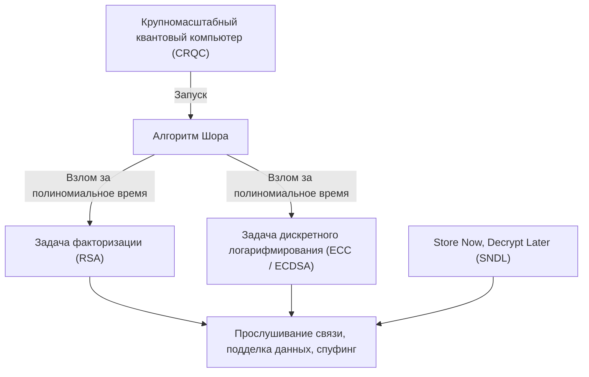
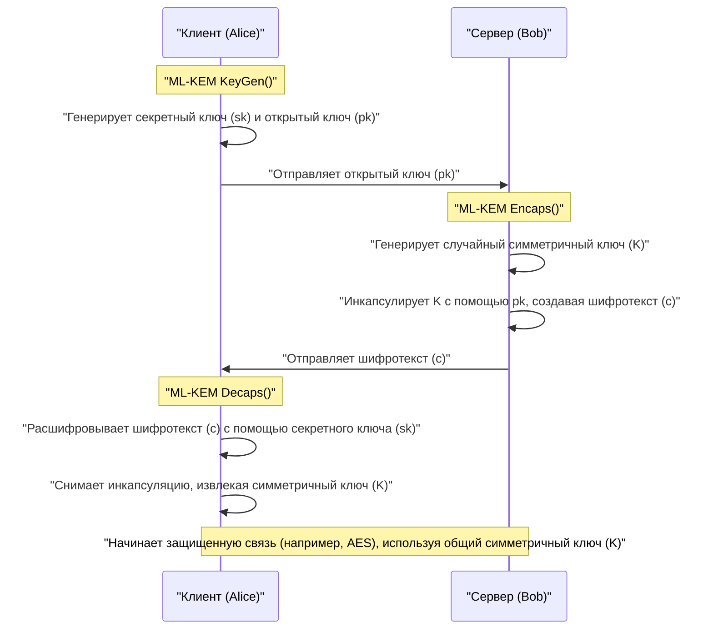
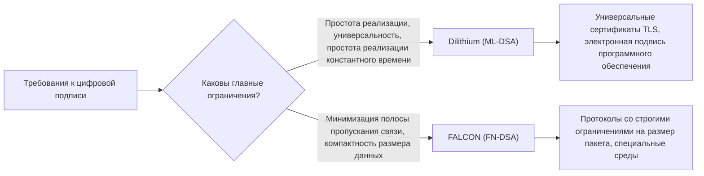

## 1. Введение: «Криптографический кризис», вызванный квантовыми компьютерами

В современном интернет-обществе криптография с открытым ключом является незаменимой инфраструктурой для защиты конфиденциальности связи и целостности данных. Безопасность широко используемых сегодня алгоритмов RSA и криптографии на эллиптических кривых (ECC) опирается на математические барьеры — «сложность факторизации больших составных чисел» и «сложность задачи дискретного логарифмирования на эллиптических кривых» соответственно. Доказано, что классическим компьютерам (компьютерам, которые мы используем сейчас, включая суперкомпьютеры) для решения этих математических задач потребовалось бы время, превышающее возраст Вселенной, и это служило основой их безопасности.

Однако эта надежная предпосылка может быть разрушена до основания из-за развития теории и практического применения **квантовых компьютеров**. В 1994 году криптограф Питер Шор (Peter Shor) представил «**Алгоритм Шора**», который теоретически доказал, что при запуске на отказоустойчивом универсальном квантовом компьютере (CRQC: Cryptographically Relevant Quantum Computer) достаточной мощности, задачи факторизации и дискретного логарифмирования могут быть решены за «полиномиальное время». Это означает, что все используемые в настоящее время алгоритмы криптографии с открытым ключом будут нейтрализованы.



Считать, что «полноценные квантовые компьютеры появятся еще через несколько десятилетий, поэтому проблем нет» — крайне опасно. Причина в том, что метод атаки, известный как **Store Now, Decrypt Later (SNDL: Сохрани сейчас, расшифруй потом)**, уже стал реальной угрозой. Это атака, при которой враждебные государства или хакерские организации сохраняют огромные объемы текущих зашифрованных данных связи (например, TLS-трафик) в хранилища, чтобы расшифровать их все в тот момент, когда в будущем станет доступен мощный квантовый компьютер. Государственные секреты, инфраструктурная информация и медицинские данные, требующие долгосрочной защиты, уже подвержены этой угрозе.

Кроме того, для симметричной криптографии (например, AES) и хеш-функций (например, SHA-256) существует **Алгоритм Гровера**, открытый в 1996 году. Он сокращает вычислительную сложность атаки полным перебором (брутфорс) до квадратного корня. Другими словами, уровень безопасности AES-128 фактически снижается вдвое — до 2 в 64-й степени, поэтому в квантовую эру рекомендуется использовать более длинные ключи и хеши, такие как AES-256 и SHA-384.

Для противодействия этому беспрецедентному криптографическому кризису была создана **постквантовая криптография (Post-Quantum Cryptography: PQC)**, основанная на новых математических задачах, которые трудно решить даже с помощью квантовых компьютеров. В этой статье, основываясь на результатах процесса стандартизации PQC, проведенного Национальным институтом стандартов и технологий США (NIST), мы подробно рассмотрим основные алгоритмы PQC — от их математических основ до механизмов работы и сравнения архитектур.

---

## 2. Обзор и история проекта по стандартизации PQC от NIST

Переход на новые криптографические технологии, включая перепроектирование протоколов, обновление систем и замену оборудования, занимает от нескольких лет до десятилетий. Поэтому криптографы во всем мире заранее начали исследования в области PQC. Центральную роль в этом сыграл NIST (Национальный институт стандартов и технологий) США. В 2016 году NIST объявил о начале процесса стандартизации PQC и начал принимать предложения совершенно новых криптографических алгоритмов от мирового криптографического сообщества.

Объектами стандартизации стали две основные категории:
1. **Криптография с открытым ключом / Механизм инкапсуляции ключа (KEM: Key Encapsulation Mechanism)**: Механизм для безопасного обмена (доставки) симметричных ключей, используемых для шифрования каналов связи, например, при TLS-соединениях.
2. **Цифровые подписи (Digital Signatures)**: Механизм для проверки отсутствия фальсификации данных и предотвращения подмены отправителя (аутентичность) при обновлениях программного обеспечения или в цифровых сертификатах.

После почти шести лет интенсивной оценки, анализа и соревнований по взлому (раунды 1–3), а также дополнительной оценки некоторых алгоритмов в раунде 4, следующие алгоритмы были официально выпущены в качестве Федеральных стандартов обработки информации (FIPS) в 2024 году и утверждены как будущие мировые стандарты:

- **FIPS 203 (ML-KEM)**: KEM на базе CRYSTALS-Kyber
- **FIPS 204 (ML-DSA)**: Цифровая подпись на базе CRYSTALS-Dilithium
- **FIPS 205 (SLH-DSA)**: Цифровая подпись на основе хешей без сохранения состояния на базе SPHINCS+
- **(Ожидается в будущем) FN-DSA**: Цифровая подпись на базе FALCON

Выбранные алгоритмы опираются на различные математические «задачи о сложности», что обеспечивает разнообразие (Crypto Agility), чтобы в случае обнаружения критической уязвимости в одном алгоритме вся система не рухнула. В процессе стандартизации криптография на решетках (Lattice-based cryptography) стала главным героем с точки зрения производительности, но криптография на основе хешей и кодов была принята в качестве надежного резерва.

---

## 3. Классификация основных математических подходов PQC

Алгоритмы PQC в основном делятся на следующие пять категорий в зависимости от математических задач, служащих основой их безопасности. В этой статье мы подробно рассмотрим первые три.

1. **Криптография на решетках (Lattice-based Cryptography)**:
   Основана на задаче нахождения кратчайшего вектора (SVP), задаче нахождения ближайшего вектора (CVP) в многомерном пространстве решеток, а также на производной от них задаче LWE. Это ядро стандартизации NIST, к которому относятся Kyber, Dilithium и FALCON. Они предлагают лучший баланс между скоростью обработки, размером открытого ключа и размером шифротекста, что делает их подходящими для общего использования.
2. **Криптография на основе хешей (Hash-based Cryptography)**:
   Безопасность опирается исключительно на «устойчивость к коллизиям» и «односторонность» криптографических хеш-функций (таких как SHA-2 или SHAKE). Применима только для цифровых подписей (например, SPHINCS+), но характеризуется наиболее строгим доказательством безопасности и чрезвычайно высокой устойчивостью к неизвестным математическим атакам.
3. **Криптография на основе кодов (Code-based Cryptography)**:
   Основана на теории кодов с исправлением ошибок и опирается на сложность задачи синдромного декодирования (Syndrome Decoding Problem). Типичным представителем является Classic McEliece, предложенный в 1970-х годах. Обладает долгой историей и доказанной безопасностью, но при этом имеет крайне большие размеры открытых ключей (в мегабайтах).
4. **Многомерная полиномиальная криптография (Multivariate Polynomial Cryptography)**:
   Основана на сложности решения системы нелинейных уравнений со многими переменными над конечным полем (задача MQ). Предлагалась в основном для цифровых подписей (например, Rainbow), но во время финального раунда NIST был обнаружен мощный метод атаки, позволивший взломать ее на обычном ПК за несколько дней, из-за чего многие алгоритмы выбыли из процесса стандартизации.
5. **Криптография на основе изогений (Isogeny-based Cryptography)**:
   Основана на задаче поиска пути в графах изогений эллиптических кривых. Имела очень маленький размер ключа и ожидалась как достойный преемник ECC, однако в 2022 году финалист «SIKE» был полностью взломан всего за несколько часов на обычном ПК с использованием классической математики (атака Castryck-Decru), что стало драматичным финалом, символизирующим сложность и опасность проектирования PQC.

---

## 4. Глубины криптографии на решетках: задача LWE и математические основы Module-LWE

В настоящее время наиболее перспективной и ставшей ядром стандартизации является **криптография на решетках**. В основе ее безопасности лежит **задача LWE (Learning with Errors: Обучение с ошибками)**. Она была предложена Одедом Регевом (Oded Regev) в 2005 году, и за это прорывное достижение он был удостоен премии Гёделя. Невозможно говорить о современной PQC без понимания задачи LWE.

### 4.1. Что такое задача LWE (Learning with Errors)?

Сначала рассмотрим простую систему линейных уравнений. Предположим, по модулю $q$ даны известная случайная матрица $A$, неизвестный секретный вектор $\vec{s}$ и их произведение $\vec{b}$:

$$ \vec{b} = A\vec{s} \pmod q $$

В этом случае, найти неизвестный $\vec{s}$ из открытой информации $A$ и $\vec{b}$ довольно просто. Используя классический алгоритм «метод Гаусса», можно легко вычислить $\vec{s}$ за полиномиальное время.

Однако, если добавить к этому уравнению «небольшую преднамеренную ошибку (шум)», сложность задачи резко возрастает. Это и есть **задача LWE**.

Имеется неизвестный секретный вектор $\vec{s} \in \mathbb{Z}_q^n$ и случайно выбранная матрица $A \in \mathbb{Z}_q^{m \times n}$. Кроме того, подготавливается вектор ошибок $\vec{e} \in \mathbb{Z}_q^m$ с «достаточно малыми значениями элементов», выбранными в соответствии с нормальным или биномиальным распределением, и $\vec{b}$ вычисляется следующим образом:

$$ \vec{b} = A\vec{s} + \vec{e} \pmod q $$

**Поисковая задача LWE (Search LWE)** заключается в нахождении секретной информации $\vec{s}$ из открытых данных $(A, \vec{b})$. Из-за присутствия ошибки $\vec{e}$ попытки применить алгебраические методы, такие как метод Гаусса, терпят неудачу: в процессе сложения и вычитания уравнений ошибка $\vec{e}$ нарастает, как снежный ком, и в конечном итоге результат становится неотличимым от случайных значений.

Величие задачи LWE заключается в наличии сильного теоретического доказательства (сведения), согласно которому, если не существует квантового алгоритма, способного решить задачи на решетках в худшем случае (Worst-case hardness), такие как GapSVP и SIVP, то задачу LWE невозможно решить в среднем случае (Average-case). Это означает, что даже случайно сгенерированные криптографические ключи обладают надежной безопасностью, подкрепленной теоретическими пределами.

### 4.2. Радикальное повышение эффективности с помощью Ring-LWE и Module-LWE

Стандартная задача LWE (Standard LWE) имеет очень четкие основания для безопасности, но матрица $A$ становится слишком большой, а размер ключа достигает мегабайтов, что делает ее непрактичной. В связи с этим был предложен подход, использующий кольца многочленов (Polynomial Rings) для создания алгебраической структуры.

В задаче **Ring-LWE** вместо обычных векторов и матриц используются элементы (многочлены) некоего кольца многочленов $R_q$. В стандартах NIST обычно используется следующее круговое кольцо многочленов:

$$ R_q = \mathbb{Z}_q[X]/(X^n + 1) $$

Здесь $n$ — степень двойки (например, 256), а $q$ — подходящее простое число. В этом кольце используются элементы $a, s, e \in R_q$ для вычисления $b = a \cdot s + e \pmod q$. Поскольку один многочлен $a$ имеет $n$ коэффициентов, данные можно значительно сжать. Кроме того, использование **NTT (Number Theoretic Transform: Теоретико-числовое преобразование)**, версии быстрого преобразования Фурье (FFT) для конечных полей, позволяет сверхбыстро умножать многочлены с вычислительной сложностью $O(n \log n)$.

Однако в случае с Ring-LWE существовали опасения, что «могут существовать неизвестные уязвимости из-за специфической алгебраической структуры кольца». Кроме того, при изменении уровня безопасности (эквивалентно AES-128, 192, 256 и т.д.) было необходимо изменять саму степень многочлена $n$, что влекло за собой инженерную проблему полного переписывания реализации, включая алгоритм NTT.

В связи с этим алгоритмы, прошедшие стандартизацию (Kyber и Dilithium), приняли задачу **Module-LWE (M-LWE)**. Module-LWE — это компромисс между бесструктурным Standard LWE и слишком структурированным Ring-LWE. Он использует матрицу (модуль) размера $k \times k$, элементами которой являются элементы кольца многочленов $R_q$:

$$ \vec{b} = A\vec{s} + \vec{e} \pmod{R_q} \quad (A \in R_q^{k \times k}, \vec{s}, \vec{e} \in R_q^k) $$

Главное преимущество Module-LWE заключается в том, что при фиксированной степени многочлена $n$ (в стандартах NIST $n=256$) можно легко масштабировать уровень безопасности, просто изменяя размерность матрицы $k$.
Например, в Kyber размерность $k$ регулируется следующим образом:
- **Kyber512 (Level 1)**: $k = 2$ (эквивалентно AES-128)
- **Kyber768 (Level 3)**: $k = 3$ (эквивалентно AES-192)
- **Kyber1024 (Level 5)**: $k = 4$ (эквивалентно AES-256)

Это позволило на 100% повторно использовать базовый код NTT и аппаратные схемы для полиномиальных вычислений на всех уровнях безопасности, что радикально повысило безопасность и эффективность реализации.

---

## 5. CRYSTALS-Kyber (ML-KEM): Механизм инкапсуляции ключа следующего поколения

Официально стандартизированный как **FIPS 203 (ML-KEM)**, CRYSTALS-Kyber представляет собой механизм инкапсуляции ключа (KEM), основанный на задаче Module-LWE, описанной выше. В будущем он станет де-факто мировым стандартом для безопасного обмена сессионными ключами в TLS 1.3, SSH и других протоколах.

### 5.1. Архитектура KEM (Key Encapsulation Mechanism)

В эру PQC стандартом станет не прямой подход, как в RSA, где «клиент создает симметричный ключ, шифрует его открытым ключом сервера и отправляет», а концепция инкапсуляции, называемая KEM.



### 5.2. Внутренние механизмы алгоритма Kyber и преобразование Фудзисаки-Окамото

Дизайн Kyber очень утонченный. Сначала создается схема криптографии с открытым ключом, устойчивая только к CPA (атака на основе выбранного открытого текста) — Kyber.CPAPKE. Затем к ней применяется мощный криптографический метод, известный как **преобразование Фудзисаки-Окамото (Fujisaki-Okamoto Transform)**, благодаря которому схема превращается в полноценный KEM, устойчивый к CCA (адаптивная атака на основе выбранного шифротекста).

Основной механизм шифрования и дешифрования CPAPKE выглядит следующим образом:

1. **Генерация ключей (Key Generation)**:
   - Из случайного значения сида генерируется матрица $A \in R_q^{k \times k}$ в домене NTT. Используется модуль $q = 3329$.
   - Из центрированного биномиального распределения (CBD) берутся секретный вектор $\vec{s}$ и вектор ошибок $\vec{e}$ с малыми коэффициентами.
   - Вычисляется $\vec{t} = A\vec{s} + \vec{e}$. Открытый ключ — это $(A, \vec{t})$, секретный ключ — $\vec{s}$. (На практике $A$ раскрывается в виде сида для экономии пропускной способности).

2. **Шифрование (Encryption)**:
   - 32-байтное сообщение $m$ (материал для симметричного ключа), которым необходимо обменяться, кодируется в многочлен.
   - Генерируются новый случайный вектор $\vec{r}$ и малые ошибки $\vec{e_1}, e_2$.
   - $\vec{u} = A^T\vec{r} + \vec{e_1}$ 
   - $v = \vec{t}^T\vec{r} + e_2 + \lfloor q/2 \rceil \cdot m$
   - Шифротекстом является пара $(\vec{u}, v)$.

3. **Дешифрование (Decryption)**:
   - Получатель вычисляет $v - \vec{s}^T\vec{u}$.
   - При разложении формулы получаем:
     $v - \vec{s}^T\vec{u} = (\vec{t}^T\vec{r} + e_2 + \lfloor q/2 \rceil \cdot m) - \vec{s}^T(A^T\vec{r} + \vec{e_1})$
   - Подставив $\vec{t} = A\vec{s} + \vec{e}$, главный член $\vec{s}^TA^T\vec{r}$ сокращается.
   - Остается: $\lfloor q/2 \rceil \cdot m + (\vec{e}^T\vec{r} + e_2 - \vec{s}^T\vec{e_1})$.
   - Члены в скобках — это «произведения и суммы малых ошибок», поэтому в целом они остаются достаточно малыми (шумом). Следовательно, путем проверки того, близок ли каждый коэффициент к $0$ или к $q/2$, можно полностью и безошибочно восстановить биты (0 или 1) исходного сообщения $m$.

Главными преимуществами Kyber являются его потрясающая **скорость обработки** и **умеренный размер ключа**. Для Kyber768 размер открытого ключа составляет 1184 байта, а размер шифротекста — 1088 байт. И хотя они больше по сравнению с RSA-3072 (размер ключа около 384 байт), они помещаются в MTU (Maximum Transmission Unit) современных интернет-сетей без фрагментации пакетов и практически не влияют на сетевые задержки.

---

## 6. CRYSTALS-Dilithium (ML-DSA): Универсальная цифровая подпись на основе решеток

В процессе стандартизации цифровых подписей соревновались алгоритмы с различными концептуальными дизайнами в рамках подхода криптографии на решетках. Среди них в качестве универсальной цифровой подписи **FIPS 204 (ML-DSA)** был выбран **CRYSTALS-Dilithium**.

### 6.1. Парадигма Fiat-Shamir with Aborts

Dilithium, как и Kyber, является схемой цифровой подписи на основе Module-LWE (а также задачи Module-SIS). В основе его дизайна лежит критически важная парадигма «**Fiat-Shamir with Aborts (Преобразование Фиата-Шамира с прерываниями)**».

Само по себе преобразование Фиата-Шамира является стандартным методом для преобразования интерактивного протокола доказательства с нулевым разглашением в неинтерактивную цифровую подпись. Доказывающий (подписант) генерирует обязательство $y$, вычисляет $w = Ay$ и пропускает через хеш-функцию, чтобы получить случайный запрос $c$, и вычисляет ответ $z = y + cs$.

Однако при простом применении этого метода в криптографии на решетках распределение ответа $z$ искажается в зависимости от значения секретного ключа $s$, что приводит к критической проблеме (математическая утечка типа побочного канала), когда атакующий, анализируя множество подписей, постепенно получает информацию о секретном ключе $s$.

Команда разработчиков Dilithium (Любашевский и др.) внедрила метод «**выборки с отклонением (Rejection Sampling)**», при котором, если коэффициенты вычисленного результата подписи $z$ не попадают в заранее заданный безопасный пороговый диапазон, весь процесс подписания прерывается (Abort), и вычисления начинаются заново с новым случайным числом $y$.

В результате окончательно выдаваемая подпись $z$ имеет абсолютно равномерное распределение, не зависящее от секретного ключа, что математически полностью предотвращает утечку информации.

### 6.2. Преимущества Dilithium и простота реализации

Огромное преимущество дизайна Dilithium заключается в том, что в процессе создания подписи **вообще не используется** сложная «выборка из гауссовского распределения» или «вычисления с плавающей запятой». Поскольку алгоритм может быть реализован с использованием только выборки из равномерного распределения, простых модульных целочисленных вычислений, NTT и хеш-функций (SHAKE), его легко безопасно реализовать за константное время (Constant-time) в самых разных средах — от встроенных микроконтроллеров до облачных серверов. Это также обеспечивает надежную защиту от физических атак по сторонним каналам, таких как атаки по времени.

---

## 7. FALCON (FN-DSA): Ультракомпактная решеточная подпись

NIST выбрал **FALCON (Fast-Fourier Lattice-based Compact Signatures over NTRU)** как еще одного кандидата на стандартизацию подписи на решетках, обладающего характеристиками, отличными от Dilithium (в настоящее время разрабатывается черновик стандарта FN-DSA).

### 7.1. Решетки NTRU и гауссовская выборка

Главной особенностью FALCON является использование исторически более старых (существующих с 1996 года) **решеток NTRU (N-th degree Truncated polynomial Ring Units)** вместо задачи LWE. Кроме того, в нем используется парадигма «**Hash-and-Sign (Хешируй и подписывай)**», основанная на фреймворке GPV (Gentry-Peikert-Vaikuntanathan).

В Hash-and-Sign хеш сообщения служит целевой точкой в пространстве, а подписью является нахождение ближайшей к ней точки решетки (приближенное решение задачи нахождения ближайшего вектора). Для этого требуется выборка точек в соответствии с дискретным гауссовским распределением, используя секретный ключ — «качественный короткий базис».

FALCON радикально ускорил эти тяжелые вычисления с помощью метода, известного как «**Быстрая ортогонализация Фурье (Fast Fourier Orthogonalization: FFO)**».

### 7.2. Преимущества и недостатки FALCON

Огромным преимуществом FALCON является его **чрезвычайно маленький размер подписи и открытого ключа (компактность)**. В то время как размер подписи Dilithium3 составляет около 3309 байт, размер подписи FALCON-512 — всего около 666 байт. Открытый ключ также очень мал — 897 байт. Это делает его настоящим спасением в условиях с жесткими ограничениями пропускной способности, для IoT-устройств и специфических сетевых протоколов.

Однако существует и серьезный недостаток. Поскольку при генерации подписи требуется дискретная гауссовская выборка, включающая сложные **вычисления с плавающей запятой (64-bit IEEE 754)**, реализовать ее за константное время (Constant-time implementation) для предотвращения утечек по времени крайне сложно, и размер кода становится огромным. По этой причине FALCON позиционируется как мощный специализированный алгоритм для конкретных применений, в отличие от универсального Dilithium.



---

## 8. SPHINCS+ (SLH-DSA): Подпись на основе хешей с высочайшим уровнем безопасности

На случай худшего сценария, при котором безопасность решеточной криптографии будет нарушена в будущем из-за прорыва гениальных математиков, NIST разработал стандарт **FIPS 205 (SLH-DSA)**, или **SPHINCS+**, с совершенно иным подходом.

SPHINCS+ относится к категории **подписей на основе хешей**. Его безопасность опирается исключительно на один факт: «используемая криптографическая хеш-функция (например, SHA-2 или SHAKE256) обладает устойчивостью к коллизиям и односторонностью». Поскольку он не зависит от математических задач с определенной алгебраической структурой, таких как LWE или факторизация, какие бы мощные квантовые алгоритмы ни появились в будущем, им можно будет противостоять простым увеличением длины выхода хеш-функции. Это обеспечивает чрезвычайно надежную безопасность (наиболее консервативную защиту).

### 8.1. Архитектура без сохранения состояния (stateless) с использованием WOTS+ и FORS

История подписей на основе хешей давняя и восходит к подписи Лэмпорта и одноразовой подписи Винтерница (WOTS) в 1970-х годах. Это были одноразовые ключи, позволяющие «безопасно подписать только один раз». Чтобы сделать возможным их многократное использование, были разработаны алгоритмы XMSS (eXtended Merkle Signature Scheme) и LMS, которые с помощью деревьев Меркла (Merkle Tree) управляли бесчисленным количеством одноразовых ключей под одним корневым хешем.

Однако у XMSS и LMS был серьезный недостаток — они были «**stateful (с сохранением состояния)**». При каждом создании подписи необходимо было строго фиксировать в энергонезависимой памяти индекс («какой по счету одноразовый ключ был использован»). Если в результате восстановления снимка виртуальной машины состояние откатывалось назад, и один и тот же ключ использовался дважды, секретный ключ мгновенно утекал, и система рушилась.

SPHINCS+ решает эту проблему управления состоянием и является **stateless (не требующей сохранения состояния)** подписью на основе хешей.
В основе его технологии лежит следующая комбинация:
1. **WOTS+ (Winternitz One-Time Signature Plus)**: Базовая одноразовая подпись.
2. **FORS (Forest of Random Subsets)**: Технология подписи с ограниченным числом использований (Few-Time Signature). Сохраняет безопасность, даже если один и тот же ключ используется несколько раз.
3. **Hyper-Tree (Гипердерево)**: Гигантская структура, состоящая из многоуровнево вложенных деревьев Меркла.

При создании подписи в SPHINCS+ вместо управления состоянием используется псевдослучайное число для случайного выбора одного из огромного числа ключей FORS в основании Hyper-Tree. Поскольку количество листьев дерева астрономически велико, вероятность случайного выбора одного и того же ключа дважды (коллизия) ничтожно мала, что в итоге позволяет реализовать подход без сохранения состояния.

Единственным и самым большим недостатком SPHINCS+ является **очень большой размер подписи**. В зависимости от параметров он может достигать от 17 КБ до 49 КБ, а скорость генерации подписи значительно ниже по сравнению с решеточной криптографией. Поэтому ожидается, что алгоритм будет применяться не в повседневном веб-браузинге, а в сценариях, требующих долгосрочной абсолютной безопасности и не требующих частого подписания, например, в подписях обновлений ПО или сертификатах корневых удостоверяющих центров (CA).

---

## 9. Криптография на основе кодов: старый добрый гигант Classic McEliece

В процессе стандартизации NIST важным подходом, который все еще оценивается в качестве финалиста Раунда 4, является алгоритм **Classic McEliece**, относящийся к **криптографии на основе кодов**.

Предложенный Робертом МакЭлисом (Robert McEliece) в 1978 году, этот алгоритм является одним из старейших в истории криптографии с открытым ключом, наряду с RSA. Он использует алгебро-геометрические коды, называемые «кодами Гоппы», и основан на «**задаче синдромного декодирования (Syndrome Decoding Problem)**»: к сообщению преднамеренно добавляется ошибка (вектор шума) для его шифрования, а восстановить исходное сообщение, удалив ошибку с помощью мощных возможностей исправления, может только тот, у кого в качестве секретного ключа есть проверочная матрица кода Гоппы.

$$ \vec{c} = \vec{m} G + \vec{e} $$
(где $G$ — скремблированная порождающая матрица, являющаяся открытым ключом, а $\vec{e}$ — вектор ошибки веса $t$)

Удивительно в Classic McEliece то, что **прошло более 40 лет с момента его создания, он подвергался интенсивным исследованиям по взлому криптографами со всего мира, но при этом ни разу не была обнаружена его фундаментальная уязвимость** — это колоссальный послужной список. Из всех алгоритмов PQC он обладает самой «проверенной временем надежной безопасностью».

Кроме того, есть преимущество: размер шифротекста очень мал (всего около 100–200 байт). Однако у него есть критический недостаток — **размер открытого ключа измеряется мегабайтами (МБ)**. Даже на самом низком уровне безопасности (эквивалентно AES-128) открытый ключ составляет около 250 КБ, а на высоких уровнях превышает 1 МБ.

По этой причине он совершенно не подходит для таких сценариев, как рукопожатие TLS, где открытый ключ передается по сети при каждом соединении. Однако для обмена предварительно общими ключами VPN, жесткого кодирования открытых ключей в прошивку или в спутниковой связи — особых случаях, где открытые ключи могут быть предварительно размещены в системе, он продолжает рассматриваться как крайне перспективный вариант благодаря своей высокой безопасности.

---

## 10. Сравнение производительности и компромиссы алгоритмов PQC

В таблице ниже приведены характеристики производительности основных алгоритмов, обсуждавшихся до сих пор, на общих уровнях безопасности (эквивалентно NIST Level 2–3, уровень AES-128–192).

| Алгоритм (Стандартное имя) | Категория | Математическая основа | Размер открытого ключа | Размер секретного ключа | Размер шифротекста/подписи | Тенденция скорости обработки | Основные характеристики и применения |
| :--- | :--- | :--- | :--- | :--- | :--- | :--- | :--- |
| **Kyber768**<br>(ML-KEM) | KEM | Module-LWE | 1,184 Bytes | 2,400 Bytes | 1,088 Bytes | Очень высокая | Лучший баланс размера ключа и скорости. Универсальный стандарт KEM для TLS 1.3 и др. |
| **Dilithium3**<br>(ML-DSA) | Подпись | Module-LWE | 1,952 Bytes | 4,032 Bytes | 3,309 Bytes | Генерация и верификация быстрые | Простая реализация. Универсальный стандарт цифровой подписи. |
| **FALCON-512**<br>(FN-DSA) | Подпись | Решетка NTRU | 897 Bytes | 1,281 Bytes | 666 Bytes | Медленная генерация подписи, сверхбыстрая верификация | Минимальный размер подписи. Требует вычислений с плавающей запятой. Для встраиваемых систем и IoT. |
| **SPHINCS+**<br>(SLH-DSA) | Подпись | Хеш-функция | 32 Bytes | 64 Bytes | Ок. 17,000 Bytes | Очень медленная генерация | Риск математического взлома близок к нулю. Для высокосекретных применений (корневые сертификаты). |
| **Classic McEliece** | KEM | Код Гоппы | **Ок. 1.04 MB** | 13,568 Bytes | **188 Bytes** | Быстрая инкапсуляция | 40 лет доказанной безопасности. Огромный открытый ключ. Для сред с возможностью хардкодинга. |

### Понимание компромиссов
В мире PQC не существует единого волшебного алгоритма, который был бы «маленьким, быстрым и имел безупречные математические гарантии».
- **Стандарт интернета (Kyber / Dilithium)**: Предлагает наилучший баланс производительности и лучше всего подходит для прозрачной замены (drop-in replacement) текущих RSA/ECC.
- **Предельный консерватизм (SPHINCS+)**: Выбирается в тех случаях, когда требуется абсолютная страховка от будущих математических прорывов, даже ценой увеличения размера данных и снижения скорости.
- **Для особых сред (FALCON / Classic McEliece)**: Специализированное оружие, выбираемое в зависимости от ограничений среды — например, при крайне узкой полосе пропускания связи или при возможности предварительного распространения ключей.

---

## 11. Проблемы практического применения и реалистичное решение: «Гибридная криптография»

С завершением стандартизации NIST и официальным выпуском стандартов FIPS, в IT-инфраструктуре по всему миру стартовал полномасштабный переход на PQC (**PQC-миграция**). Браузер Google Chrome, сервис Apple iMessage (протокол PQ3) и сетевые провайдеры вроде Cloudflare уже внедрили поддержку PQC в свои протоколы и начали их практическое использование.

Однако полный и резкий переход на новые криптографические алгоритмы сопряжен с очень высокими рисками. Если предположить, что через несколько лет какой-нибудь гениальный математик обнаружит критический метод атаки на решеточные алгоритмы, такие как Kyber (математический дефект, позволяющий взломать его даже на классическом компьютере), то вся система, зависящая от него, мгновенно окажется уязвимой.

Реалистичным и рекомендуемым подходом для смягчения риска этой неопределенности является «**Гибридная криптография (Hybrid Cryptography)**».

В гибридной криптографии для обмена ключами одновременно используются как проверенные годами классические алгоритмы (например, эллиптическая кривая X25519), так и новые PQC-алгоритмы (например, Kyber768). Каждый алгоритм генерирует компоненты симметричного ключа независимо друг от друга, а затем эти два компонента смешиваются с помощью безопасной функции формирования ключа (KDF) для создания окончательного мастер-ключа.

```mermaid
graph TD
    A["Клиент"] -->|① Отправляет открытый ключ X25519 + открытый ключ Kyber| B["Сервер"]
    B -->|② Отправляет общий ключ X25519 + инкапсулированный шифротекст Kyber| A
    A --> C{"Вывод мастер-ключа (KDF)"}
    B --> C
    C -->|Вход: (симметричный ключ X25519) || (симметричный ключ Kyber)| D["Защищенный ключ связи (AES-256 / ChaCha20)"]
    D -->|"Устойчивость к квантовым угрозам И классическим уязвимостям"| E["Защищенная гибридная зашифрованная связь (TLS 1.3)"]
```

Это обеспечивает надежную двухуровневую безопасность: «в случае появления квантового компьютера и взлома ECC, Kyber защитит связь», и наоборот: «в случае обнаружения неизвестного математического дефекта в Kyber, ECC защитит связь». Ярким примером является проект стандарта **X25519MLKEM768 (ранее X25519Kyber768)**, разрабатываемый в IETF; в настоящее время обмен данными между современными веб-браузерами и серверами осуществляется именно по этому гибридному методу.

Кроме того, в системном проектировании концепция **Crypto Agility (криптографической гибкости)** — архитектура, которая «не слишком зависит от конкретного криптографического алгоритма и может быстро переключиться на другой алгоритм в случае его компрометации (например, от Kyber к McEliece или от Dilithium к SPHINCS+)» — станет обязательным требованием при разработке будущих систем.

---

## 12. Заключение: Новые горизонты криптографии

Квантовый компьютер, технология-мечта человечества, по иронии судьбы стал величайшей угрозой, способной разрушить математические барьеры «факторизации» и «дискретного логарифмирования», на которые мы полагались долгие годы. Однако криптографы со всего мира не сдались и освоили более сложные и глубокие многомерные математические области, такие как теория решеток, деревья хеш-функций и коды, исправляющие ошибки, построив новый барьер в виде постквантовой криптографии (PQC).

Завершение стандартизации алгоритмов FIPS 203 (ML-KEM), FIPS 204 (ML-DSA) и FIPS 205 (SLH-DSA) институтом NIST — это не финиш. Это лишь первый шаг в грандиозном путешествии PQC-миграции, которое продлится десятилетия. Для инженеров-программистов и системных архитекторов главной технической задачей в будущем станет то, как оптимально адаптировать сетевые протоколы и системы к «увеличению размера ключей» и «изменениям вычислительных затрат», вызванных этими новыми алгоритмами.

Битва между квантовыми компьютерами и криптографией — это захватывающая область, где наиболее интенсивно пересекаются математические поиски человечества и технологическая эволюция. Я надеюсь, что благодаря этой статье вы смогли глубоко понять красивую математическую теорию, стоящую за PQC, и удивительные механизмы каждого из алгоритмов, формирующих будущее кибербезопасности.

---
*References:*
* *NIST Post-Quantum Cryptography Standardization Program*
* *FIPS 203: Module-Lattice-Based Key-Encapsulation Mechanism Standard*
* *FIPS 204: Module-Lattice-Based Digital Signature Standard*
* *FIPS 205: Stateless Hash-Based Digital Signature Standard*

